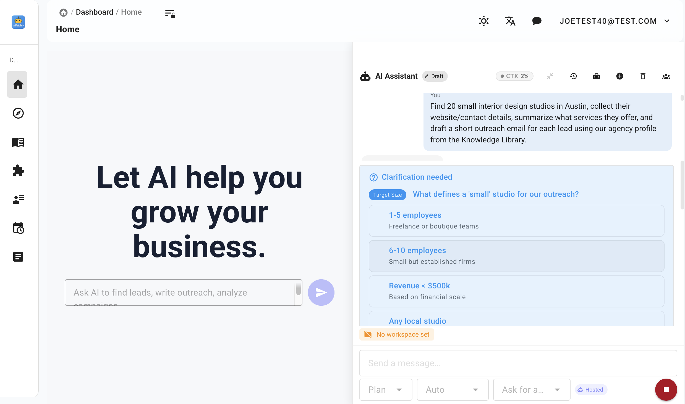
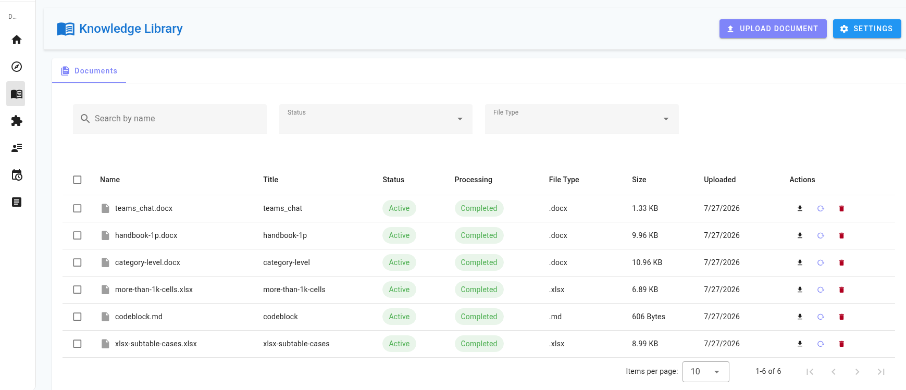
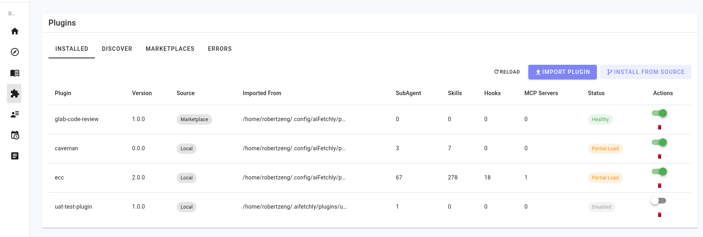
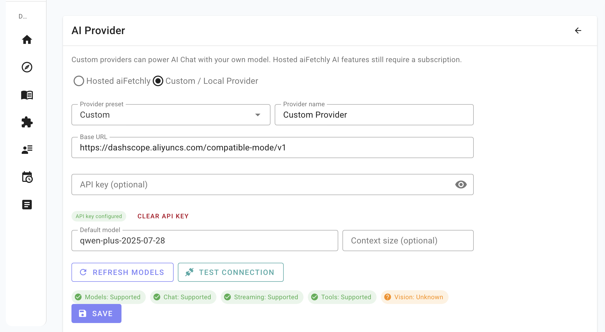

<h1 align="center">aiFetchly</h1>

<p align="center">
  <strong>Desktop-KI-Agent für Geschäftsautomatisierung</strong>
</p>

<p align="center">
  <a href="./README.md">English</a> &middot;
  <a href="./README.zh.md">简体中文</a> &middot;
  <a href="./README.es.md">Español</a> &middot;
  <a href="./README.fr.md">Français</a> &middot;
  Deutsch &middot;
  <a href="./README.ja.md">日本語</a>
</p>

<p align="center">
  
</p>

---

**aiFetchly** ist eine Open-Source-Desktop-Plattform für KI-Agenten im Geschäftsalltag. Sie verbindet lokales Wissen, Browser-Automatisierung, installierbare Skills, geplante Aufgaben, Plugins und spezialisierte Subagenten, damit Teams Recherche, Dokumentverarbeitung, Website-Datenerfassung, Kundenkommunikation und wiederkehrende Abläufe in einer Anwendung automatisieren können.

aiFetchly begann mit Marketing-Automatisierung wie Lead-Recherche, Kontaktextraktion und E-Mail-Outreach. Diese Workflows sind weiterhin enthalten, aber die Produktausrichtung ist breiter: aiFetchly wird zu einem local-first KI-Agenten-Arbeitsbereich für Business-Nutzer, die Tools, Gedächtnis, Dateien, Web-Automatisierung und kontrollierbare Ausführung benötigen.

## Was ist aiFetchly?

aiFetchly verwandelt geschäftliche Absichten in ausführbare Workflows:

- **Einem KI-Agenten Arbeit geben**: Recherche, Dateianalyse, Datenauszug, Nachrichtenentwürfe, Zusammenfassungen und Tool-Nutzung aus einer Chat-Oberfläche.
- **Eigenes Geschäftswissen nutzen**: Dokumente in eine lokale Wissensbibliothek hochladen und Antworten oder Entwürfe auf Basis eigener Dateien erzeugen.
- **Browser- und Datenaufgaben automatisieren**: Informationen von Websites sammeln, strukturierte Daten erfassen, URL-Listen verarbeiten und Ergebnisse exportieren.
- **An spezialisierte Subagenten delegieren**: Hintergrundagenten mit eigenem Prompt, Tool-Rechten, Ressourcenlimits und strukturierten Ausgaben starten.
- **Arbeitsbereich erweitern**: Skills und Plugins installieren, um Tools, Geschäftsworkflows und Integrationen hinzuzufügen.
- **Kontrolle behalten**: Daten lokal in SQLite speichern, Tool-Aktivität prüfen, Berechtigungen steuern und auf dem eigenen Desktop ausführen.

## Screenshots

### KI-Agent-Arbeitsbereich


### Wissensbibliothek



### Skill- und Plugin-Verwaltung



### AI-Provider-Einstellungen



## Agent-Funktionen

### KI-Agent-Arbeitsbereich

| Funktion | Beschreibung |
|----------|--------------|
| **KI-Chat mit Tools** | Arbeiten Sie mit einem Assistenten, der freigegebene Tools aufrufen, Geschäftskontext nutzen und mehrstufige Aufgaben erledigen kann. |
| **Eigene AI Provider** | Nutzen Sie OpenAI-kompatible Anbieter wie Ollama, LM Studio, OpenAI, OpenRouter, vLLM, LocalAI oder eigene Endpunkte. |
| **Ausführung von Business-Aufgaben** | Recherche, Extraktion, Dateiverarbeitung, Nachrichtenerstellung, Planung und Automatisierung ohne Wechsel zwischen mehreren SaaS-Tools. |
| **KI-Assistent für Kunden-E-Mails** | Entwerfen, senden und beantworten Sie Kunden-E-Mails mit Kontext aus Dokumenten und Workflow-Daten. |
| **Spezialisierte Subagenten** | Starten Sie autonome Subagenten mit eigenem Systemprompt, Tool-Allowlist, Ressourcenlimits und strukturierter Ausgabe. |
| **Berechtigungsgesteuerte Automatisierung** | Kontrollieren Sie, welche Tools, Plugins, Hooks und Subagenten ausgeführt werden dürfen. |

### Geschäftswissen und RAG

| Funktion | Beschreibung |
|----------|--------------|
| **Wissensbibliothek** | Laden Sie PDF, TXT, DOC/DOCX, Markdown, HTML, CSV und Excel in eine lokale Wissensbasis für Retrieval-Augmented Generation. |
| **Dokumentverarbeitung** | Erkennen Sie doppelte Uploads, verfolgen Sie Fortschritt, chunking von Dokumenten und speichern Sie Vektor-Embeddings. |
| **Embedding-Modell-Einstellungen** | Wählen und aktualisieren Sie das Embedding-Modell mit sichtbaren Metadaten wie Dimensionen und Verfügbarkeit. |
| **Fundierte Business-Antworten** | Erstellen Sie Zusammenfassungen, Pläne, E-Mails, Berichte und Handlungsanleitungen mit eigenen Dokumenten als Kontext. |

### Skills, Plugins und Erweiterbarkeit

| Funktion | Beschreibung |
|----------|--------------|
| **Installierbare Skills** | Erweitern Sie den Agenten mit wiederverwendbaren Paketen für Dateiverarbeitung, Analyse, Automatisierung und Fachdomänen. |
| **Skill-Verwaltung** | Importieren Sie Skills aus ZIPs, listen Sie eingebaute, installierte und pluginbasierte Skills und aktivieren oder entfernen Sie sie. |
| **Plugin-Verwaltung** | Importieren Sie Plugins aus ZIPs oder Quellordnern und verwalten Sie Status, Gesundheit, Format, Skills und MCP-Server. |
| **Kompatibilität mit Claude-Style-Plugins** | Unterstützt aiFetchly-Plugins und Claude-Style-Pakete, die Skills und MCP-Serverdefinitionen bereitstellen. |
| **Hook-Verwaltung** | Erstellen Sie Command-Hooks für AI/chat-Ereignisse wie Sitzungsstart, Prompt-Abgabe, Tool-Nutzung, Berechtigungsanfragen und Stop. |

### Web-, Daten- und Workflow-Automatisierung

| Funktion | Beschreibung |
|----------|--------------|
| **Automatisierte Web-Recherche** | Suchen Sie über Suchmaschinen, sammeln Sie Geschäftsinformationen, verarbeiten Sie URL-Listen und erholen Sie sich von Task-Fehlern. |
| **Strukturierte Datenextraktion** | Extrahieren Sie E-Mails, Telefonnummern, Adressen, Social-Profile, Firmendaten und Verzeichniseinträge. |
| **Aufgabenplanung** | Planen Sie Tasks mit cron, verketten Sie abhängige Jobs, erstellen Sie wiederkehrende Workflows und überwachen Sie Historie. |
| **Ein-Klick-Export** | Laden Sie Datensätze als CSV herunter und erzeugen Sie Berichte. |
| **Proxy-Verwaltung** | Verwalten Sie HTTP-, HTTPS- und SOCKS5-Proxies mit Massenimport, Validierung und Tests. |

### Enthaltene Growth-Workflows

| Workflow | Beschreibung |
|----------|--------------|
| **Unternehmens- und Lead-Recherche** | Finden Sie Unternehmen über Suchmaschinen, Google Maps, Yandex Maps, Yellow Pages und ähnliche Verzeichnisse. |
| **Kontaktextraktion** | Verarbeiten Sie URL-Listen und extrahieren Sie E-Mails, Telefonnummern, Adressen und Social-Profile mit Live-Fortschritt. |
| **KI-E-Mail-Entwürfe** | Erzeugen Sie personalisierte Business-E-Mails mit RAG und hochgeladenen Dokumenten. |
| **Kunden-E-Mails senden und beantworten** | Unterstützt Versand und kontextbezogene Antworten auf Basis von Wissensbasis, Kundendaten und Workflow-Ergebnissen. |
| **Social-Platform-Operationen** | Verwalten Sie Social Accounts und automatisieren Sie unterstützte Social-Media-Workflows. |

## Erste Schritte

### Voraussetzungen

- **Betriebssystem**: Windows 10+, macOS 10.15+ oder Linux (Ubuntu 20.04+)
- **RAM**: mindestens 4 GB, empfohlen 8 GB

### Erstkonfiguration

1. Öffnen Sie aiFetchly und melden Sie sich an.
2. Importieren Sie Dokumente in die Wissensbibliothek, wenn Antworten auf eigenen Dateien basieren sollen.
3. Installieren oder aktivieren Sie Skills und Plugins für die gewünschten Workflows.
4. Konfigurieren Sie einen eigenen Provider unter System Settings -> AI Provider, wenn AI Chat Ihr eigenes Modell verwenden soll.
5. Konfigurieren Sie Proxies, Social Accounts oder SMTP nur für Web-, Social- oder E-Mail-Workflows.

## Entwicklung

### Voraussetzungen

- **Node.js** 18+
- **Yarn** 1.x classic

```bash
yarn install
cp .env.example .env
yarn init
yarn dev
yarn tsc
yarn vue-check
yarn build
yarn make
```

### Tests

```bash
yarn test
yarn testmain
yarn vitest-googlescraper
yarn testhttpclient
yarn testyoutubeupload
yarn testdownload
```

### Architektur

aiFetchly folgt einer Drei-Schichten-Architektur:

```text
IPC Handler  ->  Module (Geschäftslogik)  ->  Model (Datenzugriff)
```

- **Models** (`src/model/`) behandeln TypeORM-Operationen und SQL-Abfragen.
- **Modules** (`src/modules/`) enthalten Geschäftslogik, Validierung und Koordination zwischen Models.
- **IPC Handlers** (`src/main-process/`) sind nur für Kommunikation zuständig und greifen nie direkt auf die Datenbank zu.

Worker in `src/childprocess/` führen rechenintensive Aufgaben wie Scraping und KI-Verarbeitung aus. Sie senden Ergebnisse per IPC an den Hauptprozess.

## AI-Provider-Konfiguration

AI Chat kann die gehostete aiFetchly-KI oder einen vom Nutzer konfigurierten OpenAI-kompatiblen Provider verwenden. Öffnen Sie **System Settings -> AI Provider**, um den Modus zu wechseln und einen lokalen oder eigenen Provider zu speichern.

## Dokumentation

Die vollständige Dokumentation finden Sie unter [docs.aifetchly.com](https://docs.aifetchly.com).

Die offizielle Website der Anwendung ist [sellart-online.com](https://www.sellart-online.com).

## aiFetchly unterstützen

Wenn aiFetchly Ihnen Zeit spart oder bei Ihrer Arbeit hilft, können Sie die weitere Entwicklung über Ko-fi unterstützen.

<p>
  <a href="https://ko-fi.com/aifetchly">
    
  </a>
</p>

## Mitwirken

Beiträge sind willkommen: Bugfixes, neue Funktionen, Workflow-Verbesserungen, Skills, Plugins oder Übersetzungen. Lesen Sie vor dem Mitwirken [CLAUDE.md](./CLAUDE.md).

## Lizenz

Dieses Projekt steht unter der [Apache License Version 2.0](./LICENSE).
