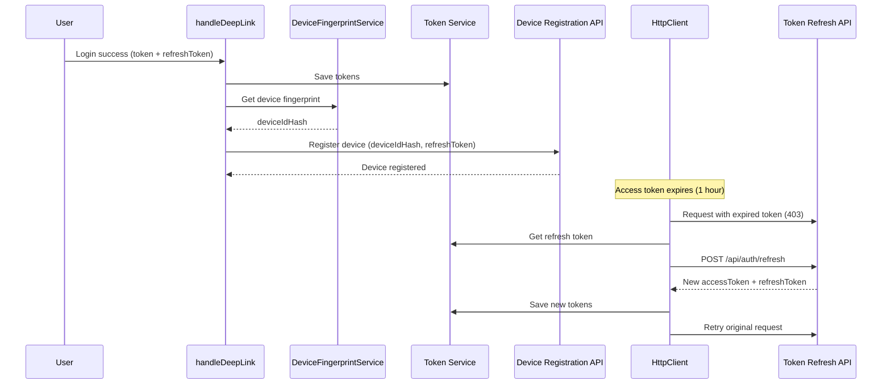

# Device Registration and Token Refresh Implementation Plan

## Overview
Implement device identification, registration with Go backend, and automatic token refresh when access tokens expire. The access token expires in 1 hour, requiring automatic refresh using the refresh token.

## Architecture Flow

## Implementation Tasks

### 1. Install Device Identification Library
- **File**: `package.json`
- Install `node-machine-id` package using yarn
- This library generates a unique machine ID based on hardware/OS characteristics

### 2. Create Device Fingerprint Service
- **New File**: `src/modules/deviceFingerprint.ts`
- Create `DeviceFingerprintService` class
- Methods:
  - `getDeviceIdHash()`: Returns unique device identifier using `node-machine-id`
  - `getDeviceName()`: Returns system-generated device name (e.g., "aiFetchly - Windows 10")
  - `getStoredDeviceIdHash()`: Retrieves previously stored deviceIdHash
  - `storeDeviceIdHash(hash: string)`: Stores deviceIdHash for reuse
- Use `os` module for platform detection and device name generation
- Store deviceIdHash in encrypted storage using `Token` service

### 3. Add Device Storage Constant
- **File**: `src/config/usersetting.ts`
- Add constant: `export const DEVICEIDHASH='user_device_id_hash'`

### 4. Create Device Registration API Service
- **New File**: `src/api/deviceApi.ts`
- Create `DeviceApi` class extending or using `HttpClient`
- Method: `registerDevice(deviceName: string, deviceIdHash: string, refreshToken?: string): Promise<DeviceRegistrationResponse>`
- Endpoint: `POST /api/auth/device`
- Request body: `{ deviceName, deviceIdHash, refreshToken? }`
- Response type: `{ status: boolean, code: number, msg: string, data: { success: boolean, deviceId: number, message: string } }`
- Handle errors (401, 400) appropriately

### 5. Create Token Refresh Service
- **New File**: `src/modules/tokenRefresh.ts`
- Create `TokenRefreshService` class
- Methods:
  - `refreshAccessToken(): Promise<TokenRefreshResponse>`
  - `isTokenExpired(token: string): boolean` (optional - JWT decode to check expiration)
- Endpoint: `POST /api/auth/refresh`
- Request body: `{ refreshToken }`
- Response type: `{ status: boolean, code: number, msg: string, data: { accessToken: string, refreshToken: string, expiresIn: number } }`
- Handle errors:
  - 401: Invalid/expired refresh token → sign out user
  - Device revoked → sign out user
- Update stored tokens after successful refresh

### 6. Update handleDeepLink Function
- **File**: `src/background.ts`
- After saving tokens (lines 596-603), add device registration:
  1. Import `DeviceFingerprintService` and `DeviceApi`
  2. Get device fingerprint using `DeviceFingerprintService`
  3. Get device name
  4. Call `DeviceApi.registerDevice()` with deviceName, deviceIdHash, and refreshToken
  5. Store deviceIdHash for future use
  6. Handle registration errors (log but don't block login flow)

### 7. Update HttpClient for Automatic Token Refresh
- **File**: `src/modules/lib/httpclient.ts`
- Import `TokenRefreshService` and `REFRESHTOKEN` constant
- Update `_fetchJSON` method (lines 42-76):
  - When receiving 403 status, instead of signing out:
    1. Check if refresh token exists
    2. Call `TokenRefreshService.refreshAccessToken()`
    3. If successful:
       - Update access token in headers
       - Save new tokens to storage
       - Retry original request with new token
    4. If refresh fails:
       - Sign out user (existing behavior)
- Update `postStream` method (lines 174-207) with same logic
- Add private method `_refreshTokenAndRetry()` to avoid code duplication
- Prevent infinite refresh loops (max 1 retry per request)

### 8. Update Token Service Usage
- **File**: `src/modules/lib/httpclient.ts`
- Import `REFRESHTOKEN` constant
- Ensure refresh token is retrieved from storage when needed

### 9. Error Handling and Edge Cases
- Handle network errors during device registration (non-blocking)
- Handle refresh token rotation (backend may return new refresh token)
- Prevent concurrent refresh requests (use a lock/flag)
- Log all token refresh attempts for debugging
- Handle case where refresh token is missing or invalid

## Files to Create
1. `src/modules/deviceFingerprint.ts` - Device fingerprint service
2. `src/api/deviceApi.ts` - Device registration API
3. `src/modules/tokenRefresh.ts` - Token refresh service

## Files to Modify
1. `package.json` - Add `node-machine-id` dependency
2. `src/config/usersetting.ts` - Add `DEVICEIDHASH` constant
3. `src/background.ts` - Update `handleDeepLink` to register device
4. `src/modules/lib/httpclient.ts` - Add automatic token refresh on 403 errors

## Testing Considerations
- Test device registration after login
- Test token refresh when access token expires
- Test refresh token rotation scenario
- Test error handling (invalid refresh token, revoked device)
- Test concurrent request handling during token refresh
- Verify deviceIdHash persistence across app restarts

## Dependencies
- `node-machine-id`: Device fingerprint generation
- Existing: `Token` service, `HttpClient`, `User` service

## Notes
- Device registration should be non-blocking (don't fail login if registration fails)
- Token refresh should be transparent to calling code
- DeviceIdHash should be consistent across app sessions (stored in encrypted storage)
- Access token expiration is 1 hour (3600 seconds) per API documentation
- Refresh token may be rotated by backend if less than 7 days remain until expiration

## Implementation Checklist

- [ ] Install node-machine-id package using yarn
- [ ] Add DEVICEIDHASH constant to usersetting.ts
- [ ] Create DeviceFingerprintService in src/modules/deviceFingerprint.ts with getDeviceIdHash, getDeviceName, and storage methods
- [ ] Create DeviceApi class in src/api/deviceApi.ts for device registration endpoint
- [ ] Create TokenRefreshService in src/modules/tokenRefresh.ts for token refresh functionality
- [ ] Update handleDeepLink in background.ts to register device after saving tokens
- [ ] Update HttpClient to automatically refresh token on 403 errors and retry request

