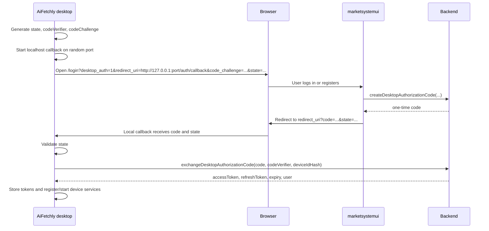

# Secure Desktop Auth Handoff Technical Design

## Problem

The web login and registration pages can redirect bearer credentials to a custom
protocol chosen from a public query string:

- `/Users/cengjianze/project/marketsystemui/app/[locale]/login/page.tsx`
  reads `?app=...`, then builds `${app}://auth?token=...&refresh_token=...`
  for both already-authenticated users and successful password login.
- `/Users/cengjianze/project/marketsystemui/app/[locale]/register/page.tsx`
  repeats the same token-bearing redirect after registration.
- `/Users/cengjianze/project/aiFetchly/src/controller/UserController.ts`
  opens `/login?app=<appName>` with `shell.openExternal(...)`.
- `/Users/cengjianze/project/aiFetchly/src/background.ts` registers and handles
  the custom protocol, parses `token` and `refresh_token` from the deep link,
  stores them, then registers the device with the refresh token.

This is unsafe because custom protocol ownership is local machine state. Another
application can register the same scheme and receive the access token and
refresh token. The `app` allowlist only limits the scheme names the web app will
use; it does not prove that the expected desktop app owns the handler.

## Goals

1. Never place access tokens or refresh tokens in custom protocol URLs, browser
   address bars, shell arguments, logs, or copied login URLs.
2. Bind desktop login completion to a request started by this desktop instance.
3. Make authorization code replay fail.
4. Keep login and registration behavior equivalent for users.
5. Preserve existing device registration and token refresh behavior after the
   desktop app receives tokens through a secure exchange.

## Non-Goals

1. Replacing the normal web session model.
2. Changing the backend's primary token format.
3. Solving malware running as the user. The design reduces credential exposure,
   but a compromised endpoint can still attack local applications.

## Recommended Approach

Use a desktop-initiated authorization code flow with PKCE and a loopback callback
as the primary flow. Keep custom protocol only as a temporary fallback, and make
the fallback carry only `code` and `state`, never bearer tokens.

### Why loopback first

Custom schemes cannot reliably prove app identity. PKCE protects a code observed
by the wrong handler, but it does not stop a malicious local app from initiating
its own login with its own verifier and scheme handler. A loopback callback is
stronger for Electron because the desktop app binds a random localhost port
before opening the browser. The browser returns the one-time code to that port,
and another process cannot receive the callback unless it already owns the port.

If loopback cannot be shipped on a platform, use `aifetchly://auth/callback` as a
fallback with the same code and PKCE exchange. That fallback still eliminates the
current bearer-token leak and is safe against passive scheme hijack, but it is
not as strong as loopback against a malicious app that initiates its own flow.

## Target Flow



## Web App Changes

Affected repo: `/Users/cengjianze/project/marketsystemui`.

### Login and registration pages

Replace the `?app=` token redirect with `desktop_auth` parameters:

- `desktop_auth=1`
- `client_id=aifetchly-desktop`
- `redirect_uri=http://127.0.0.1:<port>/auth/callback`
- `state=<random base64url value>`
- `code_challenge=<S256 challenge>`
- `code_challenge_method=S256`

The login and register pages should preserve these parameters during the form
submit. After success, and also when an already-authenticated user lands on the
login page, call a backend mutation or route to create a one-time authorization
code. Then redirect to:

```text
<redirect_uri>?code=<authorization_code>&state=<state>
```

Remove all construction of:

```text
${app}://auth?token=...
${app}://auth?token=...&refresh_token=...
```

Also remove token-bearing debug logs such as `console.log('redirecting to app:',
appUrl)`.

### Validation

The browser page must validate the desktop auth request before any redirect:

- `client_id` must be an exact known value, initially `aifetchly-desktop`.
- `code_challenge_method` must be `S256`.
- `code_challenge` must be base64url and 43 to 128 characters.
- `state` must be base64url and at least 128 bits of entropy.
- `redirect_uri` must be one of:
  - `http://127.0.0.1:<ephemeral-port>/auth/callback`
  - `http://localhost:<ephemeral-port>/auth/callback`
  - temporary fallback: `aifetchly://auth/callback`
- Loopback ports must be numeric and in the user-space range.
- Do not accept arbitrary schemes from query string.

## Desktop App Changes

Affected repo: `/Users/cengjianze/project/aiFetchly`.

### Login URL initiation

Update `src/controller/UserController.ts` so `getLoginPageUrl()` no longer sends
`app=<appName>`. Instead:

1. Generate a high-entropy `state`.
2. Generate a PKCE `codeVerifier`.
3. Derive `codeChallenge = base64url(sha256(codeVerifier))`.
4. Start a short-lived local HTTP server on `127.0.0.1` with an OS-assigned
   random port.
5. Store pending auth data in memory:
   - `state`
   - `codeVerifier`
   - `redirectUri`
   - `createdAt`
6. Open the web login URL with the desktop auth parameters.

The pending auth data should expire after 5 minutes and be cleared after success,
failure, cancellation, or app quit.

### Callback handling

Add a new handler for loopback callbacks. It should:

1. Accept only `GET /auth/callback`.
2. Parse only `code`, `state`, and optional `error`.
3. Validate that `state` matches the in-memory pending request.
4. Close the local callback server.
5. Exchange the code over HTTPS with the backend.
6. Store returned tokens using the existing `Token` service.
7. Continue the existing post-login work currently in `handleDeepLink()`:
   update user info, register the device, reset database singletons, initialize
   WebSocket, start background token refresh, and navigate to Dashboard.

Extract the post-login work into a shared function, for example:

```typescript
type DesktopTokenSet = {
  accessToken: string;
  refreshToken?: string;
  expiresIn?: number;
  refreshExpiresIn?: number;
};

async function completeDesktopLogin(tokens: DesktopTokenSet): Promise<void> {
  // Existing storage, user update, device registration, database reset,
  // WebSocket initialization, auto-refresh, and Dashboard navigation.
}
```

Then both the new loopback flow and the temporary custom-scheme fallback can call
the same completion function.

### Custom-scheme fallback

Change `handleDeepLink()` in `src/background.ts` to reject token-bearing links.
The only accepted custom-scheme callback should be:

```text
aifetchly://auth/callback?code=<authorization_code>&state=<state>
```

Required hardening:

- Validate protocol exactly: `parsedUrl.protocol === "aifetchly:"`.
- Validate host and path exactly for the supported callback shape.
- Reject if `token`, `access_token`, `refreshToken`, or `refresh_token` appears.
- Parse `code` and `state` only.
- Exchange the code with the backend using the in-memory `codeVerifier`.
- Remove manual query reconstruction for `&refresh_token` shell splitting.
- Avoid logging full callback URLs.

## Backend Changes

The backend must own code issuance and redemption. Either GraphQL or REST is
fine, but use one canonical contract.

### Create authorization code

Called by the web app after the user is authenticated in the browser.

```graphql
mutation CreateDesktopAuthorizationCode($input: CreateDesktopAuthorizationCodeInput!) {
  createDesktopAuthorizationCode(input: $input) {
    code
    expiresAt
  }
}
```

Input:

```typescript
type CreateDesktopAuthorizationCodeInput = {
  clientId: "aifetchly-desktop";
  redirectUri: string;
  state: string;
  codeChallenge: string;
  codeChallengeMethod: "S256";
};
```

Server requirements:

- Require an authenticated browser user.
- Validate `clientId` and `redirectUri` against an allowlist.
- Store only a hash of the authorization code.
- Bind the code to user id, client id, redirect URI, state, code challenge,
  creation time, expiry, and unused status.
- Expire codes after 60 to 120 seconds.
- Rate-limit by user id and IP.

### Exchange authorization code

Called only by the desktop app over HTTPS.

```http
POST /api/desktop-auth/exchange
Content-Type: application/json

{
  "clientId": "aifetchly-desktop",
  "code": "...",
  "codeVerifier": "...",
  "redirectUri": "http://127.0.0.1:49321/auth/callback",
  "deviceName": "aiFetchly - macOS",
  "deviceIdHash": "..."
}
```

Response:

```typescript
type DesktopAuthExchangeResponse = {
  accessToken: string;
  refreshToken: string;
  expiresIn: number;
  refreshExpiresIn?: number;
  user: {
    id: string;
    email: string;
    firstName?: string;
    lastName?: string;
  };
};
```

Server requirements:

- Look up the hashed code and require it to be unused and unexpired.
- Verify `base64url(sha256(codeVerifier)) === codeChallenge`.
- Verify `clientId` and `redirectUri` match the stored request.
- Atomically mark the code as used before returning tokens.
- Register or update the device during exchange, or return tokens and let the
  existing `/api/auth/device` call continue immediately after login.
- Reject replay, wrong verifier, wrong redirect URI, expired code, and unknown
  code with the same generic error shape.

## Storage Guidance

This fix is primarily about removing bearer credentials from URLs. The existing
desktop `Token` service can be kept for a narrow first patch if changing storage
would slow the security fix. A follow-up hardening task should move token storage
to OS-backed secure storage (`safeStorage` or `keytar`) instead of relying on a
static app encryption key in Electron Store.

## Migration Plan

1. Add backend code issuance and exchange endpoints.
2. Add desktop loopback login initiation and callback exchange behind a feature
   flag.
3. Update web login and registration pages to prefer `desktop_auth=1`.
4. Ship a desktop build that supports the new flow.
5. Keep the old `?app=` flow disabled by default and guarded by a short-lived
   emergency flag.
6. Remove the old token-bearing custom-scheme path after the supported desktop
   versions have upgraded.

## Test Plan

### Web tests

- Login with `desktop_auth=1` redirects to `redirect_uri?code=...&state=...`.
- Register with `desktop_auth=1` redirects to `redirect_uri?code=...&state=...`.
- Already-authenticated login with `desktop_auth=1` creates a code instead of
  sending tokens.
- Invalid `redirect_uri`, `code_challenge`, or `state` is rejected.
- No test path assigns `window.location.href` to a URL containing `token=`,
  `access_token=`, `refreshToken=`, or `refresh_token=`.

### Desktop tests

- `getLoginPageUrl()` includes `desktop_auth`, `state`, `code_challenge`, and
  loopback `redirect_uri`; it does not include `app=`.
- Callback with mismatched `state` is rejected and no tokens are stored.
- Callback with `token` or `refresh_token` is rejected.
- Successful callback exchanges code and calls the shared post-login completion
  function.
- The local callback server closes after success, failure, and timeout.

### Backend tests

- Authorization codes are single-use.
- Expired codes fail.
- Wrong verifier fails.
- Wrong redirect URI fails.
- Wrong client id fails.
- Replay after successful exchange fails.
- Rate limits apply to code creation and exchange.

## Acceptance Criteria

1. A repository search for custom-scheme redirects must not find any code that
   builds `aifetchly://...token=...`, `marketsystem://...token=...`, or any
   `refresh_token` custom-scheme URL.
2. `handleDeepLink()` must not read or store bearer tokens from URL parameters.
3. The desktop app can still complete login and registration from the browser.
4. Device registration and refresh-token rotation still work after code exchange.
5. Security logs record auth handoff events without full URLs or token values.

## Open Decisions

1. Backend API shape: GraphQL-only to match `marketsystemui` auth, or REST for
   easier Electron exchange.
2. Whether device registration should move into the exchange endpoint or remain
   as the current post-login `/api/auth/device` call.
3. Whether `marketsystem` desktop is still supported. If not, remove it from the
   web allowlist during this fix.
4. Whether to support the custom-scheme fallback after loopback ships, and for
   how long.
