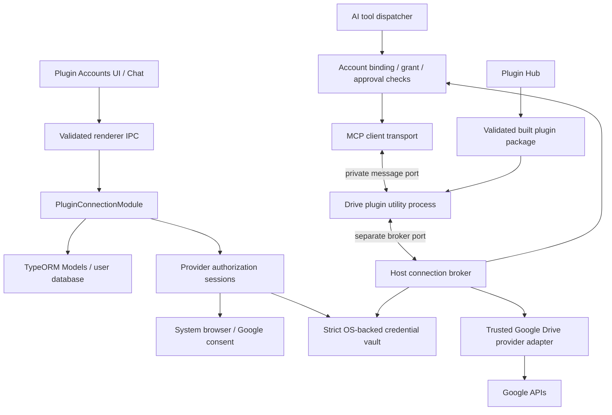

# Plugin Connections and Google Drive — Technical Design

Status: Proposed; implementation has not been performed.  
Date: 2026-09-23.  
Requirements: [PRD](PRD.md). Paths described as proposed below do not yet exist.

## 1. Evidence and relationship to existing designs

Inspected desktop `dev` and hub `master`. This document specializes [MCP OAuth guidance](../mcp-oauth-integration-guidance.md) for local first-party provider plugins. It does not implement remote HTTP MCP authorization or replace AiFetchly identity login.

| Existing code | Evidence and reuse decision |
|---|---|
| `src/entityTypes/pluginTypes.ts`, `src/service/PluginManifestService.ts` | Unknown manifest fields survive parsing but are ignored at runtime. Add real validation and capability gating; JSON alone does not implement setup. |
| `src/service/pluginCompat/PluginOptionsStore.ts`, `src/main-process/communication/plugin-ipc.ts` | Plaintext options and a renderer-readable getter. Keep nonsecret settings separate; never route OAuth tokens through these APIs. |
| `src/modules/pkce.ts`, `src/modules/loopbackCallbackServer.ts` | Reuse pure PKCE helpers; audit/extract callback mechanics for provider sessions. |
| `src/modules/pendingDesktopAuth.ts`, `src/controller/UserController.ts` | Existing login has a single pending slot. Introduce a separate session map; do not overwrite account-login state. |
| `src/modules/SecureStore.ts`, `src/modules/electronstoreservice.ts` | OS-backed wrapper exists behind `AIFETCHLY_ENCRYPT_STORE`; plaintext fallback and key-name heuristics are unsuitable for the new vault. |
| `src/modules/token.ts` | Uses CryptoSource; do not equate the legacy Token interface with guaranteed OS-backed storage. |
| `src/service/SkillWorkerClient.ts`, `src/service/PythonRuntimeWorkerClient.ts` | Existing utility-process launch/path-resolution patterns. Reuse lifecycle conventions without exposing database access to workers. |
| `src/modules/MCPClient.ts` | Child-process stdio works; SSE throws; transport union lacks message ports. Add an explicit transport implementation. |
| `src/service/MCPToolService.ts` | Tool discovery, plugin naming and execution trust are existing integration seams. |
| `src/service/AIChatToolApprovalPolicyService.ts` | Reuse approval semantics; extend trusted operation classification rather than trusting plugin risk labels. |
| `src/views/components/plugins/PluginManager.vue` | Foreground install callback receives plugin name; add setup routing across all install paths. |
| Hub `internal/validation/manifest.go` | Native/Claude manifest validation exists; extend native contract without silently changing Claude compatibility. |
| Hub `internal/artifacts/plugin_package.go` | Canonical package excludes node_modules and credential-shaped files; build bundled JS before publication. |
| Desktop `src/service/PluginMarketplaceService.ts` | Community path currently requires direct install. Do not assume managed install-plan support. |

The older OAuth guidance's broad retry suggestions do not apply to uncertain Drive writes. This design requires operation-specific reconciliation before retrying side effects.

## 2. Architecture and trust boundaries



Host responsibilities: OAuth, refresh, secrets, trusted provider endpoints, request enforcement, artifacts, database, approvals, and runtime lifecycle. Plugin responsibilities: MCP schemas, input/result formatting, AI-facing workflow logic and capability declarations. The host adapter performs provider network operations; no duplicate OAuth or refresh implementation in the plugin.

This intentionally means new provider operations can require desktop releases. Later trusted profile distribution may reduce that coupling, but release one does not execute arbitrary adapter scripts from plugins in the main process. The hub is a distribution service, not a Google-token proxy.

Utility processes run Node-capable local code, not a malicious-code sandbox. Execution trust remains mandatory. Private channels prevent confused identity in supported APIs, but do not claim protection against hostile software running with the same OS user's privileges.

## 3. Runtime and SDK

Compile plugin TypeScript and bundle pure-JS dependencies into `dist/aifetchly-entry.js`. The desktop launches a shipped bootstrap at proposed `src/childprocess/plugin-runtime/PluginRuntimeWorker.ts`, registered in Forge/Vite build configuration, using `utilityProcess.fork` after Electron readiness. Resolve installed entry paths with lexical and realpath containment checks and verified package identity. Pass a minimal environment allowlist, never the default full environment.

Electron supplies the Node-capable runtime, so users need no external node/npm/npx. Utility-process stdin cannot be piped: implement an MCP transport over MessagePort rather than pretending the current stdio client is compatible. Use MCP JSON-RPC envelopes/initialization/tool discovery through a pinned, tested SDK protocol version. Diagnostics go to bounded/redacted logs, never into protocol payload streams. [Electron utility-process API](https://www.electronjs.org/docs/latest/api/utility-process)

Transfer separate ports for MCP messages and host-operation requests. Bootstrap loads the validated plugin entry and supplies a narrow SDK object. Host maps each port to installation identity, process generation, profile, and granted invocation contexts. Worker-supplied IDs cannot change that association.

Proposed SDK package `@aifetchly/plugin-sdk` provides types, schema helpers, transport, lifecycle, and host connection calls. It must be independently versioned with shared golden fixtures. No direct imports from desktop source. A standard stdio entry point and managed Node distribution are later compatibility work, not release-one dependencies.

Lifecycle: initialize -> discover -> ready -> draining -> terminated. Timeout, crash, disable, uninstall, profile switch, or broker revocation rejects pending requests, closes ports, and invalidates process generations. Do not restart into the middle of a write. Launch/connect timeout 15 seconds; configurable read deadline 60 seconds and upload deadline 120 seconds, enforced by host. Cap concurrency initially at four broker operations/process and one write/connection.

## 4. Manifest contract v2 (proposed)

The root schema version is bumped to 2. `setup.schemaVersion=1` versions the setup block separately. A published v2 package must include a concrete `compatibility.minAppVersion` for the first supporting release, in addition to capability requirements. Its numeric value is a release gate and is intentionally not guessed here.

Illustrative root manifest (add the real minimum app version at release):

```json
{
  "schemaVersion": 2,
  "name": "google-drive",
  "displayName": "Google Drive",
  "version": "1.0.0",
  "description": "Use authorized Google Drive files in AI chat.",
  "mcpServers": ["mcp/servers.json"],
  "compatibility": {
    "requiredHostCapabilities": [
      "plugin-connections.v1", "plugin-runtime.message-port.v1"
    ]
  },
  "setup": {
    "schemaVersion": 1,
    "openAfterInstall": true,
    "connections": [{
      "id": "drive",
      "providerProfile": "aifetchly.google-drive.v1",
      "labelKey": "accounts.title",
      "label": "Google Drive accounts",
      "required": true,
      "allowMultipleAccounts": true,
      "requestedCapabilities": ["files.read", "files.create"]
    }],
    "fields": [{
      "key": "defaultUploadFolder",
      "type": "resource-picker",
      "labelKey": "settings.uploadFolder",
      "label": "Default upload folder",
      "connection": "drive",
      "resourceType": "folder",
      "storageScope": "connection",
      "required": false
    }],
    "toolBindings": [
      {"server":"drive","tool":"search_files","connection":"drive","requiresCapabilities":["files.read"]},
      {"server":"drive","tool":"get_file","connection":"drive","requiresCapabilities":["files.read"]},
      {"server":"drive","tool":"read_file","connection":"drive","requiresCapabilities":["files.read"]},
      {"server":"drive","tool":"create_folder","connection":"drive","requiresCapabilities":["files.create"]},
      {"server":"drive","tool":"upload_file","connection":"drive","requiresCapabilities":["files.create"]}
    ]
  }
}
```

Proposed `mcp/servers.json` for the native v2 format:

```json
{
  "mcpServers": {
    "drive": {
      "runtime": "aifetchly-js",
      "entry": "dist/aifetchly-entry.js",
      "transport": "aifetchly-message-port",
      "sdkProtocolVersion": 1,
      "connections": ["drive"],
      "credentialMode": "host-brokered"
    }
  }
}
```

Never add `command: node` as a fallback: it would undermine the runtime and compatibility contract. Existing v1 stdio declarations continue unchanged.

Validation rules:

- Strict schema within recognized v2 sections; duplicate IDs, unknown provider profiles/capabilities, invalid field defaults, missing references, and path escapes fail installation.
- Field kinds initially: string, boolean, enum, resource-picker. Provider-owned API-key configuration uses a dedicated secret-input schema/API later; ordinary strings are never secret storage.
- `storageScope` is plugin or connection; connection fields require a slot reference. Values are validated again when saved and used.
- Tool bindings reference actual server keys. Compare against discovered tools before activation; undeclared tools receive no broker access and are not advertised by this package.
- Effective policy is host policy intersected with granted capabilities and declared bindings. Plugin declarations cannot downgrade write approval.
- Translated labels use en/zh/es/fr/de/ja keys with English fallback. Provider controls render standard app-owned buttons. No plugin HTML/scripts in setup UI.
- Hash the normalized capability/config contract for update comparison. Broader requests invalidate readiness for affected tools, not silently expand grants.

Old clients ignore unknown fields, so a new `minAppVersion` field alone cannot protect them. The hub must omit/mark incompatible v2 entries for clients without advertised capability support, including legacy catalog projections. Patched desktop importers reject unsupported v2 packages. Direct manual imports into unpatched clients cannot be retroactively fixed: they are unsupported and the new transport must have no legacy executable fallback. Test old-client behavior before public release.

## 5. Provider profiles and OAuth

Release one ships reviewed profile definitions in desktop code. A profile includes immutable ID/version, auth mode, registered public-client configuration, exact authorization/token endpoints, redirect strategy, capability-to-scope mapping, operation allowlist, account discovery, refresh/revocation behavior and resource adapters. Manifests reference IDs, never override token URLs or inject provider code.

Google uses a registered Desktop app client, S256 PKCE, state, system browser and loopback redirect. The client ID is public. Any client configuration distributed with a desktop app is extractable, including a desktop `client_secret` value if the provider requires it. It is not the confidentiality mechanism. A confidential web-client secret requires a server and is excluded from this desktop path. [Google native OAuth](https://developers.google.com/identity/protocols/oauth2/native-app), [RFC 8252](https://www.rfc-editor.org/rfc/rfc8252).

### Session contract

Proposed `PluginAuthorizationSessionStore` is a main-process map, separate from existing account-login state. Each record holds random session ID/state, PKCE verifier, provider/client/profile, initiating installation and requested capabilities, exact redirect URI, expiration, callback server, and operation generation. TTL ten minutes; at most five pending flows/profile. Reconnect/pick-more-files sessions also bind the expected stable provider account.

1. Validate trusted renderer sender and installed plugin. Start loopback listener before browser navigation.
2. Generate verifier/challenge/state using existing pure helpers. Store session only in memory.
3. Build authorization URL from the trusted profile; open via `shell.openExternal` after explicit click.
4. Listener accepts bounded GET requests to its exact callback path on loopback. Validate state and provider response binding; ignore unrelated requests without consuming the session. Never log the callback URL/query.
5. Atomically transition matching session from pending to exchanging. Duplicate callbacks fail. Exchange code over HTTPS with exact redirect/verifier and profile-required parameters.
6. Verify response shape, actual granted scopes, account identity, and expected account when reconnecting. A different account cannot overwrite an existing account's credentials.
7. Persist vault entry, then metadata/grant, publish sanitized status event, close listener, discard verifier. Failures/cancellation/timeouts dispose resources. A late exchange completion after cancel/disable/profile switch cannot commit.
8. Browser callback page is static, escaped, no external resources, no-store, restrictive CSP/referrer policy, no credentials. Report “return to AiFetchly”; activation is best effort.

State/verifier do not authenticate an official application binary. Never present public-client PKCE as protection against a malicious fork initiating its own authorization.

### Google file selection and identity gate

The default profile requests `drive.file`. Google's desktop Picker documentation specifies a browser OAuth selection flow with `trigger_onepick=true`, `prompt=consent`, and this scope alone. Validate callback file IDs through authenticated metadata requests; scope/account identity come from trusted provider responses, not arbitrary callback parameters. Do not append identity scopes to this Picker request. “Select more files” repeats authorization bound to the expected account. Folder selection is not recursive descendant authorization. [Desktop Picker documentation](https://developers.google.com/workspace/drive/picker/guides/desktop-mobile-picker)

Before implementation locks the adapter, demonstrate a stable provider-issued account identifier available under this flow (evaluate Drive account information rather than assuming email or OIDC sub). If unavailable, specify and review a separate compatible identity flow; do not ship email-based identity deduplication. Picker, identity, production-client configuration and additional-file grants are explicit Stage-0 gates, not assumed solved.

Google's scope categories distinguish limited file access from restricted whole-Drive access. A future broad mode requires its own profile/consent/review. Do not claim read-only host tools imply a read-only OAuth token: host capabilities can be narrower than Google's scope. [Drive scopes](https://developers.google.com/workspace/drive/api/guides/api-specific-auth)

## 6. Persistence and credential vault

All SQLite access follows IPC -> Module -> Model -> TypeORM. Extend existing BaseModule/BaseDb conventions and resolve the current database through Token/USERSDBPATH. Workers have no repositories, database path, Electron app access assumptions, or credential-store access.

Proposed entities:

| Entity | Core fields and constraints |
|---|---|
| ProviderConnection | UUID id, profile owner, provider/profile version, client config ID, stable subject, non-null tenant discriminator, display label, granted scopes, status, credentialRef, credentialGeneration, expiry, timestamps; unique owner/provider/client/subject/tenant |
| PluginConnectionGrant | UUID, connectionId, installation identity, slotId, granted capabilities, selected-resource policy, approved contract hash, generation, status; unique installation/slot/connection |
| PluginConnectionPreference | owner, installation, slot, default connection; references valid active grant |
| PluginConnectionSettings | grantId/key/value for nonsecret per-connection configuration; validated schema |
| PluginOperationRecord | invocation ID, connection/grant generations, operation, argument digest, status, provider result ID if known, timestamps; no credential or content bodies |

Chat selection belongs in conversation configuration, referring to a valid grant/connection. Ownership checks apply on every read and mutation. Installation identity binds publisher/source provenance and install generation, not only mutable plugin name. Reinstall/source replacement cannot inherit grants. Add schema migrations through the project's existing migration mechanism; verify upgrade and downgrade/read compatibility before activation.

Vault is a dedicated main-process service with mandatory OS-backed encryption, explicit secret records, and no heuristic key-name detection. It may reuse audited safeStorage primitives, but must not inherit existing SecureStore's flag/plaintext fallback/return-ciphertext-on-error behavior.

- Initialize after Electron readiness. Treat Linux basic_text, missing backend, locked vault and decryption failure as distinct unavailable states. Support explicit session-only credentials in memory; persist no token in that mode.
- Scope vault paths/records to the app profile. Use restrictive permissions and atomic versioned writes. No plugin install directory, general options, telemetry, args, or renderer getters.
- Access tokens remain memory-resident where practical. Persist refresh token and provider-required secret state encrypted. Provider adapters handle absence of refresh tokens; reconnect after expiry if renewal is unavailable.
- Maintain one refresh flight per connection, early-refresh skew, bounded read retry, and compare-and-swap credential generation. Preserve the existing refresh token if a successful provider response omits a replacement.
- Persist a rotated token durably before serving it. If the provider rotates and the app crashes before local persistence, recovery may require reauthorization: no local atomic write can undo the remote rotation.
- Vault/SQLite are not one transaction. Write new versioned encrypted entry first, commit metadata reference second, then garbage-collect old/orphan entries. A failed metadata commit must not expose an inconsistent connection. Startup reconciles references, marking missing/unreadable credentials reconnect/locked as appropriate.
- Revocation increments the connection/grant generation before canceling calls. In-flight refresh cannot resurrect removed credentials. Restart never restores a session-only connection as ready.

Use available safeStorage APIs in the pinned Electron version and reject insecure fallback explicitly. OS-backed storage protects data at rest, not against all software running as the same user. [Electron safeStorage](https://www.electronjs.org/docs/latest/api/safe-storage)

## 7. IPC and UI contracts

Proposed implementation locations:

| Layer | Files/responsibility |
|---|---|
| Shared types/schemas | `src/entityTypes/pluginConnectionTypes.ts`, `src/schemas/ipc/pluginConnection.ts`, versioned manifest and broker schemas |
| Entities/models | `src/entity/ProviderConnection.entity.ts`, grant/preference/settings/operation entities, corresponding `src/model/` data-access classes |
| Module | `src/modules/PluginConnectionModule.ts` coordinates database ownership and service operations through Models |
| Main services | `src/service/pluginConnections/` contains session map, strict vault, broker, profile registry, refresh coordinator and trusted Google adapter |
| IPC | `src/main-process/communication/plugin-connection-ipc.ts` validates inputs/senders and delegates to Module/service; register through existing communication index |
| Worker | `src/childprocess/plugin-runtime/PluginRuntimeWorker.ts` plus Forge/Vite build entry and existing packaged-worker path conventions |
| Renderer API | `src/views/api/pluginConnections.ts` with narrowly exposed preload methods; never expose arbitrary IPC or secret reads |
| Renderer UI | Accounts/configuration components under `src/views/components/plugins/`; chat selector/status integrated with existing AI chat components |

Connection readiness is derived from several dimensions rather than conflating them in one flag: credential state (`active`, `session_only`, `locked`, `reconnect_required`, `removed`), grant state (`active`, `revoked`, `approval_required`), plugin enablement and runtime compatibility. UI can display transient connectivity failures without changing credential state. A connected account does not imply every tool is available.

Authorization sessions have transitions `pending -> exchanging -> completed`, with terminal alternatives `canceled`, `expired`, `failed`. Only the main process changes these states; every async completion checks the session generation. Terminal notifications remain available as sanitized short-lived results so reopening UI can recover status, but verifiers/codes are discarded immediately.

Proposed renderer operations (validated, no raw tokens in responses):

| Operation | Inputs | Output |
|---|---|---|
| listConnections | pluginId | Sanitized accounts, scopes/capabilities, defaults, states |
| startAuthorization | pluginId, slotId, purpose, optional expectedConnectionId | sessionId, expiresAt |
| cancelAuthorization | sessionId | terminal session state |
| selectResources | pluginId, connectionId | Browser-selection session ID or accessible resource page |
| setDefaultConnection | pluginId, slotId, connectionId | Updated default |
| setChatConnection | conversationId, pluginId, slotId, connectionId | Validated selection |
| saveConnectionSettings | pluginId, grantId, fields | Sanitized configuration |
| disconnectPluginConnection | pluginId, grantId | Removed binding |
| removeConnection | connectionId, explicit revocation intent | Local removal and provider revocation outcome separately |

Status event: sequence number, sessionId if applicable, pluginId, connectionId, state, safe error code. UI re-reads authoritative state on mount/reconnect; events are hints, not the only state source. Never forward provider raw response bodies or arbitrary callback HTML.

Add `PluginAccountsTab.vue`, a schema-driven settings component, connection status card in chat, and chat account selector. Reuse existing PluginManager/detail routing. Component tests belong under `test/vitest/main/components/`; critical multi-step flows under `test/e2e/specs/`. All visible labels and error-code messages use six-language i18n with English fallback.

Account management is configuration and is not AI-gated. Tool execution is AI functionality: use the established early Token/USER_AI_ENABLED check before parsing AI requests or doing work, and enforce again at the shared dispatch boundary so alternative entry paths cannot bypass it.

## 8. Broker protocol and operation enforcement

MCP arguments contain business input only, never access tokens, arbitrary connection IDs, or ambient filesystem paths. Host creates an invocation context after resolving chat selection/default, validates approval, and associates it with the MCP call. Plugin SDK receives an opaque per-invocation handle on a host-controlled context channel. It is not included in model-facing schemas.

Illustrative broker request, validated with discriminated schemas:

```typescript
interface DriveSearchRequest {
  readonly protocolVersion: 1;
  readonly type: "connection.invoke";
  readonly requestId: string;
  readonly invocationHandle: string;
  readonly slotId: "drive";
  readonly operation: "files.search";
  readonly input: {
    readonly text: string;
    readonly pageSize?: number;
    readonly pageToken?: string;
  };
}
```

Host derives installation identity from the port and looks up a live invocation. Bind handle to process generation, specific MCP tool, connection/grant generations, permitted operations, argument constraints, approval digest, expiry and quotas. A read invocation cannot request an upload. For upload approval bind artifact digest, destination, filename, account and operation; changing any requires renewed authorization. Revalidate before network dispatch, not only tool discovery.

Response union: success with bounded validated data, or failure with safe code/retryability/optional reconnect requirement. Codes include CONNECTION_REQUIRED, ACCOUNT_SELECTION_REQUIRED, GRANT_REVOKED, INSUFFICIENT_CAPABILITY, VAULT_UNAVAILABLE, AUTH_CANCELED, AUTH_EXPIRED, RECONNECT_REQUIRED, RESOURCE_NOT_AUTHORIZED, UNSUPPORTED_CONTENT, LIMIT_EXCEEDED, RATE_LIMITED, PROVIDER_UNAVAILABLE, WRITE_OUTCOME_UNKNOWN, RUNTIME_INCOMPATIBLE.

Broker allows only provider-defined operations and known destinations. No arbitrary URL, custom Authorization header, generic HTTP proxy, or worker-supplied upload path. Validate provider redirects/resumable URLs before following; never forward credentials across unapproved origins. Impose request/response size limits and bounded queues (initially 100 pending requests/process, 1 MiB control messages). Large artifact bytes stream in the main process rather than through MCP arguments.

Only trusted host policy assigns approval risk; MCP annotations and plugin text are advisory. Authorization to connect is not authorization to share/publish/delete. Each invocation consumes host approval according to existing chat policy; release-one creates require request-scoped authorization.

## 9. Drive adapter details

| Host operation | Input policy | Output policy |
|---|---|---|
| files.search | Text <= 500 chars, pageSize 1..50, opaque account-bound cursor; construct provider query safely | Metadata only, next cursor; no all-pages loop |
| files.get | Valid file ID; confirm access using bound credentials | Allowlisted metadata and source link |
| files.read | File ID, supported MIME/export mapping; 10 MiB source limit, 60s deadline | <= 64 KiB UTF-8 text, truncation flag, source reference |
| folders.create | Bounded name, optional authorized parent, approval-bound arguments | ID/name/link |
| files.upload | Existing host-approved artifact reference, digest, <=20 MiB, authorized parent and bounded name | ID/name/link and confirmed outcome |

Implement exact provider API routes/methods within the adapter, not supplied by the plugin. Validate MIME on fetched metadata; binary data cannot be interpreted as UTF-8 simply because a caller requested it. Escape search literals; pagination cursors bind to connection, query and expiration. Recheck artifact ownership/readability/digest at dispatch to prevent stale references or file substitution. Stream downloads/uploads with byte limits; no remote content in logs.

Safe read requests can use bounded retries with jitter and provider retry guidance. Writes use a persisted operation record before dispatch. Internal invocation IDs alone do not make Google operations idempotent. Use provider-supported generated resource IDs/reconciliation only where verified; otherwise an interrupted response becomes WRITE_OUTCOME_UNKNOWN, with no automatic retry. Reconcile known IDs or ask the user after explaining uncertainty. Timeout/cancel cannot undo an already accepted provider side effect.

## 10. Repository and release contract

Create `aifetchly-plugin-google-drive` separately; this documentation does not create it. Suggested layout:

```text
.aifetchly-plugin/plugin.json
mcp/servers.json
src/childprocess/aifetchly-entry.ts
src/tools/{searchFiles,getFile,readFile,uploadFile,createFolder}.ts
src/connections/DriveConnection.ts
src/schemas/toolInputs.ts
src/formatting/toolResults.ts
src/registerTools.ts
locales/{en,zh,es,fr,de,ja}.json
test/{tools,contracts,integration,fixtures}/
scripts/{build,package}.mjs
docs/{development,permissions,release}.md
package.json
tsconfig.json
LICENSE
CHANGELOG.md
```

DriveConnection is a typed host-broker client interface; fake it for unit tests. Do not place refresh tokens, OAuth callback listeners, database repositories, Electron main APIs, or configuration-page Vue code in this repository. SDK release tests verify tool schemas, host envelope fixtures, process termination and broker errors. Optional future stdio support must declare its separate credential/runtime contract.

CI: install locked dependencies -> type check -> unit/contracts -> bundle JS -> assemble allowlisted staging tree -> validate manifests/locales -> smoke test package -> create versioned release artifact and checksum. Deliver built bytes through the hub's supported publication path. The canonical packager does not execute builds. Confirm it retains dist and hidden manifest directories and that final digest describes final canonical bytes, not a pre-canonical ZIP. Inspect licenses and prohibit native dependencies initially.

Hub changes belong in its repository: v2 validation, catalog compatibility projection and resource identity. Do not add UI code there. Keep cross-repository golden manifest/broker fixtures versioned with a single contract owner. Review the minimum desktop version, SDK protocol, provider profile version and plugin version together before publishing.

A catalog digest identifies bytes but is not by itself publisher authentication. Retain source/publisher provenance and execution trust; define artifact integrity checking before launch. Updated bytes stop old workers and invalidate invocation handles. Expanded grants need renewed consent; same-name packages from another source need fresh trust and grants.

## 11. Verification and acceptance mapping

| Suite | Required scenarios | PRD coverage |
|---|---|---|
| Manifest/contracts | Missing version, bad profiles, duplicate IDs, mismatched tools, path/symlink escapes, old-client projection | PC-01, PC-12, GD-06 |
| Authorization | Two concurrent sessions, login coexistence, wrong state, replay, cancel during exchange, timeout, account mismatch | PC-03, PC-04 |
| Vault/models | Locked/unavailable/basic_text, no persistence in session-only mode, orphan recovery, rotation race, omitted refresh token | PC-06, PC-08 |
| Broker | Forged plugin identity/handle, wrong account, changed artifact, disabled AI, revoked generation, read-to-write escalation | PC-05, PC-07, PC-09, PC-11 |
| Runtime | No Node/PATH, handshake mismatch, oversize messages, crash, cancellation, app shutdown | PC-10 |
| UI | Install -> Accounts, reconnect, defaults, chat override, resource selection, all language keys, keyboard focus | PC-02, PC-04, PC-13 |
| Drive fixtures | Pagination, MIME matrix, inaccessible IDs, bounded text/upload, safe error mapping, write ambiguity | GD-01, GD-03, GD-04, GD-05 |
| Packaged live E2E | Two dedicated Google accounts, Picker selection, read and upload, restart, disable/uninstall, actual hub ZIP | GD-02, GD-06, PC-10, PC-11 |
| Observability | Sentinel tokens/query/content never appear in captured logs/events/reports | PC-14 |

Run existing component hard gate and relevant Playwright suite. Live Google tests are explicit opt-in and never run with developer personal accounts or credentials in fixtures. Verify packaged Windows/macOS/Linux, signature stability, missing OS key store and supported distribution channels. Clean-machine test removes system Node from PATH; it must still launch and execute tools.

## 12. Rollout, recovery, and observability

Use a plugin-connections feature flag for staged rollout, but never a flag allowing plaintext secrets. Schema migrations are additive. Disable feature stops workers, blocks dispatch, and preserves encrypted connections for a compatible re-enable. Older clients cannot use new vault entries; avoid destructive rollback migrations. No migration of arbitrary legacy MCP option values into OAuth connections; require explicit reconnection. Existing nonsecret options remain unchanged.

Logs use an allowlist: event type, opaque invocation/installation IDs, provider profile, duration, coarse outcome, safe error code. Never dump HTTP requests/responses, callbacks, headers, token payloads, browser auth URLs, account emails, document content or filenames. Operation records retain minimal reconciliation data for a proposed 30 days, configurable locally; purge on profile deletion. Pending authorization is memory-only and disappears on app quit. Remote metrics remain opt-in and content-free.

Local disconnect is immediate; provider revocation status is reported separately. Shared OAuth project revocation can have wider scope than removing one plugin grant, so never automatically revoke the provider grant on ordinary plugin uninstall. App profile switch kills workers, clears in-memory credentials/sessions, and cannot expose another profile's connections.

## 13. Implementation order and open gates

1. Lock fixtures and validate Google desktop client/Picker/account identity/refresh on all intended platforms.
2. Implement TypeORM models/modules and strict vault, then concurrent sessions and Google adapter.
3. Implement setup schema, detail Accounts UI, chat binding and translated states.
4. Add utility-process MCP transport, private broker protocol, policy enforcement and runtime lifecycle tests.
5. Create separate Drive repository and minimal tool package against the pinned SDK contract.
6. Extend hub validation and compatibility projection; validate real ZIP on clean packaged installations.
7. Publish only after provider consent requirements, data-use review, distribution-channel constraints and actual minimum desktop version are resolved.

Follow-up work: Salesforce/Meta adapters after provider-specific validation; API-key UX; remote MCP OAuth (separate token audience); managed Node for stdio compatibility; broad Drive mode; more content formats; synchronization; stronger plugin sandboxing. None is silently included in release-one acceptance.

## 14. References

- [PKCE specification](https://www.rfc-editor.org/rfc/rfc7636)
- [OAuth native-application best practices](https://www.rfc-editor.org/rfc/rfc8252)
- [Google desktop OAuth](https://developers.google.com/identity/protocols/oauth2/native-app)
- [Drive scope selection](https://developers.google.com/workspace/drive/api/guides/api-specific-auth)
- [Desktop/mobile Google Picker](https://developers.google.com/workspace/drive/picker/guides/desktop-mobile-picker)
- [Electron utilityProcess](https://www.electronjs.org/docs/latest/api/utility-process)
- [Electron safeStorage](https://www.electronjs.org/docs/latest/api/safe-storage)
- [MCP authorization](https://modelcontextprotocol.io/specification/latest/basic/authorization): remote MCP authorization is distinct from provider OAuth; never forward a Google token to an arbitrary MCP endpoint.

Provider documentation was consulted during the design discussion; recheck provider-specific requirements at Stage 0 and before production release. External API availability is a release dependency, not guaranteed by this document.
