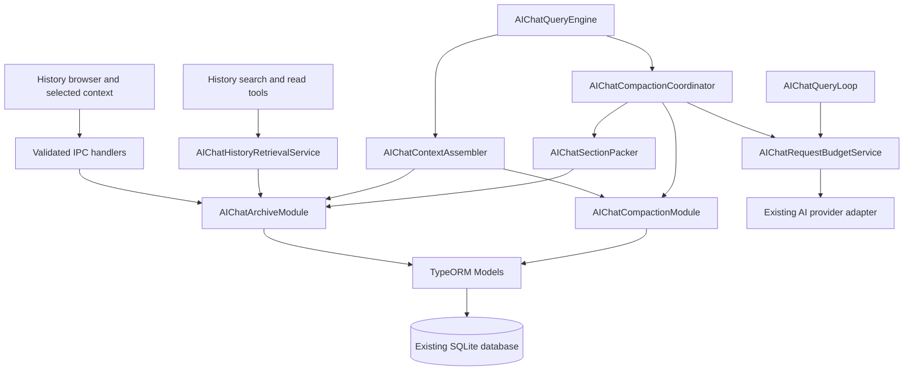
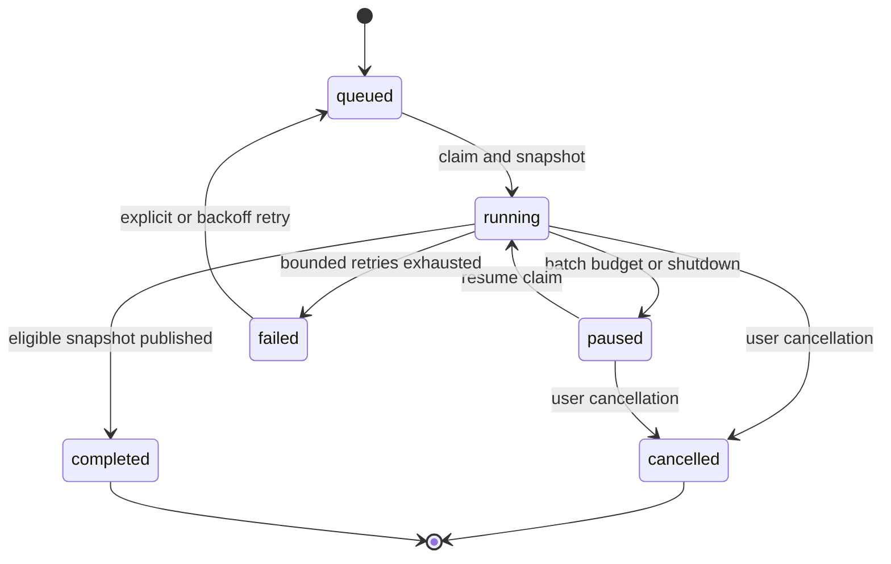

# Technical Design: Recoverable Conversation History and Incremental Compaction

**Date:** 2026-09-11  
**Status:** Draft, implementation-ready design for review  
**PRD:** [Recoverable conversation history and incremental compaction](ai-chat-recoverable-history-incremental-compaction-prd.md)  
**Scope:** AI Chat V2 archive retrieval, context assembly, and every compaction entry point  
**Implementation status:** Proposed; this document does not indicate that the feature has been implemented

## 1. Design decisions

1. Original `ai_chat_messages` content remains authoritative. Compaction creates derived records and never rewrites source messages.
2. Source order is the existing deterministic `(timestamp, id)` order, scoped to a conversation. No timestamp-only comparisons are permitted in the new path.
3. Stable row identity, a conversation epoch, and a source revision make cursors and checkpoints safe across duplicate public message IDs, source edits, late inserts, and deletion.
4. Summarize a bounded stream of source sections. Retain immutable section summaries and update one bounded overview incrementally.
5. Separate **staged source coverage** from **published active coverage**. Only published coverage can cause source messages to be excluded from context.
6. Preserve a token-budgeted recent suffix of complete turns. Historical tools remain recoverable through read-only archive tools.
7. Perform exact message search/read through bounded database queries. Add no external search service or mandatory embedding dependency.
8. Enforce a final request budget at the provider-dispatch boundary on every round, not only during initial context assembly.
9. Run orchestration in main-process services. Models and Modules own database operations; IPC and workers do not.
10. Ship retrieval and bounded compaction together. Disabling the feature must never restore the unbounded all-history summarization algorithm.

## 2. Existing integration points and gaps

The following are code-inspection findings; they are not runtime test results.

| Existing file | Observed responsibility | Required change |
| --- | --- | --- |
| `src/service/AIChatCompactAgentService.ts` | Automatic/manual compaction and incremental session memory | Delegate all work to one bounded coordinator; remove all-history input construction |
| `src/service/AIChatCompactPromptBuilder.ts` | Markdown summary prompts and heading normalization | Add versioned structured section/overview prompts and strict validation |
| `src/service/AIChatContextAssembler.ts` | Loads conversation history, removes pre-boundary rows, injects memory | Use bounded reads, composite boundaries, recent turns, source references, and typed context blocks |
| `src/service/AIChatTokenEstimator.ts` | Estimates text as characters divided by four; ignores array content | Replace budget-sensitive use with model-aware complete-request accounting |
| `src/service/AIChatModelCatalogService.ts` | Resolves context/output limits with 128k fallback | Preserve limit provenance and provide conservative unknown-model behavior |
| `src/service/AIChatQueryLoop.ts` | Builds exposed tools and dispatches each model round | Budget the actual tools/messages immediately before dispatch and after tool results |
| `src/service/AIChatQueryEngine.ts` | Persists messages and assembles initial context | Persist turn identity, invoke preflight, resolve selected sources, and integrate lifecycle |
| `src/service/AIChatQueryEngineFactory.ts` | Scheduled engines currently omit optional compaction agent | Inject shared safety services for non-interactive paths with task-scoped permissions |
| `src/service/AIChatConversationTurnCoordinator.ts` | Interactive/scheduled turn mutex | Coordinate snapshot capture without holding a turn lease through background model calls |
| `src/service/ConversationToolHistoryService.ts` | Pairs and searches stored tools after loading all rows | Use normalized tool references and paginated archive queries |
| `src/modules/AIChatV2Module.ts` | Persists text and separate tool messages | Add turn associations and archive revision bookkeeping through Models |
| `src/model/AIChatMessage.model.ts` | Timestamp/id sorted reads, optional offset pagination | Add bounded keyset/range/substring reads and conversation-scoped identity lookup |
| `src/config/SqliteDb.ts` | Registers entities; currently `synchronize: true`, empty migrations | Add an explicitly versioned archive schema bootstrap compatible with this startup behavior |

Keep public legacy summary views during transition. New execution code must not infer that a legacy timestamp alone is a safe active boundary.

## 3. Component architecture



### 3.1 New logical responsibilities

| Component | Responsibility |
| --- | --- |
| `AIChatArchiveModule` | Conversation-scoped reads, source validation, turn/tool lookup, search and cursor validation |
| `AIChatCompactionModule` | Transactional claims, checkpoints, section persistence, publication, deletion invalidation |
| `AIChatHistoryRetrievalService` | Result formatting, retrieval budget, source links, deduplication, error mapping |
| `AIChatCompactionCoordinator` | Shared triggers, run lifecycle, cancellation, resumable batches and retry decisions |
| `AIChatSectionPacker` | Turn-aware bounded source streaming, oversized fragments and deterministic coverage manifests |
| `AIChatRequestBudgetService` | Resolve limits, count complete request, allocate capacities, validate provider dispatch |
| `AIChatSummaryValidator` | Parse structured output, validate IDs and source spans, constrain outputs |
| `AIChatArchiveIndexService` | Resumable indexing and optional FTS synchronization through Module/Model APIs |

Keep these under existing `src/service/`, `src/modules/`, `src/model/`, and `src/entity/` conventions. Do not add a parallel database connection or embed repositories in the coordinator.

## 4. Source identity, order, and turn boundaries

### 4.1 Authoritative reference

Use the database row ID as the authoritative message identity within an epoch. The current entity does not declare `messageId` unique; therefore public message IDs alone cannot safely identify every historical row.

```typescript
export interface HistorySourceRef {
  readonly epoch: string;
  readonly revision: number;
  readonly rowId: number;
  readonly messageId: string;
  readonly timestampMs: number;
  readonly field: "content" | "tool_receipt";
  readonly startCodePoint: number;
  readonly endCodePoint: number;
}

export interface HistoryOrderKey {
  readonly timestampMs: number;
  readonly rowId: number;
}
```

References returned to the model/UI should normally be opaque source IDs resolved by the backend. The full structure above is the internal contract. Ranges use inclusive start and exclusive end offsets. Original text offsets count Unicode code points, not UTF-16 units or grapheme clusters. A text helper converts offsets consistently and must preserve exact stored characters without normalization.

Order comparisons are lexicographic by persisted timestamp and row ID. Keyset predicates use the same SQLite timestamp representation as the stored column; the Model converts API milliseconds consistently. Never mix numeric epoch comparisons with a datetime-text column without conversion.

### 4.2 Epoch and revision

- Create a random epoch when a conversation archive is first initialized.
- Ordinary ordered appends do not change the source revision.
- Editing existing content, replacing an earlier tool result, or inserting a row before the current high-water key increments source revision and invalidates published derived coverage.
- For the initial implementation, such mutations trigger a conservative bounded rebuild of derived coverage. Prefix reuse after verified mutation boundaries is a later optimization.
- Source references from older revisions return `SOURCE_CHANGED` with a refreshed reference when identity still resolves; never serve stale offsets as exact evidence.
- Deletion invalidates the epoch. Reusing a public conversation ID creates a new epoch.
- All write paths for V2 messages must pass through revision bookkeeping. Unsupported direct writes must not silently bypass it.

### 4.3 Turn association

Persist an explicit `turnId` for new V2 messages, generated when the engine accepts a user request and propagated to assistant/tool saves. Existing signatures accepting `assistantMessageId` do not establish a reliable stored turn association by themselves.

Maintain a derived archive entry linking source row to turn ID and normalized tool-call ID. Turn records track `open`, `completed`, `cancelled`, `failed`, or `interrupted` state. A turn is compactable only after it is terminal and all pending execution has stopped. An unresolved tool in a terminal interrupted turn is represented as interrupted, not successful.

Legacy backfill groups rows by ordered user-message boundaries and existing tool metadata. Ambiguous groups are marked inferred and represented by receipts; they must not be replayed as native tool protocol pairs. The current live turn is always excluded from the compactable prefix.

Compaction stops before the earliest retained or open turn. It does not skip over a gap to compact later turns while claiming contiguous coverage.

## 5. Persistence model

Names below are proposed concrete names. New entities use existing auditing conventions. All Model methods declare explicit return types and validate parsed JSON as `unknown` through schemas.

### 5.1 `ai_chat_archive_state`

One row per conversation:

| Column | Type / meaning |
| --- | --- |
| `conversationId` | Primary key |
| `epoch` | Random immutable identity for this lifetime |
| `sourceRevision` | Integer, increases on source mutation |
| `highWaterTimestamp`, `highWaterRowId` | Latest source order key |
| `activeGenerationId` | Nullable published generation pointer |
| `activeRunId`, `leaseOwner`, `leaseUntil`, `fence` | Durable compaction ownership |
| `indexCursorJson`, `indexState` | Resumable derived-index coverage |
| `schemaVersion`, `deletedAt` | Compatibility and invalidation state |

A tombstone retains no conversation text. Existing message append and archive-state update must share one transaction for newly enabled conversations.

### 5.2 `ai_chat_archive_turns` and `ai_chat_archive_entries`

Turn record: `(conversationId, epoch, turnId)` unique, first/last order key, terminal status, completion timestamp, association confidence.

Entry record: `(conversationId, epoch, sourceRowId)` unique; order key, source revision/content version, turn ID, message type, normalized tool-call ID, paired source row ID when known, and content length. References, not copied full content, are stored here.

Indexes:

- Existing messages: `(conversationId, timestamp, id)`.
- Entries: `(conversationId, epoch, turnId, timestamp, sourceRowId)`.
- Entries: `(conversationId, epoch, toolCallId, messageType)`.
- Turns: `(conversationId, epoch, status, lastTimestamp, lastRowId)`.

Do not load and parse all tool metadata to answer one tool-call lookup. Project bounded receipts at write/backfill time. If legacy metadata itself is very large, use bounded raw-field access and mark parsing unavailable rather than blocking on an unbounded JSON parse.

### 5.3 `ai_chat_compaction_runs`

Fields: UUID `runId`, conversation, epoch/revision, trigger, state, snapshot end key, retained-start key, base generation ID, staged cursor, published cursor, bounded working overview/state, merged-through section ordinal, fence, model/budget profile, schema version, retry counters, last failure code, created/updated times.

Run states: `queued`, `running`, `paused`, `cancelled`, `failed`, `completed`.

Persist the bounded working overview and merged-through ordinal after each successful merge. On restart, resume from that ordinal instead of collecting all staged summaries into memory or rebuilding their merge from the beginning. A working overview inside an incomplete turn remains staged and cannot advance active exclusion. Persist cursor JSON only after schema validation. Every field needed for restart is in this record or an immutable referenced section. A provider call in flight is not considered committed work.

### 5.4 `ai_chat_compaction_sections`

Fields: `sectionId`, conversation, epoch/revision, ordinal, deterministic `workKey`, source start/end positions, bounded source-manifest JSON, summary JSON, input/output estimates, actual usage when available, model, prompt/schema version, source hash, status, and timestamps.

`workKey` hashes epoch, revision, source positions, source hash, and prompt/schema version. Unique constraint on `(conversationId, epoch, workKey)` prevents duplicate saved work. Changing provider retry attempt does not create a duplicate section identity.

Section states: `staged`, `published`, `invalidated`. Content is immutable once validated; publication may change membership/state. Ordered sections form contiguous source coverage. A fragment-level checkpoint may end inside a message, but active raw-message exclusion advances only through complete terminal turns.

### 5.5 `ai_chat_context_generations`

Fields: `generationId`, conversation, epoch/revision, parent generation ID, represented section ordinal, covered-through order key, overview JSON, continuation state JSON, token estimate, model/schema version, status, timestamps.

Use a represented section ordinal/range and indexed section queries, not a growing JSON list of all historical sections. Each generation references a contiguous valid chain in the same epoch/revision. Only the archive state's `activeGenerationId` chooses the current generation; avoid multiple independent “active” flags as the source of truth.

Retain previous generations for recovery/debugging using a bounded count, initially 10. Never delete section summaries still needed by the active generation or source navigation. Original history and section summaries follow explicit conversation deletion/retention policy, not overview pruning.

### 5.6 Search storage

A rebuildable `ai_chat_archive_search_fragments` table stores bounded searchable fragments keyed by source row, field, and offset. Default maximum fragment size is 4,096 code points with 128-code-point overlap. Search verifies hits against the original source; overlap duplicates are merged.

An optional FTS virtual table indexes fragment IDs/content. FTS DDL and queries live in a dedicated Model through the existing TypeORM connection. Feature-probe the deployed SQLite build and tokenizer during initialization. FTS is an accelerator, never the only lookup path.

Index both ordinary content and bounded tool receipts. Full tool payloads are retrieved by explicit tool ID/source reference; arbitrary deep JSON search is not promised in the first release.

## 6. Model and Module contracts

The implementation should expose bounded operations with explicit defaults and hard caps:

```typescript
export interface ArchiveReadPage {
  readonly records: readonly HistoryExcerpt[];
  readonly nextCursor: string | null;
  readonly truncated: boolean;
  readonly sourceRevision: number;
}

export interface HistoryExcerpt {
  readonly sourceId: string;
  readonly messageId: string;
  readonly role: string;
  readonly timestamp: string;
  readonly text: string;
  readonly exact: boolean;
  readonly redacted: boolean;
  readonly hasMore: boolean;
}

export interface ArchivePageRequest {
  readonly conversationId: string;
  readonly cursor?: string;
  readonly maxRows: number;
  readonly maxCodePoints: number;
}

export interface CompactionClaim {
  readonly runId: string;
  readonly epoch: string;
  readonly revision: number;
  readonly fence: number;
}
```

Required operations:

- Archive: `readPage`, `readSourceSlice`, `searchPage`, `getRecentTurns`, `getToolPair`, `resolveSelections`.
- Compaction: `claimRun`, `renewLease`, `saveSectionAndCheckpoint`, `publishGeneration`, `pauseRun`, `cancelRun`, `invalidateConversation`.
- Index: `readNextIndexBatch`, `saveIndexBatchAndCursor`, `getIndexCoverage`.

Use 64-row metadata pages and a separate 64 KiB decoded-text allowance as initial internal limits. Source bodies are fetched by bounded substring reads; `LIMIT 64` alone is insufficient because a single row can contain megabytes. Include a hard serialized response byte cap in addition to token caps.

Keyset query shape, expressed conceptually:

```sql
WHERE conversationId = :conversationId
  AND (timestamp > :lastTimestamp
       OR (timestamp = :lastTimestamp AND id > :lastId))
  AND (timestamp < :snapshotTimestamp
       OR (timestamp = :snapshotTimestamp AND id <= :snapshotId))
ORDER BY timestamp ASC, id ASC
LIMIT :pageLimit
```

Bind all values. Reverse the ordering/predicate for recent-history pages. For full message reads use `substr(content, :startPlusOne, :length)` with consistent code-point semantics and a length probe. Do not normalize exact read text.

## 7. Retrieval APIs and tool behavior

### 7.1 `conversation_history_search`

Arguments: `query` string 1–200 characters; optional `before`, `after`, `types`, `cursor`; `limit` default 10, maximum 20. The active conversation comes from trusted tool context and is not an unrestricted model argument.

Response envelope:

```json
{
  "success": true,
  "records": [
    {
      "source_id": "opaque-source-reference",
      "message_id": "user-example",
      "timestamp": "2026-09-11T08:00:00.000Z",
      "role": "user",
      "excerpt": "Use the column order: email, company, country.",
      "exact": true,
      "has_more": false
    }
  ],
  "next_cursor": null,
  "truncated": false,
  "scan_complete": true,
  "index_complete": true
}
```

The example is illustrative, not repository data. Do not return an exact total by scanning the full archive on every request. Return page counts and completeness flags.

Search behavior:

1. Parse query as literal user text, never raw FTS syntax or SQL.
2. Use FTS for eligible word queries where supported; verify and rank bounded candidate excerpts.
3. Use literal scan for phrases, short identifiers, languages unsupported by the tokenizer, or index gaps.
4. Scan at most 500 bounded fragments or 100 ms per backend page, then return a continuation cursor. No-match is final only when `scan_complete` is true.
5. The retrieval service may consume several backend pages within its call time/output budget; otherwise expose a cursor and partial status.
6. Search phrase length is capped at 200 characters; cross-fragment validation reads adjacent source text, so a match crossing the overlap boundary is not lost.
7. Preserve case/characters in returned excerpts even if search matching is case-insensitive.

FTS ordering uses a stable snapshot and deterministic score/source-key tie-breaker. For the first version, a search cursor may carry a bounded candidate-page state; do not keep an unbounded result list in process memory. Literal scan cursors contain the last scanned fragment and snapshot watermark. Bind cursors to a hash of query/filter settings and epoch/revision.

Cursors are versioned opaque encodings, not authorization credentials. Decode with strict length/schema bounds, validate epoch/revision, query hash, snapshot bounds, and row membership against trusted context, and reject unknown versions. A caller-modified cursor must never widen conversation scope. Source text is not embedded in cursor payloads.

### 7.2 `conversation_history_read`

Accept exactly one of: `source_id`, `message_id`, or `from_source_id` plus `to_source_id`; optional neighbor count 0–2 and `cursor`. Ambiguous public `message_id` returns candidate source references instead of selecting an arbitrary row.

Default 4,000 output tokens, absolute maximum 8,000, reduced by remaining turn budget. Return exact source slices and a continuation cursor for large messages/ranges. Validate range direction and conversation scope. If a requested range is large, read its first bounded page rather than rejecting solely for size.

Source links open the local history browser at validated message/offsets. Use a structured UI event resolved by the app router; do not make model-generated URLs executable file paths.

### 7.3 Existing tool history

Keep `conversation_tool_history` available. Replace its full-history loader with indexed `getToolPair` and paginated receipts. Add compatible optional continuation fields for full stored payloads; retain existing callers' fields.

A stored result may itself have been truncated before persistence. Return `stored_content_incomplete: true` separately from this response's `truncated: true`. Never rerun a tool or imply that a missing external artifact can be reconstructed.

### 7.4 Retrieval accounting

Maintain request-scoped `RetrievalBudgetState`: consumed serialized tokens/bytes, unique source intervals, call count, and remaining context capacity. Default limits are 8,000 cumulative tokens and four calls per assistant turn. Search and read both count; overlapping retrieved intervals are merged.

Reserve space for result envelopes and tool-call framing. Refuse or shrink a retrieval response before execution if even its minimum envelope cannot fit. After execution, the query loop still performs final request preflight because other concurrent tool results may have used space.

Exact-recall prompts must instruct the model to retrieve before quoting uncertain historical details and to report missing/partial sources honestly. Retrieved evidence never grants permissions or supersedes current instructions.

## 8. Complete-request token budgeting

### 8.1 Limit resolution

Extend model catalog results with `limitSource: provider | configured | fallback` and effective model ID. Resolve the provider's selected default model before budgeting. Re-resolve after model fallback, tool exposure changes, or output-limit changes.

Use provider or explicit configured limits first. Unknown text-only models use a provisional 8,192-token context and at most 1,024 reserved output tokens, labeled as a fallback estimate. This is not a guarantee of provider capacity. Context rejection reduces the effective allowance within the bounded retry policy; repeated rejection returns an actionable error. Unknown image accounting requires a provider-specific conservative estimate or an explicit unsupported-budget error, never a zero-token image.

### 8.2 Formula

Let:

- `C`: selected model context limit.
- `O`: requested output reservation, capped by model/provider output limit.
- `M`: safety allowance, default `ceil(0.10 * C)`.
- `I`: estimate of the exact serialized input plus known provider framing.

Dispatch requires `I + O + M <= C`. Usable input capacity is `U = C - O - M`. Trigger compaction at `I >= 0.80 * U`; target `I <= 0.60 * U` where mandatory content permits.

Count all message content parts, tool call arguments, tool results, tool definitions, structured output schema, names/roles, framing, attachments/image estimates, workspace/plan/memory blocks, and selected/retrieved history.

Use an available compatible tokenizer when it is already supported and verified. For unknown text tokenizers, use a deliberately conservative UTF-8-byte-based estimate plus framing, rather than characters divided by four. This remains an estimate: actual usage calibration can increase margins but must not assume universal tokenizer behavior.

### 8.3 Compaction-specific allowance

For each section:

`sourceCapacity = min(12000, C - Osection - M - promptOverhead - stateInputCost)`

`Osection` defaults to 1,500 tokens but must shrink for small windows. A non-positive capacity is an error, not permission to send an oversized request. Validate the complete packed request again after source IDs and manifests are serialized.

Overview/state output target is at most 2,000 tokens combined. Merge one new section summary at a time, with prior bounded overview and required canonical state. If the merge input cannot fit, reduce the section input representation or produce a smaller bounded derivative; never concatenate all old section summaries.

Every summary request sets an explicit provider output cap. If generated output exceeds storage/validation caps or reports truncation, reject it rather than blindly cutting JSON or factual text.

### 8.4 Worked budget example

For a known model with `C = 32,000`, chat output reserve `O = 4,000`, and safety margin `M = 3,200`, usable input is `24,800`. Automatic compaction triggers at `19,840` estimated input tokens; the target is `14,880` when mandatory content permits.

A section request for the same model with `Osection = 1,500` and 1,000 tokens of summarization overhead has 26,300 tokens of theoretical source capacity, but the section source target caps it at 12,000. Final serialized validation still applies. For a small model, the calculated capacity overrides that 12,000-token target downward.

These examples illustrate allocation only; actual model limits and overhead come from the resolved request profile.

### 8.5 Dispatch enforcement

Initial assembly returns typed blocks and an estimate. `AIChatQueryLoop` must validate the final request after exposed tools are chosen, immediately before `streamChatCompletion`. Compaction's non-streaming calls use the same budget service.

Preflight may evict optional retrieved/context blocks, choose fewer old complete turns, or request compaction. It must not silently remove current user content, user-selected excerpts, required permission state, or half a native tool pair. Mandatory over-budget content produces `CONTEXT_REQUIRED_CONTENT_TOO_LARGE`.

For an in-progress oversized tool exchange, persist full results first and substitute a bounded result receipt with source references while preserving call IDs and valid response pairing. This is not compaction of an unfinished turn; it is bounded tool-result presentation. If arguments/current mandatory content still cannot fit, stop safely with a recoverable error.

## 9. Section packing and source coverage

### 9.1 Source stream

The packer obtains completed turns strictly after published/staged coverage and before the frozen retained suffix. It reads metadata pages first, then bounded source slices.

For ordinary text, include role, source reference, and exact bounded text. For tools, include a receipt with tool-call ID, operation, status, bounded arguments/result summary, artifact IDs, and source references. Large raw payloads remain archived and retrievable.

Every row is represented in the manifest by text fragments or an explicit receipt. Tool receipts intentionally represent the existence/outcome of a payload; they do not assert that all raw payload details have been summarized.

### 9.2 Oversized messages and turns

- Split an oversized text message at code-point boundaries; prefer paragraph/sentence boundaries when possible.
- Record exact `[start, end)` offsets and source content version.
- Fragments must have contiguous coverage with no omitted code points. The packer, not the model, owns the coverage ledger.
- Save fragment summaries independently when necessary. Staged progress can end inside a message or turn.
- Publish a new exclusion boundary only after every representation in a complete terminal turn is covered.
- An oversized turn can span multiple sections. Its intermediate summaries feed the bounded rolling merge without exposing an incomplete raw replay as complete.
- Preserve original source text during retries; reducing capacity may split an unsaved fragment further.

### 9.3 Complexity

Normal processing reads only newly eligible source sections. Per-request memory is bounded by metadata page, source byte allowance, and summary caps. CPU/model work is proportional to new source volume, with bounded merge overhead per section. Do not compute a lifetime source hash or load all section IDs on every compaction.

## 10. Structured summary format and validation

Use versioned JSON internally; render Markdown only for display or context presentation. Do not depend on provider JSON-schema enforcement: validate every response locally and support plain completion providers with strict parsing.

```typescript
export interface SummaryFact {
  readonly text: string;
  readonly status: "proposed" | "accepted" | "superseded" | "uncertain";
  readonly sourceIds: readonly string[];
}

export interface SectionSummaryV1 {
  readonly version: 1;
  readonly synopsis: string;
  readonly decisions: readonly SummaryFact[];
  readonly constraints: readonly SummaryFact[];
  readonly pending: readonly SummaryFact[];
  readonly toolOutcomes: readonly SummaryFact[];
  readonly topics: readonly string[];
}
```

Initial structural caps: synopsis 2,000 characters; each fact 500 characters; at most 20 facts per category; at most four references per fact; at most 20 short topics. The overall token/byte cap is authoritative even when individual fields pass.

Assign source IDs before the model call. Validate references against the bounded supplied source map; reject references outside it. Overview merge can also reference previously validated facts from its input. A valid reference proves source existence, not semantic entailment: automated schema checks must not be described as proof that the model's factual interpretation is correct.

Prompts require no invention, explicit uncertainty, later corrections, no credentials in summaries, and preservation of unresolved tasks. Canonical goal/plan/approval records are authoritative and are loaded separately, never overwritten by inferred memory. Accept no generated permission grants.

Receipts and generated summaries always use `exact: false`; only verified original text slices can use `exact: true`. Keep section summaries immutable even when rolling overview details are dropped. Source/topic navigation queries archived sections with pagination when needed.

## 11. Coordinator algorithm and transactions

### 11.1 Shared entry point

Automatic, manual, session-memory, and reactive-overflow entry points call `requestCompaction(conversationId, trigger, model, signal)`. Preserve existing public wrappers where needed, but remove their independent all-history/model-call logic.

The coordinator synchronously installs an in-process promise before its first awaited operation, then attempts a durable claim. A second caller joins the same run or receives its status. All engine instances share the coordinator for a database/profile; do not instantiate separate coordinators inside each scheduled engine.

### 11.2 Lifecycle



Background work yields after three section completions. A yield preserves resumable work and schedules another bounded batch only if still needed; it must not create a tight retry loop. Paused because of shutdown or cancellation is not auto-resumed in the same process unexpectedly.

### 11.3 Claim and snapshot transaction

1. Confirm conversation exists and is not tombstoned; read epoch/revision.
2. Atomically claim `activeRunId`, increment fence, and assign owner/lease.
3. Record current active generation, terminal-turn snapshot end, and retained suffix start.
4. Commit before model work.

Initial lease: 120 seconds, renewed every 30 seconds while active. Fence validation prevents a slow previous owner from publishing after lease takeover. Use a bounded provider timeout, initially 90 seconds per compaction call, and cancellation support. Refresh the lease before each expensive operation; no busy-waiting.

Snapshot capture may briefly coordinate with the conversation turn mutex; it must not acquire that mutex again when the caller already holds it. Background summarization does not hold the mutex while waiting on AI. The archived prefix is immutable for the captured revision; any mutation invalidates the claim.

### 11.4 Save section transaction

Validate live epoch, revision, run ID, and fence. Insert a section with unique work key or reuse the identical saved section. Advance staged cursor only if its expected previous cursor matches and coverage is contiguous. Commit section and checkpoint together.

Do not hold a database transaction across an AI call. If a save fails after an AI response, retry the write with the same section identity. A crash before persistence may require repeating that one request.

### 11.5 Overview publication transaction

Outside the transaction, build and validate the new bounded overview from prior published overview and consecutive staged sections. Inside the transaction:

1. Revalidate epoch/revision/fence and base active generation.
2. Verify complete source coverage through the proposed terminal-turn boundary.
3. Insert immutable generation.
4. Compare-and-swap `activeGenerationId` from the expected parent.
5. Advance published checkpoint and mark represented sections published.
6. Commit, then broadcast status.

If synthesis or publication fails, the old active generation remains usable. Never advance exclusion to the staged cursor merely because section generation succeeded.

### 11.6 Cancellation and deletion

Cancellation sets run state and invalidates the owner's fence; late model results are discarded. Already saved sections remain available for explicit subsequent work.

Conversation clear must first tombstone/invalidate its epoch and fence, then remove sources and derived records through a coordinated Module operation. All save/publish methods reject tombstoned state. Clearing all history applies the same invalidation before batch deletion. A compact task must never create archive state implicitly during a late save.

## 12. Context assembly and continuation

Build typed context blocks with category, token estimate, source intervals, priority, and whether they are mandatory. Render to provider messages only after allocation.

Allocation order:

1. Required system, workspace safety, tool policy, and authoritative plan/goal instructions.
2. Current user content, attachments, and explicitly selected historical passages.
3. Valid current tool exchange and recent complete turns; target at least two completed turns when they fit.
4. Bounded overview plus continuation state.
5. Optional older turns, durable/workspace memory, additional receipts, and retrieved evidence within allowance.

The actual serialized order may keep overview before recent history for chronology. Allocation priority and serialization order are separate concerns.

Use only the published composite boundary when excluding raw history. Preserve current user content exactly once even if it is already persisted. Deduplicate selected/retrieved source intervals; preserve selection provenance when a passage is already present in a recent turn.

Represent summaries and historical user/assistant/system text as labeled evidence, never as new privileged instructions. A trusted system rule explains how to interpret the evidence; the untrusted content itself stays in a provider-compatible historical-data/tool-result block. Do not replay archived permission decisions as current authorization.

If the active overview cannot fit after a switch to a smaller model, generate a bounded smaller derivative from it or use a small source-navigation receipt that explicitly indicates omitted state. Do not silently claim the full state was loaded. Retain canonical current task information; if mandatory information still cannot fit, fail clearly.

## 13. UI, IPC, and submission contracts

### 13.1 Proposed channels

Add channels to `src/config/channellist.ts` and the appropriate `src/preload.ts` invoke/event allowlists:

- `AI_CHAT_V2_HISTORY_SEARCH`
- `AI_CHAT_V2_HISTORY_READ`
- `AI_CHAT_V2_HISTORY_RESOLVE_SELECTIONS`
- `AI_CHAT_V2_COMPACTION_STATUS`
- `AI_CHAT_V2_COMPACTION_CANCEL`
- `AI_CHAT_V2_COMPACTION_PROGRESS` event

Keep `AI_CHAT_V2_COMPACT_CONVERSATION` and `AI_CHAT_V2_AUTO_COMPACTED` compatible via adapters. The new UI should use a start/status flow so long compaction does not require one indefinite IPC wait. If legacy callers expect a completed summary, bound their wait and return an explicit in-progress response only with a versioned frontend migration.

Local history endpoints validate input and session/conversation ownership but perform no AI calls. AI-serving compact endpoints check the project's `Token` / `USER_AI_ENABLED` policy before parsing request data or initiating work. Recheck permission/provider availability when executing a delayed background call. Preserve existing local-provider entitlement policy rather than introducing a different subscription decision in this feature.

### 13.2 Renderer decomposition

Proposed components:

- `AiChatHistoryDrawer.vue`: paginated search and browse.
- `AiChatHistoryMessage.vue`: bounded passage display, source navigation, selection.
- `AiChatSelectedContext.vue`: next-reply selections and estimated cost.
- `AiChatCompactionStatus.vue`: progress, pause/failure, retry/cancel.

Keep `AiChatV2.vue` responsible for integration, not archive business rules. Extend `src/views/api/aiChatV2.ts` with typed wrappers and scoped listener cleanup. History expansion must never mutate model context unless the user selects a passage.

### 13.3 Selected-context lifecycle

Store draft selection references per conversation in renderer state: source ID, offsets, and visible preview. On submit, send references plus a stable submission ID. Backend re-resolves them, checks epoch/revision and final budget, and persists accepted selection references with the user-turn metadata transaction.

Clear UI selections only after submission is accepted/persisted. Transport retry with the same submission ID must reuse the same user message and selections. If provider execution fails after acceptance, retry that existing turn rather than adding a second selected-context message. If source changed or content cannot fit, reject before acceptance and retain the draft selections.

No renderer-provided passage text is trusted as an original archive quote. User edits to copied text are ordinary current user input and should be labeled accordingly.

All UI labels/errors use six-language translations, accessible names, keyboard navigation, and source-navigation focus restoration.

## 14. Integration with existing engine consumers

- Interactive engine: reuse a profile-scoped coordinator and provider adapter from the existing factory/setup layer.
- Scheduled engine: inject budget services and bounded compaction dependencies through `AIChatQueryEngineFactory`; do not import IPC setup. Retrieval tools remain subject to scheduled tool allowlists.
- Goal/loop execution: preserve canonical goal state and existing approval logic. Compaction completion cannot complete a goal.
- Subagent or other isolated history stores: do not expose parent history implicitly. Either provide an explicitly authorized archive adapter or enforce the request budget and return a supported limitation. V2 source access never crosses conversation boundaries automatically.
- Recovery service: context overflow requests a bounded compaction/reassembly attempt with shared retry accounting. Avoid recursive recovery paths that independently retry the same overflow.
- Session memory: treat background updates as another bounded trigger, not a second model call that reads an unlimited delta. Legacy session memory is a compatibility input until new generations become active.

## 15. Migration and startup safety

The repository currently uses TypeORM synchronization and no configured migrations. Do not assume a migration runner exists.

Implementation approach:

1. Register additive ordinary entities in `SqliteDb.ts`.
2. Add an idempotent archive schema bootstrap Model/Module, invoked after connection initialization and before enabling archive services.
3. Persist a schema version and stage marker. Create explicit indexes/optional FTS structures through the same database connection.
4. Test repeated startup with `synchronize: true` against all archive objects. Unmanaged FTS/support objects must not be dropped or recreated by synchronization. If this cannot be guaranteed, release must introduce controlled migration ownership for these objects before enabling the feature; do not risk production data with untested synchronization behavior.
5. Backfill archive state, turn/entry projections, and search fragments in resumable batches. Read-only history can fall back to original messages before indexing completes.
6. Resolve legacy summary `throughMessageId` to exact row/key only when unambiguous. Keep ambiguous legacy summaries advisory; do not apply unsafe source exclusion.
7. Build new sections from original sources in bounded calls while retaining the old valid context generation/legacy adapter.
8. Publish the replacement only after contiguous coverage and overview validation.

Ordinary append while backfill runs is tracked above the captured index watermark; replay the new tail after the older snapshot. Revision changes invalidate/restart affected backfill work. Never mark an index complete merely because one batch ended.

Rollback is a feature-flag rollback within a compatible application version. A downgrade to an older binary that can run unbounded compaction is not a supported safe fallback. Keep source history and schema data intact and provide a budget-checked legacy-summary mode.

## 16. Failure policy and error codes

| Code | Behavior |
| --- | --- |
| `HISTORY_NO_MATCH` | Final only when scan complete; no fabricated evidence |
| `HISTORY_PARTIAL_SCAN` | Return cursor and searchable partial results |
| `SOURCE_CHANGED` | Refresh selection/reference; do not apply stale offsets |
| `SOURCE_UNAVAILABLE` | Show existing receipt and missing-content state |
| `HISTORY_SCOPE_INVALID` | Reject without revealing another conversation |
| `COMPACTION_BUSY` | Join/status existing run |
| `COMPACTION_OUTPUT_INVALID` | One structured-output repair attempt within the run's total retry budget |
| `COMPACTION_CONTEXT_REJECTED` | Reduce source allowance, at most two reductions per section per run |
| `COMPACTION_STALE_CLAIM` | Discard late output; no publication |
| `COMPACTION_STORAGE_FAILED` | Keep prior generation and retry persisted unit safely |
| `CONTEXT_REQUIRED_CONTENT_TOO_LARGE` | No silent truncation; actionable user error |
| `MODEL_BUDGET_UNAVAILABLE` | No unmeasured image/tool request; configure a compatible model/budget |

Apply a total attempt ceiling of four model attempts per section per run, including output repair and context reductions. Transport retries count against that ceiling. Overview merges have the same bounded attempt policy. Use existing provider retry/backoff handling where possible, with one shared accounting owner so nested retries cannot multiply limits.

After repeated failure, persist a backoff time and stop background retries until due or explicitly requested. A manual retry starts a new bounded attempt budget and reuses saved sections; it does not discard valid progress.

## 17. Testing and validation

### 17.1 Deterministic tests

- Ordering: equal timestamps, late insertion, duplicate public IDs, source edits, and delete/recreate epochs.
- Pagination: metadata pages, source slicing, Unicode offsets, cross-fragment phrase matches, partial scan cursors, and zero-result completeness.
- Budget: actual exposed tool schemas, array text/image content, output reserves, unknown-model limits, model fallback, and per-round growth.
- Packing: complete turns, oversized messages/turns, interrupted tools, contiguous fragments, and no exclusion before full terminal-turn coverage.
- Persistence: fence takeover, duplicate work key, section/checkpoint atomicity, generation compare-and-swap, crash after save, and delete during in-flight AI.
- Retrieval: scope isolation, exact text, bounded output, repeated-call limits, and source interval deduplication.
- Compatibility: all compaction triggers use bounded paths; scheduled engines do not silently omit preflight.

Use deterministic fake model responses to inspect every request and assert `I + O + M <= C`. Count source IDs in requests to prove normal incremental work never resends committed raw sections. A fake provider should deliberately reject selected sizes to test reduction behavior.

### 17.2 Test placement

Proposed main tests under `test/vitest/main/`: `AIChatArchiveModel.test.ts`, `AIChatHistoryRetrievalService.test.ts`, `AIChatSectionPacker.test.ts`, `AIChatCompactionCoordinator.test.ts`, `AIChatRequestBudgetService.test.ts`, and updated assembler/query-loop tests. Follow local framework conventions when a Model fixture belongs in the existing module suite.

Component tests under `test/vitest/main/components/` mirror the four renderer components. E2E file: `test/e2e/specs/ai-chat-recoverable-history.test.ts`, covering compact, restart, exact recovery, selection, and deletion.

Required checks: relevant service/Model tests, `yarn test:components`, applicable `yarn test:e2e`, lint, and both TypeScript checks. Document-only commits do not claim these feature tests exist or have passed.

### 17.3 PRD traceability

| PRD criteria | Primary verification |
| --- | --- |
| AC-01, AC-02, AC-21 | Retrieval integration and live-model recall dataset |
| AC-03, AC-16 | Assembler mandatory-content/recent-turn tests |
| AC-04, AC-05, AC-06, AC-23 | Packer/coordinator request capture and repeated compaction |
| AC-07, AC-08, AC-09, AC-13 | Transaction, fencing, snapshot, and restart fixtures |
| AC-10, AC-11, AC-12, AC-22 | Tool history, scope, budget, historical-data boundaries |
| AC-14, AC-15 | Validator and fake-provider failure injection |
| AC-17, AC-18, AC-24 | Component and Electron E2E tests |
| AC-19, AC-20 | Upgrade fixtures and AI-disabled local browsing |

### 17.4 Performance and model-quality evaluation

Use the PRD's 100,000-message fixture and 50-case multilingual recall dataset. Record hardware, SQLite build, provider/model, and feature settings. Measure p95 search/read latency, peak batch memory, requests per new source token, staged-to-published lag, and duplicate work.

Separate exact storage retrieval success from model answer quality. Valid schema/source IDs do not prove a faithful summary. Review incorrect answers for retrieval misses, source-selection errors, or unsupported model claims.

## 18. Observability and rollout

Emit structured events for claim, section saved, generation published, run paused/failed/completed, retrieval partial/complete, and dispatch budget rejection. Include opaque run/generation IDs, counts, timing, budget provenance, and failure categories. Exclude source content, complete queries, tool payloads, and secrets.

Rollout flags: archive reads, history tools, new compaction publication, and UI. The final dispatch guard is mandatory whenever the new code path is enabled and must remain in compatibility fallback.

Stage deployment:

1. Enable archive reads/indexing and compare pagination with known fixtures.
2. Enable bounded compaction for test profiles; inspect captured request sizes and checkpoint consistency.
3. Enable tools/UI together with new publication for a limited group.
4. Expand only after all deterministic acceptance tests and recall targets pass.

Operational rollback disables new publication, retains the last valid overview and archive tools where safe, and surfaces compact limitations. It never selects `runFullCompact`'s previous all-history implementation.

## 19. Suggested implementation units

1. Source references, cursor schemas, archive state, and bounded Model reads.
2. Turn/tool projections, mutation bookkeeping, and resumable legacy backfill.
3. Search/read tools and bounded existing tool-history integration.
4. Complete-request budget service and final query-loop guard.
5. Section packer, structured prompts, and validation.
6. Durable coordinator, transaction checkpoints, leases, and generation publication.
7. Assembler continuity, all-trigger routing, scheduled-factory compatibility.
8. History UI, selected-context submission, translations, and UI tests.
9. Migration/restart fixtures, performance/recall qualification, and rollout controls.

Each unit must be complete, tested at its boundary, and committed according to repository policy. Do not activate new source exclusion before retrieval, publication consistency, and budget enforcement are ready.

## 20. Alternatives considered

| Alternative | Benefit | Reason not selected for initial implementation |
| --- | --- | --- |
| Longer rolling summary only | Small implementation change | Still loses exact detail and cannot resolve all-history input growth |
| Restore all compacted messages on demand | Simple retrieval semantics | Recreates context overflow and has unbounded read/request cost |
| Vector search as the only history lookup | Can find paraphrased topics | Does not guarantee exact identifiers/phrases; adds indexing dependencies without fixing compaction |
| Summary tree required from day one | Supports deeper hierarchical traversal | Flat immutable sections plus a bounded overview solve initial request growth with fewer publication states |
| Add a new sequence to every original message | Simple numeric source ordering | Requires source-row migration; existing timestamp/id order is usable with revision invalidation for late writes |

The selected design keeps the original archive authoritative, adds exact bounded retrieval, and makes summary processing incremental. A future hierarchical summary index or semantic search can use the same source references without changing the fundamental safety invariants.

## 21. Completion definition

The implementation is complete when the PRD's 24 acceptance criteria pass, original details remain retrievable after repeated compaction/restart, every model path is budget checked, and normal compaction processes only new eligible history in bounded resumable sections. No full-history summarization fallback may remain reachable through automatic, manual, session-memory, reactive, or compatibility paths.
