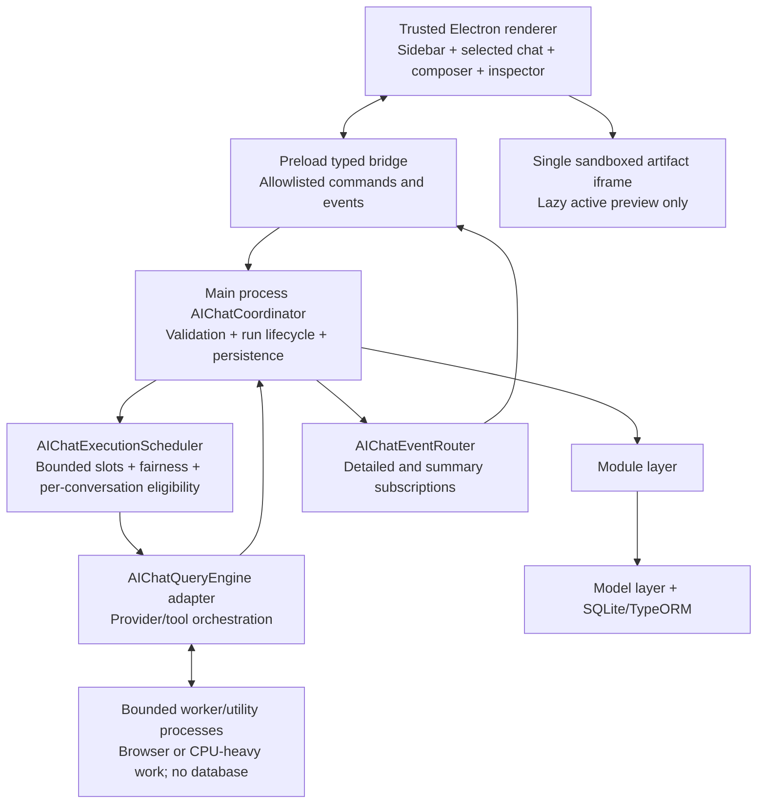
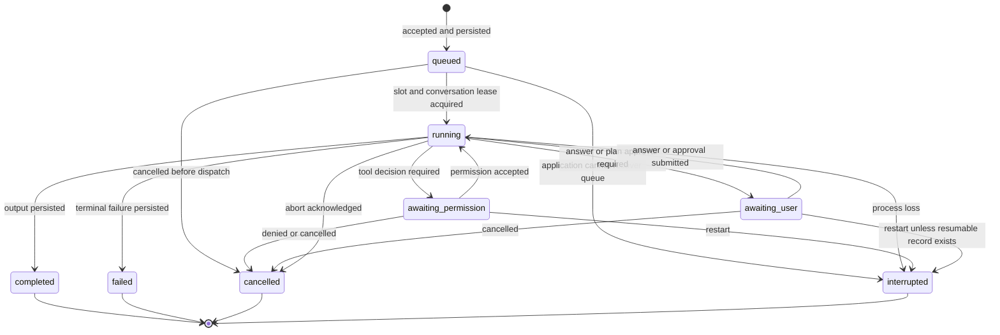

# AI Chat Workspace UI Redesign Technical Design

## Document Information

- **Version**: 1.0
- **Status**: Proposed
- **Created**: 2026-08-11
- **Owner**: AiFetchly Desktop Engineering
- **Product**: AiFetchly Electron desktop application
- **Source requirements**: [`ai-chat-workspace-ui-redesign-prd.md`](./ai-chat-workspace-ui-redesign-prd.md)
- **Related designs**:
  - [`ai-html-artifacts-technical-design.md`](./ai-html-artifacts-technical-design.md)
  - [`ai-chat-scheduled-loop-technical-design.md`](./ai-chat-scheduled-loop-technical-design.md)
  - [`ai-chat-goal-loop-prd.md`](./ai-chat-goal-loop-prd.md)
  - [`ai-chat-seven-layer-recovery-plan.md`](./ai-chat-seven-layer-recovery-plan.md)
  - [`ai-chat-batch-worker-subagent-prd.md`](./ai-chat-batch-worker-subagent-prd.md)

## 1. Purpose

This document defines the implementation architecture for the AI Chat workspace redesign. It translates the product requirements into process boundaries, durable data models, typed contracts, scheduling rules, renderer state, component boundaries, security controls, migration steps, tests, and rollout gates.

The design has two inseparable goals:

1. Replace the header-heavy chat dock with a workspace-oriented three-region interface.
2. Make conversation execution independent from the lifecycle and rendering cost of individual Vue components.

This is a design document, not an implementation. No source code behavior changes merely by adopting it.

## 2. Executive Technical Decision

AiFetchly will use one trusted Electron renderer per application window for the application shell, the selected conversation, the composer, and inspector controls. It will not create a renderer per conversation.

The Electron main process will own chat execution lifetime through a database-scoped `AIChatCoordinator`. The coordinator will persist a run envelope, enforce one conflicting turn per conversation, admit work through a bounded scheduler, and publish events through a subscription router that is independent from the renderer that started the run.

The renderer will keep only:

- Workspace and conversation summaries needed by the sidebar.
- Full message state for the selected conversation.
- Draft, scroll, focus, and inspector presentation state.
- A short-lived, batched stream buffer for the selected run.

The renderer will not keep inactive conversation histories mounted. Changing selection will unsubscribe from detailed events for the old conversation and subscribe to the new one without cancelling either conversation's main-process-owned work.

The right inspector will contain `Artifacts`, `Activity`, and `Context`. Generated HTML will be fetched by artifact ID and displayed in the existing strict sandbox pattern. Only one preview surface will be mounted for the active artifact; inactive artifacts will not own renderers or iframes.

## 3. Scope

### 3.1 In scope

- Persistent left navigation with workspace-grouped conversations.
- A center area containing only the selected conversation.
- A minimal conversation header with the real title, one summarized state, inspector toggle, and overflow menu.
- Composer-local mode, model, tool approval, attachment, voice, send, and stop controls.
- A contextual run strip for goals, plans, scheduled loops, permission, recovery, and errors.
- A right inspector containing Artifacts, Activity, and Context.
- Main-process ownership of run lifetime.
- Bounded, fair concurrency across conversations.
- Same-conversation turn serialization.
- Detailed selected-conversation events and lightweight global summary events.
- Durable conversation metadata, run state, unread state, history pagination, and restart reconciliation.
- HTML artifact sandboxing and lifecycle management.
- Performance, accessibility, localization, security, observability, migration, and rollback requirements.

### 3.2 Out of scope

- Replacing Vue, Vuetify, Pinia, TypeORM, or SQLite.
- One Electron renderer or `BrowserView` per conversation.
- Running all AI orchestration inside an operating-system worker in the first migration phase.
- Letting workers access SQLite or TypeORM.
- Redesigning provider settings, MCP management, global agent management, or all non-chat application routes.
- Enabling arbitrary JavaScript, navigation, forms, or network access inside generated HTML.
- Changing the semantics of existing plan, goal, scheduled-loop, recovery, permission, or artifact features except where integration with the new shell requires it.

## 4. Current Implementation Assessment

### 4.1 Assets to preserve

The current code already provides several strong foundations:

- `ChatV2ConversationSummary` separates list data from full history.
- `ChatV2HistoryResponse` returns one conversation's history and authoritative runtime status.
- `AIChatQueryEngine` tracks active turns, pending permissions, and pending user questions per conversation.
- `AIChatConversationTurnCoordinator` provides an in-memory per-conversation lease with interactive priority.
- `AIChatV2Module` and `AIChatMessageModel` keep database access out of the renderer.
- `WorkspaceKeyService` derives a stable workspace key from a canonical path or Git root.
- `AIArtifactModule` persists artifact content outside ordinary stream payloads.
- `AiArtifactWorkspace.vue` already renders HTML through an iframe with an empty sandbox and suppressed referrer.
- Completion notifications already exist for background results.

### 4.2 Gaps this design closes

| Current behavior | Problem | Target behavior |
| --- | --- | --- |
| Stream sink sends directly to `event.sender` | Renderer reload or destruction breaks presentation ownership | Run events enter a main-process event router independent of the initiating renderer |
| Renderer registers per-conversation listeners on shared high-volume channels | Inactive chats can retain listener and state overhead | One selected detailed subscription per window plus one summary subscription |
| `AiChatV2.vue` owns broad orchestration and many controls | Large reactive surface and unclear ownership | Split shell, selected conversation, run strip, and inspector stores/components |
| Conversation list metadata is derived from message queries | Expensive list reconstruction and N+1 query risk | Dedicated conversation metadata projection updated transactionally |
| History request types contain pagination fields but the handler loads complete history | Long histories increase load and mount cost | Cursor-paged history with a bounded rendered window |
| Runtime states are mostly in-memory and non-terminal state is not uniformly durable | Restart cannot explain every interrupted run | Durable run envelope with startup reconciliation |
| Workspace rows are conversation bindings without a stable key column | Grouping the same canonical workspace is unreliable | Persist `workspaceKey` and canonical path on bindings and group by stable key |
| Artifact preview replaces route content | Chat and result compete for the center surface | Artifact preview lives in the right inspector |

## 5. Architecture Principles

1. **One trusted renderer, one selected transcript.** Conversation count must not determine renderer count or mounted message-tree count.
2. **Execution outlives presentation.** A Vue component can unmount, a renderer can reload, and a window can change selection without implicitly cancelling a run.
3. **Persistence precedes terminal hints.** A terminal UI event is sent only after the authoritative message and run state are committed.
4. **Main process owns authority.** The renderer requests actions and renders projections; it does not own run truth, database connections, or worker assignment.
5. **Workers compute; main process commits.** Worker and utility processes never use TypeORM or SQLite.
6. **Bound work, not bound responsiveness.** The system limits admitted execution while keeping navigation and already-loaded transcripts responsive.
7. **Minimal event disclosure.** Inactive-conversation updates contain status metadata, not prompts, answers, tool bodies, or artifact HTML.
8. **Stable identifiers everywhere.** `conversationId`, `runId`, `messageId`, `workspaceKey`, and `artifactId` make stale-event rejection deterministic.
9. **Incremental migration.** Existing chat capabilities remain functional behind a feature flag while ownership is moved in stages.

## 6. Target Process Architecture



### 6.1 Why the main app keeps one renderer

Every Electron renderer has Chromium process and framework overhead. Creating a renderer per conversation would reduce Vue component contention but increase memory, IPC complexity, security surface, crash recovery work, and lifecycle coordination. It would also make hundreds of conversations structurally expensive even when idle.

The correct unit of isolation is not “conversation.” The correct boundaries are:

- Trusted application UI: one renderer per application window.
- Untrusted generated HTML: one lazy sandboxed preview surface.
- Long-running or resource-heavy computation: bounded worker/utility capacity.
- Durable state: main-process Module and Model layers.

### 6.2 Scheduler slots versus operating-system processes

The concurrency limit is a logical execution scheduler. A slot does not automatically require a dedicated process.

- Provider streaming is primarily network I/O and may remain asynchronous in the main-process execution adapter during early migration.
- Browser automation must use its existing isolated child/worker process boundary and a browser-specific concurrency limit.
- CPU-heavy parsing or transformation may use utility or child processes under a separate bound.
- Tools that require main-process services execute through typed main-process adapters; a worker cannot bypass those adapters to reach the database.

This separation achieves bounded work without allocating one process per running chat. The coordinator and event contracts allow provider execution to move into an Electron utility process later without changing renderer APIs.

## 7. Component Responsibilities

### 7.1 Trusted renderer

The renderer owns presentation-only state:

- Current route and navigation expansion.
- Current `selectedConversationId`.
- Workspace and conversation summary projections.
- Selected conversation message page(s).
- Selected run's in-progress display model.
- Drafts and scroll anchors.
- Inspector visibility, width, active tab, and selected artifact.
- Keyboard focus and accessible announcements.

The renderer must not own:

- Whether a run continues.
- Queue placement or worker assignment.
- Durable terminal state.
- Database access.
- Workspace path trust decisions outside typed commands.
- Artifact validation.

### 7.2 Preload bridge

The preload layer provides a narrow, allowlisted API. It must:

- Expose typed `invoke`, command, and subscription functions through `contextBridge`.
- Reject channels not explicitly listed.
- Return unsubscribe functions for event subscriptions.
- Remove all subscriptions for destroyed renderer scopes.
- Carry serialized data only; no Electron objects, functions, filesystem handles, or privileged APIs cross the boundary.

### 7.3 `AIChatCoordinator`

One coordinator instance exists per active user database path. It is the only entry point for interactive run lifecycle changes.

Responsibilities:

1. Check `USER_AI_ENABLED` before parsing or starting AI work.
2. Validate request schema and normalize identifiers.
3. Resolve or create the conversation and workspace association.
4. Persist the user message and durable run envelope through Module classes.
5. Submit the run to the scheduler.
6. Acquire the existing per-conversation turn lease at dispatch time.
7. Create cancellation and execution contexts.
8. Adapt `AIChatQueryEngine` events into run-aware event envelopes.
9. Persist progress that must survive restart and every terminal outcome.
10. Notify `AIChatEventRouter` only after required persistence succeeds.
11. Release lease and scheduler capacity exactly once.
12. Reconcile non-terminal runs during database initialization and shutdown.

The coordinator must be idempotent for duplicate start, cancel, worker-terminal, and renderer-subscription calls.

### 7.4 `AIChatExecutionScheduler`

The scheduler owns admission and fairness, not conversation data. It maintains:

- Configured capacity by resource class.
- Pending run descriptors containing identifiers and bounded scheduling metadata.
- Active assignments.
- Priority and aging information.
- Per-conversation eligibility so two conflicting turns are never dispatched together.

The scheduler does not persist data directly. It asks the coordinator to record every transition through `AIChatRunModule`.

### 7.5 `AIChatEventRouter`

The router replaces direct `event.sender` ownership of stream sinks. It maintains:

```typescript
type WebContentsId = number;
type ConversationId = string;

interface RendererSubscription {
  readonly webContentsId: WebContentsId;
  readonly selectedConversationId: ConversationId | null;
  readonly generation: number;
}
```

The `generation` increments whenever a window changes selection. It prevents an asynchronous subscribe response for an earlier selection from becoming active after a later selection.

The router sends:

- Detailed events only to live windows whose selected conversation matches the event.
- Summary events to live windows subscribed to the chat workspace summary feed.
- No events to destroyed `webContents`.

### 7.6 Query engine adapter

The existing `AIChatQueryEngine` remains the initial execution engine but no longer receives a renderer-owned event sink. The coordinator supplies a run-owned sink:

```typescript
interface RunEventSink {
  emit(event: ChatRunDetailEvent): Promise<void>;
}
```

The adapter adds `runId`, validates event order, persists required state, and then forwards the event to the router. The engine continues to own provider/tool orchestration, pending permission continuations, pending plan questions, and active abort controllers until those responsibilities can be extracted safely.

### 7.7 Module and Model layers

All durable operations follow the existing three-layer rule:

```text
IPC handler -> Coordinator/Module -> Model -> TypeORM/SQLite
```

IPC handlers perform communication and validation only. Workers send results to the main process. Neither IPC handlers nor workers instantiate repositories or query SQLite directly.

## 8. Durable Data Design

### 8.1 New `ai_chat_conversations` projection

Message rows are not an efficient source for every sidebar render. Add a durable conversation metadata entity.

```typescript
interface AIChatConversationRecord {
  conversationId: string;
  workspaceKey: string | null;
  title: string | null;
  preview: string;
  messageCount: number;
  lastMessageAt: Date | null;
  lastResultAt: Date | null;
  lastReadAt: Date | null;
  archivedAt: Date | null;
  createdAt: Date;
  updatedAt: Date;
}
```

Required constraints and indexes:

- Primary or unique index on `conversationId`.
- Index on `(workspaceKey, lastMessageAt)`.
- Index on `lastMessageAt` for unassigned and search ordering.
- Bounded lengths for title and preview.

`preview` contains a short normalized excerpt suitable for navigation. It must not contain tool result bodies, secrets, raw attachments, or artifact HTML.

`messageCount`, preview, and timestamps are updated in the same main-process transaction as message persistence where practical. If a transaction cannot cover a legacy path, the module performs idempotent projection repair.

### 8.2 Workspace association

The current `workspace` table represents a conversation-to-root binding and carries approval state. Preserve that trust boundary and extend it rather than replacing it immediately.

Add nullable columns:

```typescript
interface WorkspaceBindingExtension {
  workspaceKey: string | null;
  canonicalRootPath: string | null;
}
```

Add indexes:

- `(workspaceKey, conversationId)`.
- `(workspaceKey, approvalState)`.

`WorkspaceKeyService` remains the only canonical key derivation service. Sidebar grouping uses `workspaceKey`, never the raw path string. Display name resolution uses the approved label first, then the canonical directory name, then a localized “Workspace” fallback.

Rows that cannot yet be resolved appear under an `Unassigned` or `Legacy` group; they are not discarded.

### 8.3 New `ai_chat_runs` envelope

Add a durable UI execution envelope for interactive, scheduled, goal, and agent-owned chat work.

```typescript
type ChatRunOwner = "interactive" | "scheduled" | "goal" | "agent";
type ChatRunStatus =
  | "queued"
  | "running"
  | "awaiting_permission"
  | "awaiting_user"
  | "completed"
  | "failed"
  | "cancelled"
  | "interrupted";

interface AIChatRunRecord {
  runId: string;
  conversationId: string;
  owner: ChatRunOwner;
  sourceId: string | null;
  resourceClass: "general" | "browser" | "cpu" | "artifact_batch";
  status: ChatRunStatus;
  queuedAt: Date;
  startedAt: Date | null;
  waitingAt: Date | null;
  finishedAt: Date | null;
  assistantMessageId: string | null;
  errorCode: string | null;
  errorSummary: string | null;
  revision: number;
  createdAt: Date;
  updatedAt: Date;
}
```

Constraints and indexes:

- Unique `runId`.
- Index on `(conversationId, createdAt)`.
- Index on `(status, updatedAt)` for reconciliation.
- Optional unique `(owner, sourceId)` when `sourceId` is non-null and a legacy subsystem already owns a run identifier.
- Bounded, safe error summaries only; no prompt or assistant body duplication.

Existing scheduled-loop, goal-run, and agent-task tables remain authoritative for their domain-specific data. The chat run record is a common lifecycle envelope and references those records through `owner` and `sourceId`; it does not duplicate their full payloads.

### 8.4 Existing message and artifact tables

`AIChatMessageEntity` remains the transcript authority. Add a nullable `runId` index to new messages so replay and diagnostics can associate output with a run. Legacy rows without `runId` remain valid.

`AIArtifactEntity` remains the artifact authority. Artifact metadata in message rows stays bounded to IDs, title, kind, and version; full HTML remains available only through the artifact retrieval API.

### 8.5 Unread semantics

Unread is derived from durable time markers:

```text
unread = lastResultAt is not null
      && (lastReadAt is null || lastResultAt > lastReadAt)
```

The renderer requests `markRead(conversationId, observedThrough)` only after:

1. The conversation is selected.
2. Its newest persisted page is loaded.
3. The application window is focused.

The module updates `lastReadAt` monotonically; a stale renderer cannot move it backward. Runtime status never clears unread automatically.

### 8.6 Effective conversation summary

The sidebar uses one deterministic projection function in the main process. The renderer does not independently infer a different status from message content.

```text
if active/pending run exists:
  runtimeStatus = durable/live run status
else:
  runtimeStatus = idle

attention = permission when status is awaiting_permission
         or user_input when status is awaiting_user
         or failure when newest relevant run failed/interrupted and is unacknowledged
         or none

unread = durable timestamp comparison
```

The sidebar spinner is shown only for `running`; queued work uses a distinct non-spinning queue indicator. A recently completed conversation uses `idle + unread` after the terminal summary has been applied, so a loading indicator cannot remain stuck merely because the last durable run row is `completed`.

Conversation titles follow this precedence:

1. Explicit user-renamed title.
2. Persisted generated title.
3. Safe bounded excerpt of the first user message.
4. Localized `New chat` fallback.

Generated or fallback titles are persisted once and are not recomputed on every sidebar load. Clearing messages does not silently discard a user-renamed title; deleting the conversation removes its projection under the confirmed delete policy.

## 9. Run State Machine



### 9.1 Transition rules

- Only the coordinator may request a durable transition.
- `AIChatRunModule.transition` performs a compare-and-set using `runId`, expected status set, and `revision`.
- Terminal states are immutable.
- Duplicate events that repeat the current state are accepted as idempotent no-ops.
- A late non-terminal event after a terminal transition is logged and discarded.
- `completed` is written only after the assistant message and required artifact metadata are durable.
- `cancelled` requires an explicit user/system cancellation or acknowledged abort.
- `interrupted` is used for process loss where normal terminal semantics are unknown.
- A retry creates a new `runId`; it never rewinds a terminal run.

### 9.2 Pending decisions

`awaiting_permission` and `awaiting_user` are distinct because their actions, accessible labels, sidebar icons, and resume APIs differ.

The current query engine may retain live continuations in memory while the process is running. The durable run and existing plan/permission records allow the UI to reconstruct an explanation after reload. Full cross-application-restart continuation is not implied unless the underlying operation has a durable resumable protocol; otherwise startup marks the run `interrupted` and offers retry.

## 10. Scheduling and Bounded Concurrency

### 10.1 Initial capacity

| Resource class | Initial limit | Execution boundary |
| --- | ---: | --- |
| `general` | 3 | Async provider and lightweight tool orchestration |
| `browser` | 1 | Existing bounded browser child/worker process |
| `cpu` | Conservative hardware-derived value, maximum 2 initially | Utility or child process |
| `artifact_batch` | Reuse existing bound, maximum 3 | Existing artifact processing policy |

Limits are configuration owned by the main process. Renderer preferences cannot increase them beyond the safe product maximum.

### 10.2 Dispatch algorithm

The scheduler uses resource-class queues and weighted aging:

```text
effectivePriority = basePriority + min(ageBoost, maximumAgeBoost)
```

Initial base priorities:

1. Selected interactive run.
2. Other interactive run.
3. User-visible goal or agent continuation.
4. Scheduled occurrence.
5. Maintenance or background compaction.

Every queued run gains age priority at a fixed interval. A scheduled/background run that reaches the age cap must be chosen ahead of newly queued interactive work of the same resource class, preventing starvation.

### 10.3 Same-conversation coordination

The scheduler never dispatches two conflicting runs for one conversation. It checks conversation eligibility before consuming a global slot, then acquires `AIChatConversationTurnCoordinator` at dispatch. If acquisition loses a race, the scheduler returns the slot immediately and requeues without changing the run ID.

Existing owner priority remains:

- An interactive turn may take priority over queued scheduled work.
- An already-running turn is not preempted solely because the user selects another conversation.
- Scheduled occurrences follow their own coalescing/catch-up rules rather than creating an unbounded backlog.

### 10.4 Cancellation

Queued cancellation:

1. Remove the queue descriptor.
2. Persist `cancelled`.
3. Emit a terminal detail event if selected.
4. Emit a summary event.

Running cancellation:

1. Mark cancellation requested in runtime state.
2. Abort provider work and propagate typed cancellation to an assigned worker/tool.
3. Ignore late content after the cancellation fence.
4. Persist partial assistant output according to current behavior.
5. Persist the terminal run state.
6. Release lease and capacity exactly once.

Cancellation targets `runId` and `conversationId`. A conversation-only compatibility command resolves to the current non-terminal run before cancelling it.

### 10.5 Worker failure

The worker supervisor associates a worker assignment with `runId`. Unexpected exit:

- Invalidates the assignment.
- Prevents late messages from the old worker generation.
- Persists `interrupted` or enters an existing bounded recovery layer.
- Releases capacity only after coordinator cleanup.
- Restarts the worker only within a configured restart budget.
- Never creates a replacement process recursively from the worker.

## 11. IPC and Event Contracts

### 11.1 Contract principles

- All inputs use strict Zod schemas except explicitly bounded compatibility payloads.
- AI execution handlers check enablement before request parsing or provider access.
- Commands return structured success or error envelopes through existing IPC conventions.
- Every run-related detail event contains `conversationId`, `runId`, sequence, and timestamp.
- Full artifact HTML, prompt bodies, secrets, and raw tool results never appear in summary events.
- Main process validates that renderer-requested conversation and artifact IDs exist and are accessible.

### 11.2 Proposed channels

| Channel | Direction | Purpose |
| --- | --- | --- |
| `ai-chat-workspace:bootstrap` | invoke | Load workspace groups, conversation summaries, selected runtime snapshot, and feature capabilities |
| `ai-chat-workspace:select` | invoke | Atomically establish the window's detailed subscription and return initial selected snapshot |
| `ai-chat-workspace:unsubscribe-detail` | send | Clear detailed selection during teardown |
| `ai-chat-workspace:summary-event` | main to renderer | Low-volume sidebar projection updates |
| `ai-chat-workspace:detail-event` | main to renderer | Selected conversation run events |
| `ai-chat-workspace:start-run` | invoke | Validate, persist, queue, and return accepted `runId` |
| `ai-chat-workspace:cancel-run` | invoke | Cancel one queued or active run |
| `ai-chat-workspace:history-page` | invoke | Load newest or older message page by cursor |
| `ai-chat-workspace:mark-read` | invoke | Advance durable last-read marker |
| `ai-chat-workspace:rename` | invoke | Rename one conversation |
| `ai-chat-workspace:duplicate` | invoke | Create a new conversation from allowed durable content |
| `ai-chat-workspace:delete` | invoke | Execute confirmed destructive conversation deletion |
| `ai-chat-workspace:activity` | invoke | Load bounded run, plan, goal, schedule, and agent activity details |

Existing V2 channels remain during migration and are adapted to the coordinator. They are removed only after the new feature flag becomes the sole supported path and compatibility tests pass.

### 11.3 Start request and response

```typescript
interface StartChatRunRequest extends ChatV2StreamRequest {
  conversationId: string;
  clientRequestId: string;
  resourceClass?: "general";
}

interface StartChatRunResponse {
  conversationId: string;
  runId: string;
  status: "queued" | "running";
  acceptedAt: string;
}
```

`clientRequestId` is generated once by the renderer for send-button retry safety. The coordinator stores or caches the mapping long enough to return the original `runId` for duplicate submissions. It must not persist a second user message.

### 11.4 Detail event envelope

```typescript
interface ChatRunDetailEvent {
  conversationId: string;
  runId: string;
  sequence: number;
  emittedAt: string;
  eventType: ChatV2StreamEventType | "queued" | "attention_cleared";
  payload: Record<string, unknown>;
}
```

`sequence` is monotonic within one run. The renderer stores the highest applied value per selected `runId` and ignores duplicates. Gaps do not trigger blind replay of sensitive deltas; the renderer schedules an authoritative selected snapshot/history refresh.

### 11.5 Summary event envelope

```typescript
interface ConversationSummaryEvent {
  conversationId: string;
  workspaceKey: string | null;
  runId?: string;
  runtimeStatus: ChatRunStatus | "idle";
  attention: "none" | "permission" | "user_input" | "failure";
  unread: boolean;
  lastActivityAt: string;
  reason:
    | "run_queued"
    | "run_started"
    | "permission_required"
    | "user_input_required"
    | "run_completed"
    | "run_failed"
    | "run_cancelled"
    | "run_interrupted"
    | "artifact_created"
    | "conversation_updated";
}
```

No detail payload is embedded. The renderer can request authoritative data after receiving a hint.

### 11.6 Selection handshake

Selection must avoid missing events between history load and subscription establishment.

1. Renderer sends `select(conversationId, generation)`.
2. Main process registers the subscription first.
3. Main process reads the conversation snapshot and newest history cursor.
4. Main process returns the snapshot with the accepted generation.
5. Renderer applies it only if the generation still matches current selection.
6. Events queued after registration are delivered with sequence/run identifiers.

On conversation switch, the renderer clears only selected presentation buffers. The run continues in the coordinator.

## 12. History Loading and Rendering

### 12.1 Cursor pagination

Replace offset-first history loading with a stable cursor:

```typescript
interface ChatHistoryPageRequest {
  conversationId: string;
  limit: number;
  before?: {
    timestamp: string;
    messageId: string;
  };
}

interface ChatHistoryPageResponse {
  conversationId: string;
  messages: ChatV2MessageView[];
  nextBefore: ChatHistoryPageRequest["before"] | null;
  hasOlder: boolean;
  runtime: ConversationRuntimeSnapshot;
}
```

The Model queries descending by `(timestamp, id)`, takes `limit + 1`, and reverses the returned page for chronological rendering. This prevents offset drift when new messages arrive.

Initial limit: 50 messages. Allowed range: 20 to 100. Full history remains searchable through Model queries without mounting every message.

### 12.2 Bounded rendered window

The selected transcript mounts at most 200 ordinary message rows by default. Loading older pages prepends rows while preserving a scroll anchor. When the window exceeds the bound, the renderer evicts distant rows and retains cursors so they can be reloaded.

This incremental-window design is preferred initially over introducing a new virtualization dependency because chat rows have dynamic height, expand/collapse content, code blocks, images, approval cards, and artifacts. A later virtual-list implementation may replace it behind the same message-window interface after accessibility and scroll-anchor benchmarks pass.

### 12.3 Scroll behavior

- New tokens auto-follow only when the user is near the bottom.
- If the user has scrolled up, show a localized “New response” affordance without stealing position.
- Prepending older rows restores the previously visible anchor and offset.
- Switching conversations restores a bounded per-conversation scroll anchor, not a retained DOM tree.
- Terminal error or permission cards receive focus only when the action originated from keyboard flow and doing so will not unexpectedly move a background window.

## 13. Stream Batching

Token-by-token mutation of Vue reactive arrays causes excessive render work. Add a selected-conversation presentation buffer.

```typescript
interface BufferedDeltaKey {
  runId: string;
  messageId: string;
  channel: "content" | "reasoning" | "tool_call";
}
```

Rules:

- Aggregate compatible deltas for 50 ms by default.
- Flush immediately before terminal, permission, question, tool-result, artifact, or error events.
- Flush when the buffer exceeds a safe character bound.
- Discard buffers when selection generation changes; authoritative state remains in main process/persistence.
- Never batch unrelated run IDs or message IDs together.
- Apply at most one reactive update per key per flush.

The batching interval is configurable in development diagnostics and measured against perceived latency. The product target is smooth presentation without visibly delaying text.

## 14. Renderer State Design

### 14.1 `useChatWorkspaceStore`

Owns lightweight application-shell state:

```typescript
interface ChatWorkspaceState {
  workspaceOrder: string[];
  workspacesByKey: Record<string, WorkspaceSummary>;
  conversationsById: Record<string, ConversationSummary>;
  selectedConversationId: string | null;
  selectionGeneration: number;
  searchQuery: string;
  collapsedWorkspaceKeys: Set<string>;
  inspectorOpen: boolean;
  inspectorTab: "artifacts" | "activity" | "context";
  inspectorWidth: number;
}
```

It applies summary events and owns selection handshake state. It never stores full inactive histories.

### 14.2 `useSelectedConversationStore`

Owns replaceable selected-chat state:

- Loaded message window and cursors.
- Current runtime snapshot.
- Highest event sequence by run.
- In-progress assistant presentation row.
- Pending decision card views.
- Scroll anchor.
- Loading and error states.

On selection change it aborts obsolete read requests, clears stream presentation buffers, and loads the new snapshot. It does not send cancellation for the old run.

### 14.3 Draft store

Drafts are keyed by `conversationId` and contain only composer inputs. A bounded LRU policy prevents unlimited in-memory growth. Sensitive draft persistence, if enabled, must use the existing local trusted storage boundary and must be separately specified; it is not required for the first release.

### 14.4 Inspector store

The inspector stores metadata lists and the currently requested artifact record. Closing or changing the selected conversation clears full artifact content from reactive state unless the same artifact remains active. Artifact bodies are never copied into the workspace summary store.

## 15. Vue Component Design

### 15.1 Proposed hierarchy

```text
AiChatWorkspaceShell.vue
├── AiChatWorkspaceSidebar.vue
│   ├── GlobalNavigation.vue
│   ├── WorkspaceConversationTree.vue
│   └── ConversationSummaryRow.vue
├── AiChatConversationPane.vue
│   ├── AiChatConversationHeader.vue
│   ├── AiChatV2Messages.vue
│   ├── AiChatDecisionDock.vue
│   ├── AiChatRunStrip.vue
│   └── AiChatV2Composer.vue
└── AiChatInspector.vue
    ├── AiChatArtifactsPanel.vue
    │   └── AiArtifactWorkspace.vue
    ├── AiChatActivityPanel.vue
    └── AiChatContextPanel.vue
```

Existing message, composer, model selector, mode selector, approval selector, question card, plan approval card, recovery, and artifact card components should be reused and moved with minimal semantic change.

### 15.2 Shell ownership

`layout.vue` owns the three-region shell and responsive surfaces. It no longer owns temporary route-replacement artifact state. `AiChatWorkspaceShell.vue` owns chat selection and inspector coordination. Route-level global navigation remains outside conversation logic.

### 15.3 Minimal header

`AiChatConversationHeader.vue` contains only:

- Conversation title, or localized `New chat` fallback.
- At most one summarized state badge or text.
- Inspector toggle.
- Overflow menu.

It contains no robot icon and no `AI Assistant` string.

Overflow actions:

- Rename.
- Duplicate.
- Compact conversation.
- Clear messages.
- Delete conversation.

Global MCP, provider, agent, automation, and voice settings do not appear in this menu.

### 15.4 State-summary precedence

When several signals exist, the single header summary uses this precedence:

1. `Needs permission`.
2. `Needs your input`.
3. `Recovering`.
4. `Failed`.
5. `Stopping`.
6. `Running`.
7. `Queued`.
8. No status when idle.

Detailed simultaneous state belongs in Activity, not the header.

### 15.5 Contextual run strip

The run strip appears only when the selected conversation has actionable or ongoing state. It shows a compact summary and one or two primary actions for:

- Active plan or goal.
- Scheduled-loop activity.
- Permission required.
- User answer or plan approval required.
- Recovery attempt.
- Terminal failure with retry/details.

The strip links to Activity for full logs and secondary controls. Permission and user-question cards remain visible in the message flow or pinned decision dock so the required response cannot be hidden by a closed inspector.

### 15.6 Composer

The composer keeps controls scoped to the next message:

- Attachments.
- Plan/Build mode.
- Model.
- Tool-approval mode.
- Voice input.
- Send or stop.

Context usage may appear adjacent to the composer and link to Context. Spoken-response configuration belongs in Settings; only an immediate per-message control remains if product behavior requires it.

### 15.7 Complete control placement

| Existing capability or control | New location | Implementation rule |
| --- | --- | --- |
| Conversation title | Minimal header | Persisted title with `New chat` fallback |
| Running/loading state | Header summary and sidebar row | One header summary; one semantic row indicator |
| New chat | Left sidebar primary action | Created in the selected workspace when one is active |
| Conversation search/history list | Left sidebar | Query projections; do not mount histories |
| Rename, duplicate, clear, delete | Header overflow | Confirmation for destructive actions |
| Compact conversation | Header overflow and Context | Same Module action exposed contextually |
| Model | Composer | Applies to the next run |
| Plan/Build mode | Composer | Applies to the next run |
| Tool-approval mode | Composer | Applies to the next run and existing policy persistence |
| Attachments, pasted text, at-mentions, slash commands | Composer | Existing suggestion and validation flows remain |
| Voice input | Composer | Immediate input method |
| Spoken-response configuration | Settings | Global preference; avoid permanent header control |
| Send/stop | Composer | Stop targets the selected active `runId` |
| Context usage | Composer-adjacent affordance and Context tab | Summary near action; details in inspector |
| Plan questions and approval | Inline/pinned decision card and Activity | Never inspector-only when action is required |
| Tool permission | Inline/pinned decision card, run strip, and Activity | Sidebar shows attention without private content |
| Goal state and iterations | Run strip and Activity | Primary stop action may appear in strip |
| Scheduled loops | Sidebar awareness, run strip, and Activity | Pause/resume/stop details in Activity |
| Recovery | Inline active response, run strip, and Activity | Header receives only summarized precedence state |
| Tool progress and results | Active message and Activity | Bounded summaries outside selected transcript |
| Agent tasks | Activity or global activity center | Not conversation identity/header content |
| Workspace trust and memory | Inline decision when required and Context | Main-process path validation remains authoritative |
| MCP/provider/global agent management | Customize or Settings | Never conversation header/overflow |
| File-operation summaries | Inline summary and Activity/Artifacts | Full content loaded lazily |
| Generated images | Message history and Artifacts | Persisted metadata and lazy full asset handling |
| HTML artifacts | Artifact card and Artifacts inspector | Strict sandbox; never route replacement |

### 15.8 Responsive shell

The shell uses three layout modes chosen from measured available content width rather than device identity:

- **Wide**: persistent navigation/sidebar, center conversation, and resizable inspector.
- **Medium**: persistent or collapsible sidebar, center conversation, and inspector overlay/drawer.
- **Narrow**: navigation and inspector are separate overlays; the center conversation receives the full working width.

The selected conversation, active run, and drafts do not change when crossing breakpoints. Resizing never remounts background conversations because they have no mounted transcript. Inspector width is stored as a clamped preference; overlay width is derived from the viewport rather than reusing an unsafe desktop pixel value.

## 16. Sidebar Projection

### 16.1 Bootstrap query

`AIChatConversationModule.getWorkspaceSidebar()` performs a bounded projection query rather than loading messages per conversation. It returns:

- Workspace key, display label, trust summary, and collapsed-state capability.
- Conversation ID, title, preview, timestamps, unread, runtime, attention, and active run ID.
- A separate unassigned group.
- Pagination cursor for additional conversations in large workspaces.

Runtime state is joined in memory from the coordinator's active registry after durable summaries are loaded. Durable non-terminal rows that have not yet been reconciled are never reported as actively running.

### 16.2 Conversation status indicator

Each row may show one semantic indicator:

| Summary | Visual behavior | Accessible name example |
| --- | --- | --- |
| Running | Animated spinner with reduced-motion alternative | “Running” |
| Queued | Clock or static queue icon | “Queued” |
| Permission | Attention icon | “Permission required” |
| User input | Question icon | “Your input is required” |
| Completed unread | Unread dot/check | “Completed, unread” |
| Failed | Error icon | “Failed” |
| Idle | No indicator | Title only |

Color is supplementary. Icon shape and localized accessible text carry meaning.

### 16.3 Search

Search is debounced and executed through Model/Module queries over bounded title, preview, and message text. Results retain workspace grouping where practical and never cause every matching conversation history to load into the renderer.

## 17. Right Inspector

### 17.1 Shared behavior

- Collapsible and resizable on wide windows.
- Overlay or separate surface on narrow windows.
- Width clamped to a design-system minimum and maximum.
- Keyboard-accessible tabs and resize controls.
- Selected tab and width may persist as user UI preference.
- Content is scoped to the selected conversation unless explicitly labeled global.

### 17.2 Artifacts tab

The panel lists bounded artifact metadata for the selected conversation. Selecting an artifact fetches its full record by ID and mounts the preview.

When a background conversation creates an artifact:

- Its sidebar summary receives `artifact_created` and unread state.
- The current route and selected conversation do not change.
- Selecting that conversation later reveals its artifact card and Artifacts list.

When the selected conversation creates an artifact, the product may automatically open the Artifacts tab according to the PRD, but it must preserve focus sensibly and provide an announcement rather than unexpectedly trapping keyboard focus.

### 17.3 Activity tab

Activity combines bounded views of:

- Current and recent run envelopes.
- Tool progress and summaries.
- Plan and goal state.
- Scheduled-loop state and controls.
- Agent tasks.
- Recovery attempts.
- File operation summaries.

It requests details lazily. It does not subscribe to high-volume raw deltas for inactive historical runs.

### 17.4 Context tab

Context contains:

- Workspace binding and trust state.
- Workspace and session memory.
- Attached documents, images, pasted blocks, and at-mentions.
- Context/token usage.
- Conversation compaction state and action.

Context editing continues through existing typed Module APIs. Raw workspace filesystem access is never exposed to the renderer.

## 18. Artifact Security Design

### 18.1 Chosen preview technology

The first release reuses the current `iframe` `srcdoc` approach inside `AiArtifactWorkspace.vue` because it provides a strict nested browsing context without creating a retained Electron renderer per artifact.

Required attributes and controls:

- `sandbox=""` with no tokens.
- `referrerpolicy="no-referrer"`.
- No `allow` capabilities.
- No application preload.
- No `v-html` insertion into the trusted DOM.
- One mounted iframe for the active artifact only.
- Remount or clear `srcdoc` when switching or closing artifacts.

Artifact creation remains validated and persisted in the main process. The stream contains metadata only; full HTML is returned solely by the artifact retrieval channel after ID validation.

### 18.2 Content policy

Before persistence or preview, existing validation must reject or neutralize:

- Scripts and executable event handlers.
- External scripts, stylesheets, fonts, images, media, and tracking resources unless a future explicit safe policy is approved.
- Forms, top navigation, popups, downloads, and protocol handlers.
- Electron, Node.js, filesystem, clipboard, cookie, storage, and privileged message access.

The sandbox is the primary enforcement boundary; sanitization is defense in depth, not a replacement for isolation.

### 18.3 Future isolated web contents

If a future product requirement needs artifact JavaScript, use a separately specified sandboxed `WebContentsView` or utility surface with:

- `nodeIntegration: false`.
- `contextIsolation: true`.
- `sandbox: true`.
- No preload or a purpose-built non-privileged preload.
- Ephemeral storage partition.
- Navigation and window-open denial.
- Request filtering.

That is out of scope for the current redesign and must not be enabled by adding sandbox tokens to the iframe.

## 19. Renderer Reload, Window Close, and Restart

### 19.1 Renderer reload

- `webContents` destruction removes its subscriptions.
- Coordinator, scheduler, query engine, and run state remain in the main process.
- A new renderer calls bootstrap and selection handshake.
- It receives durable messages plus a runtime snapshot.
- If a run is active, subsequent detailed events resume for the newly selected conversation.
- Any token deltas missed during reload are recovered from persisted partial output or the next authoritative snapshot, not assumed to have been delivered.

### 19.2 Window close

Closing a window removes only its subscriptions. Application shutdown policy decides whether main-process jobs continue until the app quits. A close command must not be treated as a stop command.

### 19.3 Application shutdown

On orderly quit, the coordinator:

1. Stops accepting new runs.
2. Cancels or checkpoints active work according to owner-specific policy.
3. Waits for a bounded grace period.
4. Persists remaining non-terminal runs as `interrupted` if they cannot finish cleanly.
5. Releases workers and database resources.

### 19.4 Startup reconciliation

After the database connection is ready and before bootstrap reports runtime state:

1. Query `queued`, `running`, `awaiting_permission`, and `awaiting_user` run envelopes.
2. Consult owner-specific durable records for scheduled, goal, and agent work.
3. Resume only operations with an explicitly supported durable resume protocol.
4. Mark all other abandoned runs `interrupted` with a safe reason code.
5. Repair conversation summary attention/unread state.
6. Emit observability records; do not broadcast until a renderer subscribes.

An interrupted run remains visible in Activity with retry where safe.

## 20. Error Handling and Recovery

### 20.1 Error categories

| Category | Durable result | UI placement |
| --- | --- | --- |
| Validation or entitlement denial before acceptance | No run or message unless already persisted | Composer error |
| Queue admission failure | Failed run if acceptance was already returned | Run strip and Activity |
| Provider/transient error under recovery | Running with recovery metadata | Run strip and active response |
| Permission required | `awaiting_permission` | Decision card, run strip, sidebar |
| User answer required | `awaiting_user` | Decision card, run strip, sidebar |
| Terminal execution failure | `failed` after partial output persistence | Inline result, run strip, Activity |
| Worker loss | Recovery or `interrupted` | Run strip, Activity |
| Artifact load/validation failure | Run may still complete; artifact state is explicit | Artifact card and inspector |
| Persistence failure | Never announce successful completion | Blocking error and diagnostics |

### 20.2 Seven-layer recovery integration

Existing recovery events are wrapped with `runId` and routed only to the selected conversation. Summary events report `running` or terminal status without exposing provider details. Recovery exhaustion persists the final safe error before emitting `failed`.

### 20.3 Notification behavior

Completion notifications use bounded metadata: conversation title, status, and identifiers. Clicking a notification selects the conversation through the normal selection handshake. It does not restore an obsolete renderer stream listener or trust notification payload content as authoritative.

## 21. Security and Privacy

### 21.1 Trust boundaries

| Boundary | Allowed | Forbidden |
| --- | --- | --- |
| Renderer to preload | Typed allowlisted commands | Arbitrary IPC, filesystem paths without validation |
| Preload to main | Serialized validated payloads | Electron object references |
| Main to worker | Bounded job inputs and capabilities | Database credentials/connections, renderer state |
| Worker to main | Typed progress and result events | Direct window broadcasts, database mutations |
| Main to summary feed | IDs and status projection | Prompt/answer/tool/artifact bodies |
| Artifact to application | Visual rendering only | Privileged messaging, navigation, storage, network |

### 21.2 AI enablement

Every new or adapted IPC handler that starts or resumes AI work checks `Token` and `USER_AI_ENABLED` first, before parsing request bodies or invoking providers. Read-only history and artifact access follow existing authorization and data-access policy.

### 21.3 Input validation

- Validate identifier length and character policy.
- Clamp page size and inspector preferences.
- Normalize workspace paths in the main process.
- Use `WorkspaceKeyService` for key derivation.
- Treat worker events as untrusted process input: validate type, run assignment, generation, sequence, and payload bounds.
- Reject artifact IDs not belonging to an accessible conversation when that association is required.

### 21.4 Logging

Logs may include:

- Hashed or opaque identifiers.
- Event type and state transition.
- Queue wait and run duration.
- Resource class and worker generation.
- Payload byte count, never payload body.
- Error code and bounded safe summary.

Logs must not include prompts, assistant bodies, API keys, raw attachment data, artifact HTML, secrets from tool results, or canonical workspace paths by default.

## 22. Accessibility and Localization

### 22.1 Keyboard model

- Sidebar groups and conversations use correct tree/list semantics and roving focus where appropriate.
- Enter selects a conversation; Left/Right collapse or expand workspace groups.
- Inspector tabs follow ARIA tab behavior.
- Overflow menu follows menu keyboard behavior.
- Resizable dividers have keyboard controls, role, value, and localized label.
- Decision cards expose a clear heading, description, and primary actions.
- Focus is restored to the originating control when overlays close.

### 22.2 Announcements

Use restrained live regions:

- Do not announce every token.
- Announce run start once when initiated by the user.
- Announce permission/user-input requirement once.
- Announce terminal completion or failure once for the selected conversation.
- Background completion relies on the sidebar accessible state and OS notification rather than interrupting the current conversation.

### 22.3 Reduced motion

Spinners and progress animation respect `prefers-reduced-motion`. A static icon plus accessible status remains visible.

### 22.4 Six-language requirement

Every new user-facing string and accessible name is added to:

- `src/views/lang/en.ts`
- `src/views/lang/zh.ts`
- `src/views/lang/es.ts`
- `src/views/lang/fr.ts`
- `src/views/lang/de.ts`
- `src/views/lang/ja.ts`

English fallbacks follow the existing `t(key) || "English text"` pattern. State values sent over IPC remain stable machine enums; the renderer maps them to translations.

## 23. Performance Design and Budgets

### 23.1 Structural guarantees

- Conversation count does not create renderers.
- Only the selected conversation mounts detailed messages.
- Only one artifact preview iframe mounts at a time.
- Inactive conversations receive summary events only.
- History and activity use bounded pages/windows.
- Stream deltas are batched.
- Scheduler and process counts are bounded.

### 23.2 Targets

| Measurement | Target |
| --- | --- |
| Conversation selection feedback | Visible selected-row response within 100 ms |
| Cached selected snapshot render | First meaningful center content within 250 ms |
| Uncached 50-message page on local DB | p95 under 500 ms on supported hardware |
| Sidebar status propagation | p95 under 250 ms from persisted transition |
| Token presentation batch | Default 50 ms, p95 under 100 ms while foregrounded |
| Sidebar row update | No full tree rebuild for one summary event |
| Mounted ordinary messages | Default maximum 200 |
| General concurrent runs | Configured 1–3, default 3 |
| Browser concurrent runs | Default 1 |
| Inactive artifact previews | 0 mounted |

These are engineering acceptance targets and must be measured before default rollout. They are not claims about provider response time.

### 23.3 Measurement points

Record durations for:

- Bootstrap query.
- Selection handshake.
- History page query and renderer apply.
- Queue wait.
- Time to first provider delta.
- Delta received-to-presented delay.
- Terminal persistence-to-summary delivery.
- Artifact fetch and preview mount.
- Renderer heap and DOM node counts at 10, 100, and 1,000 conversations.

## 24. Observability

### 24.1 Metrics

- Active, queued, awaiting, and terminal runs by owner/resource class.
- Queue wait p50/p95 and starvation age.
- Run duration and cancellation latency.
- Worker count, crash, restart, and generation mismatch counts.
- Detailed versus summary event counts and bytes.
- Dropped stale, duplicate, post-terminal, and wrong-selection events.
- Conversation bootstrap and history query latency.
- Stream batching size and flush frequency.
- Artifact preview create, reuse, close, and validation failure.
- Startup reconciliation outcomes.

### 24.2 Diagnostics snapshot

Development diagnostics should expose a redacted snapshot containing:

- Scheduler capacity and counts.
- Run IDs and statuses using opaque IDs.
- Per-window selected conversation ID and subscription generation.
- Worker health.
- Last transition error code.
- Renderer message count and inspector iframe count.

It must not expose content bodies or secrets.

## 25. Implementation File Map

The exact names may change during planning, but responsibilities should land in these areas.

### 25.1 New main-process/domain files

| Proposed file | Responsibility |
| --- | --- |
| `src/entity/AIChatConversation.entity.ts` | Durable sidebar/conversation metadata projection |
| `src/entity/AIChatRun.entity.ts` | Durable common run envelope |
| `src/model/AIChatConversation.model.ts` | Conversation projection queries and updates |
| `src/model/AIChatRun.model.ts` | Run persistence and compare-and-set transitions |
| `src/modules/AIChatConversationModule.ts` | Conversation/workspace/sidebar business rules |
| `src/modules/AIChatRunModule.ts` | Run transition, reconciliation, and activity business rules |
| `src/service/AIChatCoordinator.ts` | Main-process execution ownership |
| `src/service/AIChatExecutionScheduler.ts` | Bounded scheduling and fairness |
| `src/service/AIChatEventRouter.ts` | Window subscriptions and event routing |
| `src/service/AIChatRunEventAdapter.ts` | Wrap engine events with run identity and persistence order |
| `src/entityTypes/aiChatWorkspaceTypes.ts` | Shared typed UI/domain contracts |
| `src/schemas/ipc/aiChatWorkspace.ts` | Strict schemas for new channels |
| `src/main-process/communication/ai-chat-workspace-ipc.ts` | Communication-only IPC registration |

Any new worker entry point must be under `src/childprocess/` and registered in `forge.config.js`. Shared execution logic belongs in `src/modules/` or `src/service/`, not inside the entry point.

### 25.2 Existing main-process files to evolve

| Existing file | Change direction |
| --- | --- |
| `src/entity/Workspace.entity.ts` | Add stable key/canonical path columns and indexes |
| `src/entity/AIChatMessage.entity.ts` | Add nullable run association/index |
| `src/config/SqliteDb.ts` | Register new entities; preserve database path rules |
| `src/entityTypes/aiChatV2Types.ts` | Add run-aware compatibility fields and expanded runtime states |
| `src/service/AIChatConversationTurnCoordinator.ts` | Reuse lease semantics; integrate scheduler dispatch |
| `src/service/AIChatConversationUpdateBroadcaster.ts` | Replace/evolve into summary routing adapter |
| `src/service/AIChatQueryEngine.ts` | Accept run-owned sink and coordinator cancellation context |
| `src/modules/AIChatV2Module.ts` | Update projections transactionally; cursor history |
| `src/main-process/communication/ai-chat-v2-ipc.ts` | Delegate stream lifecycle to coordinator; preserve AI gate first |
| `src/preload.ts` | Add allowlisted typed channels/subscription cleanup |
| `src/config/channellist.ts` | Add new channel constants |

### 25.3 Renderer files

| Proposed file | Responsibility |
| --- | --- |
| `src/views/store/chatWorkspace.ts` | Sidebar summaries, selection, inspector shell state |
| `src/views/store/selectedConversation.ts` | Selected message window and runtime projection |
| `src/views/api/aiChatWorkspace.ts` | Typed workspace/chat bridge |
| `src/views/components/aiChatWorkspace/AiChatWorkspaceShell.vue` | Three-region composition |
| `src/views/components/aiChatWorkspace/AiChatWorkspaceSidebar.vue` | Navigation and grouped conversations |
| `src/views/components/aiChatWorkspace/AiChatConversationHeader.vue` | Minimal header |
| `src/views/components/aiChatWorkspace/AiChatRunStrip.vue` | Contextual status and primary actions |
| `src/views/components/aiChatWorkspace/AiChatInspector.vue` | Inspector layout and tabs |
| `src/views/components/aiChatWorkspace/AiChatArtifactsPanel.vue` | Artifact metadata and active preview |
| `src/views/components/aiChatWorkspace/AiChatActivityPanel.vue` | Run/tool/goal/schedule/agent activity |
| `src/views/components/aiChatWorkspace/AiChatContextPanel.vue` | Context, trust, memory, attachments, compaction |

`AiChatV2.vue` should be decomposed gradually. Existing child components remain in place until the new shell owns their state; avoid a single large rewrite.

## 26. Database Evolution and Backfill

### 26.1 Schema introduction

The project currently uses TypeORM schema synchronization. New entities and nullable columns must be registered centrally and tested against a copy of an existing user database before rollout. If production database policy changes to explicit migrations, this design's steps become versioned migrations without changing the data semantics.

### 26.2 Conversation projection backfill

An idempotent main-process backfill:

1. Enumerates distinct conversation IDs from `ai_chat_messages` in bounded pages.
2. Derives created time, last message time, count, safe title, and safe preview.
3. Resolves the latest applicable workspace binding.
4. Inserts missing conversation projection rows.
5. Repairs clearly stale counts/timestamps without overwriting user-renamed titles.
6. Stores checkpoint/version state so work can continue after interruption.

The sidebar can fall back to the current summary query for conversations not yet backfilled. Backfill must not run in a worker because it accesses the database.

### 26.3 Workspace key backfill

For each binding:

1. Main process resolves canonical real path safely.
2. `WorkspaceKeyService` derives the stable key from Git root or canonical path.
3. Module updates `workspaceKey` and `canonicalRootPath`.
4. Missing or inaccessible paths remain null and visible under Legacy/Unassigned.

Do not merge trust decisions solely because two unverified raw paths look similar. Existing approval semantics remain associated with the binding and trust records.

### 26.4 Legacy run data

Historical messages do not need synthetic run rows. New execution creates run envelopes after the feature is enabled. Existing active scheduled/goal/agent records are reconciled through owner adapters; a one-time backfill may create envelopes only for currently relevant non-terminal or recent records.

## 27. Migration Plan

### Phase 0: Baseline and flags

- Add a default-off `aiChatWorkspaceRedesign` feature flag.
- Capture current renderer memory, DOM nodes, selection latency, stream update rate, and conversation query timing.
- Add compatibility tests around existing chat, artifact, plan, goal, scheduled-loop, recovery, voice, and permission flows.

Exit gate: repeatable baseline and no behavior changes.

### Phase 1: Durable projections

- Add conversation and run entities/models/modules.
- Extend workspace/message associations.
- Add idempotent backfills and projection repair.
- Keep current UI and IPC behavior.

Exit gate: legacy databases load safely, summaries match current output, and new writes update projections.

### Phase 2: Coordinator and event router

- Introduce coordinator, run-aware sink, and router.
- Adapt existing V2 start/stop channels to coordinator ownership.
- Preserve current renderer API through compatibility adapters.
- Prove renderer reload does not cancel a main-owned run.

Exit gate: existing UI works with direct `event.sender` stream ownership removed.

### Phase 3: Bounded scheduler

- Add general scheduler with default capacity three.
- Integrate existing turn coordinator.
- Add browser and CPU resource-class adapters without moving database access.
- Add fairness, cancellation, crash, and shutdown behavior.

Exit gate: concurrency, starvation, cancellation, and worker-failure tests pass.

### Phase 4: New shell and stores

- Add persistent workspace sidebar.
- Add selected-conversation store and selection handshake.
- Add cursor paging, bounded message window, and delta batching.
- Render only selected history.

Exit gate: 1,000-conversation synthetic dataset does not increase renderer/process count and meets navigation targets.

### Phase 5: Header and control relocation

- Introduce minimal header.
- Remove robot icon and `AI Assistant` string.
- Move scoped controls to composer, run strip, Activity, Context, Settings, or overflow according to the PRD matrix.
- Preserve all current capabilities.

Exit gate: control-placement compatibility matrix is complete.

### Phase 6: Inspector and artifacts

- Add Artifacts, Activity, and Context tabs.
- Move artifact preview from route replacement into the inspector.
- Keep a single lazy sandboxed iframe.
- Route background artifact creation through summary/unread state.

Exit gate: artifact security suite and background artifact flow pass.

### Phase 7: Accessibility, localization, and responsive behavior

- Complete keyboard/focus behavior and live-region policy.
- Add all six translations.
- Add wide, medium, and narrow layouts.
- Validate reduced motion and non-color state cues.

Exit gate: accessibility tests, localization-key parity, and responsive component tests pass.

### Phase 8: Rollout

- Dogfood behind flag.
- Compare performance and error metrics with baseline.
- Enable for a small cohort or opt-in group.
- Expand after stability gates.
- Remove compatibility path only in a later release.

Rollback: disable the feature flag. New durable projections remain additive and legacy UI reads continue to work.

## 28. Testing Strategy

### 28.1 Model and Module tests

- Conversation projection insert/update/repair.
- Safe title and preview bounds.
- Workspace-key grouping and legacy null grouping.
- Cursor pagination with equal timestamps and new concurrent messages.
- Monotonic unread marker updates.
- Run compare-and-set transitions and terminal immutability.
- Startup reconciliation.
- No direct database access from worker context.
- Cascade behavior for clear/delete.

### 28.2 Coordinator and scheduler tests

- Accept returns a durable run ID.
- Duplicate `clientRequestId` does not duplicate messages or work.
- Default three general runs execute concurrently.
- Fourth general run remains queued.
- Same-conversation conflicts serialize even when capacity exists.
- Interactive priority works.
- Aging prevents scheduled/background starvation.
- Queued and running cancellation release capacity once.
- Worker crash cannot resurrect or double-complete a run.
- Terminal persistence occurs before event broadcast.
- Renderer destruction does not cancel execution.
- Graceful shutdown and forced interruption reconcile correctly.

### 28.3 IPC and security tests

- AI enablement gate executes before request parsing for AI start/resume handlers.
- Every new preload channel is allowlisted and no unknown channel is callable.
- Zod schemas reject excessive sizes and unknown privileged fields.
- Wrong conversation/run IDs cannot cancel or mutate another run.
- Summary payloads contain no message, tool, attachment, or artifact bodies.
- Worker messages require matching assignment and generation.
- Destroyed `webContents` receives nothing.

### 28.4 Router tests

- Window A selected on conversation A receives only A details.
- Window B selected on conversation B receives only B details.
- Both receive safe summaries.
- Rapid A → B → A selection applies only the latest generation.
- Duplicate and out-of-order sequence events are ignored or trigger refresh.
- Post-terminal events cannot change terminal UI state.
- Reload and resubscribe restore selected live updates.

### 28.5 Renderer component tests

- Sidebar workspace hierarchy, expansion, selection, search, and status.
- Header contains title and no robot/`AI Assistant` text.
- Only one summarized header status appears.
- Overflow menu contains only conversation actions.
- Composer retains mode/model/approval/attachment/voice/send-stop controls.
- Run strip precedence and primary actions.
- Only selected message component is mounted.
- Changing selection does not invoke stop.
- Message window prepend/eviction preserves anchor.
- Delta buffer flush and selection disposal.
- Inspector tabs, resizing, overlays, and lazy data.
- All loading, empty, partial, error, and missing artifact states.

### 28.6 Artifact tests

- `create_html_artifact` produces persisted metadata and an inline card.
- Selected artifact opens in inspector, not route replacement.
- Background artifact creation does not navigate.
- Exactly zero inactive and at most one active preview iframe exist.
- Iframe has empty sandbox, no referrer, and no capability allowance.
- Script, event handler, navigation, form, popup, external-resource, and privileged-message attacks fail.
- Missing, deleted, invalid, and versioned artifacts render safe states.

### 28.7 End-to-end scenarios

1. Start conversation A, switch to B, and observe A continue through sidebar status and notification.
2. Run A, B, and C concurrently; queue D; cancel D; verify A–C unaffected.
3. Start two turns in one conversation and verify serialization.
4. Reload the renderer during streaming and reselect the conversation.
5. Restart the application during a non-resumable run and verify `interrupted` with retry.
6. Require permission in an inactive conversation and verify attention state without content disclosure.
7. Generate an HTML artifact in selected and inactive conversations.
8. Navigate 1,000 conversations and a 10,000-message history dataset within budgets.
9. Complete every interaction with keyboard only.
10. Repeat principal flows in all six locales and at narrow width.

### 28.8 Performance tests

- Renderer process count versus 10, 100, and 1,000 conversations.
- Heap and DOM growth after switching through 100 conversations.
- Stream rendering at high delta frequency with and without batching.
- Sidebar one-row update cost.
- Cursor-page query p95 on large local database.
- Inspector iframe lifecycle and memory release.
- Scheduler throughput, queue age, and cancellation latency.

## 29. Requirement Traceability

| PRD requirement | Technical mechanism | Primary verification |
| --- | --- | --- |
| FR-001–002 | Conversation projection, persisted workspace key, workspace sidebar store | Module and sidebar tests |
| FR-003 | Selected-conversation store and one mounted conversation pane | Component and process-count tests |
| FR-004–006 | Inspector tabs and responsive shell | Component and E2E tests |
| FR-007–009 | Minimal header and precedence function | Header tests |
| FR-010–013 | Overflow/composer/run-strip/inspector placement | Control matrix tests |
| FR-014–015 | Main-owned coordinator and run-owned sink | Reload/switch E2E tests |
| FR-016–019 | Bounded scheduler, resource classes, worker boundary | Scheduler and worker tests |
| FR-020 | Selection handshake and detail router | Router tests |
| FR-021–022 | Summary feed with redacted contract | IPC payload security tests |
| FR-023 | Messages, conversation projection, run envelope | Restart/reconstruction tests |
| FR-024 | Durable `lastReadAt` independent of run state | Module and UI tests |
| FR-025 | Separate waiting states and actions | State-machine tests |
| FR-026–030 | Artifact metadata flow and single sandboxed inspector preview | Artifact tests |
| FR-031–032 | One renderer and selected-only message tree | Process/DOM tests |
| FR-033 | 50 ms selected stream buffer | Stream performance tests |
| FR-034 | Cursor paging and bounded 200-row window | Large-history tests |
| FR-035 | Main-owned run and router resubscription | Renderer reload test |
| FR-036 | Startup reconciliation | Integration test |
| FR-037 | Run sequence, revision CAS, terminal fence | Duplicate/late-event tests |
| FR-038–039 | Keyboard model, ARIA patterns, restrained announcements | Accessibility tests |
| FR-040 | Six language files and key-parity check | Localization test |
| FR-041 | Icon/label semantics independent of color | Accessibility and visual tests |

## 30. Compatibility Checklist

Before the legacy UI can be retired, the new shell must demonstrate destinations for:

- Hosted and local provider model selection.
- Attachments, image previews, pasted text, at-mentions, and slash commands.
- Plan/Build modes, questions, approval, rejection, and change requests.
- Tool approval modes and permission prompts.
- Goals, iterations, evidence, and verification.
- Scheduled-loop state and pause/resume/stop controls.
- Seven-layer recovery status.
- Voice input and spoken-response settings.
- Workspace trust and workspace/session memory.
- Context usage and conversation compaction.
- Agent task list and cancellation.
- Tool progress/results and file-operation summaries.
- Generated images and HTML artifacts.
- Conversation search, rename, duplicate, clear, and delete.
- Notification navigation.

No capability may be silently omitted because its old header button was removed.

## 31. Risks and Mitigations

| Risk | Impact | Mitigation |
| --- | --- | --- |
| Coordinator becomes a large god service | Hard to test and evolve | Keep scheduler, router, transition module, and engine adapter separate |
| Projection drifts from messages | Incorrect sidebar | Transactional updates plus idempotent repair and audit tests |
| `synchronize: true` changes legacy DB unexpectedly | Startup/data risk | Test real DB copies, additive nullable schema, staged flag, backup policy |
| Main-process async provider work still consumes event-loop time | UI or IPC delay | Measure; move CPU/browser work to workers; preserve utility-process adapter seam |
| Multiple windows leak detailed events | Privacy and performance issue | Per-webContents selection map, generation checks, destruction cleanup |
| Token events arrive after cancel/complete | Corrupt UI | Sequence, run ID, revision CAS, cancellation fence, terminal immutability |
| Dynamic-height history window loses scroll | Poor navigation | Stable message anchors, prepend offset restoration, dedicated tests |
| Background permission state is missed | Stalled work | Summary attention state, unread marker, notification, decision dock on selection |
| Artifact sandbox weakens during relocation | Security regression | Reuse empty sandbox, security tests, no new sandbox tokens |
| New shell attempts a big-bang rewrite | Feature regression | Compatibility adapter and phased component extraction |
| Priority starves schedules | Automation delay | Bounded age boost and starvation metrics |
| Three runs overload a provider/device | Reliability issue | Configurable 1–3 bound, provider backoff, resource classes, telemetry |

## 32. Explicit Design Decisions

The following decisions are settled for implementation planning:

1. There is one trusted renderer per application window, not one renderer per chat.
2. Only the selected conversation's detailed message tree is mounted.
3. Background run lifetime belongs to the main process.
4. The initial general execution bound is three, configurable from one to three.
5. The pool is a logical scheduler; it does not create one process per run.
6. Browser and CPU-heavy work use separately bounded worker/utility execution.
7. Workers never access the database.
8. Same-conversation conflicting turns remain serialized.
9. Detailed events are selected-conversation-only; summaries are global and redacted.
10. Conversation metadata and run envelopes become durable database records.
11. Workspace grouping uses `WorkspaceKeyService` and a persisted stable key.
12. History uses cursor paging and a bounded rendered window.
13. Selected stream deltas are batched at approximately 50 ms.
14. The header contains no robot icon and no `AI Assistant` label.
15. The right inspector has Artifacts, Activity, and Context.
16. HTML artifacts use one lazy empty-sandbox iframe in the inspector.
17. Restart reconciliation marks unsupported abandoned runs `interrupted`; it does not pretend they completed.
18. Migration is feature-flagged, additive, measurable, and reversible.

## 33. Definition of Done

The redesign is technically complete only when:

- All 41 PRD functional requirements have passing traceable verification.
- Current chat capabilities have a tested destination in the new interface.
- Conversation count no longer increases renderer count or mounted detailed histories.
- A running conversation survives selection changes and renderer reload.
- Bounded scheduling, fairness, cancellation, same-conversation serialization, and restart reconciliation pass integration tests.
- Summary events are proven free of private bodies.
- Artifact previews remain isolated and limited to one active surface.
- The six-language, keyboard, focus, reduced-motion, and non-color requirements pass.
- Performance budgets are met on a representative legacy database and supported hardware.
- The feature can be disabled without losing messages, artifacts, workspace associations, or legacy access.

## 34. Final Architecture Summary

The new AI Chat workspace is a single-renderer presentation shell over main-process-owned conversation execution. The left sidebar is a lightweight durable projection, the center mounts only the selected transcript, and the right inspector lazily exposes artifacts, activity, and context. A coordinator persists every accepted run, a bounded fair scheduler controls resource use, the existing per-conversation coordinator prevents conflicts, and an event router delivers detailed data only to the selected conversation while sending redacted summaries for all others.

This design improves performance by reducing mounted UI and reactive churn, not by multiplying Electron renderers. It improves reliability by separating run lifetime from component lifetime. It preserves security by keeping database access in the main-process Model/Module architecture and generated HTML inside a strict sandbox. It preserves product capability by relocating existing controls according to scope instead of removing them.
