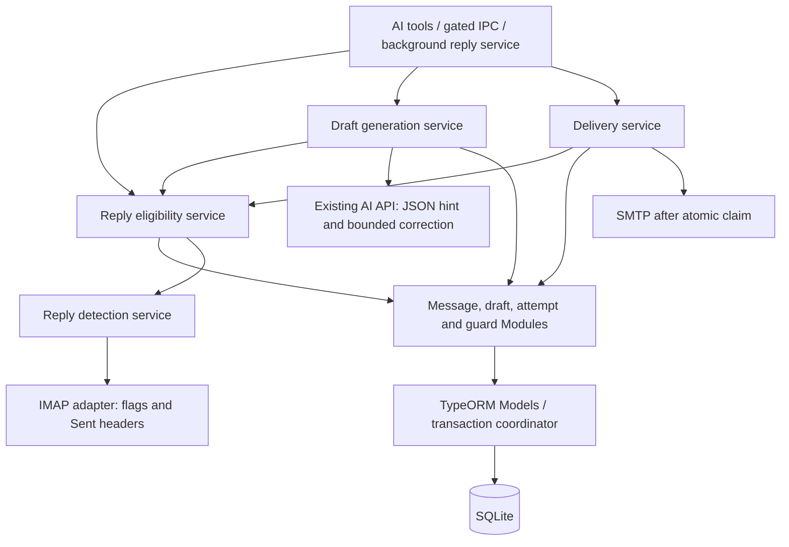

# AI Email Reply Validation and Duplicate Guard — Technical Design

## Document information

- **Status:** Revised design proposal; new symbols/contracts below are not implemented.
- **Reviewed:** 2026-10-05 against the current checkout.
- **Requirements:** [PRD](ai-email-reply-validation-and-duplicate-guard-prd.md), FR-025–FR-039.
- **Foundations:** [Receive/reply design](ai-email-receive-auto-reply-technical-design.md), [reply reliability](ai-email-thread-aware-reply-reliability-technical-design.md), [outbound delivery](ai-outbound-email-intent-aware-delivery-technical-design.md).
- **Architecture constraints:** main-process services coordinate network I/O;
  Modules/Models own database operations through TypeORM and Token/`USERSDBPATH`.
  IPC never accesses repositories; workers never access the database.

## 1. Review findings and source of truth

| Current source | Verified behavior / correction to the earlier design |
|---|---|
| `src/service/emailReply/EmailReplyPromptBuilder.ts`, `buildReplySystemMessage` | Requests `classification`, while schema requires `intentSuggestion`. |
| `src/service/emailReply/EmailReplyGenerationSchema.ts` | Required fields have type/length/enum limits; optional review fields exist. `extractJson` tolerates fences/prose. Zod object parsing is not rejection of every extra key. |
| `src/service/emailReply/EmailReplyDraftGenerationService.ts`, `createDraft` / `callLlmRaw` | Uses 700 tokens, drops completion metadata, drops original context in correction, and persists draft/revision/message state separately. |
| `src/api/aiChatApi.ts`, `OpenAIChatCompletionRequest` / `openAIChatCompletionHosted`; `src/service/aiProvider/OpenAIRequestPayload.ts` | Neither request typing nor explicit payload-copy paths expose `response_format` today. Local `complete` uses the shared payload builder. |
| `src/service/emailReceive/EmailReceiveSyncService.ts`, `toEntity`; `src/model/EmailReceivedMessage.model.ts`, `upsertByProviderUid` | Already promotes observed answered flags to `replyStatus = sent`. It does not persist flag provenance. Upsert loads and saves a full entity, risking concurrent local-state clobber. |
| `src/service/emailReceive/ImapEmailReceiveClient.ts`, `fetchFromConnectedClient` | Default fetch is unread-only/bounded. It opens configured inbox and stores bare UID as `providerUid`; no source folder/UIDVALIDITY provenance. |
| `src/model/EmailReplyDraft.model.ts`, `listByMessage` / `claimApprovedRevisionForSend` / `finalizeSendOutcome` | Draft lookup already exists. Send claim protects a draft/revision/approval, not the inbound message across siblings. Successful finalization updates received-message state atomically. |
| `src/service/emailReply/EmailReplyPolicyOrchestrator.ts` | Both stages exist, but neither enforces the complete message-level duplicate evidence described here. |
| `src/service/emailReply/EmailReplySendRecoveryService.ts`; `src/model/EmailReplyDraft.model.ts`, `reconcileDelivery` | Stale sends become `delivery_unknown`; reconciliation exists. Preserve this behavior and make guard updates conditional on authoritative outcome. |
| `src/config/SqliteDb.ts`, DataSource options | Uses `synchronize: true` and `migrations: []`. There is no registered release migration to cite. `yarn init` references `src/runcli.ts`, absent in this checkout. |

Line numbers are intentionally omitted because they drift. Symbol/file pairs
above distinguish current behavior from proposed methods below. Truncation and
production frequency remain hypotheses until completion/error metrics confirm them.

## 2. Design decisions and invariants

1. **Central evidence service:** generation, delivery, policy, and diagnostic tool
   use one reply-eligibility contract. The model is not the enforcement boundary.
2. **Separate projections from authority:** message `replyStatus` remains the
   existing union (`not_started`, `draft_created`, `sent`, `skipped`, `blocked`,
   `failed`). Read draft/attempt records for `sending`/`delivery_unknown`.
3. **Persist a message-level guard:** a new guard entity gives atomic ownership
   across LLM/network awaits and process restart. Existing draft idempotency is
   retained. An in-memory mutex alone cannot provide restart/fencing protection.
4. **Network work outside transactions:** reserve → perform bounded I/O → recheck
   and commit. SMTP remains outside the claim/finalization transaction.
5. **Unknown stays unknown:** inability to inspect a mailbox is never a successful
   negative. Positive evidence remains sticky. Fresh negative means only that
   configured sources were checked at that time.
6. **No global exactly-once claim:** message guard serializes app submissions;
   mailbox checks cannot atomically prevent an external client from replying.
   Guards apply within one database/configured service. Separate installations
   or duplicate service IDs for the same mailbox do not share a reservation.

### Alternatives considered

| Approach | Assessment |
|---|---|
| Check `replyStatus` and leave Sent detection to the AI | Small patch, but stale flags, sibling drafts, concurrent requests, and tool omission bypass protection. Insufficient for the PRD. |
| Add only an in-memory message mutex | Reduces same-process races, but has no persisted generation owner/lease or crash fencing. Useful as an optimization, not authority. |
| Persist evidence and a unique message guard; extend current transactions | Selected. Adds one small entity and changes draft/send persistence, but expresses ownership and recovery without holding a DB lock over network I/O. |

## 3. Component ownership and flow



Proposed responsibilities:

- `EmailReplyEligibilityService`: resolve canonical reply identity, inspect
  authoritative local records, request detection when necessary, produce typed
  decision. Policy adds existing classification/recipient/rate rules.
- `EmailReplyDetectionService`: coalesce probes, coordinate config-scoped cache,
  call the receive adapter, and persist observations through Modules.
- `ImapEmailReceiveClient`: connect using existing TLS/endpoint handling, resolve
  folders, refresh flags, search/fetch headers, enforce bounds, close connection.
- `EmailReplyGuardModule` / `EmailReplyGuardModel`: atomic reservation and guard
  transitions. Extend the existing draft Model's transaction code for draft
  commit, send claim, finalization, and reconciliation; never nest independent
  Module transactions inside one another.
- Outer generation/delivery service owns one refusal audit per invocation.
  Evidence/policy helpers return decisions without writing refusal audit rows.

## 4. Identity, evidence and public contracts

### 4.1 Canonical identity

Use `(emailServiceId, replyKey)`, where:

- Valid canonical inbound RFC ID: `replyKey = "rfc:" + sha256(normalizedId)`.
- Missing/malformed RFC ID: `replyKey = "row:" + storedMessageId` for local
  protection; mailbox detection still returns `unknown` unless positive local
  evidence already settles it.

Reuse `normalizeMessageId`/`normalizeThreadHeaders` for identifier conventions,
preserving identifier case. Do not key by subject, sender alone, conversation,
or a globally shared RFC ID. Scope all lookup and cache operations to the resolved
mailbox. Conflicting rows with the same RFC ID but different underlying message
identity produce `reply_state_conflict`, not automatic merging.

For legacy rows without normalized IDs, normalize relevant stored raw IDs before
binding their guard. Resolve all canonical-equivalent rows in the mailbox before
allowing work; an incomplete legacy identity scan is a conflict, not eligibility.
Guard checks include drafts/attempts linked to every equivalent row.

IMAP UID is valid only with folder and UIDVALIDITY. Add provenance at receive
time and namespace new provider keys by those values (section 5). Legacy bare
UIDs may only refresh flags after a fetched header verifies the expected RFC ID;
otherwise locate the source via Message-ID search and exact header validation.
Never attribute a reused UID's flags to the old message.

### 4.2 Typed detection result (proposed)

```typescript
export type ReplyDetectionSource =
  | "local_state"
  | "mailbox_flag"
  | "sent_search"
  | "unavailable";

export type ReplyDetectionUnknownCode =
  | "reply_in_progress"
  | "delivery_unknown"
  | "unsupported_protocol"
  | "missing_message_id"
  | "receive_unavailable"
  | "sent_folder_unavailable"
  | "ambiguous_match"
  | "identity_conflict"
  | "probe_timeout"
  | "probe_limit_exceeded"
  | "probe_failed";

interface ReplyDetectionBase {
  readonly checkedAt: string | null;
  readonly fromCache: boolean;
  readonly coverage: "local_only" | "configured_imap" | "partial";
}

export type ReplyDetectionResult =
  | (ReplyDetectionBase & {
      readonly state: "replied";
      readonly replied: true;
      readonly source: "local_state" | "mailbox_flag" | "sent_search";
      readonly matchedMessageId: string | null;
      readonly reasonCode: "already_replied";
    })
  | (ReplyDetectionBase & {
      readonly state: "not_replied";
      readonly replied: false;
      readonly source: "sent_search";
      readonly matchedMessageId: null;
      readonly reasonCode: "no_reply_observed";
    })
  | (ReplyDetectionBase & {
      readonly state: "unknown";
      readonly replied: null;
      readonly source: "local_state" | "unavailable";
      readonly matchedMessageId: null;
      readonly reasonCode: ReplyDetectionUnknownCode;
    });
```

An unknown attempted probe can have `checkedAt`, but that does not become a
successful-negative cache timestamp. Local historical state with unknown
observation time uses null. A cached result retains its original observation time.

`check_email_replied` accepts `{ message_id: positiveInteger }` (stored row ID,
not RFC header), returns this result with snake_case DTO fields plus `message_id`,
and uses the existing `success` envelope. A completed inconclusive check is
`success: true, state: "unknown", replied: null`; invalid input, AI-disabled,
missing record, and internal persistence failures are `success: false`.

Draft/send refusal adds stable `code`, nullable `existing_draft_id`, safe
`next_action`, and request `correlation_id` to the existing failure envelope.
Codes: `already_replied`, `delivery_unknown`, `reply_in_progress`,
`reply_state_conflict`, `generation_in_progress`, `reply_state_unknown`,
`needs_human_review`. Extend the typed failure union so wrappers preserve these
fields; do not smuggle them through untyped casts or error-message parsing.
Existing-draft reuse preserves the success draft DTO and adds `reused: true`.

## 5. Persistence and upgrade

### 5.1 Received-message additions (proposed)

| Field | Storage/default | Ownership and meaning |
|---|---|---|
| `isAnswered` | integer, 0 | Latest observed IMAP flag; not proof of no reply. |
| `answeredFlagCheckedAt` | nullable datetime | Observation time; null for legacy/unobserved/POP3. |
| `replyDetectedAt` | nullable datetime | First positive external evidence; sticky. |
| `replyDetectionSource` | nullable varchar | `mailbox_flag` or `sent_search` for positive evidence. |
| `replyMatchedMessageId` | nullable varchar(998) | Matched outgoing RFC ID when provided; absence does not negate a match. |
| `replyNegativeCheckAt` | nullable datetime | Last complete, successful negative detection. |
| `replyNegativeContextHash` | nullable varchar(64) | Account/folder/sender/algorithm context for that negative. |
| `providerFolder` | nullable varchar(255) | Source IMAP folder. |
| `providerUidValidity` | nullable varchar | Source UIDVALIDITY stored losslessly. |

Use explicit write methods: sync updates flags/provenance/provider content only;
detection writes evidence/cache only; app send finalization owns delivery
projection. Positive observation updates must be atomic and never erased by a
later zero/negative result. Keep original positive time/source; enrich a missing
matched ID without replacing stronger local send evidence.

Update `src/schemas/entity/emailReceivedMessage.ts` explicitly: current
`parseAndStrip` removes unknown keys, so adding only entity fields would silently
drop sync data. Update `ParsedInboundEmail`, sync `toEntity`, Model upsert, Module
methods, and renderer-safe DTO mappings together.

Replace full-entity read/modify/save upsert updates with targeted provider-field
updates and conditional positive-evidence changes. Do not save a stale snapshot
of `replyStatus`, `processedAt`, classification, or cache after awaited I/O.
Historical `sent` stays protected. Future sync stores answered provenance rather
than labeling new mailbox-only evidence as an app delivery.

New IMAP `providerUid` encodes a protocol prefix, folder hash, UIDVALIDITY, and UID
within the existing length limit. Adopt a legacy bare-UID row only after source
identity validation; otherwise insert a new namespaced row without overwriting
the old message. Canonical reply keys protect duplicate stored copies. POP3 UIDL
behavior remains unchanged. This is a targeted safety requirement, not a general
conversation migration.

### 5.2 New guard entity (proposed)

`src/entity/EmailReplyGuard.entity.ts`, table `email_reply_guard`:

| Field | Meaning |
|---|---|
| `id`, `emailServiceId`, `replyKey` | Primary ID and unique `(emailServiceId, replyKey)`; replyKey varchar(80). |
| `messageId` | Representative received row, used for navigation, not sole identity authority. |
| `phase` | `idle`, `generating`, `draft_ready`, `sending`, `sent`, `delivery_unknown`, `conflict`. |
| `ownerToken`, `leaseExpiresAt` | Nullable generation fencing token and lease. |
| `activeDraftId`, `activeAttemptId` | Nullable bindings to existing records. |
| `updatedAt` | Last transition time. |

The guard is an ownership index; reconcile it with existing draft/attempt records
inside every mutation. Never trust `idle` while a related sent/unknown/in-flight
record exists. Do not add a unique constraint to historical draft `messageId`:
multiple discarded/legacy drafts are valid history.

### 5.3 Upgrade mechanism and compatibility

Current DataSource initialization synchronizes registered entities in every
environment. Register the new entity in `SqliteDb`; additive columns/table are
created by that mechanism. There is no existing explicit release migration or
working `yarn init` entry point to rely on in this checkout.

Test against a populated old-schema copy, not just an empty database. Verify
preserved IDs/statuses/approvals/attempts/revisions and repeat initialization.
Guard rows materialize lazily after inspecting related history. Multiple live
drafts become `conflict`; do not pick the newest or delete others automatically.
Default flag zero with null observation time requires a live check on use.

Rollback must not run an older synchronized schema against new guard data and
resume automated replies. Prefer a forward fix; disable the reply workflow if
upgrade validation fails, preserve the database, and report the failure.

## 6. Generation correctness (FR-025–FR-027)

### 6.1 Shared prompt contract

Export/reuse schema enum values instead of duplicating the classification list.
Prompt uses `intentSuggestion`; required schema caps remain subject 120 characters,
body 20,000 characters, finite confidence in [0,1], and the existing optional review
fields. Keep the under-400-word concision instruction, without treating it as a
hard token guarantee. Bump the prompt version when changing this contract.

For correction, use the same system message, original bounded user/context
message, and one additional user message from sanitized validation codes. Do not
replace the original user message with correction alone or echo malformed model
output. For length failure, add a bounded instruction to produce a shorter reply.
Preserve the one-correction/two-validation-attempt rule and output safety checks.

### 6.2 JSON option propagation and fallback

Proposed request field:

```typescript
response_format?: { readonly type: "json_object" | "text" };
```

Forward it in both `openAIChatCompletionHosted` and shared
`buildOpenAIPayload` (local `OpenAICompatibleProviderClient.complete` uses it).
Apply it only where requested; unrelated chat behavior must remain compatible.
Generate with 1,500 output tokens, clamped to known model/provider limits after
accounting for bounded prompt/context. Hosted server acceptance/pass-through is
an integration gate; this repository does not prove that remote capability.

Fallback rules are per logical attempt: known unsupported capability omits the
hint; an explicit structured rejection identifying unsupported `response_format`
allows one retry without it. If the hosted error contract discards that detail,
do not guess from a generic 400; require capability configuration or extend the
server error contract. A second failure surfaces as provider failure. Authentication,
rate limit, network/timeout, generic 5xx, or model refusal is not format fallback.

Enforce the reply-content two-validation/four-submission ceiling across API
wrappers; existing model-alias retries must not silently expand it. Classification
calls have a separate bounded budget within the same overall invocation deadline.
Keep fallback and content-correction counts separate in telemetry.

### 6.3 Retain completion metadata

Replace the generation-only string return with a typed result containing content,
finish reason, returned model, and optional usage. Treat `length` as a validation
failure even if content parses. Refusal/filter/tool-call/empty-choice responses
are not sendable. Missing finish reason is explicitly recorded, and still needs
schema and content validation. No raw provider output is persisted for diagnostics.

Return `needs_human_review` after two invalid generations, with bounded codes.
Transport failure returns a separate provider error, not a fabricated second
validation strike. Release generation ownership on either failure.

## 7. IMAP detection and caching (FR-030–FR-032, FR-037)

### 7.1 Algorithm

1. Load message/config through Modules and resolve canonical identity. Inspect
   local sent/unknown/in-flight records first; a diagnostic check reports local
   sent as `replied`, pending as `unknown/reply_in_progress`, and unresolved
   delivery as `unknown/delivery_unknown`, without a mailbox round trip.
2. Return sticky positive evidence when present. Otherwise reuse a negative only
   for draft checks, with age 0–60 seconds and matching current context hash.
   Future timestamps, changed configuration, and changed algorithm invalidate it.
3. If protocol is POP3, config unavailable, or no valid inbound RFC ID exists,
   return typed `unknown`. Never construct an IMAP client from POP3 credentials.
4. Connect using existing receive config from
   `EmailServiceModule.getEmailServiceReceiveConfig`, normalization/validation,
   and TLS helpers. No invented `buildReceiveConnectionConfig` helper.
5. Refresh original flags using validated source folder/UIDVALIDITY/UID; for legacy
   rows locate/verify exact RFC identity. Unresolved identity is `unknown`.
   A positive flag settles `replied`. Missing source after expunge/move may still
   allow a verified direct Sent match, but cannot produce a complete negative.
6. Resolve Sent folders and search candidate headers. Verify exact direct parent
   and outbound sender. A verified match settles `replied`, even if other folders
   are unavailable. Without a match, all required sources must complete before
   returning `not_replied`; ambiguity/incomplete coverage yields `unknown`.
7. Before storing a negative, confirm account context has not changed during I/O.
   Use a targeted update that cannot overwrite positive evidence. Store the
   observation time/context, not the response-return time. Close the connection
   in `finally`, including timeout/cancellation paths.

### 7.2 Folder discovery and header matching

Use mailbox LIST special-use `\Sent` attributes. Search all advertised Sent
folders up to a cap of five. If none are advertised, inspect actually listed
folders for conservative known-name fallbacks (`Sent`, `Sent Items`,
`[Gmail]/Sent Mail`, `INBOX/Sent`). One unambiguous fallback may be used; multiple
unverified fallbacks or no accessible candidate yields `sent_folder_unavailable`.
Do not swallow authentication/permission/connection failures as folder absence.

The installed `node_modules/imapflow/lib/imap-flow.d.ts` defines a header **map**,
not the earlier design's tuple. Example search shape:

```typescript
const candidates = await client.search(
  {
    or: [
      { header: { "in-reply-to": originalMessageId } },
      { header: { references: originalMessageId } },
    ],
  },
  { uid: true }
);
```

Handle the declared `number[] | false` result; `false` is a failed/incomplete
search, not no matches. IMAP HEADER search is substring-based. Fetch bounded
headers (`Message-ID`, `In-Reply-To`, `References`, `From`, `To`, `Date`) and
flags using read-only/PEEK semantics; do not retrieve bodies, set `\Seen`,
append mail, or store flags. Validate normalized token equality locally.

Count as a direct reply only when `In-Reply-To` contains the exact original token
and the parsed sender matches the configured sending identity for this mailbox.
Multiple well-formed parent tokens can match an explicit parent; malformed or
truncated header parsing is ambiguous. The outgoing message's own missing
Message-ID does not negate a verified parent match; report null matched ID.

An ancestor-only References match is not a direct reply. A References-only
candidate is `ambiguous_match` in V1; do not infer its final token is always an
immediate reply. A candidate from an unrecognized sender/alias is likewise
ambiguous. A verified direct match takes precedence over ambiguity. An unrelated
substring candidate may be rejected only after complete header parsing.

Reuse identifier conventions, but do not interpret existing helpers' silent
chain truncation as complete coverage. Overlong/partially parsed headers yield
unknown. No subject-based or arbitrary recent-date heuristic establishes negative
coverage; search by the original identifier across the resolved Sent scope.

### 7.3 Operational bounds and cache

- One single-flight probe per message/context, one active IMAP probe per mailbox.
  Queue wait is included in a 15-second overall deadline; discard late results.
- At most five resolved Sent folders and 200 candidate header fetches in total.
  If more candidates exist, stop with `probe_limit_exceeded` unless a verified
  direct reply already settles the outcome. Configure server/search response
  limits and cancel excessive responses; bounded fetch alone is insufficient.
- No cacheable negative on timeout, unsupported protocol, empty/missing source
  identity, partial search, `false` search, or folder/auth errors.
- Context hash covers account endpoint/protocol/username, source/Sent scope,
  configured sender, and detector version. Exclude passwords/secrets. Identity
  changes with existing evidence require conflict review; do not reset protection.
- Generation/reuse may consume the 60-second negative cache. Delivery requests
  `forceRefresh: true`; diagnostic tool uses ordinary cache behavior. Sticky
  positive observations need no repeated network scan.
- A forced send check may join a live network probe begun for the same unchanged
  context during that send invocation, but never a cached/pre-invocation negative.

## 8. Atomic generation and existing drafts (FR-028–FR-029, FR-035)

### 8.1 Reserve

Before classification/retrieval/LLM calls, transactionally materialize the guard,
inspect all related history, and apply the PRD state precedence. Return a unique
existing live draft rather than relying on `replyStatus = draft_created` or
arbitrarily taking the first `listByMessage` row. Unknown/sending history always
blocks, including attempts attached to a discarded draft.

New generation uses a random owner token and a five-minute lease. Acquire via a
conditional update/insert under the existing database coordination mechanism;
unique key conflicts reread the winner. Do not hold the transaction over model
or mailbox work. Renew the lease conditionally before long stages; cap each model
call at 120 seconds or the remaining invocation budget, whichever is smaller;
cap the complete generation invocation at five minutes, including queueing,
classification, provider compatibility retries, and mailbox refreshes.
An expired/replaced owner cannot renew, commit, or release the current lease.

Check fresh mailbox evidence before model work. Unknown/positive results audit
and release the generation reservation. For reuse, perform the same mailbox
eligibility check and reload draft bindings afterward; never silently return a
newly sent/unknown draft as editable.

### 8.2 Commit and recovery

After validation, recheck local records and evidence. If the successful-negative
observation has expired during model work, refresh it before committing. Commit
only with the same unexpired owner and unchanged identity/configuration.

One Model transaction creates draft, initial revision/hash, message projection,
guard active-draft binding, and creation audit. Refactor existing best-effort
revision materialization into transaction-aware persistence; failure rolls back
all draft creation. It must not leave an unbound sendable draft.

On generation failure, release only the matching owner. Startup/on-use recovery
can reclaim an expired generation lease only after checking related records.
Late LLM results from expired owners are discarded. `sending` is never reclaimed
using generation lease expiry; current send recovery remains authoritative.

## 9. Delivery, failure and reconciliation (FR-029, FR-031, FR-036)

1. Resolve draft/message/guard and apply local duplicate rules before approval
   and before network work. Keep existing permission and approval requirements.
2. Run a forced mailbox detection. Positive/unknown refuses before SMTP and
   records one `reply_skipped` event. A pending approval does not override it.
3. In `claimApprovedRevisionForSend`, atomically inspect all equivalent message
   rows, sibling drafts, attempts, sticky evidence, guard binding, and existing
   approval/revision/hash/mailbox validations. Bind guard to this draft/attempt
   and `sending` in the same transaction as claim/audit. A stale negative must
   refresh; require the forced observation to be at most five seconds old when
   claiming. Do not await the mailbox inside this transaction.
4. Submit SMTP immediately after the successful claim, using the existing send
   adapter and approval binding. If execution is delayed past the five-second
   observation window before SMTP starts, rerun detection outside the transaction
   while retaining the send claim. A refusal before SMTP finalizes that unsent
   claim safely; it must not manufacture an accepted/unknown send.
   Recognize only this operation's exact attempt as the current owner during
   that refresh; every other pending/sent/unknown record still blocks. This
   internal ownership handle is never a tool/IPC bypass parameter. Allow one
   delayed refresh; further delay refuses with no SMTP submission.
5. `finalizeSendOutcome` updates existing attempt/draft/approval/message/audit
   and guard together: `sent` keeps protection; `delivery_unknown` keeps protection;
   definite pre-acceptance failure returns to this draft's retryable state, never
   creates a sibling. Retain existing fresh-approval rules where applicable.

Same-attempt repeated calls preserve existing idempotent delivery results and
never submit SMTP again. A new approval or sibling draft is not an escape from
sent/in-flight/unknown state. Discard releases an active-draft binding only after
checking no related send/unknown evidence; history remains intact.

Existing stale-send recovery converts pending attempts to `delivery_unknown`
(current threshold five minutes, periodic sweep ten minutes), without resubmission.
Extend it to transition guard state atomically. Do not release a send guard merely
because its process died or a timer elapsed.

`reconcileDelivery` must conditionally transition eligible unknown attempts under
the same message guard: verified sent sets terminal protection; verified not sent
reopens the existing draft and clears only that unknown binding; unresolved leaves
protection intact. Negative Sent search alone does not prove non-delivery.
Reconciliation cannot reopen a known `sent` record; check for positive evidence on
other siblings. Late successful SMTP finalization outranks an earlier negative
reconciliation and reinstates terminal protection. While an original submitter
could still be running, reconciliation cannot authorize retry; require quiescence
or fencing plus delivery evidence. Test this race explicitly.

## 10. Tool, IPC, audit and UI integration (FR-033–FR-034)

- Add `checkEmailReplied` and schema/DTO in `EmailReceiveAiTools.ts` and
  `emailReceiveAiTypes.ts`; register in `skillsRegistry.ts`. Resolve account from
  stored message, never a caller-supplied host or credentials.
- Check AI enable at the tool boundary before input parsing or Module creation.
  IPC checks `Token`/`USER_AI_ENABLED` first and returns the existing disabled
  `{ status: false, msg, data: null }` shape. Existing generation service gating
  remains defense in depth; an internal delivery safeguard must still run for
  already-approved user sends regardless of AI-tool availability.
- For UI diagnostic/recheck access, add the new channel through `channellist.ts`,
  `emailReceive-ipc.ts`, `preload.ts`, and `src/views/api/emailreply.ts`, using
  validated inputs and existing renderer-safe response conventions.
- Map stable codes to translated messages in all six language files. Safe audit
  metadata: stage, code, correlation ID, detector version, source, coverage,
  timestamps, cache indicator, draft/attempt IDs. Do not log bodies, credentials,
  approval tokens, raw provider errors, or invalid model prose.
- Extend `EmailReplyPolicyCode` in `src/entityTypes/emailReplyReliabilityTypes.ts`
  with the duplicate/unknown/conflict codes and preserve them across policy,
  draft/send outcomes, tool results, IPC DTOs, and audit serialization.
- Reuse is a `message_read_by_ai` event with bounded reuse metadata; refusals
  are one `reply_skipped` event owned by the outer service. Centralize that
  write so fast-path/policy/claim denial cannot double-log. Audit failure stops
  further work; no refusal can proceed to SMTP.
- Update affected component tests when UI states/results change. Existing-draft
  reuse, unknown-check retry, and blocked send are user-visible behavior and
  cannot defer tests/translations to a later patch.

## 11. Implementation sequence and traceability

| Unit | Main changes | PRD mapping |
|---|---|---|
| Generation contract | Shared enum/prompt, metadata result, preserved correction context, bounded route fallback and token budget | 025–027 |
| Persistence foundations | Entity/schema/DTO provenance, targeted sync updates, IMAP namespaced keys, guard registration/Model/Module, old-schema tests | 030, 035, 037–038 |
| Eligibility and generation | Authoritative state reader, atomic reservation/commit, transactional revision materialization, reuse and policy codes | 028–029, 035 |
| Mailbox detection | Fresh flags, special-use folders, exact header verification, three-state cache, bounds/single-flight | 031–032, 037, 039 |
| Delivery integration | Forced probe, message-scoped atomic claim/finalize, discard/recovery/reconciliation guard transitions | 029, 031, 036 |
| Tool/operator integration | Catalog/IPC/DTOs, one audit owner, six-language UI, component/E2E tests | 033–034 |
| Release verification | Populated upgrade, concurrent fake-IMAP/SMTP flows, metrics and IMAP pilot | 038–039 |

Commit completed logical units with their tests, following repository rules.
Independent validation repairs can ship first; do not describe full duplicate
protection as implemented until mailbox enforcement and message-level claims
are both integrated.

## 12. Test strategy and release gates

Extend existing tests at their actual locations:

- `test/vitest/main/EmailReplyPromptBuilder.test.ts` and
  `test/vitest/utilitycode/EmailReplyGenerationSchema.test.ts`: shared contract,
  optional fields, fenced/prose parsing, invalid shape/types/limits.
- `test/vitest/main/EmailReplyDraftGeneration.test.ts`: original context preserved
  on correction, metadata/truncation, bounded fallback, no model calls for local
  denials, correct reuse, transactional failure leaves no draft.
- `test/vitest/utilitycode/EmailReplyPolicyOrchestrator.test.ts` and
  `test/vitest/main/modules/EmailReplyPreDraftPolicy.test.ts`: both stages,
  authoritative sibling/attempt precedence, policy compatibility.
- `test/vitest/main/modules/EmailReplySendClaim.integration.test.ts`,
  `EmailReplyDeliveryFakeSmtp.test.ts`, `EmailReplyRecovery.model.test.ts`: same-
  and sibling-draft races, one SMTP submit, unknown recovery, verified reconciliation,
  late completion race, forced mailbox refresh after manual reply.
- Add detection, guard reservation, sync/UIDVALIDITY, and populated schema-upgrade
  suites under `test/vitest/main/`; use fake IMAP/SMTP and real isolated SQLite
  transactions for concurrency assertions. Mocks alone do not prove atomicity.
- Extend `EmailReceiveAiTools.test.ts`, provider payload/API tests, tool catalog
  tests, and affected `test/vitest/main/components/` tests. Cross-component
  draft/approval/recheck flows require specs under `test/e2e/specs/`.

Cover every scenario in the PRD matrix, including false search returns, malformed
headers, ancestor-only matches, unrecognized aliases, limits/timeouts, config
change during I/O, read source messages, cache races, expired-owner fencing,
legacy siblings, and audit failures. Assert no LLM/SMTP side effects on refusal.

Implementation checks: non-watch `yarn exec tsc --noEmit`, `yarn testmain`, the
relevant utility suites via `yarn vitest-puppeteer --run`, `yarn test:components`,
and `yarn test:e2e` for changed critical flows. Use the repository runners/native
dependency setup rather than treating watch-mode `yarn tsc` as a terminating gate.
These are future implementation gates, not tests claimed by this document review.

Release requires old-schema upgrade/reinitialization tests and an IMAP pilot
with verified Sent discovery and hosted JSON support/fallback. Compare first-pass
validation, correction/truncation rates, unknown reasons, detection p95, and
duplicate/guard conflicts against a captured baseline. No fabricated numeric target.
Disable guarded automation for unavailable mailbox detection; never fall back to
unsafe automatic sending. Keep local duplicate protections active during rollback.

## 13. References and unresolved external dependencies

- [RFC 5322 §3.6.4](https://www.rfc-editor.org/rfc/rfc5322.html#section-3.6.4): exact parent identifiers versus conversation ancestry.
- [RFC 9051](https://www.rfc-editor.org/rfc/rfc9051.html): flags, UIDVALIDITY identity and HEADER substring searches.
- [RFC 6154 §2](https://www.rfc-editor.org/rfc/rfc6154.html#section-2): optional/multiple Sent special-use folders.
- Installed ImapFlow declarations: `node_modules/imapflow/lib/imap-flow.d.ts`
  (`SearchObject.header`, `search`, mailbox special-use fields, fetch headers).
- Remote hosted JSON-mode forwarding/error capability is an integration dependency,
  not established by this checkout. Resolve by capability testing before rollout.
- Provider/client coverage and the remaining external-send race are documented
  limits; the design does not promise complete detection or distributed exactly-once.
