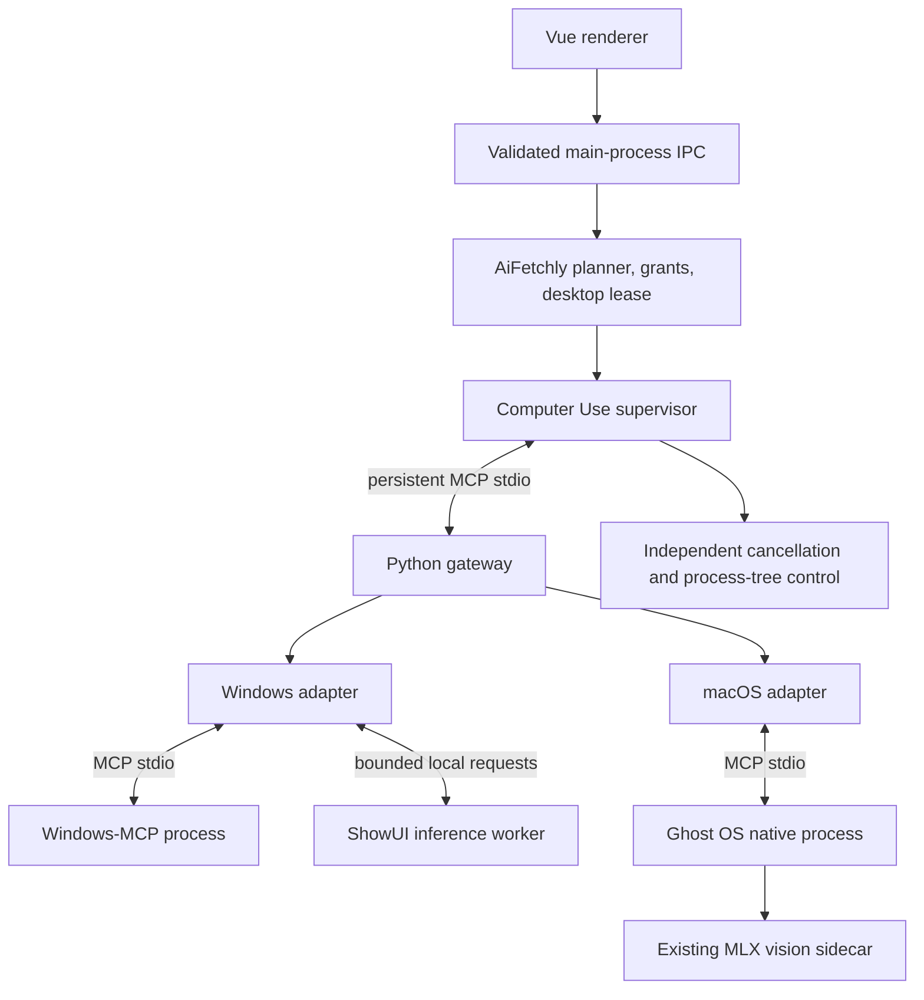

# Computer Use Plugin — Technical Design

## Document information

| Field | Value |
| --- | --- |
| Version | 1.0 |
| Status | Proposed architecture; no feature implementation is claimed |
| Date | 2026-09-23 |
| Product requirements | [Computer Use Plugin PRD](computer-use-plugin-prd.md) |
| Source repositories | `aiFetchly`, proposed `aifetchly-computer-use`, `aifetchly-hub-go` |
| Initial adapters | Windows-MCP + local ShowUI; Ghost OS + its existing local vision sidecar |
| Transport | Persistent local MCP over stdio |
| Packaging | One plugin identity, target-specific dependencies/artifacts, optional model resources |

All new interfaces, services, commands, and data structures below are proposed unless explicitly labeled existing. Example module names are implementation contracts to create, not commands available today.

## 1. Architecture decisions

1. Keep the plugin in one independent repository. Share protocol, sessions, transforms, diagnostics, and tests; separate OS adapters and release resources.
2. Maintain one public plugin listing. Source layout is independent of download selection.
3. Use a Python MCP gateway to normalize Windows-MCP and Ghost OS behavior. Prefer their public MCP boundaries over imports of unstable internal functions.
4. Keep task planning, model credentials/routing, user authorization, global desktop ownership, supervision, and audit persistence in AiFetchly.
5. Use ShowUI initially for bounded target grounding. Accessibility is the first target resolver when it supplies reliable identity; vision covers unresolved controls.
6. Keep screenshots local for local grounding. An optional remote visual planner path is separate, permissioned, and multimodal.
7. Keep one authoritative execution loop. Do not expose an unrestricted `run_computer_task(prompt)` that hides action planning, approval, and retries inside another agent.
8. Provision uv/Python/dependencies during installation. Start prepared environments without downloading or resolving packages.
9. Supervise the entire process tree. Stop and lease revocation must not wait for synchronous model inference.
10. Make coordinate mapping, locate-only overlays, and offline replay available before autonomous input.

The previous Midscene/browser-first design remains relevant to browser-only integration. Native desktop work uses the adapters above; do not claim browser testing validates native input. Model adapters remain replaceable for future UI-TARS, another local grounder, or a remote computer-use model, after equivalent evaluation.

## 2. Verified code anchors and gaps

Paths are relative to the indicated repository and were inspected during the 2026-09-23 discussion. These findings are scoped to the inspected paths, not a full implementation audit.

| Repository / anchor | Existing behavior | Required work |
| --- | --- | --- |
| Desktop `src/entityTypes/pluginTypes.ts` | Plugin skills/agents/MCP declarations; command/args/env; stdio transport | Preserve plugin identity; do not assume proposed target/resource fields are already validated |
| Desktop `src/service/PluginInstallService.ts` | Local ZIP/folder, git/GitHub, npm, URL acquisition then import | Reuse validated import; Hub managed resources remain a distinct acquisition path |
| Desktop `src/modules/MCPClient.ts`, `connectStdio()` | Spawns command with piped stdio, sanitized environment, plugin cwd | Retain shell-free argument arrays; validate required Windows environment and negotiated protocol |
| Same, initialization | Sends `initialize` with `2024-11-05`; inspected path lacks `notifications/initialized` | Implement complete version/capability negotiation and initialized notification |
| Same, `callTool()` | Returns first text content when present; otherwise unwraps first data block | Preserve mixed text/image/structured results and errors |
| Same, `connectSSE()` | Throws “SSE transport not yet implemented” | Use stdio; do not select SSE just because the type includes it |
| Same, disconnect/exit | Direct child kill and pending-map clearing | Reject pending requests, coordinate timers, graceful shutdown and process-tree cleanup |
| Desktop `src/service/MCPToolService.ts`, `executeMCPTool()` | Creates/connects/disconnects client per invocation | Add supervised session reuse; avoid reloading native services/model weights |
| Same, `assertStdioTrusted()` | Explicit trust check before local process spawn | Preserve this check; distinguish process trust from current action authorization |
| Desktop `src/service/ToolExecutor.ts` | Resolves plugin MCP names and wraps results | Propagate trusted session context/cancellation without accepting model-forged authority |
| Desktop `src/service/ManagedBrowserAiToolService.ts` | AI gate, handoff/risk patterns; screenshot returns metadata only | Reuse principles; do not mistake existing screenshot metadata for a model image input |
| Desktop `src/entityTypes/aiImageAttachmentToolTypes.ts` | Transient `ImageModelArtifact`/`ModelArtifact` | Reuse/extend for authorized remote visual input; no raw bytes in persisted tool JSON |
| Desktop `src/service/ManagedBrowserLeaseService.ts` | In-process account lease pattern | Desktop lease must cover chats/windows and same-user host processes as applicable |
| Desktop `src/service/AIChatToolApprovalPolicyService.ts` | Explicit denials, dependency approval, request-scoped actions | Integrate computer actions explicitly; generic MCP naming/category is insufficient |
| Desktop `src/service/SkillEnvironmentManager.ts` | Existing Python skill setup, hash checks | Not proof of complete managed-uv install-plan consumption |
| Hub `internal/httpapi/routes/install_plan.go` | Target-aware plan, uv provision records, uv toolchain URL/hash selection | Preserve; verify complete desktop consumer and runtime provenance |
| Hub same, `BuildManagedPlan()` | Models/environments appended from version-only queries | Filter resource closure by selected target/backend/features |
| Hub `queries/plugin_version_targets.sql` | `ListPlanModelRevisions` / `ListPlanEnvironments` filter by version | Add target applicability; do not mark all platform environments required |
| Hub `internal/managed/target.go` | Iterates every requirement when resolving target | Add explicit conditional requirements so Windows-only and Mac-only backends do not block each other |
| Hub `internal/resources/plan.go` | Plugin/runtime/environment/model/toolchain resource types; provision/bootstrap fields | Native Ghost binary representation and optional feature closure need a deliberate schema extension |
| Hub `internal/artifacts/plugin_package.go` | One canonical code archive, strips environments/caches, fixed file mode `0644` | Keep native executables outside canonical code ZIP; safe native extractor must restore validated executable metadata |
| Hub uv-runtime design | `uv pip install --require-hashes` from Hub JSON lock, not author `uv.lock` | Generate/validate production lock separately from development workflow |

The generic desktop plugin package limit observed in `pluginTypes.ts` is 50 MiB compressed / 250 MiB extracted, while the Hub canonical packager has different limits. Do not use either code-package path for multi-gigabyte model resources. Reconcile package limits during installer contract tests.

## 3. Repository and responsibility boundaries

### 3.1 Proposed independent repository

```text
aifetchly-computer-use/
├── plugin/                       # Manifest, skills, MCP declaration templates
├── contracts/                    # Versioned JSON Schemas and fixtures
├── src/
│   ├── aifetchly_computer_use/
│   │   ├── sessions/
│   │   ├── coordinates/
│   │   ├── authorization/
│   │   ├── observations/
│   │   ├── actions/
│   │   ├── diagnostics/
│   │   └── adapters/
│   │       ├── windows/
│   │       └── macos/
│   └── childprocess/             # Gateway/vision worker entrypoints
├── environments/                 # Separate target/vision locks as needed
├── packaging/
│   ├── windows/
│   └── macos/
├── debug/                        # Local viewer, offline replay, annotation
├── tests/
│   ├── contracts/
│   ├── coordinates/
│   ├── fixtures/
│   ├── integration/
│   └── desktop/
├── pyproject.toml
├── uv.lock                       # Development lock; not the Hub JSON lock
└── THIRD_PARTY_NOTICES
```

Do not commit models, Python distributions, virtualenvs, dependency caches, credentials, or customer traces. Generate release bundles from clean builds. Upstream backends are pinned dependencies or audited patches, not untracked copies. Maintain licenses/notices for code, weights, and redistribution independently.

### 3.2 Host responsibility

- User-facing Plugin Manager/session controls and translations.
- AI enable gate before AI IPC work, planner and provider routing.
- Trusted action grants, desktop lease, independent stop control, subprocess supervision.
- Managed resources and executable-path resolution from trusted plans.
- Result normalization, transient multimodal delivery when permitted, audit persistence.
- Plugin disable/uninstall/app-quit cleanup.

All DB operations remain in Models/Modules using existing Token/USERSDBPATH conventions. IPC handlers validate, authorize, and dispatch; workers and plugin processes do not access the DB. New app-owned worker entrypoints belong in `src/childprocess/` and applicable build configuration.

### 3.3 Hub responsibility

Resolve target/features into an immutable dependency closure; distribute verified resources, requirements, compatibility, and revocation. The Hub does not execute desktop input, proxy live screenshots, infer OS permissions, or certify that a local GPU is healthy.

## 4. Runtime topology and Python interoperability



Electron already supports `spawn(command, args, { shell: false, stdio: ['pipe', 'pipe', 'pipe'] })`. MCP exchanges JSON-RPC messages through pipes; language runtimes are independent. Python does not run inside Electron, the renderer, or Node's native-module ABI.

Production launch resolves `<managedEnv>/Scripts/python.exe` on Windows or `<managedEnv>/bin/python` on POSIX and a validated installed entrypoint. Use unbuffered Python (`-u`) and package-compatible import layout. The installer, not the renderer or model, selects the executable, entrypoint, cwd, model paths, and resource IDs.

Windows-MCP must run in the interactive Windows user session. WSL-hosted code must not be mistaken for a Windows desktop executor. Do not install the backend as an elevated background service or persistent login task by default. The host owns its lifetime.

Ghost OS is a native subprocess; its Python/MLX sidecar is a distinct runtime resource. Reuse its existing grounding path instead of starting a duplicate Mac ShowUI service. Do not assume Python dependency compatibility between the gateway, Windows grounder, and Ghost sidecar; isolate environments when necessary.

### 4.1 MCP client contract

- Implement the full initialize/version negotiation/initialized sequence using a tested SDK or equivalently conformant client.
- Pin supported protocol versions; disconnect on unsupported negotiated version rather than changing only a version string.
- Preserve content blocks, structured results, tool error semantics, pagination where relevant, notifications, and request IDs.
- Define startup/model-load/tool-call deadlines separately; model warm-up must not masquerade as a hung handshake.
- Buffer UTF-8 across pipe chunks correctly; bound message size and screenshot payloads without logging full payloads on parse failures.
- Keep stdout exclusively for protocol output; stderr is bounded and redacted diagnostics.
- Reject pending requests immediately on exit/cancellation and clear timers; do not leave unresolved promises after clearing a map.
- Scope a persistent backend to the supervised plugin/session generation; never reuse one whose grants, paths, version, or owner changed.
- Drain and close stdin for graceful shutdown, then terminate the owned process tree after bounded deadlines.

MCP tool discovery is not sufficient readiness: also require control/capture permissions, a supported target, and model health when vision is selected.

## 5. Platform packaging and Hub changes

### 5.1 Resource model

One plugin version has a small common package containing contracts, skills, and gateway code. Conditional dependencies supply only the selected platform adapter/native backend, Python environments, inference implementation, and model format.

| Resource | Identity includes | Download policy |
| --- | --- | --- |
| Common code | Plugin version + artifact hash | Install/update when changed |
| Native backend | Backend revision + OS + architecture + artifact hash | Only matching target |
| uv toolchain | Version + OS + architecture + hash | On demand, shared if compatible |
| Python | Exact implementation/version + OS + architecture + verified distribution provenance | Shared compatible runtime |
| Environment | Runtime identity + target + backend + full dependency lock hash + packaging schema | Prepared per exact identity |
| Model | Revision + format + quantization + preprocessing/config identity + file manifest hash | Only selected local-vision path; independent of code updates |

Apple MLX and Windows PyTorch representations must not share cache identity merely because both are named ShowUI-2B. The Hub's `mps` target vocabulary is not the same thing as the inference implementation `mlx`; declare both target compatibility and backend explicitly. Validate CPU fallback separately.

### 5.2 Selection algorithm

1. Host detects platform/architecture and supported accelerator/backend capabilities, then records selected features (for example local vision enabled).
2. Hub evaluates applicable requirements for that target and feature set.
3. Resolve exactly the required dependency closure, plus separately offered optional resources. Missing optional vision resources do not disable an explicitly supported accessibility-only mode.
4. Return exact artifact identities and provisioning descriptors; deduplicate by immutable resource identity.
5. Include target, selected features, backend, resolved resource set, and contract schema in the plan digest/cache key and prepare-install validation.
6. Desktop independently validates every resource against the selection before downloading; reject contradictions rather than ignoring unsupported required resources.

Windows-only requirements must not be evaluated as mandatory Mac requirements and vice versa. Platform labels alone are insufficient where two model formats or GPU backends share a platform.

### 5.3 Required Hub extensions

- Add explicit applicability/feature/backend bindings for requirements and models. Do not infer them from a filename or description.
- Make `ListPlanEnvironments` and `ListPlanModelRevisions` target/feature-aware; current version-only projection is insufficient.
- Apply identical selection in compatibility computation, install plan, prepare-install, ticket authorization, and revocation handling.
- Native backend delivery needs a reviewed representation (for example a versioned native-component resource). The existing registry reserves `tool` runtime type for uv; do not register Ghost OS as an arbitrary toolchain without an intentional contract/schema change.
- Keep the canonical code artifact or add explicit artifact variants if needed; do not require multiple public listings to get per-target bytes.
- Preserve old clients through schema/min-app-version gating; unknown required resource kinds must fail closed.
- Bind all selected resources to provenance/checksum and existing entitlement/revocation checks.

Unit/integration tests must assert the absence of the other platform's resources, not merely the presence of the correct one. Include vision-off, unavailable backend, wrong model format, and cached-plan feature changes.

## 6. Managed uv, Python, and dependency installation

### 6.1 Bootstrap without system tools

The desktop downloads the exact platform-specific standalone uv archive from the trusted plan, verifies its SHA-256 and signature when supplied/required by distribution policy, extracts safely, and checks the executable's identity/version. It does not need Python to do this. Store uv in a user-writable application-managed directory and launch its absolute path.

Prefer direct pinned artifacts over executing downloaded PowerShell/shell installer scripts. Existing Hub bootstrap URLs are not a reason to mutate global PATH or run arbitrary scripts. Existing user uv installations are ignored by default for reproducibility; a developer override must be explicit and appear in diagnostics.

```text
<managed resource root>/
├── toolchains/uv/<version>/<target>/
├── runtimes/python/<exact-runtime-id>/
├── environments/<environment-id>/
├── models/<manifest-hash>/
├── staging/<operation-id>/
└── cache/
```

Configure uv directories explicitly (including managed Python/cache/environment locations), retain the host environment allowlist, and validate what Windows requires for subprocess execution. Do not inherit tokens/DB paths or re-enable blocked loader variables to make an import work. Use installed packages or explicit safe entrypoint layout instead of plugin-controlled `PYTHONPATH`.

### 6.2 Production lock contract versus development

The current Hub uv design specifies an exact Python spec and a hash-pinned JSON package lock. It does not ship author `uv.lock` as an interchangeable format. Follow that production contract:

```text
ensure verified managed uv
uv python install <exactPythonSpec>
uv venv --python <resolvedManagedPython> <environmentDir>
uv pip install --python <environmentPython>
    --require-hashes --only-binary :all: -r <validatedGeneratedRequirements>
```

These are argument-vector sketches; the installer constructs each argv from validated fields with `shell:false`, never from a plugin-supplied command string. Require a complete transitive lock and approved artifact/index origins. Do not permit source builds or arbitrary setup scripts on customer machines. If compatible wheels are unavailable, publish unsupported rather than installing a compiler or silently building.

A stronger offline mode uses a verified target-specific wheelhouse and no network package resolution. This is an extension: the existing Hub uv v1 design explicitly defers offline wheel bundles. It must not be advertised as already present.

The verified uv hash does not itself pin every Python/package byte it can download. Record exact Python distribution provenance and use the provisioner's integrity checks; environments require full dependency hashes. Immutable/offline distribution must additionally supply verified Python/wheel artifacts and approved origins.

For development, use the repository's `uv.lock` and selected extras/environment projects:

```bash
uv sync --locked --extra windows
uv run --no-sync python -u -m aifetchly_computer_use
```

The example assumes these package extras and module entrypoint have been created. CI generates the corresponding Hub JSON lock with artifact hashes and checks dependency equivalence. Separate environment projects/locks are allowed for incompatible Windows GPU and Mac MLX dependency sets.

### 6.3 Startup and updates

Production can launch the prepared Python directly, or a managed uv `run --no-sync` command against a verified project environment. Direct Python is the initial recommendation because it removes an unnecessary wrapper from the supervised process tree. uv remains the provisioner.

Normal startup must not resolve/update packages, select a new Python, or download models. Disable implicit online model fetches by resolving local model files. Missing resources return `runtime_not_ready` / `model_not_ready` and route to repair.

Keep exact uv/Python/package/model versions in the installation record. Cache resource identity, not just semantic version labels. Use installation locks and reference counts/leases; two simultaneous installs cannot corrupt a shared runtime.

Prepare updates in a separate versioned directory; validate before atomic activation. Python environments can contain absolute interpreter paths, so do not assume that a staged virtualenv can be moved arbitrarily. Prepare it at its stable final versioned path while marked inactive, then activate a host-owned pointer. Incomplete directories are never launchable.

On cancellation, retain only verified resumable bytes and mark installation incomplete. Roll back to the prior activation pointer if health checks fail. Uninstall removes plugin bindings and unreferenced resources, never another plugin's live environment/model.

## 7. Public tool contract

Use versioned JSON Schemas shared by Python implementation, host TypeScript/Zod validation, and contract tests. Generated types must not use `any`. All application TypeScript functions have explicit return types; caught values are `unknown` and validated.

### 7.1 Tools

| Tool | Inputs | Result / semantics |
| --- | --- | --- |
| `computer_capabilities` | None or target query | Backend/protocol versions, supported actions, permissions, model state, display support |
| `computer_start_session` | User-selected target reference, purpose | Session ID and scoped capabilities; host obtains lease before dispatch |
| `computer_observe` | Session ID, allowed region/mode | Observation ID, structured state, transient local capture reference |
| `computer_find` | Session ID, observation ID, target description | Bounded target handle or not-found/ambiguous result, grounding source |
| `computer_act` | Session ID, target handle, typed action, action ID | Dispatched/failed/uncertain state and post-observation reference |
| `computer_verify` | Session ID, expected state, observation ID | Satisfied/unsatisfied/unknown plus evidence; not an arbitrary success assertion |
| `computer_request_handoff` | Session ID, reason | Revokes automatic input until trusted resume |
| `computer_resume_after_handoff` | Session ID | Host-approved resume with a fresh observation |
| `computer_stop_session` | Session ID | Idempotent cancellation/release result |

The normal AI-facing act schema accepts target handles rather than unbound desktop coordinates. Internal native adapters and a guarded developer calibration path may use raw coordinates. Keyboard operations without a visual target still require a current session/window observation and authorization.

### 7.2 Proposed core records

```typescript
type GroundingSource = 'accessibility' | 'vision';
type VerificationState = 'satisfied' | 'unsatisfied' | 'unknown';
type ExecutorUnits = 'desktop_physical_pixels' | 'desktop_logical_points';

interface Point2D {
  readonly x: number;
  readonly y: number;
}

interface ObservationMetadata {
  readonly id: string;
  readonly sessionId: string;
  readonly sessionGeneration: number;
  readonly capturedAt: string;
  readonly targetWindowId: string;
  readonly displayConfigurationVersion: string;
  readonly executorUnits: ExecutorUnits;
  readonly captureWidthPx: number;
  readonly captureHeightPx: number;
  readonly modelWidthPx: number;
  readonly modelHeightPx: number;
  readonly transformId: string;
  readonly imageSha256: string;
}

interface ResolvedTarget {
  readonly handle: string;
  readonly observationId: string;
  readonly source: GroundingSource;
  readonly expiresAt: string;
  readonly evidenceSummary: string;
}

interface ActionOutcome {
  readonly actionId: string;
  readonly state: 'not_dispatched' | 'dispatched' | 'failed' | 'uncertain';
  readonly verification: VerificationState;
  readonly postObservationId?: string;
  readonly errorCode?: string;
}
```

The model-visible target is opaque. Coordinates, native identifiers, transforms, generation, and expiry are held in a bounded local target store. Authority tokens and raw image bytes are not fields supplied by the model or included in ordinary tool results.

### 7.3 Errors

Use stable codes: `ai_disabled`, `permission_required`, `desktop_busy`, `unsupported_target`, `unsupported_display_configuration`, `runtime_not_ready`, `model_not_ready`, `target_not_found`, `target_ambiguous`, `invalid_grounding_output`, `stale_observation`, `focus_changed`, `action_not_authorized`, `action_cancelled`, `execution_uncertain`, `verification_failed`, `backend_unavailable`, `resource_limit`, `protocol_mismatch`.

Include a safe message, stage, retry classification, and correlation ID. Do not expose raw traceback, secrets, screenshot bytes, absolute resource paths, or executable arguments in ordinary renderer results.

## 8. Sessions, action authority, and cancellation

### 8.1 State machine

```text
STARTING → READY → OBSERVING → GROUNDING → AWAITING_AUTHORIZATION
                    ↑                         ↓
                    └──── VERIFYING ← EXECUTING

Active states → PAUSED / HANDOFF → fresh observation → READY
Any state → STOPPING → STOPPED
Backend failure → FAILED (no automatic input replay)
```

Read-only observations may skip grounding; already authorized reversible input need not repeatedly prompt. User authorization comes from trusted current-task state, not a free-form `approved:true` argument. Consequential actions must remain within the specific approved scope; ambiguity is a pause condition.

### 8.2 Ownership and generation

Acquire a desktop lease before starting native input services. A single main-process singleton is insufficient if multiple app processes can run: use the app's verified single-instance guarantee or an OS-level same-user lease/broker. Initial lease scope is the whole interactive desktop, not individual windows that share one physical cursor.

Lease/session generation increments on stop, revoke, backend restart, handoff, or invalidating desktop changes. Every target, action, and late worker result is checked against that generation. Never let a response from a previous generation schedule an action.

Input dispatch is serialized. Observation may overlap only where it cannot race the action's state snapshot. Start with one action per observation cycle; short batches are a future optimization requiring per-action validation and stop checks.

### 8.3 Trusted action grants

Host computes authorization from the active user request, target scope, action class, and current state. It injects a short-lived action grant bound to session generation, action ID, normalized action hash, and target/observation identity through a host-only dispatch context. The model cannot provide or mint the grant.

The gateway validates the grant at dispatch and denies calls through generic MCP execution that bypass this host context. Do not expose the underlying Windows/Ghost MCP servers as additional unrestricted model tools. Use a typed host wrapper/registry integration so ordinary plugin discovery cannot bypass the computer-action policy.

Trusted plugin code still executes with local OS privileges. This grant design protects normal tool paths and accidental misuse, not a malicious native binary with separately granted OS permissions.

### 8.4 Stop behavior

- UI Stop revokes the host generation immediately and clears pending actions.
- Gateway control handling remains responsive while inference executes in a separate worker.
- Discard late grounding results; cancel upstream calls when supported.
- Release tracked pressed keys/buttons during ordinary cleanup; use bounded drag/key-hold durations.
- If cooperative stop fails, supervisor terminates the entire owned process tree. Windows needs an appropriate process-tree ownership mechanism (such as a Job Object where supported), not only a POSIX signal to the direct child.
- Handoff pauses input but retains exclusive ownership unless explicitly relinquished.
- A completed OS click cannot be undone by cancellation. Post-dispatch timeout/crash becomes `execution_uncertain`, requiring observation before any retry.
- Action IDs deduplicate within the known session history. Do not claim exactly-once behavior across a crash between OS dispatch and response persistence.

Test stop during model load, inference, queued input, drag, backend hang, disconnect, and app quit. Measure stop acknowledgment and last possible input separately; choose a release SLO from native evidence.

## 9. Coordinate system and preprocessing design

### 9.1 Coordinate spaces

Distinguish:

1. Executor desktop units (physical pixels or logical points, adapter-defined).
2. Original screenshot pixels.
3. Crop pixels relative to that screenshot.
4. Resized/padded image supplied to the model.
5. Model output coordinates, normalized under the pinned model's documented convention.

ShowUI's grounding example uses normalized `[x,y]` in `[0,1]`. Do not silently guess another convention from the numeric values. The adapter pins the convention and validates its response.

### 9.2 Transform composition

Let normalized model output be `(nx, ny)`. The exact model input has size `(Wm, Hm)`. A crop beginning at `(cx, cy)` in the original screenshot was resized by `(sx, sy)` and padded by `(px, py)` in model pixels.

```text
x_model = nx × Wm
y_model = ny × Hm

x_capture = cx + (x_model - px) / sx
y_capture = cy + (y_model - py) / sy

[x_executor, y_executor, 1]ᵀ = T_capture_to_executor × [x_capture, y_capture, 1]ᵀ
```

`T_capture_to_executor` records scale, translation, axis orientation, and any supported display rotation. Store forward/inverse transforms in full precision and apply rounding only at the executor boundary. Coordinates outside the unpadded image/crop/target are invalid; do not silently clamp a bad prediction onto another control. Define a tested boundary rule for exact normalized endpoints.

For a full-screen aspect-preserving resize without padding, a 3840×2160 capture resized to 1280×720 and output `(0.75, 0.50)` maps to capture pixel `(2880,1080)`. Clicking `(960,360)` incorrectly uses model-input pixels as desktop pixels.

For a 2× Retina capture representing 1920×1080 logical points, the same normalized point maps to `(1440,540)` logical points before adding the window/monitor origin. This is an example, not a fixed global multiplier: obtain actual geometry from the adapter.

### 9.3 Platform requirements

- Windows adapter establishes and tests its DPI-awareness behavior. Do not combine DPI-virtualized window bounds with physical screenshot pixels.
- Use backend display inventory/capture metadata, not renderer CSS dimensions or a guessed monitor scale.
- Mac adapter explicitly translates capture pixels, window bounds, and input points, including origin conventions.
- Initial capture is restricted to one qualified display; reject unsupported spanning/mixed-DPI cases.
- Later multi-display support uses per-display mappings. A single affine scale for a mixed-DPI stitched desktop is not necessarily valid.
- Preserve aspect ratio. Resizing can reduce grounding accuracy through lost detail even when coordinate mapping is mathematically correct.
- Record all preprocessing, including implicit processor resizing/token-budget choices. Save the exact preprocessor input and processor revision in debug mode.

### 9.4 Staleness and validation

Bind observations to monotonic capture time, wall time for diagnostics, target identity, foreground window, bounds, display configuration, and session generation. Before dispatch, verify focus/target, geometry, age budget, and relevant UI state. A screenshot hash alone is not a stable freshness check because clocks/animations change unrelated pixels.

Use backend state revision/accessibility revalidation or a bounded fresh target-region check where available. If the state cannot be validated, re-observe. No observation strategy eliminates every last-millisecond OS race; bound it and verify the result afterward.

## 10. Local vision and platform adapters

### Windows

- Pin a Windows-MCP revision and use an explicit allowlist for screenshot/snapshot/display inventory, necessary app/window focus, click, type, scroll, move/drag, and key operations.
- Do not enable PowerShell, Registry, broad filesystem/process tools, or automatic login tasks as a side effect.
- Normalize structured UI state and capture bounds; send local image bytes directly to the ShowUI worker.
- The observed Windows-MCP docs specify Python 3.13+. Qualify this against exact inference dependencies; use a separate worker environment if necessary.
- Test Unicode/CJK input and non-English application lookup; do not assume English-only naming works for AiFetchly's six locales.
- Disable upstream telemetry by default for this integration and verify settings in the pinned version.

### macOS

- Use Ghost OS's structured accessibility tools and specific-target grounding path.
- Reuse its native input and MLX sidecar, with explicit process ownership and resource-path integration.
- Qualify Accessibility and Screen Recording permission attribution in the packaged launch path; Input Monitoring is only needed for features that require it, such as later learning/recording.
- Preserve a stable native helper identity and validate signing/notarization requirements so updates do not unexpectedly break permissions. uv cannot grant OS permissions.
- The inspected `vision-sidecar/server.py` implements `/ground`, but `/detect` and `/parse` return placeholder responses. Do not advertise visual full-screen enumeration based on those names.
- The same implementation emits fixed `confidence` values (for example 0.8 for parsed normalized coordinates), not calibrated probabilities. It can return center coordinates with an error when parsing fails: reject the error, never execute that fallback point.
- Validate dependency pins/model file format and health responses against the pinned release, not the README alone.

### Model operations

Load lazily or during explicit warm-up; keep weights warm during the session and release on configured idle/memory policy. Serialize inference where required by the backend. Use bounded requests/queues, inference timeout, and cancellation/discard semantics. Record model revision, tokenizer/processor revision, precision/quantization, device/backend, and generation settings.

Prefer a narrow target description with context; if detail is insufficient, crop from original capture at higher effective resolution. Do not fine-tune to compensate for transform/focus errors. Benchmark alternatives before choosing a permanent default.

## 11. Image routing, storage, and permissions

### Local path

Capture → gateway-local image reference → local grounder → target handle → host-safe metadata. The remote planner receives structured observation text as permitted, not automatic image bytes. Screenshot processing remains local, but structured text/task content can still leave the machine through the planner. Product messaging must state this distinction.

### Optional remote visual path

When separately enabled, translate image content into provider-native image inputs using an extended transient artifact mechanism. Base64 embedded in text JSON is not an image input. Preserve metadata/content types throughout MCP handling and explicitly filter what is persisted or sent to hooks.

Local UI previews use a separate bounded permissioned preview channel. Do not reuse a model-only artifact type in a way that violates its current “never emitted to renderer” invariant. Debug image export is another distinct, explicit channel.

### Storage

Host records session/action summaries through Models/Modules. Gateway keeps ephemeral target/observation state in memory or private temporary storage. Debug bundles use an approved local path and bounded lifecycle; ordinary logs contain no screenshot base64, credentials, or complete typed values. Sensitive handoff states suppress capture/recording where applicable.

No automatic cloud upload, training collection, or assumption that a “local model” means a fully local agent. Secrets and action grants are excluded from bundles. Screenshots can contain secrets even when text logs are redacted, so export needs a review surface.

## 12. Debugging architecture

### 12.1 Modes

| Mode | Behavior | Enforcement |
| --- | --- | --- |
| Locate only | Capture/find/overlay; no native input | Dispatch disabled in gateway; not merely hidden UI buttons |
| Step through | Pause before input, show proposed target/action | Revalidate after developer delay; changed state requires re-observation |
| Offline replay | Load saved evidence, rerun grounder/transform | Executor backend not instantiated; no live screen control |
| Live guarded run | Normal controlled execution with optional trace capture | Same grants, freshness, lease, and stop rules |

### 12.2 Proposed trace bundle

```text
trace-<id>/
├── manifest.json                 # Schema, versions, target, routing, consent
├── events.jsonl                  # Timed stage transitions and safe errors
├── steps/<step-id>/
│   ├── observation.json          # Window/display geometry and transforms
│   ├── original.png              # Opt-in original capture
│   ├── model-input.png           # Exact crop/resize/pad input
│   ├── grounding.json            # Prompt, raw parsed output, engine config
│   ├── action.json               # Intended input, transformed target, outcome
│   ├── after.png                 # Opt-in post-action capture
│   └── verification.json         # Expected state and evidence
└── annotations.json              # Human labels/clickable regions
```

Record trace/session/observation/action correlation, stage timings, image hashes, native backend IDs and revisions, Python/uv/environment/model identities, OS/display/DPI metadata, target description, transform matrices, output parse errors, dispatch timestamp, foreground-window state, and verification result. Typed content is omitted/redacted by default; a replay task may use synthetic replacement data.

Actual delivered pointer position may be sampled if the backend supports it. Label it separately from requested coordinates; a requested position is not proof of delivered input. A pointer sample alone also does not prove the correct control received the action.

### 12.3 Viewer

Show original screenshot, exact model input, and after-state side by side. Overlay predicted point, mapped point, crop rectangle, target bounds when known, and coordinate grid. Display units and transform stages explicitly. Highlight model/runtime/configuration differences between two runs.

Viewer actions: inspect stage; rerun grounding offline; compare configurations; annotate expected clickable region; mark target absent; export reviewed bundle; promote a sanitized example to a regression fixture. The viewer never executes a recorded live click as its replay behavior.

Proposed developer entrypoints include `doctor`, `locate`, `replay`, and `evaluate`. These are commands to implement, not existing upstream commands. Keep their schemas stable and allow running the independent plugin without Electron.

### 12.4 Failure classification

| Evidence | Classification | Next investigation |
| --- | --- | --- |
| Prediction wrong on model-input image | Grounding | Target description, detail, model, preprocessing |
| Model-input prediction right, original overlay wrong | Transform | Crop, padding, scale, axis orientation |
| Both overlays right, native click different | Executor mapping | DPI virtualization, unit contract, origin |
| Correct coordinates but another window receives input | Focus/scope | Foreground ownership and stale target |
| Correct old target but layout moved | Staleness | Observation/dispatch gap and UI revision |
| Input lands correctly, desired state absent | Interaction/verification | Disabled element, action type, timing, wrong expected state |

Coordinate calibration fixtures bypass ShowUI and inject known points into the adapter. Grounding fixtures never inject input. Native tests cover the remaining connection between executor coordinates and actual OS delivery.

## 13. Tests and evaluation

### 13.1 Independent plugin tests

- Pure transform tests with exact known geometry, inverse round trips, finite/bounds validation, crops, letterboxing, negative origins, rotation when supported, mixed-scale rejection.
- Parser tests for malformed/extra text, nonfinite/out-of-range coordinates, target-absent output, and upstream error with fallback coordinates.
- Contract tests for both adapters: same field meanings, units, errors, absent capabilities, and tool allowlists.
- MCP tests: initialize notification, version mismatch, chunked Unicode, mixed image/text results, progress, process exit, timeout, cancellation, output limits.
- Session tests: competing owners, revoked generations, stale target handles, duplicate action IDs, crashes before/after dispatch, no replay of uncertain input.
- Debug tests: locate-only and offline replay cannot instantiate/dispatch native input; redaction, retention, reviewed export.

### 13.2 Native desktop tests

Use controlled native test applications and a headed interactive user session. Ordinary headless CI is insufficient for permission/focus/DPI validation. Cover window movement, display changes, 100/125/150/200-percent Windows scaling where qualified, Retina points, target closure, occlusion, lock/sleep/resume, CJK input, scroll/drag, and permissions denied/revoked.

Begin with one display. Multi-display/negative origins and windows spanning different scales are separate release gates, not inferred from pure math tests alone.

### 13.3 Host and Hub tests

Host tests go in existing `test/` conventions: main-process/MCP/IPC tests under `test/vitest/main/`; UI component tests under `test/vitest/main/components/`; critical streaming/control/install flows under `test/e2e/specs/`. Run `yarn test:components` for UI work and relevant Playwright E2E tests. Update all six language files with new UI strings. Docs-only changes do not require running application suites.

Hub tests verify conditional requirement resolution and absent wrong-platform/model resources, feature selection in digests/caches/tickets, resource revocation, incompatible app versions, and uv/native resource integrity. Clean-machine tests start without uv/Python and verify no global environment mutations.

### 13.4 Benchmark design

Maintain labeled target regions rather than only one exact pixel: any point inside the correct clickable region can be valid. Include absent targets, distractors, repeated labels, icons, custom controls, small targets, Chinese/English interfaces, theme/layout changes, and native/browser examples. Keep training/tuning fixtures separate from held-out evaluation.

Compare accessibility-only, ShowUI-only, and combined paths on identical tasks. Report sample counts, software/model revisions, hardware, resolution, success/uncertainty, wrong-click and absent-target action rates, recovery/intervention counts, end-to-end completion, cold/warm stage latency, peak RAM/VRAM, and any remote API cost. Quantization can alter accuracy and memory and must be evaluated as a separate configuration.

Hard correctness gates: no input from read-only modes; no default-position click on parse error; no foreign-target artifacts; no queued action after revoked generation; no unapproved consequential action; no blind retry of uncertain input. Performance and workflow thresholds must be set from pilot evidence before GA.

## 14. Suggested implementation ownership and change map

| Repository | Proposed work |
| --- | --- |
| Plugin | Gateway and schemas; Windows/Ghost adapters; coordinate library; vision worker; trace/replay tools; packaging; native evaluation |
| Desktop | MCP lifecycle/result fixes; `ComputerUseSupervisor`, desktop lease, trusted tool wrapper; managed uv/resource installer; session UI and diagnostics integration |
| Hub | Conditional target/features; environment/model filtering; native resource contract; digest/prepare/cache parity; clean target fixtures |

Proposed host source organization:

```text
src/entityTypes/computerUseTypes.ts
src/schemas/ipc/computerUse.ts
src/modules/ComputerUseModule.ts
src/service/computerUse/ComputerUseSupervisor.ts
src/service/computerUse/ComputerUseLeaseService.ts
src/service/computerUse/ComputerUseActionAuthorization.ts
src/service/computerUse/ComputerUseToolService.ts
src/service/computerUse/ComputerUseTraceService.ts
src/main-process/communication/computer-use-ipc.ts
src/childprocess/computer-use/          # Only if app-owned worker entrypoints are needed
src/views/components/computerUse/
```

Reuse existing managed-installation services where implemented; avoid building a second private resource manager just for this plugin. Introduce entities only for data that must persist; keep DB access in Models/Modules. Native plugin subprocesses are external installed resources, not source files copied into `src/modules/`.

## 15. Release sequence and compatibility

1. Establish public schemas, exact upstream candidates, diagnostic fixtures, and Hub gap tests.
2. Implement persistent Python MCP and read-only capture/mapping/locate/replay.
3. Implement Windows action path with leases, grants, stop, native mapping and verification.
4. Implement Mac adapter parity and packaged permission checks.
5. Complete managed uv/Python/dependency/model/native distribution and clean-machine update/repair.
6. Publish benchmark-based support matrix, then add qualified displays/hardware/offline bundles.

Version independently: plugin code, tool-contract schema, trace schema, adapter/backend versions, runtime, dependency lock, model/processor/quantization. Record the full compatibility manifest per release. Reject a host below minimum contract/install-plan version. Never replace an active backend/model in the middle of a session.

A shared repository may later produce separate packages with independently pinned backends. Separate public Windows/Mac plugin products are only justified by different product features or support/release policies, not download size alone.

## 16. Important limitations and open decisions

- A small local grounder does not automatically provide robust high-level planning or outcome understanding.
- A local Python process is not an OS privilege sandbox; native input is shared with the human desktop.
- No hard-coded upstream confidence value is used as a calibrated probability or authorization criterion.
- UI state can change after validation; post-action verification and uncertainty handling remain necessary.
- Exact OS/GPU/minimum memory, model precision, stop SLO, and benchmark thresholds require measurement.
- Offline wheel/model/native distribution is additional work beyond the current uv runtime provisioner.
- Native Ghost resource schema/signing, target-specific model bindings, and the complete desktop uv consumer are implementation prerequisites, not already-complete Hub features.
- Mac OS permissions and Windows secure/elevated desktop restrictions remain OS boundaries; the installer cannot bypass them.

## 17. Requirement traceability

| PRD requirements | Design sections | Verification |
| --- | --- | --- |
| CU-INST-01–04 | §5 | Hub target/feature closure and no-wrong-platform tests |
| CU-INST-05–08 | §6 | No-uv/Python clean-machine install, identity/integrity/cache tests |
| CU-INST-09–10 | §6.3, §15 | Atomic activation/rollback; complete offline bundle qualification |
| CU-SESSION-01–07 | §3, §4, §8 | Lease, cancellation, takeover, DB boundary, native lifecycle tests |
| CU-VISION-01–02 | §7, §10 | Adapter contracts and comparative benchmark |
| CU-VISION-03, CU-VISION-10 | §11 | Local routing assertions and explicit remote-image path |
| CU-VISION-04–08 | §9 | Pure mapping, parser, freshness, and native calibration tests |
| CU-VISION-09 | §8, §10 | Inference timeout/OOM and independent stop tests |
| CU-PERM-01–08 | §3, §8, §11 | AI gate, grants, allowlist, handoff, export/routing tests |
| CU-DEBUG-01–08 | §12, §13 | Read-only enforcement, replay, labeling, redaction, regression suite |

## 18. References

Sources inspected during the discussion; upstream links refer to moving branches/docs and must be pinned to exact releases during implementation.

- [ShowUI grounding and quantization](https://github.com/showlab/ShowUI/blob/main/QUICK_START.md).
- [Windows-MCP tooling, Python prerequisites, and configuration](https://github.com/CursorTouch/Windows-MCP).
- [Ghost OS architecture](https://github.com/ghostwright/ghost-os); [vision-sidecar source](https://github.com/ghostwright/ghost-os/blob/main/vision-sidecar/server.py).
- [MCP lifecycle and cancellation expectations](https://modelcontextprotocol.io/specification/2025-06-18/basic/lifecycle).
- [uv standalone installation](https://docs.astral.sh/uv/getting-started/installation/); [lock/sync behavior](https://docs.astral.sh/uv/concepts/projects/sync/); [Python script execution](https://docs.astral.sh/uv/guides/scripts/).
- [Desktop managed-installation PRD](plugin-hub-managed-installation-prd.md) and [technical design](plugin-hub-managed-installation-technical-design.md).
- Hub documents in `/home/robertzeng/project/aifetchly-hub-go`: `docs/prd/plugin-hub-uv-managed-runtime-technical-design.md`, `docs/prd/plugin-hub-uv-managed-runtime-prd.md`, `docs/plugin-runtime-requirements-crud.md`.
