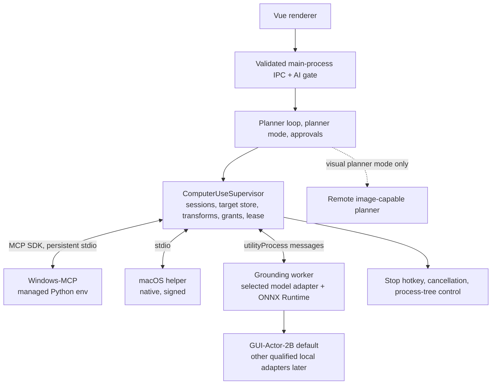

# Computer Use Plugin — Technical Design

## Document information

| Field | Value |
| --- | --- |
| Version | 1.3 |
| Status | Proposed architecture, revised after feasibility review and product decisions. No implementation is claimed |
| Date | 2026-09-26 |
| Product requirements | [Computer Use Plugin PRD](computer-use-plugin-prd.md) |
| Source repositories | `aiFetchly`, proposed `aifetchly-computer-use`, `aifetchly-hub-go` |
| Adapters | Windows-MCP (Windows); macOS backend chosen by spike (pinned Ghost OS fork or in-house Swift helper) |
| Grounder | Replaceable local model adapter in an app-owned ONNX Runtime worker; GUI-Actor-2B is the default |
| Transport | Persistent MCP over stdio via the official MCP TypeScript SDK |
| Packaging | One plugin identity. Hub: plugin code, Windows-MCP environment, Mac helper. Downloadable local AI runtime system (`LocalAiRuntimeModule`): ONNX Runtime binding and GUI-Actor model |
| First target workflow | W-1: build and format a lead list in Microsoft Excel for Windows |

All interfaces, services, commands, and data structures below are proposed unless labeled **existing**.

### Revision 1.1 summary

- Screenshots reach the planner only in opt-in visual planner mode (§12).
- ShowUI-2B is replaced by GUI-Actor-2B; GUI-Actor-3B is blocked by its base-model licence (§5.1).
- One inference runtime: ONNX Runtime with DirectML/CPU on Windows and CoreML/CPU on macOS; no PyTorch, CUDA toolkit, or MLX on customer machines (§5).
- The Python gateway is removed. The host `ComputerUseSupervisor` owns sessions, target store, transforms, grants, lease, and stop (§3, §4, §10).
- The macOS backend is chosen by a spike; Ghost OS's MLX sidecar is not used (§6.2).
- The host MCP client is rebuilt on the official SDK with persistent sessions as a Phase 0 deliverable (§4.1).
- Delivery is a thin vertical slice: Windows accessibility-first, then local vision, then macOS (§16).

### Revision 1.2 summary

- W-1 (Excel lead list) is the confirmed target workflow; adapter and benchmark notes are in §6.3 and §14.5.
- Safety controls are specified in detail: stop hotkey, control strip, own-window rejection, elevated-window rejection, refusal while AiFetchly is elevated, and a measurement harness for the provisional targets (§10.5).
- The ONNX Runtime binding and GUI-Actor model are delivered through `LocalAiRuntimeModule`. This needs a v2 catalog, a resumable file-set package format for models, two new runtime IDs, install-set consent, reference-counted worker leases, version pruning, and grounding health probes (§7).

### Revision 1.3 summary

- Separate planner providers, grounding-model adapters, and desktop adapters. Define capabilities, lifecycle, request/result metadata, compatibility, and between-session selection (§5.9).
- Keep executable grounding adapters in the host worker; the plugin repository owns their shared schemas, export pipelines, and fixtures (§3). Additional production models require qualification and may require a host app release.
- Specify the conditional Ghost OS integration: source/dependency pins, fork patches, private stdio MCP, removal of internal vision fallback and workflow execution, and signed/notarized Hub packaging (§6.2).
- Extend catalog compatibility metadata, traces, tests, rollout, and PRD traceability for model switching and Mac integration.

## 1. Architecture decisions

1. **Host owns authority.** Sessions, the target store, coordinate transforms, action grants, the desktop lease, stop, and audit live in the AiFetchly main process. No plugin or adapter process can authorize input.
2. **Thin adapters, no gateway.** Adapters are the upstream backend processes themselves (Windows-MCP, the Mac helper) behind a host-side allowlist wrapper. No intermediate Python gateway.
3. **One inference runtime.** Qualified grounders run on ONNX Runtime on every OS, in an app-owned worker under `src/childprocess/computer-use/`. Each model has its own export and preprocessing, shared across OSes and tested for parity against its reference implementation.
4. **GUI-Actor-2B is the default grounder.** Its licence chain (Qwen2-VL-2B Apache-2.0 → MIT) permits commercial distribution. The grounder is replaceable behind a stable internal contract.
5. **Accessibility first.** The grounder resolves only targets accessibility cannot identify reliably.
6. **Two planner modes.** Local-only (default) sends structured text; visual planner mode (opt-in) additionally sends target-window screenshots as transient image inputs.
7. **One authoritative task loop.** No `run_computer_task(prompt)` that hides planning, approval, and retries in another agent.
8. **Installation provisions; sessions only start.** No package resolution or model download during session startup.
9. **Whole-tree supervision.** Stop and lease revocation never wait for model inference.
10. **Read-only diagnostics first.** Coordinate mapping, locate-only overlays, and offline replay exist before autonomous input on vision targets.
11. **Independent repository for non-authority code.** Contracts, adapter packaging, the Mac helper, the ONNX export pipeline, fixtures, and evaluation tools live in `aifetchly-computer-use`.
12. **One local AI component manager.** The grounding runtime and model are local AI runtimes managed by `LocalAiRuntimeModule`, not a second private resource manager and not Hub resources. The subsystem is extended where the model's size and platform independence require it (§7).
13. **Safety controls are host features.** Stop hotkey, control strip, own-window rejection, and elevation checks are enforced by the supervisor before every dispatch, not by adapters or skill text (§10.5).
14. **Three independent interfaces.** Planner providers choose steps; grounding-model adapters produce candidate locations; desktop adapters observe and execute authorized input. Neither model selection nor an OS backend change alters the public tools (§5.9).
15. **Model selection is pinned per session.** Only installed, healthy, compatible configurations are selectable. No live model replacement, silent substitution, remote grounding, or executable adapter loaded from a plugin package.

## 2. Verified code anchors and gaps

Paths were inspected on 2026-09-23. Findings are scoped to these paths, not a full audit.

### 2.1 Desktop (`aiFetchly`)

| Anchor | Existing behavior | Required work |
| --- | --- | --- |
| `package.json` | No `@modelcontextprotocol/sdk` dependency; MCP protocol is hand-rolled | Add the official SDK (verify its `zod` peer range against the project's `zod ^3.24`) |
| `src/modules/MCPClient.ts`, `connectStdio()` | Spawns with piped stdio, sanitized env allow/deny lists, plugin cwd | Keep the env sanitization and trust checks; move them into a custom SDK `Transport` (§4.1) |
| Same, stdout handler (~line 259) | `buffer += data.toString()` decodes each chunk separately | Multi-byte UTF-8 (CJK) split across chunks is corrupted. Buffer bytes and decode complete lines |
| Same, initialize (~line 292) | Sends `initialize` with `2024-11-05`; no `notifications/initialized` | Full version negotiation and initialized notification (SDK `Client`) |
| Same, `handleMessage()` | Handles responses only; drops notifications and server requests | Notifications, progress, cancellation (SDK) |
| Same, `callTool()` | Returns the first text block, else the first `data` block | Preserve all content blocks, structured content, and `isError` semantics |
| Same, `disconnect()` | Direct child `kill()`, clears pending map without rejecting | Reject pending requests; graceful close; process-tree termination |
| Same, `connectSSE()` | Throws "not yet implemented" | Out of scope; Computer Use uses stdio |
| `src/service/MCPToolService.ts`, `executeMCPTool()` | Connects and disconnects a client per invocation | Persistent session pool (§4.2) |
| Same, `assertStdioTrusted()` | Trust check before spawning a local process | Keep; process trust is separate from action authorization |
| `src/service/ToolExecutor.ts` | Resolves plugin MCP tool names | Route Computer Use tools to the supervisor; never expose raw adapter tools to the model |
| `src/service/ManagedBrowserAiToolService.ts` | AI gate, handoff/risk patterns; screenshots return metadata only | Reuse the patterns |
| `src/entityTypes/aiImageAttachmentToolTypes.ts` | Transient `ImageModelArtifact` / `ModelArtifact` | Carrier for visual planner images (§12) |
| `src/service/ManagedBrowserLeaseService.ts` | In-process account lease | Pattern for the desktop lease |
| `src/service/AIChatToolApprovalPolicyService.ts` | Denials, dependency approval, request-scoped actions | Add explicit computer-action classes |
| `src/childprocess/embedding/LocalEmbeddingWorker.ts` | App-owned worker running ONNX models via `@xenova/transformers`, loaded at runtime from a downloaded runtime | Precedent for an app-owned ONNX Runtime worker and runtime-loaded native bindings |
| `src/modules/LocalAiRuntimeModule.ts`, `src/entityTypes/localAiRuntimeTypes.ts` | First-party downloadable runtimes (`embedding-xenova`, `voice-sherpa`): compile-time ID allowlist, per-platform/arch/ABI catalog, consent-bound install, SHA-256, safe ZIP extraction, side-by-side versions, atomic `active.json`, operation coordinator | **Delivery path for the ONNX Runtime binding and model (§7).** Extensions listed in §7.9 |
| `src/schemas/localAiRuntime.ts` | Catalog entries are `.strict()` and `runtimeId` is `z.enum(LOCAL_AI_RUNTIME_IDS)`; `expectedArchiveFileName()` hard-codes the `voice`/`embedding` prefixes | A new runtime ID in the shared catalog would make older apps reject the whole catalog. New IDs go in a v2 catalog (§7.3) |
| `src/service/localAiRuntime/localAiRuntimeConstants.ts` | 768 MiB archive, 2 GiB extracted, 1 GiB per entry, 10-minute total download timeout | Too small for GUI-Actor weights; models use a separate file-set format and limits (§7.5) |
| `LocalAiRuntimeDownloadService` | Single-file stream opened with `wx`; no HTTP range resume | Resumable per-file downloader for models (§7.5) |
| `LocalAiRuntimeOperationCoordinator` | Worker version leases are a `Set`, not reference-counted; one mutable operation per runtime ID | Reference-counted leases (§7.8) |
| `LocalAiRuntimeModule.listStatuses()` | Hard-codes the two existing IDs | Group-aware listing (§7.9) |
| `LocalAiRuntimeStateStore.listInstalledVersions()` | Exists but nothing prunes old versions | Pruning for multi-GB model versions (§7.8) |
| `DisposableVoiceRuntimeProbe` | Health probe in a disposable utility process so native DLLs never lock files in the main process | Pattern for the grounding runtime and model probes (§7.7) |
| `src/main-process/communication/local-ai-runtime-ipc.ts` | Composition root; catalog URL from `AIFETCHLY_RUNTIME_CATALOG_URL` or the GitHub release `local-ai-runtimes.json`; `disposeIdleWorkersForRuntime`; worker resolver injection | v2 catalog source, grounding disposer and resolver, install-set channels (§7.9) |
| `.github/workflows/local-ai-runtime-release.yml` | Builds per-platform runtime archives, verifies them, generates and publishes the catalog | Adds the ONNX Runtime package, model entries, and dual v1/v2 catalog output (§7.10) |
| `src/utils/packagedWorkerPath.ts` | `buildPackagedWorkerEnv`, `resolvePackagedWorkerPath` | Required for the grounding worker spawn |
| Desktop `src/` | No uv or Python install-plan consumer | Needed only for the Windows-MCP environment (§8) |

The generic plugin package limit in `pluginTypes.ts` (50 MiB compressed / 250 MiB extracted) and the Hub canonical packager limits both rule out model weights in code packages. Models are delivered as local AI runtime model packages (§7.5).

### 2.2 Hub (`aifetchly-hub-go`)

| Anchor | Existing behavior | Required work (phase) |
| --- | --- | --- |
| `internal/httpapi/routes/install_plan.go` | Target-aware plan, uv provision records, uv toolchain selection | Preserve (Phase 1) |
| Same, `BuildManagedPlan()` | Models/environments appended from version-only queries | Filter by target, execution provider, and features (Phase 3, when two targets exist) |
| `queries/plugin_version_targets.sql` | `ListPlanModelRevisions` / `ListPlanEnvironments` filter by version | Add target applicability (Phase 3) |
| `internal/managed/target.go` | Iterates every requirement when resolving a target | Conditional requirements so Windows-only and Mac-only resources do not block each other (Phase 3) |
| `internal/resources/plan.go` | Plugin/runtime/environment/model/toolchain types | Native-component resource type for the Mac helper (Phase 3) |
| `internal/artifacts/plugin_package.go` | One code archive, fixed file mode `0644` | Native executables stay outside the code ZIP; a safe native extractor restores validated executable bits (Phase 3) |
| uv-runtime design | `uv pip install --require-hashes` from a Hub JSON lock | Applies to the Windows-MCP environment only |

### 2.3 Document reconciliation

The older managed-installation PRD disallows public package installation at runtime. The Hub uv design adds hash-pinned provisioning during installation. This feature uses the uv provisioner only during installation, only for the Windows-MCP environment, and only from a validated plan; session startup never installs packages. Developer `uv.lock` workflows and the Hub JSON lock are different formats; release tooling generates and verifies the Hub lock.

## 3. Repository and responsibility boundaries

### 3.1 Independent repository

```text
aifetchly-computer-use/
├── plugin/                        # Manifest, skills, tool descriptions
├── contracts/                     # Versioned JSON Schemas + fixtures shared with the host
│   ├── tools/
│   ├── desktop/                  # Backend capabilities, observations, atomic input, errors
│   ├── grounding/                # Model capabilities, lifecycle, requests/results, compatibility
│   ├── traces/
│   └── fixtures/transforms/       # Golden geometry cases consumed by host tests
├── adapters/
│   ├── windows/                   # Windows-MCP pin, tool allowlist, launch profile, lock generation
│   └── macos/                     # Backend chosen by spike; Ghost candidate layout below
│       └── ghost-os/
│           ├── upstream.lock      # Exact source commit, dependency pins, toolchain identity
│           ├── patches/           # Reproducible AiFetchly patch set (or lock to a maintained fork)
│           └── tool-allowlist.json # Reviewed backend surface; host also enforces it
├── grounding/
│   ├── reference/                 # PyTorch reference runner (CI and developer machines only)
│   ├── export/                    # PyTorch → ONNX export, quantization, manifest generation
│   ├── parity/                    # Stage-by-stage golden tensors and tolerance checks
│   └── fixtures/                  # Per-model preprocessing, output, absence/ambiguity cases
├── eval/                          # Benchmark datasets metadata, evaluate/replay CLI
├── packaging/
│   ├── windows/
│   └── macos/                     # Build, sign, notarize, archive, checksums, Hub metadata
├── tests/
└── THIRD_PARTY_NOTICES            # Code and model licences, including base-model chains
```

PyTorch and Python are used here only in CI and on developer machines to export and verify models. Customer machines receive ONNX files. Do not commit weights, Python distributions, virtualenvs, caches, credentials, or customer traces.

The host and this repository share **schemas and fixtures, not code**. Host TypeScript types are generated from or validated against the JSON Schemas, and host transform tests consume `contracts/fixtures/transforms`.

Executable grounding adapters, including model-specific preprocessing and output decoding, ship in the AiFetchly worker. They are not dynamically imported from this repository or a downloaded model package. Moving them into a shared executable package would require a separate revision of this boundary. The Ghost source/fork is different: it is compiled into the separately versioned native desktop helper and delivered through the Hub.

### 3.2 Host responsibility

- Plugin Manager integration, Computer Use settings, session control strip, translations.
- AI enable gate, planner and provider routing, planner mode enforcement.
- `ComputerUseSupervisor`: session state machine, target store, coordinate transforms, grants, desktop lease, stop and stop hotkey, adapter and worker supervision.
- Grounding worker (ONNX Runtime), model adapter registry, model-specific preprocessing/postprocessing, and selection/compatibility validation.
- Local AI runtime extensions that deliver the grounding runtime and model (§7), and managed resource resolution from trusted Hub plans for the rest.
- Result normalization, transient image delivery in visual planner mode, audit persistence through Modules/Models.
- Cleanup on plugin disable/uninstall and app quit.

IPC handlers validate, check the AI gate, authorize, and dispatch. Workers and adapter processes never access the database. The grounding worker entrypoint lives in `src/childprocess/computer-use/` and is registered in the build configuration.

### 3.3 Hub responsibility

Resolve target and features into an immutable resource closure; distribute verified resources, compatibility, and revocation. The Hub does not execute input, proxy screenshots, infer OS permissions, or certify local GPU health.

## 4. Runtime topology



- Windows-MCP runs in the interactive Windows user session as a child of AiFetchly. It is not an elevated service or login task. WSL-hosted code is never a Windows desktop executor.
- The macOS helper is a native subprocess. macOS normally attributes a spawned helper's Accessibility and Screen Recording use to the responsible app (AiFetchly.app); verify this in the packaged build (§6.2).
- The grounding worker is an Electron `utilityProcess` spawned with `buildPackagedWorkerEnv`. It loads the ONNX Runtime Node binding and the model from version roots resolved by `LocalAiRuntimeResolver` in the main process, and has no network or database access.
- Screenshot bytes flow from the adapter to the supervisor to the worker. They reach the planner only in visual planner mode.

### 4.1 MCP client on the official SDK

- Use `@modelcontextprotocol/sdk` `Client` for protocol handling: initialize, version negotiation, `notifications/initialized`, capabilities, notifications, progress, cancellation, and complete content blocks.
- Implement a custom SDK `Transport` over the host's own spawn, rather than the SDK's stock stdio transport, so these stay in host code: `assertStdioTrusted`, env allow/deny lists, cwd, shell-free argv, bounded message size, and process-tree ownership (Windows Job Object; POSIX process group).
- Decode stdout from buffered bytes on newline boundaries (fixes the existing UTF-8 split bug). Keep stdout exclusively for protocol messages; stderr is bounded and redacted.
- Pin supported protocol versions; disconnect on an unsupported negotiated version.
- Separate deadlines for spawn, initialize, model warm-up, and each tool call.
- On exit or cancellation, reject all pending requests and clear timers.
- Normalize results to a typed union of text, image, and structured content without `any`. Image content from adapters is routed to the supervisor, never into persisted tool JSON.

This is a Phase 0 deliverable. It ships independently and benefits every MCP plugin.

### 4.2 Persistent session pool

- Key sessions by server identity + resolved launch configuration hash + trust generation.
- Reuse a live session for repeated calls; close after a configurable idle timeout.
- Never reuse a session whose grants, paths, version, or owner changed.
- Computer Use sessions are pinned for their lifetime and closed by the supervisor on stop.
- Drain and close stdin for graceful shutdown, then terminate the owned process tree after bounded deadlines.

Tool discovery alone is not readiness. Computer Use readiness also requires OS permissions, a supported target, and (when local vision is selected) a healthy grounding worker.

## 5. Local grounding: model adapters on ONNX Runtime

Sections 5.1–5.8 specify the default GUI-Actor implementation. Section 5.9 defines the common contract; future adapters provide their own preprocessing, decoding, and calibration without changing the planner or desktop backends.

### 5.1 Model selection

| Model | Base and licence chain | Parameters | Weights (published) | Status |
| --- | --- | --- | --- | --- |
| GUI-Actor-2B-Qwen2-VL | Qwen2-VL-2B-Instruct (Apache-2.0) → MIT | ~2B, 28 decoder layers, hidden 1536 | bf16 safetensors ≈ 4.45 GB | **Default** |
| GUI-Actor-3B-Qwen2.5-VL | Qwen2.5-VL-3B-Instruct (Qwen Research License, non-commercial) → MIT | ~3B | — | **Blocked** pending commercial licence |
| GUI-Actor-7B-Qwen2.5-VL | Qwen2.5-VL-7B-Instruct (Apache-2.0) → MIT | ~7B | — | Future high-memory tier |
| GUI-Actor-Verifier-2B | UI-TARS-2B-SFT → MIT | ~2B | — | Future; licence chain to confirm |

Release tooling records the licence of every weight file and its base model, and fails publication on a non-commercial licence.

### 5.2 Inference path

GUI-Actor adds an attention-based pointer head to Qwen2-VL. The reference implementation's placeholder mode (`inference(..., use_placeholder=True)`) needs **one forward pass and no token-by-token generation**:

1. Build the chat prompt with the system grounding message, the image, and the instruction, then append the assistant starter `<|im_start|>assistant<|recipient|>os\npyautogui.click(<|pointer_start|><|pointer_pad|><|pointer_end|>)`.
2. Run the vision encoder on the image patches.
3. Run the decoder over the full prompt (prefill only, no KV cache output).
4. Take the input-embedding-layer hidden states at `<|image_pad|>` positions and the final-layer hidden state at `<|pointer_pad|>` (`pointer_pad_token_id` 151661 in the 2B config).
5. Run the pointer head to get attention scores over the merged patch grid (`image_grid_thw / merge_size`).
6. Postprocess: keep patches above 0.3 × max activation, group 4-connected regions, rank regions by mean activation, and return activation-weighted centers normalized to `[0,1]` in model-input image space.

Steps 1 and 6 run in TypeScript in the worker. Steps 2–5 are ONNX graphs.

### 5.3 Export pipeline (CI, in the plugin repository)

- Export three graphs, or fewer if fusion is verified: `vision_encoder.onnx`, `decoder_prefill.onnx` (returns the two hidden-state tensors needed, not logits, so the vocabulary projection is never computed), and `pointer_head.onnx`.
- Save weights as ONNX external data, sharded by the export pipeline into files of at most 512 MiB, so every file fits the model package limits and GitHub release asset limits (§7.5).
- Pin the opset and exporter versions. Record them in the model manifest.
- Produce configurations as separate, independently benchmarked model packages, each with its own local runtime ID (§7.4): fp16 baseline; int8 or int4 weight-only decoder (for example `MatMulNBits`) with fp16 vision encoder. Verify each operator is supported by each target execution provider before publishing. Size estimates to confirm in Phase 0: about 4.4 GB for fp16 (the published bf16 checkpoint is about 4.45 GB; the 2B model ties its input and output embeddings, so dropping the LM head saves little), and about 2.2–2.7 GB for an int4 decoder with fp16 vision encoder.
- Ship `tokenizer.json`, special-token map, chat template, and `preprocessor_config.json` alongside the graphs.
- Manifest identity includes model revision, export pipeline version, opset, quantization, preprocessing configuration, and per-file hashes.

**Parity tests** (hard gate for every configuration): for each fixture, compare the ONNX pipeline against the PyTorch reference at every stage — `pixel_values`, `image_grid_thw`, position ids, image-token embeddings, pointer hidden state, attention scores, ranked regions, and final points — with recorded tolerances. The final check is region-hit agreement on the labeled fixture set.

### 5.4 Preprocessing in TypeScript

Port `Qwen2VLImageProcessor` exactly, using values from the pinned `preprocessor_config.json` (GUI-Actor-2B: `patch_size` 14, `merge_size` 2, `temporal_patch_size` 2, `min_pixels` 3136, `max_pixels` 5720064, CLIP mean/std, bicubic resample):

- `smart_resize`: round each dimension to a multiple of 28 (`patch_size × merge_size`) within the pixel budget. Each axis is rounded independently, so the resize is slightly **anisotropic**; the transform stores separate `sx` and `sy` (§11).
- Rescale, normalize, duplicate the frame to `temporal_patch_size`, patchify, and order patches to match the 2×2 merge layout.
- Tokenize with the pinned tokenizer and apply the chat template byte-for-byte.
- Compute Qwen2-VL multimodal rotary position ids (`get_rope_index`). Prefer embedding this computation in the decoder graph to avoid drift; if computed in TypeScript, cover it with golden tests.

**Pixel budget is the main latency lever.** At the default `max_pixels` (~5.7 MP), a full-screen 4K capture becomes about 7,200 merged visual tokens of decoder prefill. Crop to the target window first. The benchmark evaluates smaller budgets (for example 1–2 MP plus crop-and-re-ground) against accuracy. The default budget is recorded in the model package manifest and every observation's grounding metadata. It is a runtime parameter, not part of the download identity, so changing it never redownloads weights.

Static-shape buckets (a few fixed grids with recorded padding) are an optimization candidate for CoreML and DirectML. Dynamic shapes are the baseline until measurements justify buckets; any padding is recorded in the transform.

### 5.5 Execution providers

| Target | Primary | Fallback | Notes |
| --- | --- | --- | --- |
| Windows 10/11 x64 with a DirectX 12 GPU | DirectML EP | CPU EP | Covers NVIDIA, AMD, and Intel GPUs. DirectML is in sustained engineering (maintained, no new features). Requires sequential execution and memory-pattern optimization disabled. bf16 weights are converted to fp16 or quantized |
| Windows CPU only | CPU EP | — | Local vision enabled only if measured latency meets the budget |
| Windows 11 24H2+ | Windows ML vendor EPs (TensorRT for RTX, OpenVINO, MIGraphX) | DirectML / CPU | Phase 5 evaluation; not in the Node binding path today |
| macOS Apple Silicon | CoreML EP | CPU EP | Measure per-operator offload; partial offload is common for dynamic-shape VLMs |

- The worker probes available providers at load time, initializes the best one, and falls back to CPU on initialization failure. The chosen provider is recorded in every observation's grounding metadata.
- The provider never changes during a session. A provider failure mid-session fails the grounding call with `backend_unavailable` and requires a worker restart.
- CUDA EP is not shipped initially (binary size and driver coupling); it may be evaluated later.

### 5.6 Grounding worker

`src/childprocess/computer-use/GroundingWorker.ts`, spawned by the supervisor via `utilityProcess.fork` with `buildPackagedWorkerEnv` and `resolvePackagedWorkerPath`.

| Message | Direction | Semantics |
| --- | --- | --- |
| `load` | host → worker | Contract/adapter identity, resolved model/runtime paths, configuration and calibration identity, preferred providers (§5.9). Replies with effective capabilities, provider, load time, memory estimate |
| `ground` | host → worker | Request ID, session generation, observation ID, image reference and dimensions, target description, optional crop. One in flight; queue depth 1 |
| `cancel` | host → worker | Discard the result for a request ID; terminate the run if the binding supports it |
| `unload` | host → worker | Release sessions and memory |
| `result` / `error` | worker → host | Candidate points/regions, coordinate space, preprocessing transforms, model identity, timings, provider, optional attention grid; or a typed error (§5.9) |

- Image bytes are transferred as `ArrayBuffer` over the worker message port or via a private temp file. They are never logged.
- The host discards any result whose session generation is stale. On Stop, if a run cannot be terminated promptly, the supervisor kills the worker; model reload is the cost of a guaranteed stop.
- Weights load lazily on first vision need or during an explicit warm-up with visible progress, stay warm during the session, and unload on idle or memory pressure.
- The worker code (preprocessing, postprocessing, protocol) stays in the app bundle and is tested with the app. Only the native binding and the model are downloaded. `OnnxRuntimeLoader` loads `onnxruntime-node` from the resolved `grounding-onnxruntime` root with a scoped `createRequire`, the same pattern as the voice runtime's `SherpaOnnxNative`. It then checks the loaded version against the package manifest (§7.6).
- The worker receives the runtime root, model root, and versions in `load`. These paths come from the main process and are never sent to the renderer. The host holds version leases on both while the worker is loaded (§7.8).

### 5.7 Candidates, ambiguity, and absence

GUI-Actor always produces an attention peak; it has no native "not present" output.

- **Ambiguous:** the second-ranked region's score is at least a calibrated ratio of the top score and its center is outside the top region → `target_ambiguous`.
- **Likely absent:** the top region's mean activation is below a threshold calibrated on absent-target fixtures → `target_not_found`.
- **Cross-check:** when accessibility data exists for the region, a contradiction (for example a disabled element or a different role) downgrades to ambiguous.
- In visual planner mode, the planner can confirm a proposed target before a consequential action.
- Activation scores are metadata for ranking and diagnostics. They are never probabilities and never authorization.

### 5.8 Precision

GUI-Actor grounds at merged-patch granularity (28 × 28 px in model-input space), refined by activation weighting. For small targets, or when the top region is large relative to the expected control, crop the original capture around the candidate and re-ground at a higher effective resolution. Crops map back through the same transform path.

### 5.9 Grounding-model adapter contract and selection

#### 5.9.1 Responsibilities and lifecycle

| Interface | Responsibility | Implementation location |
| --- | --- | --- |
| Planner provider | Choose steps and interpret observations; optional transient screenshot understanding | Existing host planner/provider routing |
| `GroundingModelAdapter` | Describe capabilities, load a model, preprocess an image, infer and decode candidate locations, cancel, unload | Host `src/childprocess/computer-use/grounding/` |
| Desktop adapter | Accessibility, window capture/geometry, and supervised atomic input | Windows-MCP or the chosen Mac helper, through host MCP wrappers |

The plugin repository publishes versioned JSON Schemas and conformance fixtures under `contracts/grounding/`. The worker implements these lifecycle operations:

| Operation | Input | Output / guarantee |
| --- | --- | --- |
| `capabilities` | Built-in adapter ID | Contract version, adapter/version, accepted model architecture and manifest versions, ONNX Runtime/provider support, image formats and pixel limits, crop support, point/region/heatmap output support, absence-policy support, cooperative-cancel support |
| `load` | Validated model/runtime roots and immutable identity, provider preference, session generation | Loaded identity and effective capabilities, selected provider, load timing and memory estimate; rejects incompatible packages before inference |
| `ground` | Request defined below | Candidate result or typed failure, never an input action or target handle |
| `cancel` | Request ID and session generation | Marks work cancelled and suppresses its result; attempts cooperative cancellation; the supervisor enforces a deadline and kills the worker if needed |
| `unload` | Loaded configuration identity | Releases model sessions and buffers; host releases version leases after unload/exit is confirmed |

The registry is a compile-time map from approved adapter IDs to implementations. A catalog can name a supported adapter, but cannot supply module paths, JavaScript, commands, or an entry point. `GuiActorOnnxAdapter` wraps the pipeline in §5.2–5.8. The model adapter never calls desktop tools, sends network requests, accesses the database, converts coordinates to desktop units, or authorizes input.

#### 5.9.2 Requests, results, and model-specific behavior

| Contract field | Semantics |
| --- | --- |
| Request envelope | `contractVersion`, `requestId`, `sessionGeneration`, `observationId`, and the loaded configuration identity |
| Request image | Private image reference/bytes using §5.6 transport, format, original capture width/height; optional crop in capture pixels with an explicit origin and bounds |
| Request task | Target description and bounded inference/pixel-budget options supported by that adapter |
| Result envelope | Echoes request/generation/observation IDs and loaded identity; host compares all of them before accepting candidates |
| Candidate geometry | Finite point and/or region coordinates in explicitly declared `capture_pixels` or `model_input_pixels`; never desktop coordinates. Bounds must match the declared image dimensions |
| Preprocessing evidence | Crop, resize, padding, model-input dimensions, and mapping to the original capture; host validates and applies the common transform path (§11) |
| Candidate interpretation | Adapter-specific ranking scores with named score semantics and versioned decoding/calibration policy; no assumed cross-model confidence scale |
| Diagnostics | Stage timings, runtime version and execution provider, optional attention grid/heatmap according to declared capabilities; no image bytes in ordinary tool JSON |
| Failure | Common typed codes: `target_not_found`, `target_ambiguous`, `invalid_grounding_output`, `action_cancelled`, `resource_limit`, `backend_unavailable`, `model_not_ready`, or `protocol_mismatch`, with stage and correlation metadata (§9.3) |

The immutable configuration identity includes adapter ID/version, contract version, model runtime ID/version and manifest hash, preprocessing revision, decoding revision, and calibration revision. Runtime version and actual execution provider are bound at load time. Image byte limits, dimensions, finite values, candidate counts, transform validity, and capability support are checked at the worker boundary and again before the host creates a target handle. Missing/invalid transforms or unsupported outputs fail closed.

Each architecture needs its own preprocessing and output decoding; ONNX compatibility alone does not make weights interchangeable. GUI-Actor uses the attention policy in §5.7. Other models must implement and qualify their own absence/ambiguity policy; a generated confidence value is not automatically a probability. Do not reuse thresholds across architectures or quantizations without evaluation. Unsupported heatmaps are omitted, never fabricated. Adapters without a qualified absence policy cannot be selected for autonomous input.

#### 5.9.3 Selection, compatibility, and qualification

1. Settings lists installed model configurations only when their adapter is built into this app, package and runtime health checks pass, and app version, architecture, runtime/provider, memory, manifest, and calibration compatibility match. Qualified missing models have a separate install action through `LocalAiRuntimeModule`.
2. A model change updates `groundingModelRuntimeId` only while no Computer Use session exists, including paused/handoff sessions. An active change request returns `desktop_busy`; it does not queue a hidden switch. Explicitly stop the current session first.
3. Before a new session with local vision enabled starts, resolve and lease the selected model/runtime versions, freeze the full identity, and check readiness. Initial provider selection may use the qualified CPU fallback (§5.5). It must never silently select another model. Lazy model load must use those exact leased versions. Accessibility-only sessions do not require an installed grounder.
4. Stop invalidates targets and in-flight results. A new session gets a new generation and observation; unload or terminate an idle worker with the old model before loading the new selection. If the selected model is missing, incompatible, or fails load, return `model_not_ready` or the corresponding runtime/backend error with a recovery action.
5. Phase 2 ships GUI-Actor plus a test-only second adapter for conformance and switching tests. A second production model ships only after licence-chain review, reference/export parity, held-out absence/ambiguity evaluation, native region-hit/workflow tests, resource measurements, and cancellation tests. Registering a new architecture or configuration can require an app release (§7.4).

All production adapters in this design run locally on ONNX Runtime. Remote grounding and alternative inference runtimes are deferred. Visual planner consent applies only to the configured planner, never a separate grounding endpoint. Model-specific implementations and selection do not alter this routing boundary.

## 6. Platform adapters

### 6.1 Windows: Windows-MCP

- Pin a Windows-MCP revision (MIT, actively maintained). The observed docs require Python 3.13+; it is the only Python component in the system.
- The host wrapper enforces an allowlist on both `tools/list` and `tools/call`: screenshot/state, display inventory, app/window focus, click, type, scroll, move/drag, and keys. Upstream allowlist settings are also configured. PowerShell, registry, filesystem, and process tools are unreachable.
- Adapter tools are never registered as model-visible tools. Only the supervisor calls them, after grant validation.
- Normalize the UI Automation tree and capture bounds into the observation contract.
- Elevated target windows are rejected with `unsupported_target`. UIPI blocks injection from a lower-integrity process, and `SendInput` reports neither an error nor a distinguishable return value when UIPI blocks it, so the check must happen before dispatch (§10.5.4).
- The plugin adds one read-only tool to the allowlisted surface, `process_integrity`. Given a window handle or process ID, it returns the owning process ID and integrity level (`low`, `medium`, `high`, `system`), using `OpenProcess(PROCESS_QUERY_LIMITED_INFORMATION)` and `GetTokenInformation(TokenIntegrityLevel)` through `ctypes`. The same tool reports AiFetchly's own integrity level. It ships either as an extension module loaded by the plugin's launch entrypoint or as a patch in a pinned fork, decided with the Windows-MCP pin in Phase 0. The host has no FFI dependency today and does not add one for this.
- Window-at-point: the adapter returns the top-level window handle and owning process ID for a desktop point (`WindowFromPoint` → `GetAncestor(GA_ROOT)` → `GetWindowThreadProcessId`). The supervisor uses this for own-window and elevation checks.
- Disable upstream telemetry and verify the setting in the pinned version.
- Test Unicode/CJK input and non-English application names for all six locales.

### 6.2 macOS: backend decided by spike

| Option | Description | Considerations |
| --- | --- | --- |
| A — pinned Ghost OS fork | MIT, macOS 14+, Swift 6.2. Created February 2026; last upstream push March 2026 | Accessibility tools and input exist today. We would build, sign, and notarize it ourselves, disable its MLX vision sidecar and learning features, and own maintenance of the fork |
| B — in-house Swift helper | Accessibility API tree (`AXUIElement`), `CGEvent` input, ScreenCaptureKit capture, NSWorkspace app/window listing, exposing the same tool subset over stdio MCP | Full ownership and a smaller surface; more initial work |

Spike criteria (time-boxed, Phase 0): accessibility coverage on the target workflows' Mac apps, CJK input, capture geometry correctness, binary size, signing/notarization effort, and estimated maintenance cost. The decision is recorded before Phase 3.

Either way:

- The shared ONNX grounder is used; no Mac-specific model format or sidecar.
- Qualify permission attribution in the packaged app. A helper spawned by AiFetchly is normally attributed to AiFetchly.app as the responsible process, so prompts name AiFetchly, the app's signing identity must stay stable across updates, and development builds attribute to the terminal or IDE.
- Accessibility and Screen Recording are required; Input Monitoring only for later recording/learning features.

#### 6.2.1 Ghost OS source, packaging, and launch

This is the integration plan if option A wins the spike, not a declaration that Ghost OS has been selected or qualified. The [upstream developer guide](https://github.com/ghostwright/ghost-os/blob/main/CLAUDE.md), inspected on 2026-09-26, documents `ghost mcp` as the Swift stdio server. The source build requires Swift 6.2+ and macOS 14+; the published project is MIT-licensed. Customer machines receive only our built native helper and required notices/resources.

- Maintain `adapters/macos/ghost-os/upstream.lock` with an exact upstream/fork commit, locked dependency revisions (including AXorcist), patch-set digest, Swift toolchain, and deployment target. Either a maintained fork or patches applied to a pinned checkout is acceptable; builds must fail on unresolved patches or lock drift. Never resolve a branch or download source during installation/startup.
- macOS CI checks out the pin, applies patches, resolves locked dependencies, tests, and builds the release executable for `darwin-arm64`. Sign the distributed executable/bundle, notarize the chosen distribution format, and verify signatures and notarization after packaging. Record source/dependency identities, output SHA-256, architecture, minimum OS, signing identity, and compatible contract/app versions in release metadata. Retain Ghost OS and dependency licence notices.
- Publish a target-specific Hub `native-component` resource (§7.1); keep executable artifacts out of the plugin code ZIP. The managed extractor restores only validated executable permissions. Do not package Ghost's Python/MLX sidecar, model weights, recipes, or learning assets.
- The host resolves the verified executable's absolute path and launches it with argv `["mcp"]`, `shell: false`, sanitized environment, and an app-owned working directory via the supervised MCP transport (§4.1). Keep the connection for the session and stdout reserved for MCP. Do not invoke `ghost setup`, alter another MCP client's configuration, edit global PATH, or require Homebrew.
- Integrate permission readiness into AiFetchly's UI and qualify attribution in the signed packaged app and after updates. A diagnostic path must check the capabilities actually shipped, without requiring the removed vision or learning components. Shared ONNX runtime/model installation stays with `LocalAiRuntimeModule`.

#### 6.2.2 Ghost OS tool isolation and required patches

The [upstream tool guide](https://github.com/ghostwright/ghost-os/blob/main/GHOST-MCP.md) documents implicit vision fallback in ordinary tools, focus changes during input/capture, and screenshots downsampled to a maximum width of 1280 pixels. These behaviors must be audited in the pinned source and adapted to the host contract; hiding `ghost_ground` alone is insufficient.

| Surface | AiFetchly integration policy |
| --- | --- |
| Observation | Allow scoped `ghost_context`, `ghost_state`, `ghost_find`, `ghost_read`, `ghost_inspect`, `ghost_element_at`, and `ghost_screenshot`; validate target window/process and bound output |
| Input | Allow only needed atomic `ghost_click`, `ghost_type`, `ghost_press`, `ghost_hotkey`, `ghost_scroll`, `ghost_hover`, `ghost_drag`, and `ghost_focus` operations after host validation; serialize them. Omit unused operations from the shipped allowlist |
| Vision | Remove/disable `ghost_ground`, `ghost_parse_screen`, and all implicit sidecar fallbacks in perception/actions. AX failure returns a typed unresolved-target error to the supervisor, which may call its selected grounder |
| Workflows and recording | Remove/disable `ghost_run`, all recipe management, and `ghost_learn_*`; no multi-step execution or recorder starts behind a single grant |
| Other tools | Deny by default, including broad `ghost_window` operations, annotation, long-press, or waits until explicitly mapped, bounded, and qualified for a required host action |

Enforce the reviewed allowlist in both backend registration/dispatch and the host wrapper's `tools/list` and `tools/call` paths. Do not register raw Ghost tools as model-visible tools or import upstream agent instructions/recipes into AiFetchly's planner.

Patch or constrain action strategy fallbacks so each dispatch acts on the already validated target. Re-searching by an ambiguous label, switching windows, restoring focus, or using an alternate CDP/VLM execution path must not silently expand the authorized action. Observation must not unexpectedly activate another app; return a recoverable error when capture requires an unapproved focus transition. Retain the host's window-at-point/own-window and freshness checks and add the backend metadata or primitives needed to support them.

Return capture pixel dimensions, captured window identity, logical frame/origin, scale/resize information, and executor coordinate convention. Either preserve original captures or describe any downsampling exactly. The host maps selected-model output through these transforms; it never calls `ghost_ground` to perform coordinate conversion. Qualify Retina, moved windows, occlusion, and foreground changes with native fixtures.

The upstream server is documented as synchronous, so receiving an MCP cancellation message cannot be assumed to interrupt a running action. Add bounded operations and cooperative stop where possible; the host revokes grants immediately and owns process-tree termination independently of that connection. Passing the existing stop/last-input gates is required before shipping; the fork must fix cancellation gaps or the spike chooses the in-house helper.

### 6.3 Target workflow W-1: Excel lead list

W-1 (PRD §3.1) drives adapter qualification, fixtures, and the benchmark for Phases 1 and 2.

**Observation.**

- Excel exposes the worksheet grid, cells, the Name Box, the formula bar, sheet tabs, and ribbon controls through UI Automation. The adapter normalizes a bounded subset: header row, used range limited to the visible rows plus row count, active cell, selection, sheet tabs, and the ribbon controls needed by W-1.
- The full grid tree can be very large. The adapter caps depth and element count and reads cell values for the header row and at most the rows being verified. Observation time is measured against the 2 s planning target.
- Cell values are read through the UI Automation value and grid patterns, never by OCR, and are treated as untrusted text (CU-PERM-07).

**Entry.**

- Rows are inserted by paste, not by typing cell by cell. The host writes tab-separated text to the clipboard with Electron's main-process `clipboard` API, the agent selects the first empty cell (via the Name Box or `Ctrl+G`) and sends `Ctrl+V`, and the host then restores the user's previous clipboard text. Windows-MCP clipboard tools are not added to the allowlist. Rich clipboard formats other than text are not preserved and the user is told so on first use.
- Before paste, the supervisor verifies that the destination range is empty by reading it back. A non-empty range requires confirmation.
- Before paste, phone, postal code, and ID columns are set to Text format. Cells containing `=`, `+`, `-`, or `@` at the start are prefixed with an apostrophe so pasted lead data can never become a formula (formula-injection guard).
- Excel cell edit mode and IME composition are detected from the accessibility state; the agent presses `Esc` to leave edit mode before navigation, and never sends keys while an IME candidate window is open.

**Formatting.** Header bold, table style or AutoFilter, column autofit, and conditional formatting for duplicate emails, through ribbon controls. Ribbon galleries, colour swatches, and filter dropdown arrows are the Excel targets used to qualify the vision path in Phase 2.

**Verification.** Read back the row count and a sample of cells (all cells for runs up to 50 rows; otherwise the first, last, and a random sample of rows, plus every column containing a formatted type) and compare them with the source rows after normalizing whitespace. Any mismatch is reported to the user with row and column; the run never reports success with a known mismatch.

**Stop points.** Save, Save As, Share, closing the workbook, deleting rows or columns, and Remove Duplicates are consequential action classes in `AIChatToolApprovalPolicyService` and always need current-task authorization. Protected View, "Enable Editing", co-authoring conflicts, and sign-in prompts trigger a handoff.

## 7. Packaging and delivery

### 7.1 Delivery channels

| Resource | Channel | Identity includes | Download policy |
| --- | --- | --- | --- |
| Common plugin code | Hub | Plugin version + hash | When changed |
| Windows-MCP environment | Hub (managed uv, §8) | Python runtime identity + full dependency lock hash + target | Windows only |
| uv toolchain + Python runtime | Hub | Version + OS + architecture + hash | Windows only, shared when compatible |
| macOS helper | Hub (native-component resource, Phase 3) | Helper revision + architecture + hash + signing identity | macOS only |
| ONNX Runtime Node binding | Local AI runtime catalog v2, runtime ID `grounding-onnxruntime` | ONNX Runtime version + execution providers + platform + architecture + Electron ABI + SHA-256 | When the user turns on local vision |
| GUI-Actor model configuration | Local AI runtime catalog v2, runtime ID `grounding-model-gui-actor-2b-<config>` | Model revision + export pipeline version + opset + quantization + preprocessing identity + per-file SHA-256 | When the user turns on local vision; independent of plugin code |

The Hub install plan for Computer Use contains no model or ONNX Runtime resource. The plugin manifest declares which local runtime IDs it can use (`localAiRuntimes: [{ runtimeId, minVersion }]`). The host accepts only IDs in its compiled allowlist, so a plugin can never add a runtime, change a download URL, or select a different model file.

### 7.2 Why `LocalAiRuntimeModule`

The existing subsystem (design: [downloadable local AI runtimes](downloadable-local-ai-runtimes-technical-design.md)) already provides what the grounding runtime and model need, and it is covered by tests under `test/vitest/main/service/LocalAiRuntime*.test.ts`. Reused unchanged:

- a compile-time allowlist of runtime IDs, so network data never selects package names or entry points;
- HTTPS catalog fetch with size and time limits, ETag caching, and Zod validation, where an invalid response never replaces a valid cache;
- exact platform, architecture, Node-module-ABI, and app-version matching, with no silent fallback;
- a consent token bound to runtime ID, version, and SHA-256, with a 5-minute expiry;
- streaming SHA-256 downloads with per-hop HTTPS, bounded redirects, and cancellation;
- safe ZIP extraction (path, link, size, and entry-count checks);
- side-by-side version directories, atomic `active.json`, `previousVersion`, and staging cleanup on failure;
- one mutable operation per runtime ID, and worker version leases that block removal of a version in use;
- health checks before activation, including a disposable-process probe pattern;
- progress IPC, the Settings → Local AI components panel, and repair and remove.

What it does not do today, and this design adds:

- a way to add runtime IDs without breaking older apps (§7.3);
- a package format for platform-independent, multi-GB, resumable model files (§7.5);
- dependencies between packages, one consent covering two packages, memory checks, reference-counted leases, and version pruning (§7.8).

### 7.3 Catalog v2

Today's schema parses `runtimeId` with `z.enum(LOCAL_AI_RUNTIME_IDS)` and `.strict()` entries. An older app that meets an unknown ID rejects the entire catalog, which would break its embedding and voice installs. Therefore:

- **Two catalog files in the same GitHub release.** `local-ai-runtimes.json` (v1) keeps exactly its current entries and shape. `local-ai-runtimes.v2.json` (`schemaVersion: 2`) contains every runtime, including the embedding and voice runtimes re-expressed as `native_runtime` entries. The release workflow always publishes both.
- **New apps read only v2.** `resolveCatalogSource()` builds the v2 URL. `AIFETCHLY_RUNTIME_CATALOG_URL` must now point to a v2 document; a v1 document fails with `runtime_catalog_invalid` and a diagnostic naming the schema version.
- **Separate caches.** The v2 catalog is cached as `catalog-cache.v2.json` and `catalog-cache.v2.meta.json`, so upgrades and downgrades never parse the other schema's cache.
- **Forward compatibility.** The v2 parser first reads `runtimes` as `unknown[]`. Entries whose `runtimeId` is not in this app's allowlist, or whose `packageKind` it does not know, are skipped and logged. Entries with a known ID are validated strictly, and a malformed known entry still rejects the catalog. Future runtime IDs therefore never break this app.

```typescript
type LocalAiRuntimePackageKind = 'native_runtime' | 'model';

interface NativeRuntimeCatalogEntryV2 extends LocalAiRuntimeCatalogEntry {
  readonly packageKind: 'native_runtime';
  readonly executionProviders?: readonly ExecutionProviderId[]; // grounding-onnxruntime only
}

interface ModelPackageFile {
  readonly path: string;      // safe relative path (isSafeRelativeRuntimePath)
  readonly url: string;       // https only
  readonly sizeBytes: number;
  readonly sha256: string;    // lowercase hex
}

interface ModelCatalogEntryV2 {
  readonly packageKind: 'model';
  readonly runtimeId: LocalAiRuntimeId;
  readonly runtimeVersion: string;
  readonly platform: 'any';
  readonly arch: 'any';
  readonly minAppVersion: string;
  readonly maxAppVersion?: string;
  readonly downloadSizeBytes: number;   // equals the sum of file sizes
  readonly installedSizeBytes: number;
  readonly minSystemMemoryBytes: number;
  readonly groundingContractVersion: number;
  readonly groundingAdapterId: string; // resolved only through the app's built-in registry
  readonly groundingAdapterVersion: string; // exact qualified implementation version
  readonly modelArchitecture: string;
  readonly modelManifestVersion: number;
  readonly preprocessingRevision: string;
  readonly decodingRevision: string;
  readonly calibrationRevision: string;
  readonly requiresRuntime: { readonly runtimeId: 'grounding-onnxruntime'; readonly minVersion: string };
  readonly supportedExecutionProviders: readonly ExecutionProviderId[];
  readonly license: {
    readonly model: string;       // e.g. "MIT"
    readonly baseModel: string;   // e.g. "Apache-2.0"
    readonly baseModelId: string; // e.g. "Qwen/Qwen2-VL-2B-Instruct"
  };
  readonly manifestSha256: string;
  readonly files: readonly ModelPackageFile[];
}

interface LocalAiRuntimeCatalogV2 {
  readonly schemaVersion: 2;
  readonly catalogVersion: string;
  readonly releaseTag: string;
  readonly publishedAt: string;
  readonly runtimes: readonly (NativeRuntimeCatalogEntryV2 | ModelCatalogEntryV2)[];
}
```

Model entry validation also requires:

- unique file paths;
- `manifest.json` present, with a hash equal to `manifestSha256`;
- a file count and every file size within the local limits (§7.5);
- the size sum equal to `downloadSizeBytes`;
- grounding compatibility fields present and consistent with the verified model manifest; the app's registry must support the adapter/architecture/contract and processing revisions before offering installation or selection (§5.9). Unsupported combinations are unavailable with a reason, never dynamically loaded;
- licence fields present and not on a non-commercial blocklist. This is defence in depth; the primary check is in release tooling (CU-INST-11).

The per-runtime entry rules that are `if` chains today (`entryPoint` only for embedding, `entryModule` only for voice) become a table keyed by runtime ID, and `expectedArchiveFileName()` uses `LOCAL_AI_RUNTIME_ARTIFACT_PREFIX` instead of hard-coding two prefixes.

### 7.4 Runtime IDs and model configurations

| Runtime ID | Package kind | Targets | Contents |
| --- | --- | --- | --- |
| `grounding-onnxruntime` | `native_runtime` (ZIP) | win32-x64 (DirectML, CPU); darwin-arm64 (CoreML, CPU) from Phase 3 | `onnxruntime-node` binding and shared libraries (§7.6) |
| `grounding-model-gui-actor-2b-int4` (example; Phase 0 fixes the default configuration) | `model` (file set) | any | Three ONNX graphs, sharded external data, tokenizer and preprocessing files, health fixture, licences (§7.5) |
| `grounding-model-gui-actor-2b-fp16` (only if measurements justify a second configuration) | `model` (file set) | any | Same layout |

Each model configuration gets its own runtime ID instead of a variant field on one ID:

- the path layout (`<runtimeDir>/<version>`), `active.json`, update checks, and leases all key on runtime ID plus semantic version, so a variant field would add a selection dimension everywhere;
- a configuration is coupled to worker code (graph inputs, quantized operators), so a new one needs an app release anyway;
- the compile-time allowlist stays the security boundary.

Computer Use uses one model configuration at a time, recorded in the Computer Use settings as `groundingModelRuntimeId` and validated against the allowlist and built-in adapter registry. Selection changes only between sessions (§5.9.3). A new version of an already supported configuration can be delivered as model data if its declared compatibility still matches; a new architecture/ID or changed processing code requires an app release. Catalog metadata cannot introduce executable adapters.

Two runtime groups drive UI listing: `local-ai` (`embedding-xenova`, `voice-sherpa`) and `computer-use` (the grounding IDs).

### 7.5 Model package format (file set)

ZIP is not used for models:

- GUI-Actor weights exceed the current 768 MiB archive, 1 GiB entry, and 2 GiB extracted limits.
- Weights barely compress.
- Extraction doubles the disk needed.
- A single archive cannot resume per part, and GitHub release assets are limited to 2 GiB each.

A model package is instead a set of individually hashed files downloaded straight into staging.

```text
<userData>/local-ai-runtimes/grounding-model-gui-actor-2b-int4/
├── active.json
└── 1.0.0/
    ├── manifest.json
    ├── vision_encoder.onnx
    ├── vision_encoder.data.000 … .NNN     # external data shards, each ≤ 512 MiB
    ├── decoder_prefill.onnx
    ├── decoder_prefill.data.000 … .NNN
    ├── pointer_head.onnx
    ├── tokenizer.json
    ├── special_tokens_map.json
    ├── chat_template.jinja
    ├── preprocessor_config.json
    ├── health/fixture.png
    ├── health/expected.json
    └── LICENSES/                          # GUI-Actor (MIT), Qwen2-VL (Apache-2.0), NOTICE
```

The model `manifest.json` (Zod-validated as `LocalAiModelPackageManifest`) records:

- package kind, runtime ID, and version;
- upstream model ID and commit revision;
- grounding contract/adapter identity, model architecture and manifest version, and preprocessing/decoding/calibration revisions matching the catalog (§5.9);
- export pipeline version, exporter, opset, and quantization;
- model-specific preprocessing configuration (for GUI-Actor: patch 14, merge 2, temporal patch 2, pixel bounds, default budget, `pointer_pad_token_id`) and calibrated output-policy parameters;
- graph file names and their input/output names;
- supported execution providers;
- the file list with sizes and hashes;
- licences, the parity report hash and fixture count, and build provenance.

**Download algorithm** (`LocalAiRuntimeFileSetDownloadService`):

1. **Disk preflight.** Require free space of at least the remaining bytes plus a 512 MiB margin; otherwise `runtime_disk_space_insufficient`. Files are renamed into place on the same volume, so there is no second copy.
2. **Manifest first.** Download `manifest.json`, check `manifestSha256`, parse it, and require its file list to equal the catalog entry's (path, size, hash). A mismatch fails with `runtime_manifest_invalid` before any weight is downloaded.
3. **Resumable partial files**, keyed by content hash: `<runtimeRoot>/.downloads/files/<sha256>.part`. Keying by hash lets any later operation resume, and lets identical files (for example the tokenizer) be reused across versions. If a `.part` exists and is shorter than the expected size, hash its existing bytes to seed SHA-256, then request `Range: bytes=<n>-`.
   - Continue only on `206` with a matching `Content-Range` total.
   - On `200`, restart from zero.
   - A `.part` of full size is verified and reused.
4. **Network policy** is the existing one: per-hop HTTPS, no URL credentials, at most 5 redirects. It is extracted into a helper shared with `LocalAiRuntimeDownloadService`.
5. **Idle timeout** of 60 s without bytes (`runtime_download_stalled`) instead of a whole-download timeout. The lease's `AbortController` cancels.
6. **Finalize each file.** Check the exact size and SHA-256, then rename the `.part` into staging at its relative path. On mismatch, delete the `.part` and retry that file once from zero; a second mismatch fails with `runtime_checksum_mismatch`.
7. **Progress** aggregates bytes across files, throttled to the existing 10 events per second.

After all files are in staging, the pipeline continues exactly like the ZIP path: validate, health check (§7.7), atomic rename to the version directory, write `active.json`.

**Limits** (`LOCAL_AI_MODEL_PACKAGE_LIMITS`, local ceilings that the catalog can lower but never raise): 1 GiB per file, 128 files, 8 GiB total, 60 s idle timeout, 5 redirects.

**Cleanup.** At startup reconciliation, `.part` files older than 14 days or not referenced by the cached catalog are deleted. Removing a model deletes its `.part` files.

### 7.6 ONNX Runtime package (`grounding-onnxruntime`)

```text
grounding-runtime-win32-x64-<version>.zip
├── manifest.json                       # existing package manifest + executionProviders
├── package.json                        # private package pinning onnxruntime-node exactly
├── node_modules/onnxruntime-node/**    # binding + ONNX Runtime shared libraries (+ DirectML.dll on win32)
├── node_modules/onnxruntime-common/**
├── health/add.onnx                     # tiny graph for the runtime-only probe
└── THIRD_PARTY_NOTICES                 # ONNX Runtime (MIT), DirectML redistributable terms
```

- `entryModule: "onnxruntime-node"`, loaded with a scoped `createRequire(<versionRoot>/package.json)`. This is the voice runtime's pattern, and the per-ID rule table (§7.3) allows it for this ID.
- `executionProviders`: `["dml", "cpu"]` on win32-x64, `["coreml", "cpu"]` on darwin-arm64.
- `onnxruntime-node` uses Node-API, so the binary does not depend on Electron's module ABI. Entries still carry `electronVersion` and `nodeModuleAbi`, and the exact-match rule is kept, so compatibility logic stays uniform. The release workflow re-stamps the package on each Electron upgrade.
- Phase 0 verifies that the pinned `onnxruntime-node` prebuilt exposes `dml` on win32-x64 and `coreml` on darwin-arm64. If it does not, the runtime job builds ONNX Runtime from source with those providers and packages the resulting binding.
- The embedding runtime ships its own, older `onnxruntime-node` through `@xenova/transformers`. The two live in different version roots and load in different processes, so they never conflict. They are not deduplicated; the disk cost of tens of MB is accepted.
- No package is built for linux, win32-arm64, or darwin-x64. Selection returns `runtime_catalog_target_missing`, and the local vision toggle is disabled with an explanation.

### 7.7 Health probes

- **Why a disposable process.** Loading ONNX Runtime and DirectML DLLs into the main process would lock files on Windows and make the staging-to-version rename fail. This is the reason `DisposableVoiceRuntimeProbe` exists. `DisposableGroundingRuntimeProbe` forks `src/childprocess/computer-use/GroundingRuntimeProbeWorker.ts` in a `utilityProcess` for every probe and exits it afterwards.
- **Runtime probe (`runtime_only`, at install).**
  1. Scoped-require the binding and check its version against the manifest.
  2. Run `health/add.onnx` on the CPU provider and check the output.
  3. Try to create a session with each declared GPU provider, recording the result in `details`, for example `{ dml: true }`.

  A GPU provider that fails is not an install failure, because CPU is the fallback.
- **Model probe (`full`, at install and repair).** Requires an active `grounding-onnxruntime`; otherwise the install fails with `runtime_dependency_missing`.
  1. Validate adapter/manifest compatibility, then use the same built-in adapter as the live worker to load the model on CPU (three graphs for the default GUI-Actor export).
  2. Ground `health/fixture.png` at a small fixed budget.
  3. Require the top candidate point/region to hit `health/expected.json` within tolerance; reject invalid output or unsupported capabilities.

  The timeout is 180 s. The probe uses CPU so install results do not depend on GPU drivers; provider selection happens when the worker loads (§5.5).
- `LocalAiRuntimeHealthService` registers both probes, and the model pipeline passes it the resolved active runtime.

### 7.8 Install, activation, leases, updates, and removal

**One consent for runtime and model (CU-INST-13).**

- `prepareInstallSet(runtimeIds)`:
  1. Selects entries, runtime first and then model.
  2. Checks the target and memory: `os.totalmem() < minSystemMemoryBytes` fails with `runtime_insufficient_memory`.
  3. Checks `requiresRuntime` against the selected runtime version.
     Also checks model/adapter/contract and processing-revision compatibility before offering the install set (§5.9).
  4. Returns one offer: `operationId`, per-entry ID, version, and sizes, totals, `consentToken`, and expiry.

  The grant stores each entry's version and hash (`sha256` for ZIP packages, `manifestSha256` for models).
- `installSet(request)`:
  1. Validates the grant once. The 5-minute expiry limits when the install may start, not how long a multi-GB download may take.
  2. Runs the pipelines in order. The runtime is skipped if the same version is already active and healthy. Each pipeline takes its own coordinator operation, so the existing per-ID `runtime_busy` rule still holds. Progress events carry the set `operationId` and the current runtime ID.
- **Failure handling.** If the runtime fails, the model is not attempted. If the model fails, the runtime stays installed for later reuse. Cancelling stops the current step and keeps completed steps.

**Readiness** (`ComputerUseGroundingReadinessService`, computed from both statuses and compatibility; the renderer shows it in Computer Use settings):

```typescript
type GroundingReadiness =
  | 'unsupported_target'
  | 'insufficient_memory'
  | 'not_installed'
  | 'runtime_required'
  | 'model_required'
  | 'model_incompatible'
  | 'installing'
  | 'ready'
  | 'update_available'
  | 'repair_required';
```

`model_incompatible` identifies a known model configuration whose adapter, architecture, contract, processing revisions, or runtime/provider requirements do not match this app. Expose a safe reason and update/select-another-model recovery; do not mark it ready merely because its files exist.

**Leases.**

- `LocalAiRuntimeOperationCoordinator.versionLeases` changes from `Set<string>` to a reference-counted `Map<string, number>`. Otherwise two holders of the same version, such as the live worker and a repair probe, could clear each other's lease.
- For local-vision sessions, the supervisor resolves and acquires leases on selected runtime/model versions before session readiness, keeping lazy loading pinned to those versions. `ComputerUseGroundingClient` takes its own references at `load`, releasing them on `unload`, worker exit, or crash. Session references last until session teardown; idle workers and probes retain their own references while using the files.

**Activation while a session runs (CU-INST-16).**

- Prepare and probe a new version side by side. The existing `activate()` checks only a lease on the *target* version; Computer Use must additionally defer the `active.json` flip while a session or worker holds the current version. Record a pending activation and complete it after the relevant leases are released (CU-INST-16).
- `disposeIdleWorkersForRuntime()` gains the grounding IDs. An idle grounding worker is disposed, and the next `load` resolves the new version. During a session it only sets `restartAfterSession`; the supervisor restarts the worker when the session ends. A worker never switches versions mid-session.

**Updates and rollback.**

- `checkForUpdate()` is unchanged. Model updates are never downloaded automatically; Settings shows "Update available" with the size, and the user installs through an install set.
- Native runtime packages keep `previousVersion` for rollback, as today.
- Model packages: after a new version passes its `full` probe and activates, `pruneInactiveVersions(runtimeId)` deletes every version that is neither active, leased, nor pending activation. A leased old version is pruned when its lease is released. Rolling a model back means downloading again; this is accepted to avoid keeping two multi-GB copies.

**Removal (CU-INST-17).**

- Removing a model deletes its unleased versions and its `.part` files.
- Removing `grounding-onnxruntime` while a model is installed is allowed; readiness becomes `runtime_required`.
- Turning off local vision in Computer Use settings offers to remove both.
- Removal during a session fails with the existing `runtime_busy` lease check.

**Startup reconciliation** resumes or rejects recorded pending activations after compatibility/health checks, deletes stale `.part` files, and prunes orphaned versions. Preserve active, leased, and pending-activation versions throughout reconciliation.

### 7.9 Code changes in the local AI runtime subsystem

| File | Change |
| --- | --- |
| `src/entityTypes/localAiRuntimeTypes.ts` | Add the grounding IDs, `LOCAL_AI_RUNTIME_PACKAGE_KIND`, `LOCAL_AI_RUNTIME_GROUPS`, the `grounding` artifact prefix, v2 catalog and model manifest types, and install-set offer/request/result types. Add error codes `runtime_dependency_missing`, `runtime_insufficient_memory`, and `runtime_download_stalled` |
| `src/schemas/localAiRuntime.ts` | v2 catalog schema (package-kind union, per-ID rule table, unknown-ID skipping), model manifest schema, prefix-driven `expectedArchiveFileName()`. The v1 schema stays for the release compatibility test |
| `src/schemas/ipc/localAiRuntime.ts`, `src/config/channellist.ts` | New IDs in the runtime ID enum; optional `group` for listing; `LOCAL_AI_RUNTIME_PREPARE_INSTALL_SET` and `LOCAL_AI_RUNTIME_INSTALL_SET` |
| `localAiRuntimeConstants.ts` | `LOCAL_AI_MODEL_PACKAGE_LIMITS` |
| `LocalAiRuntimePathService.ts` | v2 cache paths; `getResumablePartPath(sha256)` beneath `.downloads/files/`, validating a 64-character hex name |
| `LocalAiRuntimeStateStore.ts` | v2 cache read/write; model manifest read/write; version listing used by pruning |
| `LocalAiRuntimeCatalogService.ts` | v2 parsing with unknown-entry skipping |
| `LocalAiRuntimeCompatibilityService.ts` | Selection by package kind, `requiresRuntime`, memory check, supported targets for `grounding-onnxruntime`, built-in grounding adapter/architecture/contract and processing-revision compatibility |
| `LocalAiRuntimeDownloadService.ts` | Extract the shared redirect/URL policy helper |
| `LocalAiRuntimeFileSetDownloadService.ts` (new) | §7.5 |
| `LocalAiRuntimeResolver.ts` | Model kind: no ABI check; required files are checked by `stat` and size, not hashed on the hot path. Native kind unchanged |
| `LocalAiRuntimeOperationCoordinator.ts` | Reference-counted version leases |
| `LocalAiRuntimeHealthService.ts`, `DisposableGroundingRuntimeProbe.ts` (new), `src/childprocess/computer-use/GroundingRuntimeProbeWorker.ts` (new) | §7.7 |
| `src/modules/LocalAiRuntimeModule.ts` | `listStatuses(group)`, `prepareInstallSet`, `installSet`, pipeline branch by package kind, dependency check, `pruneInactiveVersions` |
| `src/main-process/communication/local-ai-runtime-ipc.ts` | v2 catalog source, grounding disposer, resolver injection into `ComputerUseGroundingClient`, install-set handlers. Like the existing channels these use `registerValidatedHandler`: component management is not an AI request. The AI gate applies to the Computer Use session IPC |
| `src/views/api/localAiRuntime.ts`, `LocalAiComponentsPanel.vue`, `src/views/utils/localAiRuntimeUi.ts` | "Computer Use" group, install-set consent dialog with combined sizes, model download phases, readiness labels |
| `src/views/lang/{en,zh,es,fr,de,ja}.ts` | New strings in all six locales |

Tests extend the existing suites: `LocalAiRuntimeSchema`, `CatalogService`, `CompatibilityService`, `DownloadService`, `OperationCoordinator`, `Resolver`, `HealthService`, the module, and the IPC handlers. New suites cover the file-set downloader and the grounding probe, and component tests cover the panel and the consent dialog.

### 7.10 Release workflow

- **Runtime build.** `local-ai-runtime-release.yml` adds `grounding-onnxruntime` for win32-x64 and, from Phase 3, darwin-arm64. The job installs the pinned `onnxruntime-node` into a staging package, copies its closure, adds the health graph, notices, and manifest, and zips with the existing structured ZIP tooling.
- **Verification.** Under the target Electron (`ELECTRON_RUN_AS_NODE=1`): scoped require, then `add.onnx` on CPU. GPU providers need real hardware, so DirectML and CoreML initialization is verified on a GPU runner or in the native test lab before publishing, and the result is recorded in the release notes.
- **Model entries.** Model packages are produced by the plugin repository's export pipeline after parity and licence-chain checks pass, and are published to an immutable release (hosting location is open decision 9). AiFetchly keeps a reviewed lock file, `scripts/local-ai-runtime/grounding-models.lock.json`, listing each model runtime ID's version, manifest URL, and manifest hash. The catalog generator downloads only the manifest, verifies its hash, and turns it into a v2 model entry. It never downloads weights.
- **Catalogs.** The generator writes `local-ai-runtimes.json` (v1, embedding and voice only, unchanged) and `local-ai-runtimes.v2.json`. A workflow test parses the v1 file with a pinned copy of the previous release's schema, proving older apps still accept it (CU-INST-15).
- **Publishing** remains the protected manual step.

### 7.11 Hub extensions by phase

- **Phase 1 (Windows only):** Mac is marked unsupported for the listing; existing uv provisioning covers the Windows-MCP environment.
- **Phase 2:** no Hub changes. Local vision is delivered by the local AI runtime catalog; the plugin manifest's `localAiRuntimes` declaration is used for compatibility display only.
- **Phase 3 (two targets):** conditional requirement applicability; target-aware `ListPlanEnvironments` / `ListPlanModelRevisions`; identical selection in compatibility, install plan, prepare-install, tickets, and revocation; a reviewed native-component resource type for the Mac helper; safe extraction of executables. Old clients fail closed on unknown required resource kinds.

Tests assert the absence of the other platform's resources, not only the presence of the right ones, for both the Hub plan and the local runtime catalog selection.

## 8. Managed Python for Windows-MCP

Python is needed only on Windows, only for Windows-MCP.

- The desktop downloads the pinned standalone uv archive from the trusted plan, verifies its hash, extracts it into an app-managed directory, and launches it by absolute path. No installer scripts, no PATH changes, and any existing user uv is ignored unless an explicit developer override is set.
- Provisioning (argv built from validated fields, `shell: false`): install the exact Python, create the environment, then `uv pip install --require-hashes --only-binary :all:` from the generated Hub lock. No source builds on customer machines; missing wheels mean unsupported.
- Launch the environment's `python.exe -u` with a validated entrypoint. Session startup never resolves packages.
- Record exact uv, Python, and package versions in the installation record. Prepare updates in a new versioned directory and activate via a host-owned pointer; roll back on failed health checks.

**Alternative evaluated in Phase 0:** ship Windows-MCP as a prebuilt bundle (embeddable Python + prebuilt wheels) as a single verified artifact. This avoids install-time resolution and the uv consumer entirely, at the cost of a larger download and bundling work per Windows-MCP update. Decision recorded in §17.

## 9. Public tool contract

Versioned JSON Schemas are shared by the host (Zod validation) and plugin contract tests. Generated types never use `any`. Application functions have explicit return types; caught values are `unknown`.

### 9.1 Tools

| Tool | Inputs | Result / semantics |
| --- | --- | --- |
| `computer_capabilities` | None or target query | Backend and protocol versions, supported actions, permissions, grounder state and provider, planner mode, display support |
| `computer_start_session` | User-selected target reference, purpose | Session ID and scoped capabilities; the host takes the lease first |
| `computer_observe` | Session ID, region/mode | Observation ID and structured state. In visual planner mode the host attaches a transient image artifact |
| `computer_find` | Session ID, observation ID, target description | Opaque target handle, or `target_not_found` / `target_ambiguous`, with grounding source |
| `computer_act` | Session ID, target handle, typed action, action ID | Dispatched / failed / uncertain, with a post-observation reference |
| `computer_verify` | Session ID, expected state, observation ID | Satisfied / unsatisfied / unknown with evidence |
| `computer_request_handoff` | Session ID, reason | Revokes automatic input until trusted resume |
| `computer_resume_after_handoff` | Session ID | Host-approved resume with a fresh observation |
| `computer_stop_session` | Session ID | Idempotent cancellation and release |

The model-facing act schema accepts target handles, not raw desktop coordinates. Raw coordinates exist only inside the supervisor and a guarded developer calibration path. Keyboard actions without a visual target still require a current session, target window focus, and authorization.

### 9.2 Core records

```typescript
type GroundingSource = 'accessibility' | 'vision';
type PlannerMode = 'local_only' | 'visual_planner';
type VerificationState = 'satisfied' | 'unsatisfied' | 'unknown';
type ExecutorUnits = 'desktop_physical_pixels' | 'desktop_logical_points';
type ExecutionProviderId = 'dml' | 'coreml' | 'cpu';

interface Point2D {
  readonly x: number;
  readonly y: number;
}

interface GroundingMetadata {
  readonly modelConfigurationId: string;
  readonly modelRuntimeVersion: string;
  readonly modelManifestSha256: string;
  readonly groundingContractVersion: number;
  readonly adapterId: string;
  readonly adapterVersion: string;
  readonly preprocessingRevision: string;
  readonly decodingRevision: string;
  readonly calibrationRevision: string;
  readonly executionProvider: ExecutionProviderId;
  readonly onnxRuntimeVersion: string;
  readonly attentionGrid?: { readonly width: number; readonly height: number };
  readonly inferenceMs: number;
}

interface ObservationMetadata {
  readonly id: string;
  readonly sessionId: string;
  readonly sessionGeneration: number;
  readonly capturedAt: string;
  readonly targetWindowId: string;
  readonly displayConfigurationVersion: string;
  readonly executorUnits: ExecutorUnits;
  readonly captureWidthPx: number;
  readonly captureHeightPx: number;
  readonly plannerMode: PlannerMode;
  readonly plannerImageAttached: boolean;
  readonly imageSha256: string;
}

interface ResolvedTarget {
  readonly handle: string;
  readonly observationId: string;
  readonly source: GroundingSource;
  readonly expiresAt: string;
  readonly evidenceSummary: string;
}

interface ActionOutcome {
  readonly actionId: string;
  readonly state: 'not_dispatched' | 'dispatched' | 'failed' | 'uncertain';
  readonly verification: VerificationState;
  readonly postObservationId?: string;
  readonly errorCode?: string;
}
```

Coordinates, native identifiers, transforms, grounding metadata, generation, and expiry live in the supervisor's bounded target store. Grants and raw image bytes are never model-supplied fields or part of ordinary tool results.

### 9.3 Errors

Stable codes: `ai_disabled`, `permission_required`, `desktop_busy`, `unsupported_target`, `unsupported_display_configuration`, `runtime_not_ready`, `model_not_ready`, `target_not_found`, `target_ambiguous`, `invalid_grounding_output`, `stale_observation`, `focus_changed`, `action_not_authorized`, `action_cancelled`, `execution_uncertain`, `verification_failed`, `backend_unavailable`, `resource_limit`, `protocol_mismatch`, `planner_mode_unavailable`, `stop_hotkey_unavailable` (the global stop hotkey could not be registered, so the session does not start), `host_elevated` (AiFetchly itself is running elevated, so sessions are refused).

`unsupported_target` carries a reason: `elevated_window`, `own_window`, `protected_view`, `unsupported_app`, or `unsupported_display`. `model_not_ready` carries the `GroundingReadiness` value (§7.8).

Each error has a safe message, stage, retry classification, and correlation ID. No tracebacks, secrets, image bytes, absolute paths, or argv in renderer results.

## 10. Sessions, authority, and cancellation

### 10.1 State machine

```text
STARTING → READY → OBSERVING → GROUNDING → AWAITING_AUTHORIZATION
                    ↑                         ↓
                    └──── VERIFYING ← EXECUTING

Active states → PAUSED / HANDOFF → fresh observation → READY
Any state → STOPPING → STOPPED
Backend failure → FAILED (no automatic input replay)
```

The state machine lives only in the supervisor. Adapters are stateless with respect to authority.

### 10.2 Ownership and generation

- Acquire the desktop lease before starting adapters. Rely on the app's single-instance lock, or an OS-level same-user lease if multiple app processes can run. The lease covers the whole interactive desktop.
- The session generation increments on stop, revoke, adapter or worker restart, handoff, planner mode change, and invalidating desktop changes. Every target, action, and late worker result is checked against it.
- Input dispatch is serialized; one action per observation cycle initially.

### 10.3 Trusted action grants

The host computes authorization from the active user request, target scope, action class, and current state, and mints a short-lived grant bound to session generation, action ID, normalized action hash, and target/observation identity. The supervisor validates the grant immediately before calling the adapter's input tool. The model cannot provide or mint grants, and adapter tools are unreachable through generic MCP execution.

Trusted adapter code still runs with local OS privileges. Grants protect the normal tool path, not against a malicious native binary.

### 10.4 Stop behavior

- The Stop button, the control strip's Stop button, and the global stop hotkey (§10.5.1) revoke the generation immediately and clear pending actions.
- Human mouse or keyboard activity detected by the adapter, or an unexpected foreground change, pauses automation.
- Late grounding results are discarded; the worker is killed if it cannot stop promptly.
- Tracked pressed keys and buttons are released on cleanup; drags and key holds have bounded durations.
- If cooperative stop fails, the supervisor terminates the whole adapter process tree (Job Object on Windows).
- Handoff pauses input but keeps ownership unless relinquished.
- A post-dispatch timeout or crash becomes `execution_uncertain` and requires observation before any retry. Action IDs deduplicate within known session history; exactly-once across crashes is not claimed.
- Actions whose resolved point lands on an AiFetchly window, including the control strip, are rejected (§10.5.3).

Test stop during model load, inference, queued input, drag, adapter hang, disconnect, and app quit. Measure stop acknowledgment and last possible input separately (§10.5.5).

### 10.5 Safety controls

These controls live in the supervisor (`ComputerUseSafetyService`) and run for every session and every dispatch, whatever the adapter or skill says (decision 13).

#### 10.5.1 Global stop hotkey

- Registered with Electron `globalShortcut.register()` when a session enters `STARTING`, and unregistered on `STOPPED` or `FAILED`. It is never registered outside a session, so it does not take a key combination from other apps permanently.
- Default candidate: `Ctrl+Alt+Shift+S` on Windows and `Ctrl+Option+Cmd+S` on macOS (open decision 8). On Windows, `Ctrl+Alt` is also AltGr, so the final default must be checked against German, French, and Spanish layouts and against Excel shortcuts. The user can change it in Computer Use settings; the value is validated as an Electron accelerator that includes at least two modifiers.
- If `register()` returns `false` (another app holds the combination), the session does not start and returns `stop_hotkey_unavailable`, with a prompt to choose another combination. A session never runs without a working hotkey.
- The hotkey callback runs in the main process and calls the same `revoke()` path as the Stop button. It does not depend on the renderer, the adapter, or the grounding worker, so it works while the main window is hidden or unresponsive.
- `SendInput` keystrokes from the adapter could in principle trigger the registered hotkey. The supervisor refuses any `type_text` or key action whose content or chord matches the current hotkey.

#### 10.5.2 Always-on-top control strip

- A separate `BrowserWindow` (`ComputerUseControlStrip`) created at session start and destroyed at session end: frameless, `alwaysOnTop: true` at level `screen-saver`, `skipTaskbar: true`, `focusable: false`, `resizable: false`, no close button. Its preload exposes only the strip's own IPC channels (state updates in, Stop/Pause/Take over out) through `contextBridge`, with context isolation and sandbox on.
- `focusable: false` means clicking Stop never takes focus from the target app. The strip cannot be dismissed except by stopping the session.
- Content shows the state (observing, grounding, awaiting approval, executing, paused, handoff), the target app name, the current step summary, the planner mode (local-only or visual), the stop hotkey hint, and Pause, Take over, and Stop buttons. All text uses i18n keys in the six locales.
- It is positioned at the top centre of the display containing the target window, outside the target window's bounds when there is room; otherwise it is placed at the display edge farthest from the next target point.
- `setContentProtection(true)` sets `WDA_EXCLUDEFROMCAPTURE` on Windows 10 2004 and later (and `NSWindowSharingNone` on macOS), so the strip is absent from screenshots. Because this is not guaranteed on every capture path, the supervisor also masks the strip's screen rectangle in every observation before grounding, and no crop includes it.
- A second click-through overlay outlines the target window (`setIgnoreMouseEvents(true)`, `focusable: false`, content-protected and masked the same way) so the user can see which window the agent controls.

#### 10.5.3 Own-window rejection

- **Target selection.** The target picker lists windows from the adapter and removes any whose process ID is in AiFetchly's process set (`app.getAppMetrics()` process IDs, refreshed at every observation).
- **Pointer actions.** Immediately before dispatch the supervisor:
  1. converts every AiFetchly `BrowserWindow`'s bounds from device-independent pixels to physical desktop pixels (`screen.dipToScreenRect`);
  2. rejects the action if the resolved point is inside any visible one, including the strip, the overlay, and dialogs;
  3. calls the adapter's window-at-point check (§6.1) and rejects the action if the owning process is in AiFetchly's process set.
  Rejections return `unsupported_target` with reason `own_window`.
- **Keyboard actions.** Refused while AiFetchly has foreground focus (`BrowserWindow.getFocusedWindow()` is not null, or the adapter reports an AiFetchly process as foreground).
- This prevents the agent from approving its own prompts, changing its own settings, or typing into AI Chat.

#### 10.5.4 Elevated windows and elevated host

- At session start the supervisor calls `process_integrity` (§6.1) for AiFetchly's own process. If AiFetchly is running at high or system integrity, the session is refused with `host_elevated`: an elevated agent could drive administrator windows, and the product does not support that.
- Before every dispatch, the supervisor queries the integrity level of the target window's process (cached per process ID for the observation). A level above AiFetchly's level returns `unsupported_target` with reason `elevated_window` and pauses the session with an explanation. A query failure is treated as elevated (fail closed).
- The check happens before dispatch because a UIPI-blocked `SendInput` gives no reliable failure signal (§6.1).
- On macOS the equivalent checks (secure input, system dialogs) are defined by the Phase 3 spike.

#### 10.5.5 Measurement harness for provisional targets

The PRD targets (§8) are planning values to be replaced by measured baselines. The harness records them with the same monotonic clock in the main process:

| Metric | Start event | End event |
| --- | --- | --- |
| Stop acknowledgment | Hotkey callback or Stop IPC received | Generation revoked and strip shows "Stopping" |
| Last possible input | Generation revoked | Last `SendInput`/CGEvent call returns, reported by the adapter with its monotonic timestamp and correlated by action ID |
| Stop completion | Generation revoked | Adapter confirms released keys and idle, or process tree terminated |
| Observation latency | Observe request sent | Normalized observation returned |
| Grounding latency (warm) | Worker `ground` sent | Candidates returned, recorded per execution provider |
| Worker cold start | `load` sent | Worker ready |

- The hard gate "no input after stop acknowledgment" is tested with adapter-side timestamps: any dispatch whose timestamp is later than the acknowledgment fails the run.
- Runs repeat each metric at least 50 times on the reference devices (§14.3) and report p50, p95, and max. The Phase 1 exit report replaces the PRD's provisional values with the measured p95 plus margin.

## 11. Coordinate system

### 11.1 Spaces

1. Executor desktop units (physical pixels or logical points, per adapter).
2. Original capture pixels.
3. Crop pixels relative to the capture.
4. Model-input pixels after `smart_resize` (and any bucket padding).
5. Normalized model output in `[0,1]` over the model-input image.

### 11.2 Transform composition

Let normalized output be `(nx, ny)`, model-input size `(Wm, Hm)`, crop origin `(cx, cy)`, per-axis scale `(sx, sy)` from crop pixels to model pixels, and padding `(px, py)` in model pixels.

```text
x_model = nx × Wm
y_model = ny × Hm

x_capture = cx + (x_model - px) / sx
y_capture = cy + (y_model - py) / sy

[x_executor, y_executor, 1]ᵀ = T_capture_to_executor × [x_capture, y_capture, 1]ᵀ
```

`smart_resize` rounds each axis to a multiple of 28 independently, so `sx ≠ sy` in general. Never assume a single scale factor. Store transforms in full precision and round only at the executor boundary. Points outside the unpadded image or crop are invalid; never clamp a bad prediction onto another control.

Example: a 1920×1080 window capture with a 2,000,000-pixel budget resizes to 1876×1036 (multiples of 28), so `sx = 1876/1920 ≈ 0.9771` and `sy = 1036/1080 ≈ 0.9593`. An output of `(0.5, 0.5)` maps to model pixel `(938, 518)` and capture pixel `(960, 540)`. Clicking model pixels as desktop pixels would miss by about 22 px here and by far more at larger downscales. With the default budget, the same capture is slightly *upscaled* to 1932×1092, which is why the transform must never assume a downscale.

For a 2× Retina capture of a 1920×1080-point window, capture pixel `(1920, 1080)` maps to `(960, 540)` points before adding the window origin. Obtain real geometry from the adapter; do not assume a global multiplier.

### 11.3 Platform requirements

- The Windows adapter's DPI-awareness behavior is established and tested; never mix DPI-virtualized bounds with physical pixels.
- Use adapter display inventory and capture metadata, not renderer CSS dimensions.
- The Mac adapter translates capture pixels, window bounds, and input points explicitly, including origin conventions.
- Initial capture is one qualified display; spanning and mixed-DPI windows are rejected.
- Record all preprocessing, including the pixel budget and processor revision; debug mode saves the exact model input.

### 11.4 Staleness

Bind observations to monotonic capture time, target identity, foreground window, bounds, display configuration, and session generation. Before dispatch, verify focus, geometry, age, and relevant UI state through accessibility revalidation or a bounded fresh target-region check. If validation is impossible, re-observe. Verify outcomes afterward; no strategy removes every last-millisecond race.

## 12. Planner modes and image routing

### 12.1 Local-only (default)

Capture → supervisor → grounding worker → target handle → safe metadata. The planner receives structured observation text, grounding results, and action outcomes. Screenshots stay local, but task content and UI text still go to the planner; product messaging states this.

### 12.2 Visual planner (opt-in)

- Enabled by a user setting with consent text naming the configured provider and model (PRD CU-PLAN-01/02). The setting is stored through the existing settings path and validated with Zod at load.
- Available only when the planner model supports image input; otherwise `planner_mode_unavailable`.
- `computer_observe` attaches a target-window image as an `ImageModelArtifact`, delivered as a provider-native image input. Base64 inside text JSON is not an image input.
- Images are downscaled to a configured maximum and cropped to the target window.
- Suppressed during handoff and sensitive states (password fields, login and verification screens detected by accessibility role or handoff reason).
- Never persisted in tool JSON, chat history, logs, or hook payloads. `plannerImageAttached` is recorded per observation.
- Turning the mode off increments the session generation and takes effect from the next observation.
- The local grounder is still used for precise coordinates; the planner never supplies raw coordinates.

### 12.3 Previews and storage

Local previews use a separate, bounded, permissioned channel, and do not reuse the model-only artifact type in a way that breaks its "never emitted to renderer" invariant. Debug export is another explicit channel.

The host records session and action summaries through Models/Modules. The target store is in memory. Debug bundles use an approved local path with bounded retention. Logs never contain image bytes, credentials, or complete typed values. Screenshots can contain secrets even when text is redacted, so export requires a review step.

## 13. Debugging

### 13.1 Modes

| Mode | Behavior | Enforcement |
| --- | --- | --- |
| Locate only | Capture, find, overlay; no input | The supervisor refuses dispatch in this mode, not just the UI |
| Step through | Pause before input and show the proposed target | Revalidate after the delay; changed state forces re-observation |
| Offline replay | Load saved evidence and rerun preprocessing, grounding, and transforms | No adapter is started |
| Live guarded run | Normal execution with optional trace capture | Same grants, freshness, lease, and stop rules |

Offline replay reuses the same grounding worker and TypeScript transform code as live runs. The plugin repository's `eval` CLI can also replay bundles against the PyTorch reference to separate export errors from model errors.

### 13.2 Trace bundle

```text
trace-<id>/
├── manifest.json                 # Schema, versions, target, planner mode, consent
├── events.jsonl                  # Stage transitions, timings, safe errors
├── steps/<step-id>/
│   ├── observation.json          # Geometry, transforms, planner image flag
│   ├── original.png              # Opt-in original capture
│   ├── model-input.png           # Exact resized/cropped model input
│   ├── attention.json            # Optional: adapter-provided patch-grid activations
│   ├── grounding.json            # Adapter/model/calibration identity, candidates, score semantics, timings
│   ├── action.json               # Intended input, transformed target, outcome
│   ├── after.png                 # Opt-in post-action capture
│   └── verification.json         # Expected state and evidence
└── annotations.json              # Human labels, clickable regions, absent flags
```

Also record ONNX Runtime version, execution provider, model manifest hash, complete configuration identity (§5.9), Python/Windows-MCP or Mac helper source/build identity, OS/display/DPI metadata, dispatch timestamp, and foreground window. Typed content is redacted by default. Replay requires a compatible installed adapter and matching model/processing revisions; unavailable versions fail explicitly without substituting the currently selected model. Comparing another model is a separately labelled comparison run.

### 13.3 Viewer

Shows original capture, model input, and after-state side by side, with overlays for candidate points/regions with model-specific score labels, predicted point, mapped point, crop rectangle, known target bounds, and a coordinate grid. Show the attention heatmap only when the adapter supplies it. Actions: inspect a stage, rerun grounding offline, compare qualified models or configurations on identical evidence, annotate the expected region, mark target absent, export a reviewed bundle, and promote a sanitized example to a fixture. Compare region hits, errors, latency, and memory rather than raw scores across models. Replay never executes a recorded click.

### 13.4 Failure classification

| Evidence | Classification | Next investigation |
| --- | --- | --- |
| Attention peaks on the wrong element in the model input | Grounding | Description, pixel budget, crop, model configuration |
| ONNX and PyTorch reference disagree on the same input | Export | Parity stage where divergence starts, quantization, provider |
| Model-input prediction right, capture overlay wrong | Transform | Crop, padding, per-axis scale |
| Both overlays right, click lands elsewhere | Executor mapping | DPI virtualization, units, origin |
| Correct coordinates, another window receives input | Focus/scope | Foreground ownership, staleness |
| Correct old target, layout moved | Staleness | Observation-to-dispatch gap |
| Input lands correctly, desired state absent | Interaction/verification | Disabled element, action type, timing |

## 14. Tests and evaluation

### 14.1 Plugin repository

- ONNX parity per configuration and execution provider at every stage (§5.3).
- Transform fixtures: exact geometry, inverse round trips, anisotropic resize, crops, padding, negative origins, mixed-scale rejection.
- Contract tests for both adapters: field meanings, units, errors, absent capabilities, allowlists.
- Grounding schema conformance fixtures for GUI-Actor and a test-only second adapter, including point-only output without a heatmap, crop transforms, incompatible contracts, and absent/ambiguous targets.
- Ghost fork tests if selected: reproducible pins/patch application; allowlist enforcement in discovery and dispatch; explicit and implicit vision paths disabled; recipe/learning tools unavailable; unresolved AX targets return without sidecar launch or access, even if a user has an upstream sidecar installed.
- Licence-chain check for every published model.

### 14.2 Host

- MCP SDK transport: initialize and initialized notification, version mismatch, chunked multi-byte UTF-8, mixed content results, progress, exit, timeout, cancellation, output limits, process-tree cleanup, session pool reuse and invalidation. Under `test/vitest/main/`.
- Grounding worker: preprocessing golden tensors, postprocessing regions, ambiguity and absence thresholds, stale-generation discard, kill-on-stop, provider fallback.
- Model selection: built-in registry and package compatibility; no executable adapter from a manifest; missing/unhealthy/incompatible selections; refusal during active, paused, or handoff sessions; new-session identity/generation after a switch; pre-load version leases; late old-model result discard; no silent model or remote fallback. Run the same worker/host contract suite with GUI-Actor and the test adapter; no second production model is required.
- Supervisor: competing owners, revoked generations, stale handles, duplicate action IDs, crashes before/after dispatch, no replay of uncertain input.
- Safety controls (§10.5): hotkey registered only during a session and unregistered on every exit path; `register()` failure blocks start with `stop_hotkey_unavailable`; the hotkey callback revokes with the renderer mocked as unresponsive; typed text matching the hotkey is refused; own-window rejection for points inside each AiFetchly window at 100/150/200% scaling (DIP-to-screen conversion) and for window-at-point results owned by AiFetchly processes; keyboard refused while AiFetchly has focus; `host_elevated` at start; elevated and unknown integrity levels rejected before dispatch; the strip's rectangle masked in every observation.
- Local runtime delivery (§7): v2 catalog parsing with unknown IDs and package kinds skipped and malformed known entries rejected; v1 catalog unaffected; model entry validation (duplicate paths, size sum, limits, manifest hash, licences); `requiresRuntime` and memory selection; install-set consent bound to both versions and hashes, expiry checked only at start, runtime-then-model order, partial failure keeps the runtime; file-set download resume on `206`, restart on `200`, a mismatched `Content-Range` rejected, idle timeout, a hash mismatch retried once then failed, hex-validated `.part` paths; reference-counted leases; activation deferred during a session; pruning skips leased versions; disposable probes in both modes, with the model probe failing when no runtime is active. These extend the existing `LocalAiRuntime*` suites.
- W-1 Excel logic: TSV construction with formula-injection prefixes; Text-format column detection; clipboard save and restore on success, failure, and stop; the non-empty destination check; read-back comparison with whitespace normalization and mismatch reporting by row and column.
- Planner modes: no image bytes in planner requests, logs, persisted tool JSON, or hook payloads in local-only mode; suppression during sensitive states; mode toggle mid-session.
- Debug: locate-only and replay never dispatch; redaction, retention, reviewed export.
- UI: component tests in `test/vitest/main/components/` (`yarn test:components`) for Computer Use settings (local vision readiness, model compatibility/selection and session lock, hotkey editor validation), the install-set consent dialog, the "Computer Use" group in `LocalAiComponentsPanel`, the control strip states, and failure states. Playwright E2E in `test/e2e/specs/` for start → observe → act → stop, stop → select another model → new session using test adapters, the hotkey path, and local vision install against a loopback catalog and file server (the E2E network guard allows loopback only). All six locale files updated.

### 14.3 Native desktop

Controlled test applications in a headed interactive session. Cover window movement, display changes, 100/125/150/200% Windows scaling, Retina points, target closure, occlusion, lock/sleep/resume, CJK input, scroll/drag, elevated windows, and permission denial/revocation. One display first; multi-display is a separate gate.

For the packaged Mac helper, verify signatures/notarization and permission attribution on a clean machine and after update; Accessibility/Screen Recording denial and revocation; capture downsampling/Retina transforms; window-at-point ownership; CJK input; stop during long typing/drag and blocked synchronous MCP calls; process-tree cleanup and last-input timestamps. If using Ghost, force failed AX lookup/action and confirm it never invokes an internal vision, CDP, or workflow path outside the reviewed atomic action policy (§6.2.2).

Safety-control cases on the reference Windows devices:

- the stop hotkey while Excel, a browser, and a full-screen app have focus, and while AiFetchly is minimized;
- the control strip absent from Windows-MCP and Electron captures (`WDA_EXCLUDEFROMCAPTURE`), and masked when capture exclusion is forced off;
- clicking the strip leaves the target focused;
- an elevated Notepad or Task Manager target rejected before any input;
- AiFetchly started "Run as administrator" refuses sessions;
- the measurement harness (§10.5.5) run at least 50 times per metric.

Excel cases, using fixture workbooks under version control for Microsoft 365 Current Channel and Excel 2021, in English and Simplified Chinese UI, at 100% and 150% scaling:

- empty sheet; sheet with an existing header; header in a different column order; ambiguous header names;
- non-empty destination range; leading-zero phone and postal values; long numeric IDs; dates;
- values starting with `=`, `+`, `-`, or `@`;
- a Protected View file and a read-only file;
- 500 rows × 15 columns for observation timing.

### 14.3.1 Local runtime delivery (native and CI)

- The release workflow loads `grounding-onnxruntime` under the target Electron and runs `add.onnx`. DirectML and CoreML initialization is verified on GPU hardware before publishing.
- The model probe passes on the reference CPU machine within its timeout.
- Kill the network and the app during a model download, then resume; corrupt one shard and confirm activation is blocked and that file alone is downloaded again.
- Update the model while a session is running; activation waits for session end, and the old version is pruned after release.
- The v1 catalog from the same release installs the embedding and voice runtimes in the previous app release.

### 14.4 Hub

Conditional resolution and absence of wrong-platform resources, feature selection in digests/caches/tickets, revocation, incompatible app versions, and resource integrity. Clean-machine tests start without uv or Python and verify no global mutations.

### 14.5 Benchmark

Labeled clickable regions (any point inside counts), absent targets, distractors, repeated labels, icons, custom controls, small targets, Chinese/English UI, themes, and layout changes, drawn from the target workflows. Held-out evaluation is separate from regression fixtures.

**W-1 Excel benchmark.**

- **Tasks.** Paste 20, 200, and 500 lead rows into each fixture workbook, then format and verify. Source rows are synthetic leads with realistic edge cases (CJK names, leading zeros, long IDs, duplicate emails, values starting with `=` or `+`).
- **Grounding targets.** Labeled from Excel screenshots at 100% and 150% scaling, light and dark Office themes, and full and collapsed ribbons: Name Box, sheet tabs, header cells, filter dropdown arrows, table style gallery swatches, conditional formatting menu items, and icon-only ribbon buttons. Absent-target variants remove the control, for example a collapsed ribbon group.
- **Arms.** Accessibility-only (Phase 1), grounder-only (Phase 2, grounding every step through the vision path so the grounder is qualified on its own), combined, and visual planner mode.
- **Metrics.** Task success, handoffs, cell mismatches after verification (hard gate: 0), unauthorized consequential actions (hard gate: 0), run time per 200 rows, planner steps, and API cost.

Compare on identical tasks:

- accessibility-only, grounder-only, and combined target resolution;
- local-only vs. visual planner mode;
- pixel budgets and quantization configurations per execution provider;
- GUI-Actor-2B vs. ShowUI-2B vs. an end-to-end computer-use model baseline.

Report sample counts, revisions, hardware, resolution, region hits, wrong-action rate on absent targets, uncertainty, interventions, recovery, end-to-end completion, cold/warm stage latency, peak RAM/VRAM, and API cost.

Hard gates: no input from read-only modes; no click on parse error, absence, or ambiguity; no wrong-platform artifacts; no action after a revoked generation or stop acknowledgment; no unapproved consequential action; no blind retry of uncertain input; no screenshot to the planner in local-only mode; no action on an AiFetchly window or an elevated window; no remaining cell mismatch after W-1 verification.

## 15. Change map

| Repository | Work |
| --- | --- |
| Desktop | MCP SDK client + custom transport + session pool; `ComputerUseSupervisor` and related services; safety controls (hotkey, control strip, own-window and elevation checks, measurement harness); grounding worker and built-in model adapters/registry; model selection and compatibility; planner mode routing; Windows-MCP provisioning; local AI runtime extensions (§7.9); runtime release workflow (§7.10); UI and translations |
| Plugin | Desktop/grounding contracts and fixtures; Windows-MCP packaging, allowlist, and the `process_integrity` / window-at-point tools; W-1 Excel fixture workbooks and benchmark; Mac helper or pinned Ghost OS fork with patches, CI signing/notarization and packaging; per-model ONNX export, sharding, quantization, and parity pipeline that publishes model packages; eval/replay CLI; notices |
| Hub | Phase 1: listing and Windows environment. Phase 2: none. Phase 3: conditional target resolution and native-component resources |

Proposed host files:

```text
src/modules/MCPClient.ts                               # Rebuilt on @modelcontextprotocol/sdk Client
src/modules/mcp/SupervisedStdioTransport.ts            # Custom SDK Transport over host spawn
src/service/MCPSessionPool.ts
src/entityTypes/computerUseTypes.ts
src/schemas/ipc/computerUse.ts
src/modules/ComputerUseModule.ts                       # Persistence of session/action summaries
src/service/computerUse/ComputerUseSupervisor.ts
src/service/computerUse/ComputerUseTargetStore.ts
src/service/computerUse/ComputerUseCoordinateTransforms.ts
src/service/computerUse/ComputerUseLeaseService.ts
src/service/computerUse/ComputerUseActionAuthorization.ts
src/service/computerUse/ComputerUseAdapterRegistry.ts  # Allowlisted adapter wrappers
src/service/computerUse/ComputerUseGroundingClient.ts  # Host side of the worker protocol
src/service/computerUse/ComputerUseGroundingSelectionService.ts # Validated between-session choice and compatibility
src/service/computerUse/ComputerUsePlannerImageService.ts
src/service/computerUse/ComputerUseTraceService.ts
src/service/computerUse/ComputerUseSafetyService.ts        # Own-window, elevation, hotkey-chord checks before dispatch
src/service/computerUse/ComputerUseStopHotkeyService.ts    # globalShortcut register/unregister per session
src/service/computerUse/ComputerUseElevationService.ts     # process_integrity queries and per-observation cache
src/service/computerUse/ComputerUseMeasurementService.ts   # Safety and latency timestamps (§10.5.5)
src/service/computerUse/ComputerUseGroundingReadinessService.ts
src/service/computerUse/excel/ExcelLeadListPlanner.ts      # Column mapping, TSV, Text-format columns, read-back diff
src/service/computerUse/ComputerUseClipboardService.ts     # Save/write/restore clipboard text around paste
src/main-process/windows/ComputerUseControlStrip.ts        # Always-on-top strip and target overlay windows
src/main-process/communication/computer-use-ipc.ts
src/childprocess/computer-use/GroundingWorker.ts
src/childprocess/computer-use/grounding/GroundingModelAdapter.ts
src/childprocess/computer-use/grounding/GroundingAdapterRegistry.ts
src/childprocess/computer-use/grounding/GuiActorOnnxAdapter.ts
src/childprocess/computer-use/GuiActorPreprocessor.ts
src/childprocess/computer-use/GuiActorPostprocessor.ts
src/childprocess/computer-use/OnnxRuntimeLoader.ts
src/childprocess/computer-use/GroundingRuntimeProbeWorker.ts
src/service/localAiRuntime/LocalAiRuntimeFileSetDownloadService.ts
src/service/localAiRuntime/DisposableGroundingRuntimeProbe.ts
src/views/components/computerUse/                          # Settings, consent, strip UI, readiness
src/views/pages/computerUse/controlStrip.html              # Strip renderer entry (own preload)
scripts/local-ai-runtime/grounding-models.lock.json
```

Modified local AI runtime files are listed in §7.9. Reuse existing managed-installation and local-runtime services where they apply; do not build a second private resource manager. Introduce entities only for data that must persist.

## 16. Release sequence

| Phase | Deliverables |
| --- | --- |
| 0 | MCP SDK client, transport, and session pool (independent PR); schemas; W-1 Excel fixture workbooks and benchmark tasks; Excel UI Automation exposure check; GUI-Actor-2B export + sharding + parity + provider latency/memory/file-size spike and default configuration; `onnxruntime-node` provider check (DirectML, CoreML); `process_integrity` prototype; Mac backend spike; Windows-MCP delivery decision; end-to-end baseline; measurement harness |
| 1 | Windows MVP: Windows-MCP provisioning, supervisor, lease, grants, Stop, stop hotkey, control strip and overlay, own-window and elevated-window rejection, `host_elevated`, one display, opt-in visual planner, W-1 up to its stop point on the accessibility path, measured baselines replacing provisional targets, limited beta |
| 2 | Windows local vision: catalog v2 and dual catalog publishing; file-set model packages and resumable downloader; install sets; reference-counted leases and pruning; grounding runtime and model probes; `grounding-onnxruntime` (win32-x64) and the default model configuration; grounding adapter contract/registry, GUI-Actor adapter and test-only second implementation, between-session selection; grounding worker (DirectML/CPU); crops; ambiguity/absence calibration on Excel targets; locate-only, offline replay, trace viewer |
| 3 | macOS: chosen backend with managed packaging (§6.2), `grounding-onnxruntime` for darwin-arm64 (CoreML/CPU) from the same catalog, permissions, Mac safety-control equivalents, Hub conditional resolution for the helper, CU-MAC-01–05 verification |
| 4 | Update/repair, clean-machine matrix, published support matrix and SLOs, GA |
| 5 | Multi-display, Windows ML vendor providers, larger grounder tier or verifier, offline bundles |

If the Phase 0 export spike fails, Phase 1 proceeds and Phase 2 re-plans around another exportable grounder.

Version independently: plugin code, public tool and grounding contracts, trace schema, desktop and grounding adapter revisions, model preprocessing/decoding/calibration, Python environment, `grounding-onnxruntime`, and each model configuration's runtime ID. Record the full compatibility manifest per release. Never replace an adapter, runtime, or model mid-session.

## 17. Limitations and open decisions

Limitations:

- A small grounder does not provide planning or outcome understanding; local-only mode has lower task success on visually complex apps.
- GUI-Actor has no native absence output; absence relies on calibration and cross-checks.
- DirectML is maintained but no longer developed; long-term Windows GPU acceleration may move to Windows ML.
- A local process is not a privilege sandbox; native input is shared with the human.
- UI state can change after validation; post-action verification and uncertainty handling remain necessary.
- OS permission models (macOS TCC, Windows secure desktop and UIPI) cannot be bypassed.
- Capture exclusion for the control strip depends on the OS and capture path; masking is the guarantee.
- Clipboard restore preserves text only; other formats on the user's clipboard are lost during a W-1 paste, and the user is told so.
- Rolling back a model version means downloading it again, because superseded model versions are pruned.

Resolved in version 1.2: target workflow (W-1 Excel lead list) and delivery of the runtime binding and model (`LocalAiRuntimeModule`, §7).

Resolved in version 1.3: host-owned grounding adapter contract and between-session selection (§5.9), and the conditional Ghost OS packaging/integration plan (§6.2). Additional production models still need qualification; the Mac backend winner remains open.

Open decisions (numbering used in this document):

1. macOS backend (spike outcome).
2. Windows-MCP delivery: managed uv environment vs. prebuilt embeddable-Python bundle.
3. Default model configuration (quantization, default pixel budget, static-shape buckets), execution-provider matrix, reference hardware, and `minSystemMemoryBytes`, from the Phase 0 spike.
4. Ambiguity and absence thresholds (calibrated in Phase 2 on Excel targets).
5. Visual planner image size, crop policy, and supported providers.
6. GUI-Actor-3B commercial licence, only if 2B is insufficient.
7. SLOs replacing the PRD's provisional targets.
8. Default stop hotkey.
9. Hosting location for model files (plugin repository releases or the AiFetchly runtime release).
10. Delivery of `process_integrity` and window-at-point: Windows-MCP extension module vs. patch in a pinned fork.
11. Debug retention and storage cap.

## 18. Requirement traceability

| PRD requirements | Design sections | Verification |
| --- | --- | --- |
| CU-INST-01–04 | §7 | Target/feature closure; absence of wrong-platform resources |
| CU-INST-05–09 | §7, §8 | Clean-machine install; identity, integrity, cache, atomic activation |
| CU-INST-10 | §16 | Offline bundle qualification (Phase 5) |
| CU-INST-11 | §5.1, §7.3, §7.10, §14.1 | Licence-chain check in release tooling; catalog licence validation |
| CU-INST-12 | §7.1, §7.2, §7.4, §7.9 | Components listed in the "Computer Use" group with update, repair, remove |
| CU-INST-13 | §7.8 | Install-set consent binding and expiry tests; consent dialog component test |
| CU-INST-14 | §7.5 | Resume, restart, idle timeout, corrupted-shard tests; native interrupted-download case |
| CU-INST-15 | §7.3, §7.10 | v2 unknown-entry skipping; v1 compatibility test in the release workflow |
| CU-INST-16 | §7.8 | Reference-counted leases; deferred activation during a session |
| CU-INST-17 | §7.8 | Removal and pruning tests; leased versions protected |
| CU-INST-18 | §7.3, §7.5, §7.8 | Memory selection test; disk preflight test |
| CU-SESSION-01–07 | §3, §4, §10 | Lease, cancellation, takeover, DB boundary, lifecycle tests |
| CU-SESSION-08 | §10.4, §10.5.1 | Hotkey lifecycle, registration failure, hidden-window stop |
| CU-SESSION-09 | §10.5.2 | Control strip component and native capture-exclusion/masking tests |
| CU-SESSION-10 | §10.5.3 | Own-window rejection at multiple scales; keyboard refusal while focused |
| CU-SESSION-11 | §6.1, §10.5.4 | Elevated target rejected before dispatch; unknown integrity fails closed |
| CU-SESSION-12 | §10.5.4 | `host_elevated` at session start |
| CU-SESSION-13 | §10.5.5, §14.3 | Measurement harness runs and Phase 1 baseline report |
| W-1 workflow (PRD §3.1) | §6.3, §14.5 | Excel fixture cases and benchmark arms |
| CU-VISION-01–02 | §5, §6, §9 | Adapter contracts; comparative benchmark |
| CU-VISION-03 | §12 | No image bytes leave the device in local-only mode |
| CU-VISION-04–08 | §5.4, §5.8, §11 | Transform, parser, freshness, native calibration tests |
| CU-VISION-09–10 | §5.5, §5.6 | Provider fallback, inference timeout/OOM, kill-on-stop |
| CU-VISION-11 | §5.7, §5.9.2 | Model-specific ambiguity/absence calibration on fixtures |
| CU-VISION-12–13 | §3, §5.9, §7.3–7.4, §7.7 | Common suite with GUI-Actor and a test adapter; capability, model/adapter compatibility, and readiness checks |
| CU-VISION-14 | §5.9.3, §7.8, §14.2 | Reject live selection; session leases and stale-result discard; new-session switching E2E |
| CU-VISION-15 | §5.9.2, §9.2, §13 | Complete trace identity; optional heatmap; labelled comparison and exact-replay compatibility tests |
| CU-VISION-16 | §5.9.3, §12, §14.2 | No silent model substitution or remote grounder; planner consent remains separately scoped |
| CU-MAC-01–02 | §3.1, §4.1, §6.2, §7.11 | Pinned signed/notarized native package; private launch; discovery and invocation allowlists |
| CU-MAC-03–05 | §6.2.2, §10, §11, §14.1–14.3 | Internal vision/workflow paths disabled; native geometry, packaged permissions, CJK, stop and cleanup gates |
| CU-PLAN-01–08 | §12.2 | Consent, capability gating, suppression, transience, toggle tests |
| CU-PERM-01–08 | §3, §6.1, §10, §12 | AI gate, grants, allowlist, handoff, export tests |
| CU-DEBUG-01–08 | §13, §14 | Read-only enforcement, replay, labeling, redaction, regression suite |

## 19. References

Upstream links refer to moving branches; pin exact revisions when implementing. The Ghost OS repository, developer guide, and tool guide were rechecked on 2026-09-26 for revision 1.3; these upstream capabilities still require packaged-app qualification.

- [GUI-Actor repository and inference code](https://github.com/microsoft/GUI-Actor) (`src/gui_actor/inference.py`, placeholder mode); [GUI-Actor-2B model](https://huggingface.co/microsoft/GUI-Actor-2B-Qwen2-VL) (config and `preprocessor_config.json`).
- [Qwen2-VL-2B-Instruct](https://huggingface.co/Qwen/Qwen2-VL-2B-Instruct); [Qwen2.5-VL-3B-Instruct licence](https://huggingface.co/Qwen/Qwen2.5-VL-3B-Instruct/blob/main/LICENSE).
- [ONNX Runtime DirectML EP](https://onnxruntime.ai/docs/execution-providers/DirectML-ExecutionProvider.html); [DirectML maintenance notice](https://github.com/microsoft/DirectML); [Windows ML execution providers](https://learn.microsoft.com/en-us/windows/ai/new-windows-ml/supported-execution-providers).
- [MCP TypeScript SDK](https://github.com/modelcontextprotocol/typescript-sdk); [MCP lifecycle](https://modelcontextprotocol.io/specification/2025-06-18/basic/lifecycle).
- [Windows-MCP](https://github.com/CursorTouch/Windows-MCP); [Ghost OS](https://github.com/ghostwright/ghost-os).
- [Ghost OS developer guide](https://github.com/ghostwright/ghost-os/blob/main/CLAUDE.md); [Ghost OS tool behavior and coordinate mapping](https://github.com/ghostwright/ghost-os/blob/main/GHOST-MCP.md).
- [uv standalone installation](https://docs.astral.sh/uv/getting-started/installation/).
- [Electron `globalShortcut`](https://www.electronjs.org/docs/latest/api/global-shortcut); [`BrowserWindow.setContentProtection`](https://www.electronjs.org/docs/latest/api/browser-window#winsetcontentprotectionenable); [`screen.dipToScreenRect`](https://www.electronjs.org/docs/latest/api/screen#screendiptoscreenrectwindow-rect-windows); [`SetWindowDisplayAffinity` / `WDA_EXCLUDEFROMCAPTURE`](https://learn.microsoft.com/en-us/windows/win32/api/winuser/nf-winuser-setwindowdisplayaffinity).
- [UI Automation security and UIPI](https://learn.microsoft.com/en-us/windows/win32/winauto/uiauto-securityoverview); [`SendInput`](https://learn.microsoft.com/en-us/windows/win32/api/winuser/nf-winuser-sendinput) (UIPI blocking is not reported); [`GetTokenInformation` / `TokenIntegrityLevel`](https://learn.microsoft.com/en-us/windows/win32/api/securitybaseapi/nf-securitybaseapi-gettokeninformation); [mandatory integrity control](https://learn.microsoft.com/en-us/windows/win32/secauthz/mandatory-integrity-control).
- [UI Automation overview](https://learn.microsoft.com/en-us/windows/win32/winauto/entry-uiauto-win32) (grid, table, and value patterns used by W-1).
- [ONNX Runtime Node.js binding](https://onnxruntime.ai/docs/get-started/with-javascript/node.html); [ONNX external data](https://onnx.ai/onnx/repo-docs/ExternalData.html); [HTTP range requests (RFC 9110 §14)](https://www.rfc-editor.org/rfc/rfc9110#name-range-requests); [GitHub release asset size limit](https://docs.github.com/en/repositories/releasing-projects-on-github/about-releases#storage-and-bandwidth-quotas).
- Desktop: [managed installation PRD](plugin-hub-managed-installation-prd.md) and [technical design](plugin-hub-managed-installation-technical-design.md); [downloadable local AI runtimes technical design](downloadable-local-ai-runtimes-technical-design.md).
- Hub (`aifetchly-hub-go`): `docs/prd/plugin-hub-uv-managed-runtime-technical-design.md`, `docs/prd/plugin-hub-uv-managed-runtime-prd.md`, `docs/plugin-runtime-requirements-crud.md`.
