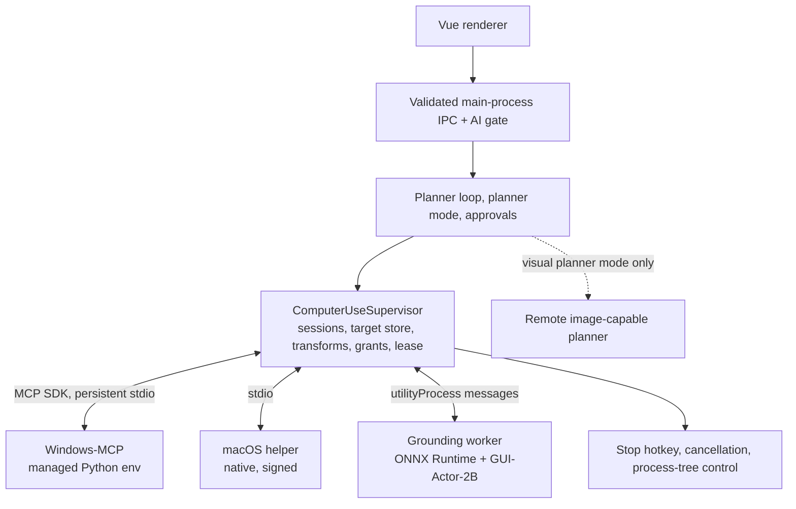

# Computer Use Plugin — Technical Design

## Document information

| Field | Value |
| --- | --- |
| Version | 1.1 |
| Status | Proposed architecture, revised after feasibility review. No implementation is claimed |
| Date | 2026-09-23 |
| Product requirements | [Computer Use Plugin PRD](computer-use-plugin-prd.md) |
| Source repositories | `aiFetchly`, proposed `aifetchly-computer-use`, `aifetchly-hub-go` |
| Adapters | Windows-MCP (Windows); macOS backend chosen by spike (pinned Ghost OS fork or in-house Swift helper) |
| Grounder | GUI-Actor-2B exported to ONNX, running on ONNX Runtime in an app-owned worker |
| Transport | Persistent MCP over stdio via the official MCP TypeScript SDK |
| Packaging | One plugin identity; target-specific adapters, runtime binding, and optional model resources |

All interfaces, services, commands, and data structures below are proposed unless labeled **existing**.

### Revision 1.1 summary

- Screenshots reach the planner only in opt-in visual planner mode (§12).
- ShowUI-2B is replaced by GUI-Actor-2B; GUI-Actor-3B is blocked by its base-model licence (§5.1).
- One inference runtime: ONNX Runtime with DirectML/CPU on Windows and CoreML/CPU on macOS; no PyTorch, CUDA toolkit, or MLX on customer machines (§5).
- The Python gateway is removed. The host `ComputerUseSupervisor` owns sessions, target store, transforms, grants, lease, and stop (§3, §4, §10).
- The macOS backend is chosen by a spike; Ghost OS's MLX sidecar is not used (§6.2).
- The host MCP client is rebuilt on the official SDK with persistent sessions as a Phase 0 deliverable (§4.1).
- Delivery is a thin vertical slice: Windows accessibility-first, then local vision, then macOS (§16).

## 1. Architecture decisions

1. **Host owns authority.** Sessions, the target store, coordinate transforms, action grants, the desktop lease, stop, and audit live in the AiFetchly main process. No plugin or adapter process can authorize input.
2. **Thin adapters, no gateway.** Adapters are the upstream backend processes themselves (Windows-MCP, the Mac helper) behind a host-side allowlist wrapper. No intermediate Python gateway.
3. **One inference runtime.** The grounder runs on ONNX Runtime on every OS, in an app-owned worker under `src/childprocess/computer-use/`. The model is exported once in CI and tested for parity against the PyTorch reference.
4. **GUI-Actor-2B is the default grounder.** Its licence chain (Qwen2-VL-2B Apache-2.0 → MIT) permits commercial distribution. The grounder is replaceable behind a stable internal contract.
5. **Accessibility first.** The grounder resolves only targets accessibility cannot identify reliably.
6. **Two planner modes.** Local-only (default) sends structured text; visual planner mode (opt-in) additionally sends target-window screenshots as transient image inputs.
7. **One authoritative task loop.** No `run_computer_task(prompt)` that hides planning, approval, and retries in another agent.
8. **Installation provisions; sessions only start.** No package resolution or model download during session startup.
9. **Whole-tree supervision.** Stop and lease revocation never wait for model inference.
10. **Read-only diagnostics first.** Coordinate mapping, locate-only overlays, and offline replay exist before autonomous input on vision targets.
11. **Independent repository for non-authority code.** Contracts, adapter packaging, the Mac helper, the ONNX export pipeline, fixtures, and evaluation tools live in `aifetchly-computer-use`.

## 2. Verified code anchors and gaps

Paths were inspected on 2026-09-23. Findings are scoped to these paths, not a full audit.

### 2.1 Desktop (`aiFetchly`)

| Anchor | Existing behavior | Required work |
| --- | --- | --- |
| `package.json` | No `@modelcontextprotocol/sdk` dependency; MCP protocol is hand-rolled | Add the official SDK (verify its `zod` peer range against the project's `zod ^3.24`) |
| `src/modules/MCPClient.ts`, `connectStdio()` | Spawns with piped stdio, sanitized env allow/deny lists, plugin cwd | Keep the env sanitization and trust checks; move them into a custom SDK `Transport` (§4.1) |
| Same, stdout handler (~line 259) | `buffer += data.toString()` decodes each chunk separately | Multi-byte UTF-8 (CJK) split across chunks is corrupted. Buffer bytes and decode complete lines |
| Same, initialize (~line 292) | Sends `initialize` with `2024-11-05`; no `notifications/initialized` | Full version negotiation and initialized notification (SDK `Client`) |
| Same, `handleMessage()` | Handles responses only; drops notifications and server requests | Notifications, progress, cancellation (SDK) |
| Same, `callTool()` | Returns the first text block, else the first `data` block | Preserve all content blocks, structured content, and `isError` semantics |
| Same, `disconnect()` | Direct child `kill()`, clears pending map without rejecting | Reject pending requests; graceful close; process-tree termination |
| Same, `connectSSE()` | Throws "not yet implemented" | Out of scope; Computer Use uses stdio |
| `src/service/MCPToolService.ts`, `executeMCPTool()` | Connects and disconnects a client per invocation | Persistent session pool (§4.2) |
| Same, `assertStdioTrusted()` | Trust check before spawning a local process | Keep; process trust is separate from action authorization |
| `src/service/ToolExecutor.ts` | Resolves plugin MCP tool names | Route Computer Use tools to the supervisor; never expose raw adapter tools to the model |
| `src/service/ManagedBrowserAiToolService.ts` | AI gate, handoff/risk patterns; screenshots return metadata only | Reuse the patterns |
| `src/entityTypes/aiImageAttachmentToolTypes.ts` | Transient `ImageModelArtifact` / `ModelArtifact` | Carrier for visual planner images (§12) |
| `src/service/ManagedBrowserLeaseService.ts` | In-process account lease | Pattern for the desktop lease |
| `src/service/AIChatToolApprovalPolicyService.ts` | Denials, dependency approval, request-scoped actions | Add explicit computer-action classes |
| `src/childprocess/embedding/LocalEmbeddingWorker.ts` | App-owned worker running ONNX models via `@xenova/transformers`, loaded at runtime from a downloaded runtime | Precedent for an app-owned ONNX Runtime worker and runtime-loaded native bindings |
| `src/modules/LocalAiRuntimeModule.ts`, `src/entityTypes/localAiRuntimeTypes.ts` | First-party downloadable runtimes (`embedding-xenova`, `voice-sherpa`): per-platform/arch catalog, SHA-256, Electron ABI fields, atomic `active.json`, operation leases | Candidate delivery path for the ONNX Runtime binding and model (open decision §17) |
| `src/utils/packagedWorkerPath.ts` | `buildPackagedWorkerEnv`, `resolvePackagedWorkerPath` | Required for the grounding worker spawn |
| Desktop `src/` | No uv or Python install-plan consumer | Needed only for the Windows-MCP environment (§8) |

The generic plugin package limit in `pluginTypes.ts` (50 MiB compressed / 250 MiB extracted) and the Hub canonical packager limits both rule out model weights in code packages. Models are separate resources.

### 2.2 Hub (`aifetchly-hub-go`)

| Anchor | Existing behavior | Required work (phase) |
| --- | --- | --- |
| `internal/httpapi/routes/install_plan.go` | Target-aware plan, uv provision records, uv toolchain selection | Preserve (Phase 1) |
| Same, `BuildManagedPlan()` | Models/environments appended from version-only queries | Filter by target, execution provider, and features (Phase 3, when two targets exist) |
| `queries/plugin_version_targets.sql` | `ListPlanModelRevisions` / `ListPlanEnvironments` filter by version | Add target applicability (Phase 3) |
| `internal/managed/target.go` | Iterates every requirement when resolving a target | Conditional requirements so Windows-only and Mac-only resources do not block each other (Phase 3) |
| `internal/resources/plan.go` | Plugin/runtime/environment/model/toolchain types | Native-component resource type for the Mac helper (Phase 3) |
| `internal/artifacts/plugin_package.go` | One code archive, fixed file mode `0644` | Native executables stay outside the code ZIP; a safe native extractor restores validated executable bits (Phase 3) |
| uv-runtime design | `uv pip install --require-hashes` from a Hub JSON lock | Applies to the Windows-MCP environment only |

### 2.3 Document reconciliation

The older managed-installation PRD disallows public package installation at runtime. The Hub uv design adds hash-pinned provisioning during installation. This feature uses the uv provisioner only during installation, only for the Windows-MCP environment, and only from a validated plan; session startup never installs packages. Developer `uv.lock` workflows and the Hub JSON lock are different formats; release tooling generates and verifies the Hub lock.

## 3. Repository and responsibility boundaries

### 3.1 Independent repository

```text
aifetchly-computer-use/
├── plugin/                        # Manifest, skills, tool descriptions
├── contracts/                     # Versioned JSON Schemas + fixtures shared with the host
│   ├── tools/
│   ├── traces/
│   └── fixtures/transforms/       # Golden geometry cases consumed by host tests
├── adapters/
│   ├── windows/                   # Windows-MCP pin, tool allowlist, launch profile, lock generation
│   └── macos/                     # Swift helper source or pinned Ghost OS patch set (spike outcome)
├── grounding/
│   ├── reference/                 # PyTorch reference runner (CI and developer machines only)
│   ├── export/                    # PyTorch → ONNX export, quantization, manifest generation
│   └── parity/                    # Stage-by-stage golden tensors and tolerance checks
├── eval/                          # Benchmark datasets metadata, evaluate/replay CLI
├── packaging/
│   ├── windows/
│   └── macos/
├── tests/
└── THIRD_PARTY_NOTICES            # Code and model licences, including base-model chains
```

PyTorch and Python are used here only in CI and on developer machines to export and verify models. Customer machines receive ONNX files. Do not commit weights, Python distributions, virtualenvs, caches, credentials, or customer traces.

The host and this repository share **schemas and fixtures, not code**. Host TypeScript types are generated from or validated against the JSON Schemas, and host transform tests consume `contracts/fixtures/transforms`.

### 3.2 Host responsibility

- Plugin Manager integration, Computer Use settings, session control strip, translations.
- AI enable gate, planner and provider routing, planner mode enforcement.
- `ComputerUseSupervisor`: session state machine, target store, coordinate transforms, grants, desktop lease, stop and stop hotkey, adapter and worker supervision.
- Grounding worker (ONNX Runtime) and its preprocessing/postprocessing.
- Managed resource resolution from trusted plans.
- Result normalization, transient image delivery in visual planner mode, audit persistence through Modules/Models.
- Cleanup on plugin disable/uninstall and app quit.

IPC handlers validate, check the AI gate, authorize, and dispatch. Workers and adapter processes never access the database. The grounding worker entrypoint lives in `src/childprocess/computer-use/` and is registered in the build configuration.

### 3.3 Hub responsibility

Resolve target and features into an immutable resource closure; distribute verified resources, compatibility, and revocation. The Hub does not execute input, proxy screenshots, infer OS permissions, or certify local GPU health.

## 4. Runtime topology



- Windows-MCP runs in the interactive Windows user session as a child of AiFetchly. It is not an elevated service or login task. WSL-hosted code is never a Windows desktop executor.
- The macOS helper is a native subprocess. macOS normally attributes a spawned helper's Accessibility and Screen Recording use to the responsible app (AiFetchly.app); verify this in the packaged build (§6.2).
- The grounding worker is an Electron `utilityProcess` spawned with `buildPackagedWorkerEnv`. It loads the ONNX Runtime Node binding and the model from resolved managed resources and has no network or database access.
- Screenshot bytes flow from the adapter to the supervisor to the worker. They reach the planner only in visual planner mode.

### 4.1 MCP client on the official SDK

- Use `@modelcontextprotocol/sdk` `Client` for protocol handling: initialize, version negotiation, `notifications/initialized`, capabilities, notifications, progress, cancellation, and complete content blocks.
- Implement a custom SDK `Transport` over the host's own spawn, rather than the SDK's stock stdio transport, so these stay in host code: `assertStdioTrusted`, env allow/deny lists, cwd, shell-free argv, bounded message size, and process-tree ownership (Windows Job Object; POSIX process group).
- Decode stdout from buffered bytes on newline boundaries (fixes the existing UTF-8 split bug). Keep stdout exclusively for protocol messages; stderr is bounded and redacted.
- Pin supported protocol versions; disconnect on an unsupported negotiated version.
- Separate deadlines for spawn, initialize, model warm-up, and each tool call.
- On exit or cancellation, reject all pending requests and clear timers.
- Normalize results to a typed union of text, image, and structured content without `any`. Image content from adapters is routed to the supervisor, never into persisted tool JSON.

This is a Phase 0 deliverable. It ships independently and benefits every MCP plugin.

### 4.2 Persistent session pool

- Key sessions by server identity + resolved launch configuration hash + trust generation.
- Reuse a live session for repeated calls; close after a configurable idle timeout.
- Never reuse a session whose grants, paths, version, or owner changed.
- Computer Use sessions are pinned for their lifetime and closed by the supervisor on stop.
- Drain and close stdin for graceful shutdown, then terminate the owned process tree after bounded deadlines.

Tool discovery alone is not readiness. Computer Use readiness also requires OS permissions, a supported target, and (when local vision is selected) a healthy grounding worker.

## 5. Local grounding: GUI-Actor on ONNX Runtime

### 5.1 Model selection

| Model | Base and licence chain | Parameters | Weights (published) | Status |
| --- | --- | --- | --- | --- |
| GUI-Actor-2B-Qwen2-VL | Qwen2-VL-2B-Instruct (Apache-2.0) → MIT | ~2B, 28 decoder layers, hidden 1536 | bf16 safetensors ≈ 4.45 GB | **Default** |
| GUI-Actor-3B-Qwen2.5-VL | Qwen2.5-VL-3B-Instruct (Qwen Research License, non-commercial) → MIT | ~3B | — | **Blocked** pending commercial licence |
| GUI-Actor-7B-Qwen2.5-VL | Qwen2.5-VL-7B-Instruct (Apache-2.0) → MIT | ~7B | — | Future high-memory tier |
| GUI-Actor-Verifier-2B | UI-TARS-2B-SFT → MIT | ~2B | — | Future; licence chain to confirm |

Release tooling records the licence of every weight file and its base model, and fails publication on a non-commercial licence.

### 5.2 Inference path

GUI-Actor adds an attention-based pointer head to Qwen2-VL. The reference implementation's placeholder mode (`inference(..., use_placeholder=True)`) needs **one forward pass and no token-by-token generation**:

1. Build the chat prompt with the system grounding message, the image, and the instruction, then append the assistant starter `<|im_start|>assistant<|recipient|>os\npyautogui.click(<|pointer_start|><|pointer_pad|><|pointer_end|>)`.
2. Run the vision encoder on the image patches.
3. Run the decoder over the full prompt (prefill only, no KV cache output).
4. Take the input-embedding-layer hidden states at `<|image_pad|>` positions and the final-layer hidden state at `<|pointer_pad|>` (`pointer_pad_token_id` 151661 in the 2B config).
5. Run the pointer head to get attention scores over the merged patch grid (`image_grid_thw / merge_size`).
6. Postprocess: keep patches above 0.3 × max activation, group 4-connected regions, rank regions by mean activation, and return activation-weighted centers normalized to `[0,1]` in model-input image space.

Steps 1 and 6 run in TypeScript in the worker. Steps 2–5 are ONNX graphs.

### 5.3 Export pipeline (CI, in the plugin repository)

- Export three graphs, or fewer if fusion is verified: `vision_encoder.onnx`, `decoder_prefill.onnx` (returns the two hidden-state tensors needed, not logits), and `pointer_head.onnx`.
- Pin the opset and exporter versions. Record them in the model manifest.
- Produce configurations as separate, independently benchmarked resources: fp16 baseline; int8 or int4 weight-only decoder (for example `MatMulNBits`) with fp16 vision encoder. Verify each operator is supported by each target execution provider before publishing.
- Ship `tokenizer.json`, special-token map, chat template, and `preprocessor_config.json` alongside the graphs.
- Manifest identity includes model revision, export pipeline version, opset, quantization, preprocessing configuration, and per-file hashes.

**Parity tests** (hard gate for every configuration): for each fixture, compare the ONNX pipeline against the PyTorch reference at every stage — `pixel_values`, `image_grid_thw`, position ids, image-token embeddings, pointer hidden state, attention scores, ranked regions, and final points — with recorded tolerances. The final check is region-hit agreement on the labeled fixture set.

### 5.4 Preprocessing in TypeScript

Port `Qwen2VLImageProcessor` exactly, using values from the pinned `preprocessor_config.json` (GUI-Actor-2B: `patch_size` 14, `merge_size` 2, `temporal_patch_size` 2, `min_pixels` 3136, `max_pixels` 5720064, CLIP mean/std, bicubic resample):

- `smart_resize`: round each dimension to a multiple of 28 (`patch_size × merge_size`) within the pixel budget. Each axis is rounded independently, so the resize is slightly **anisotropic**; the transform stores separate `sx` and `sy` (§11).
- Rescale, normalize, duplicate the frame to `temporal_patch_size`, patchify, and order patches to match the 2×2 merge layout.
- Tokenize with the pinned tokenizer and apply the chat template byte-for-byte.
- Compute Qwen2-VL multimodal rotary position ids (`get_rope_index`). Prefer embedding this computation in the decoder graph to avoid drift; if computed in TypeScript, cover it with golden tests.

**Pixel budget is the main latency lever.** At the default `max_pixels` (~5.7 MP), a full-screen 4K capture becomes about 7,200 merged visual tokens of decoder prefill. Crop to the target window first. The benchmark evaluates smaller budgets (for example 1–2 MP plus crop-and-re-ground) against accuracy. The chosen budget is part of the model configuration identity.

Static-shape buckets (a few fixed grids with recorded padding) are an optimization candidate for CoreML and DirectML. Dynamic shapes are the baseline until measurements justify buckets; any padding is recorded in the transform.

### 5.5 Execution providers

| Target | Primary | Fallback | Notes |
| --- | --- | --- | --- |
| Windows 10/11 x64 with a DirectX 12 GPU | DirectML EP | CPU EP | Covers NVIDIA, AMD, and Intel GPUs. DirectML is in sustained engineering (maintained, no new features). Requires sequential execution and memory-pattern optimization disabled. bf16 weights are converted to fp16 or quantized |
| Windows CPU only | CPU EP | — | Local vision enabled only if measured latency meets the budget |
| Windows 11 24H2+ | Windows ML vendor EPs (TensorRT for RTX, OpenVINO, MIGraphX) | DirectML / CPU | Phase 5 evaluation; not in the Node binding path today |
| macOS Apple Silicon | CoreML EP | CPU EP | Measure per-operator offload; partial offload is common for dynamic-shape VLMs |

- The worker probes available providers at load time, initializes the best one, and falls back to CPU on initialization failure. The chosen provider is recorded in every observation's grounding metadata.
- The provider never changes during a session. A provider failure mid-session fails the grounding call with `backend_unavailable` and requires a worker restart.
- CUDA EP is not shipped initially (binary size and driver coupling); it may be evaluated later.

### 5.6 Grounding worker

`src/childprocess/computer-use/GroundingWorker.ts`, spawned by the supervisor via `utilityProcess.fork` with `buildPackagedWorkerEnv` and `resolvePackagedWorkerPath`.

| Message | Direction | Semantics |
| --- | --- | --- |
| `load` | host → worker | Resolved model/runtime paths, configuration identity, preferred providers. Replies with provider, load time, memory estimate |
| `ground` | host → worker | Request ID, session generation, image reference, target description, optional crop. One in flight; queue depth 1 |
| `cancel` | host → worker | Discard the result for a request ID; terminate the run if the binding supports it |
| `unload` | host → worker | Release sessions and memory |
| `result` / `error` | worker → host | Ranked regions, attention grid dimensions, timings, provider; or a typed error |

- Image bytes are transferred as `ArrayBuffer` over the worker message port or via a private temp file. They are never logged.
- The host discards any result whose session generation is stale. On Stop, if a run cannot be terminated promptly, the supervisor kills the worker; model reload is the cost of a guaranteed stop.
- Weights load lazily on first vision need or during an explicit warm-up with visible progress, stay warm during the session, and unload on idle or memory pressure.
- The ONNX Runtime Node binding is a native module matched to the Electron ABI. It is delivered as a managed resource with the same ABI and target fields as the existing local runtime packages and loaded at runtime (the `LocalTransformersLoader` pattern), not bundled into the base installer.

### 5.7 Candidates, ambiguity, and absence

GUI-Actor always produces an attention peak; it has no native "not present" output.

- **Ambiguous:** the second-ranked region's score is at least a calibrated ratio of the top score and its center is outside the top region → `target_ambiguous`.
- **Likely absent:** the top region's mean activation is below a threshold calibrated on absent-target fixtures → `target_not_found`.
- **Cross-check:** when accessibility data exists for the region, a contradiction (for example a disabled element or a different role) downgrades to ambiguous.
- In visual planner mode, the planner can confirm a proposed target before a consequential action.
- Activation scores are metadata for ranking and diagnostics. They are never probabilities and never authorization.

### 5.8 Precision

GUI-Actor grounds at merged-patch granularity (28 × 28 px in model-input space), refined by activation weighting. For small targets, or when the top region is large relative to the expected control, crop the original capture around the candidate and re-ground at a higher effective resolution. Crops map back through the same transform path.

## 6. Platform adapters

### 6.1 Windows: Windows-MCP

- Pin a Windows-MCP revision (MIT, actively maintained). The observed docs require Python 3.13+; it is the only Python component in the system.
- The host wrapper enforces an allowlist on both `tools/list` and `tools/call`: screenshot/state, display inventory, app/window focus, click, type, scroll, move/drag, and keys. Upstream allowlist settings are also configured. PowerShell, registry, filesystem, and process tools are unreachable.
- Adapter tools are never registered as model-visible tools. Only the supervisor calls them, after grant validation.
- Normalize the UI Automation tree and capture bounds into the observation contract.
- Elevated target windows are rejected with `unsupported_target` (UIPI blocks injection from a non-elevated process).
- Disable upstream telemetry and verify the setting in the pinned version.
- Test Unicode/CJK input and non-English application names for all six locales.

### 6.2 macOS: backend decided by spike

| Option | Description | Considerations |
| --- | --- | --- |
| A — pinned Ghost OS fork | MIT, macOS 14+, Swift 6.2. Created February 2026; last upstream push March 2026 | Accessibility tools and input exist today. We would build, sign, and notarize it ourselves, disable its MLX vision sidecar and learning features, and own maintenance of the fork |
| B — in-house Swift helper | Accessibility API tree (`AXUIElement`), `CGEvent` input, ScreenCaptureKit capture, NSWorkspace app/window listing, exposing the same tool subset over stdio MCP | Full ownership and a smaller surface; more initial work |

Spike criteria (time-boxed, Phase 0): accessibility coverage on the target workflows' Mac apps, CJK input, capture geometry correctness, binary size, signing/notarization effort, and estimated maintenance cost. The decision is recorded before Phase 3.

Either way:

- The shared ONNX grounder is used; no Mac-specific model format or sidecar.
- Qualify permission attribution in the packaged app. A helper spawned by AiFetchly is normally attributed to AiFetchly.app as the responsible process, so prompts name AiFetchly, the app's signing identity must stay stable across updates, and development builds attribute to the terminal or IDE.
- Accessibility and Screen Recording are required; Input Monitoring only for later recording/learning features.

## 7. Packaging and Hub changes

### 7.1 Resource model

| Resource | Identity includes | Download policy |
| --- | --- | --- |
| Common code | Plugin version + hash | When changed |
| Windows-MCP environment | Python runtime identity + full dependency lock hash + target | Windows only |
| uv toolchain + Python runtime | Version + OS + architecture + hash | Windows only, shared when compatible |
| macOS helper | Helper revision + architecture + hash + signing identity | macOS only |
| ONNX Runtime Node binding | ORT version + execution providers + OS + architecture + Electron ABI + hash | When local vision is selected |
| Grounder model | Model revision + export pipeline version + opset + quantization + pixel budget + preprocessing identity + file manifest hash | When local vision is selected; independent of code updates |

The model is one ONNX format for all targets; configurations differ only by quantization and budget. Execution provider support is a property of the runtime binding resource.

### 7.2 Selection

1. The host detects platform, architecture, available execution providers, and selected features (local vision on/off).
2. The Hub (or the local runtime catalog, per §17) resolves the applicable closure.
3. The desktop validates every resource against the selection before downloading and rejects contradictions.
4. The plan digest includes target, features, execution provider set, and the resolved resource set.

### 7.3 Hub extensions by phase

- **Phase 1 (Windows only):** Mac is marked unsupported for the listing; existing uv provisioning covers the Windows-MCP environment.
- **Phase 2:** grounder model and runtime binding resources, unless delivered through the local runtime catalog.
- **Phase 3 (two targets):** conditional requirement applicability; target-aware `ListPlanEnvironments` / `ListPlanModelRevisions`; identical selection in compatibility, install plan, prepare-install, tickets, and revocation; a reviewed native-component resource type for the Mac helper; safe extraction of executables. Old clients fail closed on unknown required resource kinds.

Tests assert the absence of the other platform's resources, not only the presence of the right ones.

## 8. Managed Python for Windows-MCP

Python is needed only on Windows, only for Windows-MCP.

- The desktop downloads the pinned standalone uv archive from the trusted plan, verifies its hash, extracts it into an app-managed directory, and launches it by absolute path. No installer scripts, no PATH changes, and any existing user uv is ignored unless an explicit developer override is set.
- Provisioning (argv built from validated fields, `shell: false`): install the exact Python, create the environment, then `uv pip install --require-hashes --only-binary :all:` from the generated Hub lock. No source builds on customer machines; missing wheels mean unsupported.
- Launch the environment's `python.exe -u` with a validated entrypoint. Session startup never resolves packages.
- Record exact uv, Python, and package versions in the installation record. Prepare updates in a new versioned directory and activate via a host-owned pointer; roll back on failed health checks.

**Alternative evaluated in Phase 0:** ship Windows-MCP as a prebuilt bundle (embeddable Python + prebuilt wheels) as a single verified artifact. This avoids install-time resolution and the uv consumer entirely, at the cost of a larger download and bundling work per Windows-MCP update. Decision recorded in §17.

## 9. Public tool contract

Versioned JSON Schemas are shared by the host (Zod validation) and plugin contract tests. Generated types never use `any`. Application functions have explicit return types; caught values are `unknown`.

### 9.1 Tools

| Tool | Inputs | Result / semantics |
| --- | --- | --- |
| `computer_capabilities` | None or target query | Backend and protocol versions, supported actions, permissions, grounder state and provider, planner mode, display support |
| `computer_start_session` | User-selected target reference, purpose | Session ID and scoped capabilities; the host takes the lease first |
| `computer_observe` | Session ID, region/mode | Observation ID and structured state. In visual planner mode the host attaches a transient image artifact |
| `computer_find` | Session ID, observation ID, target description | Opaque target handle, or `target_not_found` / `target_ambiguous`, with grounding source |
| `computer_act` | Session ID, target handle, typed action, action ID | Dispatched / failed / uncertain, with a post-observation reference |
| `computer_verify` | Session ID, expected state, observation ID | Satisfied / unsatisfied / unknown with evidence |
| `computer_request_handoff` | Session ID, reason | Revokes automatic input until trusted resume |
| `computer_resume_after_handoff` | Session ID | Host-approved resume with a fresh observation |
| `computer_stop_session` | Session ID | Idempotent cancellation and release |

The model-facing act schema accepts target handles, not raw desktop coordinates. Raw coordinates exist only inside the supervisor and a guarded developer calibration path. Keyboard actions without a visual target still require a current session, target window focus, and authorization.

### 9.2 Core records

```typescript
type GroundingSource = 'accessibility' | 'vision';
type PlannerMode = 'local_only' | 'visual_planner';
type VerificationState = 'satisfied' | 'unsatisfied' | 'unknown';
type ExecutorUnits = 'desktop_physical_pixels' | 'desktop_logical_points';
type ExecutionProviderId = 'dml' | 'coreml' | 'cpu';

interface Point2D {
  readonly x: number;
  readonly y: number;
}

interface GroundingMetadata {
  readonly modelConfigurationId: string;
  readonly executionProvider: ExecutionProviderId;
  readonly onnxRuntimeVersion: string;
  readonly patchGridWidth: number;
  readonly patchGridHeight: number;
  readonly inferenceMs: number;
}

interface ObservationMetadata {
  readonly id: string;
  readonly sessionId: string;
  readonly sessionGeneration: number;
  readonly capturedAt: string;
  readonly targetWindowId: string;
  readonly displayConfigurationVersion: string;
  readonly executorUnits: ExecutorUnits;
  readonly captureWidthPx: number;
  readonly captureHeightPx: number;
  readonly plannerMode: PlannerMode;
  readonly plannerImageAttached: boolean;
  readonly imageSha256: string;
}

interface ResolvedTarget {
  readonly handle: string;
  readonly observationId: string;
  readonly source: GroundingSource;
  readonly expiresAt: string;
  readonly evidenceSummary: string;
}

interface ActionOutcome {
  readonly actionId: string;
  readonly state: 'not_dispatched' | 'dispatched' | 'failed' | 'uncertain';
  readonly verification: VerificationState;
  readonly postObservationId?: string;
  readonly errorCode?: string;
}
```

Coordinates, native identifiers, transforms, grounding metadata, generation, and expiry live in the supervisor's bounded target store. Grants and raw image bytes are never model-supplied fields or part of ordinary tool results.

### 9.3 Errors

Stable codes: `ai_disabled`, `permission_required`, `desktop_busy`, `unsupported_target`, `unsupported_display_configuration`, `runtime_not_ready`, `model_not_ready`, `target_not_found`, `target_ambiguous`, `invalid_grounding_output`, `stale_observation`, `focus_changed`, `action_not_authorized`, `action_cancelled`, `execution_uncertain`, `verification_failed`, `backend_unavailable`, `resource_limit`, `protocol_mismatch`, `planner_mode_unavailable`.

Each error has a safe message, stage, retry classification, and correlation ID. No tracebacks, secrets, image bytes, absolute paths, or argv in renderer results.

## 10. Sessions, authority, and cancellation

### 10.1 State machine

```text
STARTING → READY → OBSERVING → GROUNDING → AWAITING_AUTHORIZATION
                    ↑                         ↓
                    └──── VERIFYING ← EXECUTING

Active states → PAUSED / HANDOFF → fresh observation → READY
Any state → STOPPING → STOPPED
Backend failure → FAILED (no automatic input replay)
```

The state machine lives only in the supervisor. Adapters are stateless with respect to authority.

### 10.2 Ownership and generation

- Acquire the desktop lease before starting adapters. Rely on the app's single-instance lock, or an OS-level same-user lease if multiple app processes can run. The lease covers the whole interactive desktop.
- The session generation increments on stop, revoke, adapter or worker restart, handoff, planner mode change, and invalidating desktop changes. Every target, action, and late worker result is checked against it.
- Input dispatch is serialized; one action per observation cycle initially.

### 10.3 Trusted action grants

The host computes authorization from the active user request, target scope, action class, and current state, and mints a short-lived grant bound to session generation, action ID, normalized action hash, and target/observation identity. The supervisor validates the grant immediately before calling the adapter's input tool. The model cannot provide or mint grants, and adapter tools are unreachable through generic MCP execution.

Trusted adapter code still runs with local OS privileges. Grants protect the normal tool path, not against a malicious native binary.

### 10.4 Stop behavior

- The Stop button and the global stop hotkey (Electron `globalShortcut`, registered only while a session is active) revoke the generation immediately and clear pending actions.
- Human mouse or keyboard activity detected by the adapter, or an unexpected foreground change, pauses automation.
- Late grounding results are discarded; the worker is killed if it cannot stop promptly.
- Tracked pressed keys and buttons are released on cleanup; drags and key holds have bounded durations.
- If cooperative stop fails, the supervisor terminates the whole adapter process tree (Job Object on Windows).
- Handoff pauses input but keeps ownership unless relinquished.
- A post-dispatch timeout or crash becomes `execution_uncertain` and requires observation before any retry. Action IDs deduplicate within known session history; exactly-once across crashes is not claimed.
- Actions whose resolved point lands on an AiFetchly window, including the control strip, are rejected.

Test stop during model load, inference, queued input, drag, adapter hang, disconnect, and app quit. Measure stop acknowledgment and last possible input separately.

## 11. Coordinate system

### 11.1 Spaces

1. Executor desktop units (physical pixels or logical points, per adapter).
2. Original capture pixels.
3. Crop pixels relative to the capture.
4. Model-input pixels after `smart_resize` (and any bucket padding).
5. Normalized model output in `[0,1]` over the model-input image.

### 11.2 Transform composition

Let normalized output be `(nx, ny)`, model-input size `(Wm, Hm)`, crop origin `(cx, cy)`, per-axis scale `(sx, sy)` from crop pixels to model pixels, and padding `(px, py)` in model pixels.

```text
x_model = nx × Wm
y_model = ny × Hm

x_capture = cx + (x_model - px) / sx
y_capture = cy + (y_model - py) / sy

[x_executor, y_executor, 1]ᵀ = T_capture_to_executor × [x_capture, y_capture, 1]ᵀ
```

`smart_resize` rounds each axis to a multiple of 28 independently, so `sx ≠ sy` in general. Never assume a single scale factor. Store transforms in full precision and round only at the executor boundary. Points outside the unpadded image or crop are invalid; never clamp a bad prediction onto another control.

Example: a 1920×1080 window capture with a 2,000,000-pixel budget resizes to 1876×1036 (multiples of 28), so `sx = 1876/1920 ≈ 0.9771` and `sy = 1036/1080 ≈ 0.9593`. An output of `(0.5, 0.5)` maps to model pixel `(938, 518)` and capture pixel `(960, 540)`. Clicking model pixels as desktop pixels would miss by about 22 px here and by far more at larger downscales. With the default budget, the same capture is slightly *upscaled* to 1932×1092, which is why the transform must never assume a downscale.

For a 2× Retina capture of a 1920×1080-point window, capture pixel `(1920, 1080)` maps to `(960, 540)` points before adding the window origin. Obtain real geometry from the adapter; do not assume a global multiplier.

### 11.3 Platform requirements

- The Windows adapter's DPI-awareness behavior is established and tested; never mix DPI-virtualized bounds with physical pixels.
- Use adapter display inventory and capture metadata, not renderer CSS dimensions.
- The Mac adapter translates capture pixels, window bounds, and input points explicitly, including origin conventions.
- Initial capture is one qualified display; spanning and mixed-DPI windows are rejected.
- Record all preprocessing, including the pixel budget and processor revision; debug mode saves the exact model input.

### 11.4 Staleness

Bind observations to monotonic capture time, target identity, foreground window, bounds, display configuration, and session generation. Before dispatch, verify focus, geometry, age, and relevant UI state through accessibility revalidation or a bounded fresh target-region check. If validation is impossible, re-observe. Verify outcomes afterward; no strategy removes every last-millisecond race.

## 12. Planner modes and image routing

### 12.1 Local-only (default)

Capture → supervisor → grounding worker → target handle → safe metadata. The planner receives structured observation text, grounding results, and action outcomes. Screenshots stay local, but task content and UI text still go to the planner; product messaging states this.

### 12.2 Visual planner (opt-in)

- Enabled by a user setting with consent text naming the configured provider and model (PRD CU-PLAN-01/02). The setting is stored through the existing settings path and validated with Zod at load.
- Available only when the planner model supports image input; otherwise `planner_mode_unavailable`.
- `computer_observe` attaches a target-window image as an `ImageModelArtifact`, delivered as a provider-native image input. Base64 inside text JSON is not an image input.
- Images are downscaled to a configured maximum and cropped to the target window.
- Suppressed during handoff and sensitive states (password fields, login and verification screens detected by accessibility role or handoff reason).
- Never persisted in tool JSON, chat history, logs, or hook payloads. `plannerImageAttached` is recorded per observation.
- Turning the mode off increments the session generation and takes effect from the next observation.
- The local grounder is still used for precise coordinates; the planner never supplies raw coordinates.

### 12.3 Previews and storage

Local previews use a separate, bounded, permissioned channel, and do not reuse the model-only artifact type in a way that breaks its "never emitted to renderer" invariant. Debug export is another explicit channel.

The host records session and action summaries through Models/Modules. The target store is in memory. Debug bundles use an approved local path with bounded retention. Logs never contain image bytes, credentials, or complete typed values. Screenshots can contain secrets even when text is redacted, so export requires a review step.

## 13. Debugging

### 13.1 Modes

| Mode | Behavior | Enforcement |
| --- | --- | --- |
| Locate only | Capture, find, overlay; no input | The supervisor refuses dispatch in this mode, not just the UI |
| Step through | Pause before input and show the proposed target | Revalidate after the delay; changed state forces re-observation |
| Offline replay | Load saved evidence and rerun preprocessing, grounding, and transforms | No adapter is started |
| Live guarded run | Normal execution with optional trace capture | Same grants, freshness, lease, and stop rules |

Offline replay reuses the same grounding worker and TypeScript transform code as live runs. The plugin repository's `eval` CLI can also replay bundles against the PyTorch reference to separate export errors from model errors.

### 13.2 Trace bundle

```text
trace-<id>/
├── manifest.json                 # Schema, versions, target, planner mode, consent
├── events.jsonl                  # Stage transitions, timings, safe errors
├── steps/<step-id>/
│   ├── observation.json          # Geometry, transforms, planner image flag
│   ├── original.png              # Opt-in original capture
│   ├── model-input.png           # Exact resized/cropped model input
│   ├── attention.json            # Patch-grid activations and ranked regions
│   ├── grounding.json            # Description, model configuration, provider, timings, parse result
│   ├── action.json               # Intended input, transformed target, outcome
│   ├── after.png                 # Opt-in post-action capture
│   └── verification.json         # Expected state and evidence
└── annotations.json              # Human labels, clickable regions, absent flags
```

Also record ONNX Runtime version, execution provider, model manifest hash, Python/Windows-MCP identity, OS/display/DPI metadata, dispatch timestamp, and foreground window. Typed content is redacted by default.

### 13.3 Viewer

Shows original capture, model input, and after-state side by side, with overlays for the attention heatmap, candidate regions with scores, predicted point, mapped point, crop rectangle, known target bounds, and a coordinate grid. Actions: inspect a stage, rerun grounding offline, compare configurations (for example two pixel budgets or quantizations), annotate the expected region, mark target absent, export a reviewed bundle, and promote a sanitized example to a fixture. Replay never executes a recorded click.

### 13.4 Failure classification

| Evidence | Classification | Next investigation |
| --- | --- | --- |
| Attention peaks on the wrong element in the model input | Grounding | Description, pixel budget, crop, model configuration |
| ONNX and PyTorch reference disagree on the same input | Export | Parity stage where divergence starts, quantization, provider |
| Model-input prediction right, capture overlay wrong | Transform | Crop, padding, per-axis scale |
| Both overlays right, click lands elsewhere | Executor mapping | DPI virtualization, units, origin |
| Correct coordinates, another window receives input | Focus/scope | Foreground ownership, staleness |
| Correct old target, layout moved | Staleness | Observation-to-dispatch gap |
| Input lands correctly, desired state absent | Interaction/verification | Disabled element, action type, timing |

## 14. Tests and evaluation

### 14.1 Plugin repository

- ONNX parity per configuration and execution provider at every stage (§5.3).
- Transform fixtures: exact geometry, inverse round trips, anisotropic resize, crops, padding, negative origins, mixed-scale rejection.
- Contract tests for both adapters: field meanings, units, errors, absent capabilities, allowlists.
- Licence-chain check for every published model.

### 14.2 Host

- MCP SDK transport: initialize and initialized notification, version mismatch, chunked multi-byte UTF-8, mixed content results, progress, exit, timeout, cancellation, output limits, process-tree cleanup, session pool reuse and invalidation. Under `test/vitest/main/`.
- Grounding worker: preprocessing golden tensors, postprocessing regions, ambiguity and absence thresholds, stale-generation discard, kill-on-stop, provider fallback.
- Supervisor: competing owners, revoked generations, stale handles, duplicate action IDs, crashes before/after dispatch, no replay of uncertain input, rejection of targets on AiFetchly windows.
- Planner modes: no image bytes in planner requests, logs, persisted tool JSON, or hook payloads in local-only mode; suppression during sensitive states; mode toggle mid-session.
- Debug: locate-only and replay never dispatch; redaction, retention, reviewed export.
- UI: component tests for settings, consent, control strip, and failure states in `test/vitest/main/components/` (`yarn test:components`); Playwright E2E for start → observe → act → stop and the hotkey path in `test/e2e/specs/`. All six locale files updated.

### 14.3 Native desktop

Controlled test applications in a headed interactive session. Cover window movement, display changes, 100/125/150/200% Windows scaling, Retina points, target closure, occlusion, lock/sleep/resume, CJK input, scroll/drag, elevated windows, and permission denial/revocation. One display first; multi-display is a separate gate.

### 14.4 Hub

Conditional resolution and absence of wrong-platform resources, feature selection in digests/caches/tickets, revocation, incompatible app versions, and resource integrity. Clean-machine tests start without uv or Python and verify no global mutations.

### 14.5 Benchmark

Labeled clickable regions (any point inside counts), absent targets, distractors, repeated labels, icons, custom controls, small targets, Chinese/English UI, themes, and layout changes, drawn from the target workflows. Held-out evaluation is separate from regression fixtures.

Compare on identical tasks:

- accessibility-only, grounder-only, and combined target resolution;
- local-only vs. visual planner mode;
- pixel budgets and quantization configurations per execution provider;
- GUI-Actor-2B vs. ShowUI-2B vs. an end-to-end computer-use model baseline.

Report sample counts, revisions, hardware, resolution, region hits, wrong-action rate on absent targets, uncertainty, interventions, recovery, end-to-end completion, cold/warm stage latency, peak RAM/VRAM, and API cost.

Hard gates: no input from read-only modes; no click on parse error, absence, or ambiguity; no wrong-platform artifacts; no action after a revoked generation; no unapproved consequential action; no blind retry of uncertain input; no screenshot to the planner in local-only mode.

## 15. Change map

| Repository | Work |
| --- | --- |
| Desktop | MCP SDK client + custom transport + session pool; `ComputerUseSupervisor` and related services; grounding worker; planner mode routing; Windows-MCP provisioning; UI and translations |
| Plugin | Contracts and fixtures; Windows-MCP packaging and allowlist; Mac helper or Ghost OS fork; ONNX export, quantization, and parity pipeline; eval/replay CLI; notices |
| Hub | Phase 1: listing and Windows environment. Phase 3: conditional target resolution and native-component resources |

Proposed host files:

```text
src/modules/MCPClient.ts                               # Rebuilt on @modelcontextprotocol/sdk Client
src/modules/mcp/SupervisedStdioTransport.ts            # Custom SDK Transport over host spawn
src/service/MCPSessionPool.ts
src/entityTypes/computerUseTypes.ts
src/schemas/ipc/computerUse.ts
src/modules/ComputerUseModule.ts                       # Persistence of session/action summaries
src/service/computerUse/ComputerUseSupervisor.ts
src/service/computerUse/ComputerUseTargetStore.ts
src/service/computerUse/ComputerUseCoordinateTransforms.ts
src/service/computerUse/ComputerUseLeaseService.ts
src/service/computerUse/ComputerUseActionAuthorization.ts
src/service/computerUse/ComputerUseAdapterRegistry.ts  # Allowlisted adapter wrappers
src/service/computerUse/ComputerUseGroundingClient.ts  # Host side of the worker protocol
src/service/computerUse/ComputerUsePlannerImageService.ts
src/service/computerUse/ComputerUseTraceService.ts
src/main-process/communication/computer-use-ipc.ts
src/childprocess/computer-use/GroundingWorker.ts
src/childprocess/computer-use/GuiActorPreprocessor.ts
src/childprocess/computer-use/GuiActorPostprocessor.ts
src/childprocess/computer-use/OnnxRuntimeLoader.ts
src/views/components/computerUse/
```

Reuse existing managed-installation and local-runtime services where they apply; do not build a second private resource manager. Introduce entities only for data that must persist.

## 16. Release sequence

| Phase | Deliverables |
| --- | --- |
| 0 | MCP SDK client, transport, and session pool (independent PR); schemas and fixtures; target workflows confirmed; GUI-Actor-2B export + parity + provider latency/memory spike; Mac backend spike; Windows-MCP delivery decision; end-to-end baseline |
| 1 | Windows MVP: Windows-MCP provisioning, supervisor, lease, grants, Stop + hotkey, control strip, one display, opt-in visual planner, draft-only workflows, limited beta |
| 2 | Windows local vision: grounding worker (DirectML/CPU), crops, ambiguity/absence calibration, locate-only, offline replay, trace viewer |
| 3 | macOS: chosen backend, CoreML/CPU grounder, permissions, Hub conditional resolution |
| 4 | Update/repair, clean-machine matrix, published support matrix and SLOs, GA |
| 5 | Multi-display, Windows ML vendor providers, larger grounder tier or verifier, offline bundles |

If the Phase 0 export spike fails, Phase 1 proceeds and Phase 2 re-plans around another exportable grounder.

Version independently: plugin code, tool contract, trace schema, adapter revisions, Python environment, ONNX Runtime binding, model configuration. Record the full compatibility manifest per release. Never replace an adapter or model mid-session.

## 17. Limitations and open decisions

Limitations:

- A small grounder does not provide planning or outcome understanding; local-only mode has lower task success on visually complex apps.
- GUI-Actor has no native absence output; absence relies on calibration and cross-checks.
- DirectML is maintained but no longer developed; long-term Windows GPU acceleration may move to Windows ML.
- A local process is not a privilege sandbox; native input is shared with the human.
- UI state can change after validation; post-action verification and uncertainty handling remain necessary.
- OS permission models (macOS TCC, Windows secure desktop and UIPI) cannot be bypassed.

Open decisions:

1. macOS backend (spike outcome).
2. Delivery of the ONNX Runtime binding and model: existing local runtime catalog (`LocalAiRuntimeModule`) vs. Hub managed resources.
3. Windows-MCP delivery: managed uv environment vs. prebuilt embeddable-Python bundle.
4. Pixel budget, quantization, and whether static-shape buckets are used, per provider.
5. Ambiguity and absence thresholds (calibrated in Phase 2).
6. Visual planner image size, crop policy, and supported providers.
7. GUI-Actor-3B commercial licence, only if 2B is insufficient.
8. Stop-latency and grounding-latency SLOs replacing the PRD's provisional targets.
9. Debug retention and storage cap.

## 18. Requirement traceability

| PRD requirements | Design sections | Verification |
| --- | --- | --- |
| CU-INST-01–04 | §7 | Target/feature closure; absence of wrong-platform resources |
| CU-INST-05–09 | §7, §8 | Clean-machine install; identity, integrity, cache, atomic activation |
| CU-INST-10 | §16 | Offline bundle qualification (Phase 5) |
| CU-INST-11 | §5.1, §14.1 | Licence-chain check in release tooling |
| CU-SESSION-01–07 | §3, §4, §10 | Lease, cancellation, takeover, DB boundary, lifecycle tests |
| CU-SESSION-08–10 | §10.4 | Hotkey stop, control strip, own-window rejection tests |
| CU-VISION-01–02 | §5, §6, §9 | Adapter contracts; comparative benchmark |
| CU-VISION-03 | §12 | No image bytes leave the device in local-only mode |
| CU-VISION-04–08 | §5.4, §5.8, §11 | Transform, parser, freshness, native calibration tests |
| CU-VISION-09–10 | §5.5, §5.6 | Provider fallback, inference timeout/OOM, kill-on-stop |
| CU-VISION-11 | §5.7 | Ambiguity/absence calibration on fixtures |
| CU-PLAN-01–08 | §12.2 | Consent, capability gating, suppression, transience, toggle tests |
| CU-PERM-01–08 | §3, §6.1, §10, §12 | AI gate, grants, allowlist, handoff, export tests |
| CU-DEBUG-01–08 | §13, §14 | Read-only enforcement, replay, labeling, redaction, regression suite |

## 19. References

Upstream links refer to moving branches; pin exact revisions when implementing.

- [GUI-Actor repository and inference code](https://github.com/microsoft/GUI-Actor) (`src/gui_actor/inference.py`, placeholder mode); [GUI-Actor-2B model](https://huggingface.co/microsoft/GUI-Actor-2B-Qwen2-VL) (config and `preprocessor_config.json`).
- [Qwen2-VL-2B-Instruct](https://huggingface.co/Qwen/Qwen2-VL-2B-Instruct); [Qwen2.5-VL-3B-Instruct licence](https://huggingface.co/Qwen/Qwen2.5-VL-3B-Instruct/blob/main/LICENSE).
- [ONNX Runtime DirectML EP](https://onnxruntime.ai/docs/execution-providers/DirectML-ExecutionProvider.html); [DirectML maintenance notice](https://github.com/microsoft/DirectML); [Windows ML execution providers](https://learn.microsoft.com/en-us/windows/ai/new-windows-ml/supported-execution-providers).
- [MCP TypeScript SDK](https://github.com/modelcontextprotocol/typescript-sdk); [MCP lifecycle](https://modelcontextprotocol.io/specification/2025-06-18/basic/lifecycle).
- [Windows-MCP](https://github.com/CursorTouch/Windows-MCP); [Ghost OS](https://github.com/ghostwright/ghost-os).
- [uv standalone installation](https://docs.astral.sh/uv/getting-started/installation/).
- Desktop: [managed installation PRD](plugin-hub-managed-installation-prd.md) and [technical design](plugin-hub-managed-installation-technical-design.md); [downloadable local AI runtimes technical design](downloadable-local-ai-runtimes-technical-design.md).
- Hub (`aifetchly-hub-go`): `docs/prd/plugin-hub-uv-managed-runtime-technical-design.md`, `docs/prd/plugin-hub-uv-managed-runtime-prd.md`, `docs/plugin-runtime-requirements-crud.md`.
