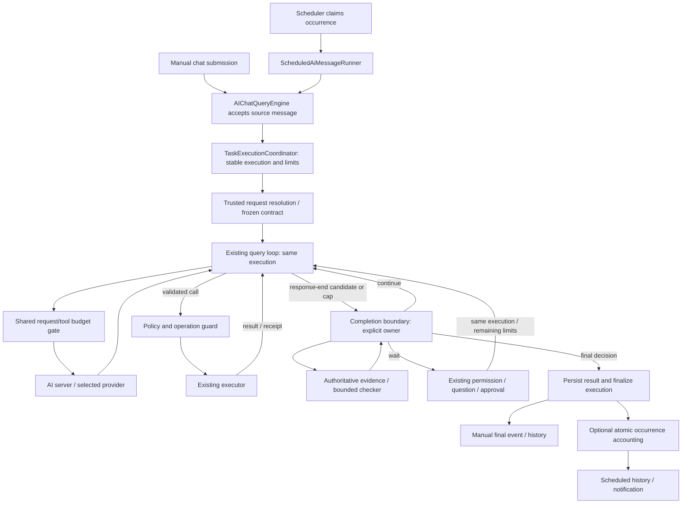

# Shared AI Task Completion and Premature-Stop Recovery Technical Design

## Document information

- Version: 2.0
- Date: 2026-10-04
- Status: Proposed; additions below are design targets, not implemented APIs.
- Requirements: [Shared task completion and recovery PRD](./scheduled-loop-premature-stop-recovery-advice.md).
- Initial scope: manually started Chat V2 tasks and enrolled chat-bound scheduled occurrences; ordinary answers use the same boundary with response-only semantics.
- Server target: `/Users/cengjianze/project/aifetchserver`.
- Related: [query-engine design](./ai-chat-query-engine-technical-design.md), [scheduled-loop design](./ai-chat-scheduled-loop-technical-design.md), [goal-loop design](./ai-chat-goal-loop-technical-design.md).
- For enrolled executions this design supersedes assumptions equating a normal turn ending with successful task completion. Existing cadence, conversation binding, overlap, and approval contracts remain authoritative.

## 1. Architecture decision

Use an execution-scoped `TaskCompletionController`, created by a shared `TaskExecutionCoordinator` in the Electron main process and attached to the existing query engine through a trusted binding. Manual submission and scheduled runners use the same coordinator; a schedule is optional metadata, not the execution store or prerequisite. The inner loop consults it when a response proposes an end to work. The controller owns verification, semantic continuation, progress accounting, and outcome. The loop owns transcript/tool execution; the engine/coordinator owns manual execution lifetime; the scheduler owns occurrence timing and schedule accounting. Request resolution distinguishes response-only answers from task contracts before the boundary decides whether task recovery is applicable.

| Approach | Assessment |
| --- | --- |
| Broaden `goalTextStop` with scheduled context. | Retries completions/blockers indiscriminately, misses first-response/resume cases, renews allowances on tool traffic, and retains false-success finalization. Rejected as final design. |
| Create ephemeral conversation goals. | Couples recovery to user-facing goal ownership/state/accounting. Rejected. |
| New scheduled agent engine. | Duplicates streaming, compaction, tools, permissions, and transcript logic. Rejected. |
| Explicit task-mode toggle only. | Leaves normal typed task requests exposed; not the default manual enrollment path. |
| Continue every response until a token target. | Repeats valid answers/blockers and provides no completion proof. Rejected. |
| Trusted controller attached to existing engine. | Selected: automatic manual task enrollment, evidence-based decisions within one execution, and existing policy boundaries. |

Semantic recovery does not recursively call `submitMessage()` or restart the original task. One execution retains its originating submitted user message and assistant-turn identity; actual user answers/approvals can be linked later. Automatic recovery adds no new user submission. Manual work creates no synthetic scheduled task/run or `/goal`. Permission resumes can invoke the loop again but retain the controller, contract, and durable counters.

## 2. Current integration points

| Existing file | Relevant behavior |
| --- | --- |
| `src/service/AIChatQueryLoop.ts` | Parses calls; handles output/empty/text-stop recovery; returns completed/cancelled/paused/failed. General cap: 30 rounds plus up to 200 continuation cycles. |
| `src/service/AIChatQueryEngine.ts` | Assembles initial/resumed inputs, saves messages, emits terminal completion, resolves goal mode by conversation lookup. |
| `src/service/AIChatQueryEvents.ts` | Loop input/result and pending permission/question types. Binding must survive every applicable resume path. |
| `src/service/AIChatQueryEngineFactory.ts` | Interactive/scheduled engine construction and task-scoped tool policy; inject shared execution ports. |
| `src/main-process/communication/ai-chat-v2-ipc.ts` | Manual `handleStream` gates availability, validates input, and calls `engine.submitMessage`; keep contract/database work in services/Modules. |
| `src/service/AIChatConversationTurnCoordinator.ts` | Shared manual/scheduled conversation lease and interactive priority; retain and fence the owner across waits. |
| `src/entity/AIChatMessage.entity.ts` | Source/assistant message identities and JSON metadata; link execution results without using message metadata as the sole ledger. |
| `src/service/ScheduledLoopEventSink.ts` | Currently converts any complete event into completed occurrence outcome. |
| `src/service/ScheduledAiMessageRunner.ts` | Run/lease/engine registration, timeouts, permission waits, finalization, schedule accounting, broadcasts. |
| `src/entity/AiMessageTask.entity.ts` | Prompt, workspace, configured runtime/tool/continue limits, and policy. |
| `src/entity/AiMessageTaskRun.entity.ts` | Occurrence identity, message links, statuses, metadata, unique occurrence idempotency key. |
| `src/modules/AiMessageTaskRunModule.ts` | Current completion/failure updates are not versioned checkpoints or atomic accounting transactions; metadata updates can replace prior metadata. |
| `src/service/aiChatGoal/*` | Evidence/verifier/controller concepts exist; actual goals remain single-owner via an explicit adapter. |
| `AIChatQueryEngine.dispatchStop` | Existing lifecycle Stop hooks are post-turn and non-fatal; they are not a trusted pre-finalization verifier. |

Existing evidence limitations must not be inherited blindly. `GoalEvidenceCollector.collectFile()` currently treats a present file as passing a changed-file check. The qualitative verifier receives reason/state summaries, and the goal loop does not collect rich qualitative evidence for it. Shared task verification requires current artifact/record/receipt references and content appropriate to each criterion.

## 3. Data flow



Database work flows through Modules/Models; services receive injectable ports. No TypeORM access enters IPC or worker files. The controller remains in the main process. Future evidence-computation workers belong under `src/childprocess/` and send data to the main process for persistence.

## 4. Proposed file responsibilities

New files unless marked existing:

| File | Responsibility |
| --- | --- |
| `src/entityTypes/aiTaskExecutionTypes.ts` | Validated serialized contract/evidence/checkpoint/decision/outcome types. |
| `src/service/aiTaskExecution/TaskExecutionCoordinator.ts` | Accept/reuse execution, resolve owner, assemble binding, manage timers/leases, finalize and recover. |
| `src/service/aiTaskExecution/TaskRequestResolver.ts` | Response/task/preparation routing; bounded structured intent extraction with source/scope validation. |
| `src/service/aiTaskExecution/TaskCompletionController.ts` | Decision precedence, verification, continuation reservations, terminal outcomes. |
| `src/service/aiTaskExecution/TaskCompletionContractService.ts` | Validate/configure/freeze criteria from the original objective without broadening authorization. |
| `src/service/aiTaskExecution/TaskEvidenceService.ts` | Bounded task-specific read-only adapters, deterministic checks, checker dispatch. |
| `src/service/aiTaskExecution/TaskProgressTracker.ts` | Stable evidence fingerprints and repeated request/result detection. |
| `src/service/aiTaskExecution/TaskRunBudget.ts` | Provider/tool/checker/time/token reservations and reconciliation. |
| `src/service/aiTaskExecution/TaskOperationGuard.ts` | Native operation-dedup adapters or durable claim/reconciliation fallback. |
| `src/modules/AiTaskExecutionModule.ts` | Validated checkpoints/transitions; atomic terminal accounting. |
| `src/entity/AiTaskExecution.entity.ts` | Schedule-independent execution/source/policy/checkpoint/outcome record and ledger reference. |
| `src/entity/AiTaskExecutionLedger.entity.ts` | Versioned counters/reservations/active owner shared by explicit Continue lineage; independent of immutable execution outcomes. |
| `src/model/AiTaskExecution.model.ts` | Execution lookup/CAS, reservations, transactions, immutable outcomes, idempotent manual/scheduled finalization. |
| `src/entity/AiTaskOperation.entity.ts` | Durable operation key/state/receipt when existing native guards are insufficient. |
| `src/model/AiTaskOperation.model.ts`, `src/modules/AiTaskOperationModule.ts` | Main-process claims, reconciliation, and receipt updates. |
| Existing engine/loop/events/factory/IPC/sink/runner/goal services | Manual acceptance and trusted binding, single owner, response-end decisions, budget hooks, all pauses/resumes, and outcome adapters. |
| Existing entities/task types/SQLite configuration | Additive contract/checkpoint/outcome fields and operation-entity registration. |

Avoid unrelated query-loop refactoring. Actual `/goal` transitions remain owned by its existing goal controller. Share pure verification utilities selectively, with compatibility tests; manual/scheduled standalone tasks never invoke user-facing goal persistence as a recovery shortcut.

## 4A. Manual acceptance, routing, and ownership

### 4A.1 Accept before execution

1. IPC checks AI availability first, validates the renderer request, and delegates to the engine. Never deserialize trusted execution/controller/policy/send-preauthorization fields from renderer JSON.
2. Engine/coordinator acquires the existing conversation lease, resolves DB/user scope, and accepts/reuses the durable user message by stable `submissionId`. Create a lightweight execution record and ledger before resolver or maker dispatch. Register the active cancellable owner and emit start/resolving before potentially slow resolution; Stop must already work at this stage. Both manual and scheduled adapters call this path; scheduled source IDs remain stable as today.
3. Resolve actual user-authored objective and explicitly linked approved references. Selected history, attachment contents, tool results, assistant text, and runtime continuations are data, never independent authority. For a referential follow-up, main-process lookup selects the prior execution explicitly referenced; ambiguous linkage asks for clarification.
4. Resolve route and owner, validate policy/criteria, persist versions and source references. Take artifact/source baselines before maker actions requiring change evidence. A resolved normal answer uses response-only semantics; every turn still reaches the shared end boundary.
5. Attach one trusted binding to active/resumed loop input. All resolver/maker/checker requests and effects pass the ledger gate; recheck AI enable before dispatch. On acceptance/persistence failure, no new effect is dispatched.

The new renderer generates and retains `submissionId` across transport retries. The server-side uniqueness key includes database/user scope and conversation ID. Hash the request before enrichment, using canonical validated user-supplied fields and opaque reference IDs; changed resolved source revisions cannot turn an identical retry into a new request. Same ID with a different request hash is `SUBMISSION_CONFLICT`; same accepted ID returns current/final execution status without duplicating the message or effect. A legacy request without an ID receives an acceptance ID on start; absence of stable retry correlation cannot provide exact submission dedup, and native operation protection still applies.

### 4A.2 Resolve requests without a user task-mode switch

Trusted typed actions and registered templates resolve deterministically. Other messages use a bounded tool-free structured resolver only when needed. Its result contains route, source message/span references, proposed requested outcomes, supported adapter/source selectors, and ambiguity reasons; arbitrary code, executable predicates, new recipients, or new objectives are forbidden. At most two attempts share provider/token/active-time limits. Candidate criteria need main-process validation against actual source text, supported adapters, existing workspace/target policy, and plan/send authorization. Structured output alone is not trusted authorization.

| Route | Example | End policy |
| --- | --- | --- |
| `response_only` | “What does this setting mean?” | A meaningful answer may close as response-ended; no task-success badge, forced tools, or goal lookup takeover. |
| `task_verified` | “Save 100 contacts”, “check latest status”, “write a summary of this document” | Required authoritative/qualitative criteria; incomplete feasible work can continue. |
| `task_best_effort` | Action/deliverable request whose required evidence cannot be configured reliably | Bounded allowed work; unknown remains unverified; no vacuous success or repeated work to hide checker failure. |
| `preparation` | Plan draft awaiting real approval or missing target clarification | Existing waiting controls; no execution success from draft, no unauthorized mutation. |

Task criteria can be qualitative restatements of an unambiguous request with actual request/source evidence; they are not limited to prebuilt count templates. Conjunctions retain every requested part. Reject a resolver that substitutes “start” for “finish”, “draft” for “send”, or drops a requested save step. Routine restated criteria need no extra approval. Material ambiguity routes to clarification, and a resolver failure never silently grants action scope or marks a possible task Completed.

A response-only route permits the ordinary answering workflow and existing information-retrieval tools, but cannot dispatch a consequential action. Before any actual task action, validate task routing/contract and existing permission; capture baseline first. If a known task action contradicts response-only classification, re-resolve against the original request before dispatch. A model's attempt alone cannot authorize escalation. At a text-only first stop, the boundary checks the source request for unresolved task intent; it cannot depend on a prior tool round. Task-shaped/misclassified or promised-but-missing work is re-resolved within the resolver cap, otherwise ends clarification/unverified. Valid response-only text ends without semantic continuation; empty/missing responses use existing bounded output recovery and cannot masquerade as a task result.

### 4A.3 Plans and one owner

Owner is supplied by trusted acceptance: `standalone` for ordinary manual/scheduled tasks, `goal` only for actual goal-controller dispatch. An active goal discovered in the conversation cannot change it. For standalone executions, disable inherited `goalAutoContinue`/empty-stop/cap nudges and route all semantic continuation through this controller. Keep reason-specific transport/output recovery, with the same ledger.

Actual `/goal` and immediate `/loop` keep the goal controller as sole semantic-continuation/final-goal owner. A goal adapter propagates execution identity and delegated budgets to maker iterations and converts a stopped maker round into an internal iteration result; the standalone controller does not add its own nudges or claim goal completion. Goal verification and terminal status remain evidence-based in the existing outer controller. This avoids both stacked loops and unrelated manual requests accidentally pursuing an old goal.

Preparation can gather a plan/answers within approval rules. Freeze execution policy at acceptance and executable contract after actual user-approved scope is resolved, before the first task effect. Carry the same ledger across this preparation. If the user only requested a plan draft, that draft is a text/artifact deliverable and may verify without campaign execution; do not invent an approval-to-execute requirement. Once frozen, contract/policy and scope cannot be edited during a pause; a materially changed request becomes a linked successor. Merely saving a draft emits preparation/wait, not task Complete. Existing approval records, not classifier or checker text, determine when execution can proceed.

### 4A.4 New messages, Continue, Retry, and cancellation

- Transport Retry: same submission/execution and current/final status; no re-dispatch.
- Live permission/question/approval answer: verify the existing handle and append a real user-message link; resume the same execution and remaining ledger.
- New unrelated message: serialize through the conversation coordinator. Explicit replacement cancels/fences old work before new acceptance; old checks/tool callbacks cannot write or emit for the replacement.
- Continue after a terminal incomplete/interrupted outcome: terminal row stays immutable. Create a linked successor from the approved objective and remaining-work evidence, with a lineage ledger that inherits spent reservations and remaining allowances. No automatic fresh budget. If no allowance remains, show that reason and the available explicit new-attempt action.
- Explicit Retry remaining work/new attempt: the human request authorizes a distinct bounded attempt with a new disclosed allowance; still reuse/reconcile confirmed/unknown receipts and validate current scope. Do not ask for redundant permission merely to create the attempt. Additional tool permissions remain governed by existing approval controls.
- Stop/cancel: abort owner and checker/transport waits, prohibit subsequent reservations, invalidate handles, persist cancellation, and release the lease once. Cancelled work never resumes from a stale callback or automatic Continue.

Successors reference the preceding execution and validated original objective. New unrelated objectives have separate ledgers. The user cannot unknowingly renew an exhausted task through a transport retry or permission response. Broad natural-language linkage is not assumed when several prior tasks could match.

## 5. Contract and runtime types

### 5.1 Completion contract

These interfaces illustrate required semantics. Implementations decode external JSON from `unknown`, reject inappropriate fields, and use explicit return types without `any`.

```typescript
export type TaskOutcome =
  | "verified_complete" | "incomplete" | "needs_user_input"
  | "blocked_by_policy" | "failed" | "cancelled" | "timeout";

export interface TaskCompletionContract {
  readonly schemaVersion: 1;
  readonly contractId: string;
  readonly contractHash: string;
  readonly objective: string;
  readonly sourceUserMessageId: string;
  readonly approvedSourceMessageIds: readonly string[];
  readonly mode: "verified" | "best_effort";
  readonly criteria: readonly TaskCriterion[];
}

export interface TaskCriterionSource {
  readonly messageId: string;
  readonly startOffset: number;
  readonly endOffset: number;
}

export interface TaskCriterionBase {
  readonly sourceRefs: readonly TaskCriterionSource[];
}

export type TaskCriterion = TaskCriterionBase & (
  | { readonly id: string; readonly required: boolean;
      readonly kind: "observation"; readonly description: string;
      readonly adapterKey: string; readonly targetId: string }
  | { readonly id: string; readonly required: boolean;
      readonly kind: "record_count"; readonly description: string;
      readonly adapterKey: string; readonly targetId: string;
      readonly scope: "execution" | "lineage" | "cumulative"; readonly minimum: number }
  | { readonly id: string; readonly required: boolean;
      readonly kind: "artifact"; readonly description: string;
      readonly relativePath: string; readonly expectation: "exists" | "changed";
      readonly requiredContentChecks: readonly string[] }
  | { readonly id: string; readonly required: boolean;
      readonly kind: "operation_receipt"; readonly description: string;
      readonly adapterKey: string; readonly targetId: string;
      readonly requiredState: "accepted" | "completed" }
  | { readonly id: string; readonly required: boolean;
      readonly kind: "qualitative"; readonly description: string;
      readonly sourceSelectorKeys: readonly string[] });
```

Validate criterion source offsets against the exact persisted user/approved-plan message bodies listed in `approvedSourceMessageIds`; references cannot point at runtime nudges or retrieved instructions. Hash canonical frozen objective/criteria/approved sources, excluding volatile execution/provider IDs, so an unchanged Continue contract remains comparable. Source references support scope checking but do not alone prove semantic extraction correct.

Adapter/content-check keys resolve through a trusted registry, not executable expressions. Contracts contain no arbitrary SQL, commands, scripts, or model-supplied predicate code. Record qualification comes from the configured domain adapter and approved criterion. Evidence selectors are validated against approved workspace/domain targets.

Qualitative source selectors identify approved evidence sources at contract creation; actual evidence IDs are generated during collection and passed to the checker. An observation verifies both retrieval and the requested report. If the report is free text rather than deterministically comparable structured output, add a required qualitative report criterion; retrieval alone cannot satisfy the full objective.

Examples:

- Observation: deployment job was queried during this occurrence and report matches current status. Running/failed external status can satisfy an observation.
- Records: 100 qualifying saved contacts in the approved campaign; duplicates/unqualified contacts do not count. Prior occurrences contribute only for explicit cumulative scope.
- Changed artifact: current hash differs from pre-run baseline and required content checks pass; existence alone does not pass.
- Send receipt: accepted job proves “start sending”; delivery requires its actual completed/delivery state. Queue acceptance cannot substitute for delivery.

A trusted compiler uses registered templates or main-process-validated structured manual criteria as described in §4A.2. Ambiguous/unsupported objectives use clarification or best-effort; a model's extraction alone never enables additional actions. Freeze the configured contract into the execution. A best-effort contract with zero required criteria cannot pass vacuously; it remains unverified unless a validated contract is established through the appropriate user/task configuration workflow before a new run.

### 5.2 Evidence, candidates, and decisions

```typescript
export interface TaskEvidence {
  readonly evidenceId: string;
  readonly criterionId: string;
  readonly contractHash: string;
  readonly executionId: string;
  readonly observedAt: string;
  readonly source: string;
  readonly sourceRevision: string;
  readonly state: "pass" | "fail" | "unknown";
  readonly referenceIds: readonly string[];
  readonly summary: string;
}

export interface TaskEndCandidate {
  readonly candidateId: string;
  readonly executionId: string;
  readonly content: string;
  readonly finishReason: string | null;
  readonly provenance: "provider" | "adapter" | "synthetic" | "unknown";
  readonly streamTerminalSeen: boolean;
  readonly boundary: "response_end" | "round_cap" | "budget_cap";
  readonly pendingPermission: boolean;
  readonly pendingQuestion: boolean;
  readonly pendingPlanApproval: boolean;
  readonly safetyRestriction: boolean;
}

export type TaskCompletionDecision =
  | { readonly type: "continue"; readonly continuationId: string;
      readonly prompt: string; readonly unmetCriterionIds: readonly string[] }
  | { readonly type: "wait"; readonly reason: "permission" | "input"
      | "plan_approval" | "external_job" }
  | { readonly type: "finish_response"; readonly result: "response_ended" }
  | { readonly type: "yield_owner"; readonly owner: "goal";
      readonly result: "maker_iteration_ended" }
  | { readonly type: "finish"; readonly outcome: TaskOutcome;
      readonly reasonCode: string; readonly evidenceIds: readonly string[];
      readonly summary: string; readonly remainingWork: readonly string[] };
```

Use the following trusted runtime binding; scheduled linkage is a discriminated optional origin, never a requirement for manual execution:

```typescript
export type TaskExecutionOrigin =
  | { readonly type: "manual"; readonly submissionId: string }
  | { readonly type: "scheduled"; readonly taskId: number;
      readonly runId: number; readonly occurrenceKey: string };

export type TaskExecutionRoute =
  | "response_only" | "task_verified" | "task_best_effort" | "preparation";

export interface TaskExecutionBinding {
  readonly executionId: string;
  readonly conversationId: string;
  readonly sourceUserMessageId: string;
  readonly origin: TaskExecutionOrigin;
  readonly route: TaskExecutionRoute;
  readonly completionOwner: "standalone" | "goal";
  readonly leaseGeneration: number;
  readonly ledgerId: string;
  readonly contract: TaskCompletionContract | null;
  readonly controller: TaskCompletionController;
  readonly budget: TaskRunBudget;
}
```

`contract` is non-null for executable task routes and frozen before first task action. Response-only/preparation have explicit end/wait semantics, not an empty passing contract. A goal-owned maker iteration yields to its owner through an internal typed result, not a standalone task-success result. The binding is main-process state, never serializable renderer input. The controller exposes `decide(candidate, signal): Promise<TaskCompletionDecision>`. Budget methods reserve/reconcile provider, checker, tool, and continuation work using stable request IDs and return a typed reservation or budget-exhausted decision. Detailed port implementations belong in the listed services.

Add optional `taskExecution` to trusted engine submission, active-turn state, loop input, `PendingPermissionTurn`, and `PendingPlanQuestionTurn`. Preserve it through permission, plan-question, and plan-approval resume paths. It is absent from renderer `ChatV2StreamRequest`; JSON supplied by a model or renderer cannot attach it. Resume validates execution identity, conversation, contract/stage, expected handle, and fenced lease generation. Scheduled pre-authorization is accepted only from a scheduled-origin trusted binding; it never transfers to manual tasks.

Explicit completion ownership takes precedence over conversation-level `goalAutoContinue`. Existing goal/empty-stop/cap nudges cannot stack with standalone controller continuations. Actual interactive goals retain their explicit owner adapter; lookup alone cannot change any manual/scheduled objective.

## 6. Persistence and concurrency

### 6.1 Additive schema

| Entity | Additions |
| --- | --- |
| `AiMessageTaskEntity` | Nullable `completion_contract_json`, nullable `execution_policy_json`, `execution_policy_version` default 0; version 0 means legacy/un-enrolled. |
| `AiTaskExecutionLedgerEntity` | Opaque ledger ID, immutable policy limits, CAS version, reservations/consumed totals, active/wait time, no-progress state, active execution ID and fenced owner generation. Continue successors share this record; an explicit new attempt gets a new one. |
| `AiTaskExecutionEntity` | New table: opaque execution ID, conversation/source/assistant/submission IDs and request hash, origin/route/owner/stage, contract/policy snapshots, execution/lineage ledger IDs, parent execution, `execution_state_json`, CAS version, outcome/reason/finalized time, final-event identity/delivery state. |
| `AiMessageTaskRunEntity` | Nullable unique `execution_id` link, task-outcome/reason/result summary; existing occurrence status/identities remain. It is not a second budget/checkpoint authority. |
| `AIChatMessageEntity.metadata` | Add bounded execution/result references and segment metadata through existing Module/Model methods. Source/assistant rows remain the durable transcript; no new message-table columns are required. |
| `AiTaskOperationEntity` | Unique operation key, execution ID, trusted tool/domain identity, canonical intent hash, operation state, receipt reference, timestamps, claim generation, safe failure code. |

Checkpoint stores contract/policy snapshots, source baselines, ledger reference and counter snapshot, bounded evidence references/summary, candidate verdict, progress fingerprint, and continuation references. Only the ledger is authoritative for spent/remaining allowance; snapshots cannot renew it. Outcome immutability does not prevent the separate ledger from accounting for a linked successor. Full transcript/results remain in existing scoped stores.

Checkpoint states are `resolving`, `preparing`, `active`, `verifying`, `continuing`, `waiting_permission`, `waiting_input`, `waiting_approval`, `waiting_external_job`, and `terminal`. The generic execution and its single linked ledger are authoritative; scheduled run summaries are references. Persist the expected resume/action identity with waiting states. External-job waiting remains inside the active-time allowance; bounded permission/input/approval waiting suspends that allowance; consumed active time and a shared cumulative wait allowance persist. A terminal state is immutable except for delivery/reconciliation annotations.

Do not replace `metadata_json` with partial recovery updates. Store the checkpoint separately and merge summary metadata at finalization. Initial bounds: 64 KiB checkpoint, 2 KiB evidence summaries, 100 evidence references, 20 recent request/result fingerprints. Larger required evidence uses durable scoped artifact/result references; never silently drop required criteria to fit bounds.

Add `incomplete` and `needs_user_input` to scheduled run-status types and define separate generic execution statuses (including response-ended/preparation/interrupted). Map `verified_complete` to existing `completed`; preserve its semantic value in `task_outcome`. Other terminal outcomes use matching existing/new statuses. Permission waiting is runtime/checkpoint state with run status running; existing pending-permission metadata remains authoritative. Terminal needs-input has no dangling resume handle. A response-only ending stores `response_ended`, not a verified task outcome. Manual rows require neither task ID nor scheduled run ID.

Existing SQLite setup registers entities and uses TypeORM synchronization; implementation must test upgrade from a real old-schema fixture. New nullable columns/defaults preserve old rows. Validate stored JSON by schema version and treat unreadable enrolled state as non-success; do not downgrade it to legacy mode. Add uniqueness/indexes for scoped submission identity, execution ID, optional scheduled run linkage, parent/lineage IDs, and operation intent/state lookup; avoid destructive migrations on rollback.

### 6.2 Versioned checkpoints

Model transactions update the generic execution entity only when `execution_state_version` matches the loaded version and the execution is unfinalized. A reservation transaction also CAS-updates the ledger version and validates that its active execution ID/generation matches the binding. Increment each affected version; no independent in-memory counter is authoritative. On conflict, reload once and re-evaluate; repeated conflict stops dispatch with `STATE_CONFLICT`. Retrying a database update must never repeat an external action.

Persist reservations before dispatch. IDs are stable within the execution and inherited lineage; reserving an existing ID returns its prior reservation without incrementing. A crash between reservation and dispatch conservatively consumes allowance. A crash after dispatch but before receipt persistence produces an uncertain operation. Creating a Continue successor atomically claims the inactive lineage ledger and sets the new active owner; at most one descendant is active. Finalizing an execution releases that ledger owner, not its spent allowance. An explicit new attempt gets a new ledger after current/unknown operations are reconciled. Stale ancestors cannot reserve on the successor ledger.

New Model entry points enforce worker-access guards. Modules use `BaseModule.ensureConnection()` and Token-derived database path. Runner and IPC do not directly query repositories.

### 6.3 Atomic finalization and delivery

Use `AiTaskExecutionModule.finalizeExecution()` for manual and scheduled executions. A scheduled adapter participates in the same transaction instead of complete/fail plus separate counter updates:

1. Claim an unfinalized execution using expected state version in a transaction.
2. Save outcome, reason, linked assistant result, evidence/counter summary, finished time, and finalized marker.
3. For scheduled origin only, update linked occurrence status, schedule counters, and next-run state exactly once under existing cadence rules. Manual origin never reads/writes schedule counters.
4. Save final-event identity `execution-result:<executionId>` and applicable notification/delivery state in the same transaction.
5. Release the ledger owner in the transaction, commit, then publish terminal event/refresh/notification and mark delivery afterward. Late confirmed receipts may update guarded reconciliation annotations for already-dispatched operations; they never change the immutable task outcome or authorize further effects.

The linked assistant result must already be durable before final delivery. Manual non-success still emits a terminal outcome after best-effort result persistence; if durable finalization itself fails, emit only an explicit persistence error with last known execution identity, never a successful task result. Startup recovery reconciles the unfinalized row without replaying actions. Order is: recovery/verification decision, save final result, transactional finalization, terminal event/notification. Withhold recoverable errors and response-end candidates from consumers that would terminate early; send non-terminal progress while recovery is pending. If saving fails, do not emit success. If finalization fails, stop new effects, report `PERSISTENCE_FAILED`, and retain last checkpoint for startup reconciliation. Never fall back to old unconditional success.

A second finalizer returns the existing outcome; counters never increment twice. Late checker/tool/permission callbacks validate execution generation and finalized state. Release the shared conversation lease once on terminal cleanup. Notification retries use the saved identity and do not rerun work. Transport without delivery dedup has unavoidable notification uncertainty; do not claim guaranteed exactly-once delivery, though database accounting remains idempotent.

## 7. Decision precedence and loop behavior

### 7.1 Provider response classification

Preserve finish reason and separately record whether a terminal choice was received and its optional provenance. Extend `OpenAIStreamAccumulator` and API stream types as needed. Missing server diagnostics remain unknown. Clean EOF or `[DONE]` alone does not establish task completion.

Validated complete calls use normal execution even with `stop`, subject to restrictions/budgets. Incomplete calls never execute. Explicit filter/refusal prevents effect dispatch even if an inconsistent payload includes calls. Output/transport recovery retains its existing ownership but passes the same run budget gate.

For every enrolled manual/scheduled no-call ending and round cap, consult the owner boundary before a terminal completion event. Suppress existing empty/text-stop/hidden-cap continuations unless the controller permits continuation. Parser salvage may remain, but exhausted recovery creates a non-success candidate; it cannot silently complete unfinished work.

### 7.2 Controller order

1. Validate ownership, route/stage, contract hash when applicable, active generation, and unfinalized state; reject stale work.
2. User cancellation wins over verification; preserve progress and finish cancelled.
3. Honor safety restrictions, permanent entitlement/auth errors, and policy blocks. No checker can bypass them.
4. Pending permission/plan/question wins over semantic continuation. Supported bounded handles retain the same execution; unresolved input without a valid handle finishes needs-input and pauses recurrence only for scheduled origin. Preparation cannot finish executable work.
5. Response-only candidates may finish response-ended after source/route and output checks; goal-owned maker iterations yield internally to their owner. For a task candidate, require a frozen executable contract, collect current deterministic evidence and validate scope/revision. Invoke the checker only for qualitative criteria with usable evidence and remaining reservation.
6. If all required criteria pass, finish verified immediately. At exhausted maker/request budgets, local bounded read-only checks may establish success; unreserved remote checker work is forbidden.
7. Update progress/no-progress state for unfinished candidates. Unknown evidence stays unknown.
8. Exhausted active deadline or total budget produces timeout/incomplete with exact reason. No further dispatch. At deadline expiry, use only already collected admissible evidence; no new slow verification.
9. At repeated no-progress bound, finish incomplete. Uncertain consequential operations require reconciliation and cannot be repeated.
10. If unmet work is feasible in approved scope, reserve a semantic continuation and return a targeted prompt. Otherwise return needs-input, blocked, or incomplete.

First eligible unfinished response without relevant progress increments the streak. Relevant new evidence resets it to zero. Discovery calls, generic successes, generated timestamps, and model summaries do not reset it. Checker retries consume checker/provider budgets but do not count as additional maker no-progress boundaries.

Blocker text is a candidate signal checked against actual permissions, failures, missing data, and evidence. Do not ignore it or trust it as success. Read-only clarification can resolve ambiguity but cannot authorize new actions. An unsupported ambiguity ends needs-input/incomplete.

### 7.3 Transcript and continuation

Preserve assistant candidate content as a response segment and append a typed runtime continuation:

```text
Continue the same approved task execution.
Objective: <unchanged objective>
Verified progress: <authoritative bounded summary>
Unmet criteria: <missing conditions>
Failures or restrictions: <safe summary>
Remaining limits: <trusted runtime limits>
Perform an allowed next step or explain the blocker requiring input.
Do not repeat operations with receipts. Do not claim completion without
required evidence. A text deliverable does not require tool calls.
```

The angle-bracket values are runtime substitutions, not unfinished design sections. Do not save continuation as another user request. Persist a typed runtime-continuation record/reference for transcript assembly, excluded from user-intent extraction and outbound authorization. Include it in order with complete tool-call/result groups after compaction/resume. Compaction preserves contract/progress/receipt references and cannot erase durable counters.

Keep per-response content segments. Stream progress normally and retain it in history; final result presents actual output or a controller-authored incomplete explanation. Do not concatenate repeated preambles into artificial completion text. Assistant metadata retains the provider reason beside the independent task outcome.

## 8. Evidence verification

### 8.1 Admissibility and adapters

Each adapter returns authoritative source IDs/revision, evaluated state, and bounded excerpt. Recheck approved scope at collection time. Distinguish execution-local evidence from explicitly cumulative targets; retain pre-run baseline where change is required.

- Records: read through existing Models/Modules, scoped to approved campaign/target; apply domain identity dedup and qualification.
- Files: existing path guard, baseline/current hash and content checks. Missing baseline makes changed unknown. Do not execute generated files as evidence checks.
- Operations: native send/job receipts for approved intent; distinguish accepted, pending, completed, failed, and unknown.
- Observations: fresh retrieval in this execution plus report consistency with observed status.
- Text: actual deliverable and supplied source excerpts, not a sentence claiming completion.

Continue/Retry remaining-work successors explicitly import admissible parent record IDs, operation receipts, original change baselines, and produced deliverables into lineage scope, then revalidate them against current sources and the unchanged approved objective. A new execution ID neither loses the 54 already saved contacts nor makes unrelated existing contacts count. Previously passed criteria are not grandfathered without current evidence. Scope changes require a new contract and cannot import unrelated completion.

If relevant source changes during verification, discard stale verdict and recollect once within budgets; repeated churn ends unknown/incomplete. No arbitrary model-selected commands. Existing approved command checks can run only through existing approval/tool/accounting boundaries.

### 8.2 Checker contract

Separate maker and checker invocations. Checker receives frozen criteria, actual evidence IDs/excerpts/revisions, and deliverable. It has no mutation tools, treats evidence as untrusted data, and cannot alter objectives. Use low temperature where supported; validity does not rely on provider JSON-mode or temperature compliance.

Expected JSON:

```json
{
  "criteria": [
    {
      "criterionId": "report-status",
      "verdict": "pass",
      "evidenceIds": ["status-evidence-1", "report-evidence-1"],
      "reason": "The report matches the supplied current status."
    }
  ]
}
```

Require exact known criteria, no duplicates, enum validity, reference membership/scope/current revisions, length bounds, and one result per requested criterion. Every pass cites admissible supporting evidence. Missing/invalid output is unknown; required deterministic fail cannot be overridden. Checker independence alone does not prove reliability; side effects require authoritative receipts.

One checker retry per unchanged candidate is allowed for transient/invalid output, using the same evidence. Six attempts maximum per run and all share request/token gates. Persistent verification failure ends incomplete; do not keep maker work running to conceal an unavailable checker.

## 9. Budgets, progress, and timer ownership

`TaskRunBudget` is the sole execution-wide reservation authority, despite retaining the short class name. Linked Continue successors share its lineage accounting; an explicit new attempt gets a separate disclosed ledger. Share it across resolver, maker, checker, compaction, fallback, HTTP retries, tools, and permitted nested-agent dispatches. Count actual wire attempts, not only `loop.run()` or outer API calls.

| Counter | Rule |
| --- | --- |
| Semantic continuations | Reserve before controller returns continue; total never resets; default min(configured, 3), hard cap 10. |
| Provider attempts | Reserve immediately before each wire attempt; 60 total across resolver, maker, checker, and recovery dispatch paths. |
| Resolver | At most 2 wire attempts per execution, including one retry; consumes provider/token/runtime allowance. |
| Tools | Manual default 50; scheduled configured limit. Reserve before executor invocation, including failed execution; previews/receipt reuse are not effect executions. |
| Checker | Reserve with provider attempt; at most 2 per candidate and 6 per run. |
| Tokens | Reserve estimated full input plus permitted output; reconcile actual usage; 128,000 total default. |
| Active time | All active maker/tool/checker/compaction/retry segments accumulate across resumes. |
| No-progress streak | Increment at eligible unfinished response boundaries; relevant evidence alone resets; bound 3. |

Conservative token estimates do not guarantee a billing ceiling. If reported actual exceeds estimate, record overage and block subsequent dispatch. Deduplicate usage by request ID. Context indicators keep existing last-round meanings; execution usage sums all prompts/outputs, including repeated prompts. Usage is labeled actual/estimated/unavailable.

Validate all configured limits as positive safe integers and enforce hard caps. Manual active allowance defaults to ten minutes, configurable to a thirty-minute hard cap through trusted settings. Scheduled active allowance is `min(task.maxRuntimeMs, SCHEDULED_LOOP_RUN_TIMEOUT_MS)`. Neither is renewed after a pause. All supported permission/input/approval waits share a one-hour cumulative backstop; checkpoint remaining wait time so repeated pauses cannot renew it. Terminal questions pause recurrence only for scheduled origin; manual tasks end with actionable needs-input when no handle remains.

Shared coordinator/budget binding owns timers; the scheduled runner supplies stricter occurrence constraints, not an independent resetting timer. On pause checkpoint consumed time and suspend active timer. On resume arm remaining active allowance, bounded by existing resume timeout. Deadline expiry aborts maker/checker/tool awaits and force-resolves outstanding waits; post-header provider stalls cannot hold a lease indefinitely. Non-cancellable dispatched effects remain uncertain until reconciled.

Nested agents require delegated reservations from this parent execution and deduplicated accounting. Do not enroll tools/agents in strict attempt enforcement until an adapter exposes their dispatch usage; unsupported opaque work is not an exception to limits.

## 10. Consequential-action protection

### 10.1 Stable operation identity

Changing provider tool-call IDs cannot deduplicate an action. Generate an operation key from trusted execution/lineage identity, domain operation, approved target, canonical intent arguments, and an action ordinal only when the contract explicitly permits repeated identical actions. The maker cannot invent an ordinal to evade a claim.

Retain existing send-batch/authorization/hash checks and domain dedup. Prefer native claims/receipts; the generic guard adds missing durability. Exclude credentials/volatile IDs from hashes and raw sensitive data from keys/logs.

### 10.2 State machine

```text
prepared -> claimed -> dispatched -> confirmed
                           |
                           +-> unknown -> confirmed / failed / reconciliation
claimed -> failed-before-dispatch
```

Claim before dispatch; supply stable provider idempotency key where supported. Confirmed repetitions return stored receipt. Pending/unknown repetitions query native operation status. Retry only with definitive no-effect failure evidence, existing permission, and budget.

Crash between dispatch and confirmation produces unknown. If there is neither provider idempotency nor lookup, finish incomplete and pause for reconciliation. Do not promise exactly-once effects in that case. Explicit new manual attempts and new occurrences use separate execution keys, but existing recipient/campaign dedup remains authoritative across occurrences.

Before dispatch, also look for unresolved earlier operations matching the same domain intent/target, using a non-unique domain/target/intent/state index or native job lookup. A new execution ID or conversation must not bypass an unknown earlier send/job. Resolve it or report reconciliation required before dispatching that same intent again. Explicitly independent recurring actions have distinct trusted domain identities; a model-generated argument variation cannot establish that independence.

### 10.3 Background jobs

Starting a job and completing its objective differ. Accepted receipt satisfies a start-only criterion; completion requires actual confirmed completion. Approved read-only polling consumes budgets/time with backoff and a minimum one-second interval. External pending work can end this occurrence incomplete while later monitoring checks continue. No unbounded internal polling.

## 11. Results, events, accounting, and renderer

Add a discriminated execution result to terminal loop/engine results and stream payloads: execution ID, result kind (`response_ended` or `task_outcome`), optional contract hash, task outcome/reason/progress/evidence/counters, and optional scheduled linkage. Internal goal iteration results remain separate and cannot be serialized as task success. A chat complete closes the stream only after durable outcome finalization; its task result determines task success.

The manual renderer must consume non-success task results even when the transport event is complete. Never map every complete event to a Completed badge. Include execution ID/lease generation/event ID on execution events; ignore stale or duplicate events. On reconnect/reload, obtain persisted execution outcome and bounded progress through Module-backed IPC rather than reconstructing success from the last text or a local loading flag.

For enrolled runs, `ScheduledLoopEventSink` rejects missing/malformed task result as `MISSING_TASK_OUTCOME`; it cannot fall back to success. For a task-routed manual execution, a missing/malformed final task result is also `MISSING_TASK_OUTCOME`, never unchecked response-ended. Intermediate boundaries emit non-terminal `task_verifying`, `task_continuing`, and `task_progress` events scoped by conversation/execution/message ID and never resolve the terminal promise. Preserve existing permission-event ordering.

Save final/partial assistant content and metadata before success notification. Coordinator calls the shared atomic finalizer; scheduled adapter updates occurrence accounting in that transaction. The runner must not wait for its sink and then perform a second finalization; final result delivery follows the shared transaction. Record actual tool counts/blocked records, replacing current zero placeholders. Update typed result unions, serializers, stores, and history readers before enabling recovery.

| Outcome | Run status | Schedule handling |
| --- | --- | --- |
| Verified | completed | Success once; reset failure streak; next anchored occurrence. |
| Incomplete / failed / timeout | Matching status | Failure once; existing three-failure termination; anchored cadence otherwise. |
| Incomplete with unknown action outcome | incomplete | Failure once and immediate reconciliation pause; no next occurrence until resolved. |
| Needs input / policy blocked | Matching status | Pause; no automatic continuation or failure increment for pause itself. |
| Cancelled | cancelled | No failure increment; current-run stop retains recurrence; schedule-stop stays stopped. |
| Restart interruption | interrupted | No verified success; preserve existing interruption/coalescing policy and reconcile uncertain operations. |

Never revive a stopped/expired/deleted schedule during finalization. Recovery does not consume another occurrence or shift interval anchor. Contract fulfillment does not stop recurrence.

Renderer changes cover the existing manual chat status/progress/final message and conversation reload as well as scheduled status/run-history surfaces: update `ChatV2StreamChunk`, event-to-IPC mappings, API/store serializers, `AiChatV2.vue`, and relevant status components. Translate verifying, continuing, incomplete, needs input, no progress, verification unavailable, uncertain operation, and remaining-work text in all six languages with English fallbacks. Task metadata grants no renderer mutation authority. Show Stop throughout resolver/checker/recovery and linked Retry remaining work only when safe; normal response-only answers retain their simple presentation. Explicit new attempts disclose fresh bounded allowances; recovery nudges remain hidden runtime records.

## 12. Permission resume and restart

- Pause: same execution/controller/budget references on permission/question/approval pending turn, durable checkpoint/operation state, existing registry and bounded wait.
- Grant/deny: verify pending execution/generation; restore remaining time/counters; retain source user message, intent decision, outbound authorization/pre-authorization, workspace, and catalog state. Denial persists for the attempted operation.
- Restart: no automatic controller reconstruction/execution. Mark unfinished generic executions and linked scheduled runs interrupted through startup recovery; preserve checkpoints/receipts; invalidate old callbacks/handles.
- Future occurrence: normal coalescing and new baseline; never silently redo uncertain prior operations.
- Manual Continue after a terminal interruption/incomplete outcome: reconcile first, obtain a new fenced lease, create an immutable linked successor with the same lineage remaining counters. Explicit Retry/new attempt creates a disclosed new ledger; it cannot hide renewed allowance, repeat a confirmed operation, or bypass uncertainty. See §4A.4.

## 13. Server integration

### 13.1 Targets and semantics

Target `aifetchserver/api/openai_compatible.py`, selected adapters such as `aifetchserver/services/adapters/openai_adapter.py`, and shared stream/debug types. Follow server `AGENTS.md`: monitoring, service/database separation, `uv` tooling, tests, commits. Link this design from server documentation as needed rather than create divergent requirements.

Server never evaluates desktop contracts or runs desktop tools. Preserve provider reasons; existing missing-terminal synthesis stays compatible but records provenance. Do not apply an image-response whitelist to unrelated passthrough streams or silently translate errors into successful stops.

### 13.2 Correlation and optional diagnostics

Desktop supplies opaque request/execution and optional scheduled-run correlation through optional metadata/headers; server validates them as labels, never authorization. An optional response header exposes server correlation before streaming. After provider selection/failover, optional capability-negotiated metadata reports actual serving provenance.

Proposed `aifetch_stream_diagnostics` extension:

```json
{
  "schema_version": 1,
  "request_id": "opaque-request-id",
  "server_query_id": "opaque-query-id",
  "provider_label": "configured-provider-alias",
  "selected_model": "resolved-model",
  "upstream_response_id": "optional-safe-id",
  "upstream_finish_reason": "stop",
  "forwarded_finish_reason": "stop",
  "terminal_origin": "provider",
  "upstream_terminal_seen": true,
  "output_token_limit": 16384,
  "usage_source": "provider"
}
```

Origins: provider, adapter-normalized, synthetic-missing-terminal, transport-error; unknown adapters report unknown raw provenance. Provider failover records actual serving model/attempt labels, not just initially requested model. Never expose credential URLs, API keys, or internal API-setting row IDs to renderer.

Serialized `terminal_origin` values use `provider`, `adapter_normalized`, `synthetic_missing_terminal`, `transport_error`, or `unknown`. Map the first three to candidate provenance `provider`, `adapter`, and `synthetic`. Transport errors take the error path rather than a normal response candidate; missing diagnostics map to `unknown`.

Metadata is optional and capability-negotiated. Older consumers ignore/receive no extension; desktop tolerates absence. Preserve usage after terminal reason and existing error/`[DONE]` behavior. Diagnostics cannot manufacture task success.

Routine logs contain safe codes/labels, lengths/counts, request correlations, safe tool-schema identities, output limit, usage source. Exclude full prompts/results/arguments/recipients/reasoning. A useful trace distinguishes raw provider, adapter output, and forwarded/synthetic terminals when those layers expose them. `auto` alone never proves origin of failure.

## 14. Error taxonomy

| Code | Behavior |
| --- | --- |
| `CRITERIA_SATISFIED` | Verified complete after all required checks pass. |
| `NO_PROGRESS` | Incomplete at stable-obstruction streak. |
| `CONTINUATION_LIMIT`, `MODEL_ATTEMPT_LIMIT`, `TOOL_LIMIT`, `TOKEN_LIMIT` | Incomplete unless available evidence already verifies; no subsequent work reservation. |
| `ACTIVE_RUNTIME_LIMIT` | Timeout unless verified before expiry. |
| `VERIFICATION_UNAVAILABLE`, `INVALID_VERIFIER_RESPONSE`, `EVIDENCE_UNAVAILABLE` | Unknown/incomplete after permitted checker retry. |
| `UNKNOWN_ACTION_OUTCOME` | Incomplete, reconciliation required, no replay. |
| `INPUT_REQUIRED`, `PERMISSION_DENIED` | Actual needs-input/policy boundary; retain pending semantics if genuinely resumable. |
| `CONTENT_RESTRICTED` | Policy blocked, no bypass. |
| `AI_DISABLED`, permanent auth/quota error | Existing actionable failure/pause; no semantic retry. |
| `STREAM_INCOMPLETE`, `OUTPUT_TRUNCATED` | Bounded existing transport/output recovery, then non-success; provenance retained. |
| `PERSISTENCE_FAILED`, `STATE_CONFLICT`, `MISSING_TASK_OUTCOME` | No success publish; stop new effects; preserve checkpoint. |
| `SUBMISSION_CONFLICT`, `INTENT_UNRESOLVED`, `PREPARATION_REQUIRED` | Reject mismatched retry; clarify/unverified result or supported preparation wait. No verified success or scope expansion. |
| `USER_CANCELLED`, `TASK_REPLACED`, `SCHEDULE_STOPPED` | Cancelled; ignore late callbacks; no failure-streak increment. |

HTTP layer owns transient transport retries. Semantic recovery does not stack pristine-task replay over HTTP retries. Partial visible output or uncertain effects require transcript/operation-aware continuation or failure.

## 15. Test ownership and verification

New test names below are proposed; extend existing coverage without deleting meaningful assertions.

| Test location | Required coverage |
| --- | --- |
| `test/vitest/main/service/TaskRequestResolver.test.ts` | Plain typed task without toggle; paired ordinary question/latest-status request; text/multi-part tasks; quoted/attachment/history injection; misclassified first stop; ambiguity/resolver failure; draft/send/start/finish differences. |
| `test/vitest/main/service/TaskExecutionCoordinator.test.ts` | Manual acceptance/idempotent submission; response-only end; no schedule prerequisite; lineage Continue versus explicit Retry; owner isolation; replacement/Stop fencing; every pause/approval; durable event ordering. |
| `test/vitest/main/service/TaskCompletionController.test.ts` | First-response stop; 54/100; immediate genuine completion; monitor while job pending; deterministic failure versus checker pass; blockers/caps. |
| `test/vitest/main/service/TaskRunBudget.test.ts` | Reservations; resume totals; actual HTTP retries; compaction/fallback/checker accounting; token dedup/estimates; consumed time and abort. |
| `test/vitest/main/service/TaskProgressTracker.test.ts` | Same result/new timestamp; new qualifying records; discovery no reset; errors cannot replenish totals. |
| `test/vitest/main/service/TaskEvidenceService.test.ts` | Wrong run/target; stale revisions; changed-file baseline; actual text evidence; invented references; malformed checker output; bounded persistence. |
| `test/vitest/main/service/TaskOperationGuard.test.ts` | New provider ID/same intent; receipt reuse; pending/unknown; crash after dispatch; safe no-effect retry; cross-occurrence dedup. |
| `test/modules/AiTaskExecutionModule.test.ts` | Old-schema upgrade; concurrent CAS; manual no-schedule finalization; submission conflicts; lineage reservation inheritance/one active successor; immutable ancestor outcome versus mutable ledger; retained 54/100 lineage evidence; finalization races; single scheduled count increment; metadata preservation; persistence failure; worker guard; notification identity. |
| Existing loop/permission/cancellation/timeout suites | Controller before terminal event; old nudges suppressed only enrolled; calls with stop; restriction/truncation; binding on every resume; caps cannot silently succeed. |
| Existing scheduled runner chat/permission suites | Frozen identity; missing outcome; actual counts; remaining active time; durable-success ordering; stopped schedule during checker; retained cadence. |
| `test/vitest/main/components/` | Manual/scheduled status/progress/history, main interactions, language fallbacks, incomplete/uncertain outcomes, grant/deny, run-stop versus schedule-stop. |
| `test/e2e/specs/` | Manual plain-message and scheduled fake-stream tool-stop-recovery; ordinary-answer no-loop; text deliverable; pause-resume-stop; reload/routing; interruption; one accepted manual/scheduled user message; Stop during checker/recovery; stale event after replacement; reload honest manual outcome; effect simulator dispatched once. |
| Server unit/integration suites | Raw stop passthrough; absent-terminal origin; normalization; midstream error; post-terminal usage; actual fallback model; optional metadata; sensitive-log exclusion. |

Use fake streams, clocks, temporary SQLite, and an in-memory external-effect simulator. Never send live emails to test dedup. Assert event order, persisted outcome, dispatch counts, operation effects, and scheduler accounting rather than only matching a prompt constant.

Future implementation checks: desktop `yarn testmain`, relevant `yarn test` module cases, `yarn typecheck`, `yarn test:components`, `yarn vue-typecheck`, and `yarn test:e2e` for critical changed flows. Server `uv run pytest` affected suites, `uv run ruff check` changed files, and applicable `uv run mypy` scope. This documentation task does not claim execution of these tests.

## 16. Delivery slices and traceability

| Slice | Deliverables | PRD coverage / gate |
| --- | --- | --- |
| 1. Shared acceptance/classification | Generic execution entity/coordinator, request resolution, owner adapters, correlation/provenance and read-only shadow evaluation on both origins. | FR-05/06/16–20/24; AC-12/14/19/21/26/31. |
| 2. Manual + scheduled recovery | Contract/checkpoint, budgets/lineage, evidence/checker, all resumes/cancellation, complete manual/scheduled event/status/UI support. | FR-01–10/12–15/17–24; AC-01–08/11/15–27/29–32; both origins are required. |
| 3. Guarded effects | Native/generic receipts, reconciliation, crash/finalization tests. | FR-11, NFR-05/07; AC-09/10/13/28 before manual or scheduled effects enrollment. |
| 4. External adapters | Legacy schedule-page and non-Chat-V2 AI features through separate enrollment. | FR-04, AC-14; manual Chat V2 is already required in slice 2. |

No slice enables continuations while retaining unconditional manual task or occurrence success. Each completed implementation unit includes meaningful tests and conventional commit per repository policy. This technical design does not authorize implementation or replace a task-by-task execution plan.

## 17. Rollout and rollback

Use trusted feature gate `aiTaskCompletionPolicyV1`, frozen in execution policy snapshot. Shadow mode uses local read-only evidence and explicitly budgeted checker work; it cannot alter counters or trigger maker continuations. Measure checker cost before enrollment.

Enable manual and scheduled read-only/data/text tasks in the same release gate, then guarded effects for both. Flag/version is shared; origin-specific rollout cohorts cannot redefine the supported product scope. Read-only refers to protected recovery actions: existing user-approved actions keep normal policy, and automatic repetition of consequential tools stays disabled until guarded-effects enrollment passes its tests. Legacy tasks enroll visibly with validated contracts. Null outcome is expected for old history but an error for enrolled runs. Never relabel old completion as verified.

Rollback stops new enrollment/continuations. Active enrolled runs use frozen policy or stop incomplete/cancelled; no fallback success. Retain additive columns/operation records. Quiesce enrolled runs before downgrading to old binaries whose serializers do not recognize new states.

Monitor verified/incomplete outcomes, recovery success, no-progress reasons, resolver/maker/checker/compaction attempts, actual/estimated tokens, latency, waits, finalization conflicts, and operation reconciliation. Investigate any duplicate effect or non-verified enrolled run incrementing success. Segment rollout metrics by manual/scheduled origin and route. Provider attribution requires the correlated trace, not model-name assumptions.

## 18. Definition of done

- Every PRD acceptance case AC-01–32 passes its assigned test layers, including manually typed tasks without `/goal`, schedule, or task-mode toggle.
- Enrolled task success requires persisted verified outcome; response-ended is a distinct result and never a verified task badge.
- Manual execution uses schedule-independent storage and cannot alter schedule accounting.
- Transport retries, Continue lineage, explicit new attempts, scope replacement, and stale-event fencing have distinct tested semantics.
- Total counters/time survive all resumes and cannot renew through tool traffic.
- Consequential-action enrollment has durable claims/receipts and safe unknown-outcome behavior.
- Status serializers, history, six translations, component tests, and critical E2E flows are complete.
- Ordinary answers, manual tasks, immediate single-owner goal loops, cadence/coalescing, workspaces, and approvals pass regression tests.
- Server diagnostics remain optional/compatible and distinguish forwarded/synthetic endings accurately.
- Documentation separates source findings, proposed interfaces, and unresolved production attribution.
