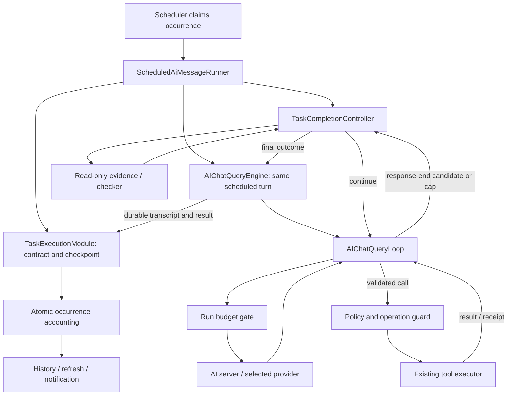

# Scheduled AI Task Completion and Premature-Stop Recovery Technical Design

## Document information

- Version: 1.0
- Date: 2026-10-04
- Status: Proposed; additions below are design targets, not implemented APIs.
- Requirements: [Scheduled task completion and recovery PRD](./scheduled-loop-premature-stop-recovery-advice.md).
- Initial scope: enrolled chat-bound scheduled occurrences in AiFetchly.
- Server target: `/Users/cengjianze/project/aifetchserver`.
- Related: [scheduled-loop design](./ai-chat-scheduled-loop-technical-design.md), [goal-loop design](./ai-chat-goal-loop-technical-design.md).
- For enrolled executions this design supersedes assumptions equating a normal turn ending with successful task completion. Existing cadence, conversation binding, overlap, and approval contracts remain authoritative.

## 1. Architecture decision

Use an occurrence-scoped `TaskCompletionController`, created by the scheduled runner in the Electron main process and attached to the existing query engine through a trusted binding. The inner loop consults it when a response proposes an end to work. The controller owns verification, semantic continuation, progress accounting, and outcome. The loop owns transcript/tool execution; the scheduler owns occurrence timing.

| Approach | Assessment |
| --- | --- |
| Broaden `goalTextStop` with scheduled context. | Retries completions/blockers indiscriminately, misses first-response/resume cases, renews allowances on tool traffic, and retains false-success finalization. Rejected as final design. |
| Create ephemeral conversation goals. | Couples recovery to user-facing goal ownership/state/accounting. Rejected. |
| New scheduled agent engine. | Duplicates streaming, compaction, tools, permissions, and transcript logic. Rejected. |
| Trusted controller attached to existing engine. | Selected: evidence-based decisions within one occurrence and existing policy boundaries. |

Semantic recovery does not recursively call `submitMessage()` or restart the original task. One occurrence retains one scheduled user message and one assistant-turn identity. Permission resumes can invoke the loop again but retain the controller, contract, and durable counters.

## 2. Current integration points

| Existing file | Relevant behavior |
| --- | --- |
| `src/service/AIChatQueryLoop.ts` | Parses calls; handles output/empty/text-stop recovery; returns completed/cancelled/paused/failed. General cap: 30 rounds plus up to 200 continuation cycles. |
| `src/service/AIChatQueryEngine.ts` | Assembles initial/resumed inputs, saves messages, emits terminal completion, resolves goal mode by conversation lookup. |
| `src/service/AIChatQueryEvents.ts` | Loop input/result and pending permission/question types. Binding must survive every applicable resume path. |
| `src/service/AIChatQueryEngineFactory.ts` | Scheduled engine construction and task-scoped tool policy. |
| `src/service/ScheduledLoopEventSink.ts` | Currently converts any complete event into completed occurrence outcome. |
| `src/service/ScheduledAiMessageRunner.ts` | Run/lease/engine registration, timeouts, permission waits, finalization, schedule accounting, broadcasts. |
| `src/entity/AiMessageTask.entity.ts` | Prompt, workspace, configured runtime/tool/continue limits, and policy. |
| `src/entity/AiMessageTaskRun.entity.ts` | Occurrence identity, message links, statuses, metadata, unique occurrence idempotency key. |
| `src/modules/AiMessageTaskRunModule.ts` | Current completion/failure updates are not versioned checkpoints or atomic accounting transactions; metadata updates can replace prior metadata. |
| `src/service/aiChatGoal/*` | Evidence/verifier/controller concepts exist; not a turnkey scheduled implementation. |

Existing evidence limitations must not be inherited blindly. `GoalEvidenceCollector.collectFile()` currently treats a present file as passing a changed-file check. The qualitative verifier receives reason/state summaries, and the goal loop does not collect rich qualitative evidence for it. Scheduled verification requires current artifact/record/receipt references and content appropriate to each criterion.

## 3. Data flow



Database work flows through Modules/Models; services receive injectable ports. No TypeORM access enters IPC or worker files. The controller remains in the main process. Future evidence-computation workers belong under `src/childprocess/` and send data to the main process for persistence.

## 4. Proposed file responsibilities

New files unless marked existing:

| File | Responsibility |
| --- | --- |
| `src/entityTypes/aiTaskExecutionTypes.ts` | Validated serialized contract/evidence/checkpoint/decision/outcome types. |
| `src/service/aiTaskExecution/TaskCompletionController.ts` | Decision precedence, verification, continuation reservations, terminal outcomes. |
| `src/service/aiTaskExecution/TaskCompletionContractService.ts` | Validate/configure/freeze criteria from the original objective without broadening authorization. |
| `src/service/aiTaskExecution/TaskEvidenceService.ts` | Bounded task-specific read-only adapters, deterministic checks, checker dispatch. |
| `src/service/aiTaskExecution/TaskProgressTracker.ts` | Stable evidence fingerprints and repeated request/result detection. |
| `src/service/aiTaskExecution/TaskRunBudget.ts` | Provider/tool/checker/time/token reservations and reconciliation. |
| `src/service/aiTaskExecution/TaskOperationGuard.ts` | Native operation-dedup adapters or durable claim/reconciliation fallback. |
| `src/modules/AiTaskExecutionModule.ts` | Validated checkpoints/transitions; atomic terminal accounting. |
| `src/model/AiTaskExecution.model.ts` | Versioned updates on existing task/run tables, transactions, idempotent finalization. |
| `src/entity/AiTaskOperation.entity.ts` | Durable operation key/state/receipt when existing native guards are insufficient. |
| `src/model/AiTaskOperation.model.ts`, `src/modules/AiTaskOperationModule.ts` | Main-process claims, reconciliation, and receipt updates. |
| Existing engine/loop/events/factory/sink/runner | Trusted binding, response-end decisions, budget hooks, pauses/resumes, outcomes. |
| Existing entities/task types/SQLite configuration | Additive contract/checkpoint/outcome fields and operation-entity registration. |

Avoid unrelated query-loop refactoring. Actual `/goal` transitions remain owned by its existing goal controller. Share pure verification utilities selectively, with compatibility tests; scheduled runs never invoke user-facing goal persistence as a recovery shortcut.

## 5. Contract and runtime types

### 5.1 Completion contract

These interfaces illustrate required semantics. Implementations decode external JSON from `unknown`, reject inappropriate fields, and use explicit return types without `any`.

```typescript
export type TaskOutcome =
  | "verified_complete" | "incomplete" | "needs_user_input"
  | "blocked_by_policy" | "failed" | "cancelled" | "timeout";

export interface TaskCompletionContract {
  readonly schemaVersion: 1;
  readonly contractId: string;
  readonly contractHash: string;
  readonly objective: string;
  readonly sourceUserMessageId: string;
  readonly mode: "verified" | "best_effort";
  readonly criteria: readonly TaskCriterion[];
}

export type TaskCriterion =
  | { readonly id: string; readonly required: boolean;
      readonly kind: "observation"; readonly description: string;
      readonly adapterKey: string; readonly targetId: string }
  | { readonly id: string; readonly required: boolean;
      readonly kind: "record_count"; readonly description: string;
      readonly adapterKey: string; readonly targetId: string;
      readonly scope: "occurrence" | "cumulative"; readonly minimum: number }
  | { readonly id: string; readonly required: boolean;
      readonly kind: "artifact"; readonly description: string;
      readonly relativePath: string; readonly expectation: "exists" | "changed";
      readonly requiredContentChecks: readonly string[] }
  | { readonly id: string; readonly required: boolean;
      readonly kind: "operation_receipt"; readonly description: string;
      readonly adapterKey: string; readonly targetId: string;
      readonly requiredState: "accepted" | "completed" }
  | { readonly id: string; readonly required: boolean;
      readonly kind: "qualitative"; readonly description: string;
      readonly sourceSelectorKeys: readonly string[] };
```

Adapter/content-check keys resolve through a trusted registry, not executable expressions. Contracts contain no arbitrary SQL, commands, scripts, or model-supplied predicate code. Record qualification comes from the configured domain adapter and approved criterion. Evidence selectors are validated against approved workspace/domain targets.

Qualitative source selectors identify approved evidence sources at contract creation; actual evidence IDs are generated during collection and passed to the checker. An observation verifies both retrieval and the requested report. If the report is free text rather than deterministically comparable structured output, add a required qualitative report criterion; retrieval alone cannot satisfy the full objective.

Examples:

- Observation: deployment job was queried during this occurrence and report matches current status. Running/failed external status can satisfy an observation.
- Records: 100 qualifying saved contacts in the approved campaign; duplicates/unqualified contacts do not count. Prior occurrences contribute only for explicit cumulative scope.
- Changed artifact: current hash differs from pre-run baseline and required content checks pass; existence alone does not pass.
- Send receipt: accepted job proves “start sending”; delivery requires its actual completed/delivery state. Queue acceptance cannot substitute for delivery.

A deterministic compiler recognizes explicit objectives through registered task templates. Ambiguous/unsupported objectives use clarification or best-effort; a model's extraction alone never enables additional actions. Freeze the configured contract into the run. A best-effort contract with zero required criteria cannot pass vacuously; it remains unverified unless a validated contract is established through the appropriate user/task configuration workflow before a new run.

### 5.2 Evidence, candidates, and decisions

```typescript
export interface TaskEvidence {
  readonly evidenceId: string;
  readonly criterionId: string;
  readonly contractHash: string;
  readonly runId: number;
  readonly observedAt: string;
  readonly source: string;
  readonly sourceRevision: string;
  readonly state: "pass" | "fail" | "unknown";
  readonly referenceIds: readonly string[];
  readonly summary: string;
}

export interface TaskEndCandidate {
  readonly candidateId: string;
  readonly runId: number;
  readonly content: string;
  readonly finishReason: string | null;
  readonly provenance: "provider" | "adapter" | "synthetic" | "unknown";
  readonly streamTerminalSeen: boolean;
  readonly boundary: "response_end" | "round_cap" | "budget_cap";
  readonly pendingPermission: boolean;
  readonly pendingQuestion: boolean;
  readonly pendingPlanApproval: boolean;
  readonly safetyRestriction: boolean;
}

export type TaskCompletionDecision =
  | { readonly type: "continue"; readonly continuationId: string;
      readonly prompt: string; readonly unmetCriterionIds: readonly string[] }
  | { readonly type: "wait"; readonly reason: "permission" | "external_job" }
  | { readonly type: "finish"; readonly outcome: TaskOutcome;
      readonly reasonCode: string; readonly evidenceIds: readonly string[];
      readonly summary: string; readonly remainingWork: readonly string[] };
```

A `TaskRunBinding` carries run ID, occurrence key, contract hash, controller reference, and budget reference. It is trusted main-process runtime state, not serializable renderer input. The controller exposes `decide(candidate, signal): Promise<TaskCompletionDecision>`. Budget methods reserve/reconcile provider, checker, tool, and continuation work using stable request IDs and return a typed reservation or budget-exhausted decision. Detailed port implementations belong in the listed services.

Add optional `taskRun` to trusted engine submission, active-turn state, loop input, `PendingPermissionTurn`, and `PendingPlanQuestionTurn`. Preserve it through permission, plan-question, and plan-approval resume paths. It is absent from renderer `ChatV2StreamRequest`; JSON supplied by a model or renderer cannot attach it. Resume validates active run, conversation, contract hash, and fenced lease generation.

For enrolled tasks, explicit task ownership takes precedence over `goalAutoContinue`. Existing goal/empty-stop/cap nudges cannot stack with controller continuations. Ordinary interactive goals retain their own owner and behavior. A goal lookup alone cannot change a scheduled contract.

## 6. Persistence and concurrency

### 6.1 Additive schema

| Entity | Additions |
| --- | --- |
| `AiMessageTaskEntity` | Nullable `completion_contract_json`, nullable `execution_policy_json`, `execution_policy_version` default 0; version 0 means legacy/un-enrolled. |
| `AiMessageTaskRunEntity` | Nullable `execution_state_json`, `execution_state_version` default 0, nullable `task_outcome`, `terminal_reason_code`, `finalized_at`, `result_notification_key`. |
| `AiTaskOperationEntity` | Unique operation key, run ID, trusted tool/domain identity, canonical intent hash, operation state, receipt reference, timestamps, claim generation, safe failure code. |

Checkpoint stores contract/policy snapshots, source baselines, reservations/counters, consumed active time, bounded evidence references/summary, candidate verdict, progress fingerprint, no-progress streak, and continuation references. Full transcript/results remain in existing scoped stores.

Checkpoint states are `active`, `verifying`, `continuing`, `waiting_permission`, `waiting_external_job`, and `terminal`. Persist the expected resume/action identity with waiting states. External-job waiting remains inside the active-time allowance; permission waiting alone suspends that allowance. A terminal state is immutable except for delivery/reconciliation annotations.

Do not replace `metadata_json` with partial recovery updates. Store the checkpoint separately and merge summary metadata at finalization. Initial bounds: 64 KiB checkpoint, 2 KiB evidence summaries, 100 evidence references, 20 recent request/result fingerprints. Larger required evidence uses durable scoped artifact/result references; never silently drop required criteria to fit bounds.

Add `incomplete` and `needs_user_input` to run-status types. Map `verified_complete` to existing `completed`; preserve its semantic value in `task_outcome`. Other terminal outcomes use matching existing/new statuses. Permission waiting is runtime/checkpoint state with run status running; existing pending-permission metadata remains authoritative. Terminal needs-input has no dangling permission handle.

Existing SQLite setup registers entities and uses TypeORM synchronization; implementation must test upgrade from a real old-schema fixture. New nullable columns/defaults preserve old rows. Validate stored JSON by schema version and treat unreadable enrolled state as non-success; do not downgrade it to legacy mode. Add indexes for operation keys and run lookup; avoid destructive migrations on rollback.

### 6.2 Versioned checkpoints

Model transactions update state only when `execution_state_version` matches the loaded version and the run is unfinalized. Increment the version on every reservation/checkpoint. On conflict, reload once and re-evaluate; repeated conflict stops dispatch with `STATE_CONFLICT`. Retrying a database update must never repeat an external action.

Persist reservations before dispatch. IDs are stable within the run; reserving an existing ID returns its prior reservation without incrementing. A crash between reservation and dispatch conservatively consumes allowance. A crash after dispatch but before receipt persistence produces an uncertain operation.

New Model entry points enforce worker-access guards. Modules use `BaseModule.ensureConnection()` and Token-derived database path. Runner and IPC do not directly query repositories.

### 6.3 Atomic finalization and delivery

Replace enrolled-run complete/fail plus separate counter updates with `AiTaskExecutionModule.finalizeOccurrence()`:

1. Claim an unfinalized run using expected state version in a transaction.
2. Save outcome, reason, linked assistant result, evidence/counter summary, finished time, and finalized marker.
3. Update schedule counters and next-run state exactly once under existing cadence rules.
4. Save notification identity `task-result:<runId>` and pending delivery state in the same transaction.
5. Commit, then publish refresh/notification and mark delivery afterward.

The linked assistant result must already be durable for success. If saving fails, do not emit success. If finalization fails, stop new effects, report `PERSISTENCE_FAILED`, and retain last checkpoint for startup reconciliation. Never fall back to old unconditional success.

A second finalizer returns the existing outcome; counters never increment twice. Late checker/tool/permission callbacks validate run generation and finalized state. Release the shared conversation lease once on terminal cleanup. Notification retries use the saved identity and do not rerun work. Transport without delivery dedup has unavoidable notification uncertainty; do not claim guaranteed exactly-once delivery, though database accounting remains idempotent.

## 7. Decision precedence and loop behavior

### 7.1 Response classification

Preserve finish reason and separately record whether a terminal choice was received and its optional provenance. Extend `OpenAIStreamAccumulator` and API stream types as needed. Missing server diagnostics remain unknown. Clean EOF or `[DONE]` alone does not establish task completion.

Validated complete calls use normal execution even with `stop`, subject to restrictions/budgets. Incomplete calls never execute. Explicit filter/refusal prevents effect dispatch even if an inconsistent payload includes calls. Output/transport recovery retains its existing ownership but passes the same run budget gate.

For enrolled no-call endings and round caps, consult the controller before a terminal completion event. Suppress existing empty/text-stop/hidden-cap continuations unless the controller permits continuation. Parser salvage may remain, but exhausted recovery creates a non-success candidate; it cannot silently complete unfinished work.

### 7.2 Controller order

1. Validate ownership, contract hash, active generation, and unfinalized state; reject stale work.
2. User cancellation wins over verification; preserve progress and finish cancelled.
3. Honor safety restrictions, permanent entitlement/auth errors, and policy blocks. No checker can bypass them.
4. Pending permission/plan/question wins over semantic continuation. Permission uses bounded existing resume; unresolved plan/questions finish needs-input and pause recurrence.
5. For a trustworthy candidate, collect current deterministic evidence and validate scope/revision. Invoke the checker only for qualitative criteria with usable evidence and remaining reservation.
6. If all required criteria pass, finish verified immediately. At exhausted maker/request budgets, local bounded read-only checks may establish success; unreserved remote checker work is forbidden.
7. Update progress/no-progress state for unfinished candidates. Unknown evidence stays unknown.
8. Exhausted active deadline or total budget produces timeout/incomplete with exact reason. No further dispatch. At deadline expiry, use only already collected admissible evidence; no new slow verification.
9. At repeated no-progress bound, finish incomplete. Uncertain consequential operations require reconciliation and cannot be repeated.
10. If unmet work is feasible in approved scope, reserve a semantic continuation and return a targeted prompt. Otherwise return needs-input, blocked, or incomplete.

First eligible unfinished response without relevant progress increments the streak. Relevant new evidence resets it to zero. Discovery calls, generic successes, generated timestamps, and model summaries do not reset it. Checker retries consume checker/provider budgets but do not count as additional maker no-progress boundaries.

Blocker text is a candidate signal checked against actual permissions, failures, missing data, and evidence. Do not ignore it or trust it as success. Read-only clarification can resolve ambiguity but cannot authorize new actions. An unsupported ambiguity ends needs-input/incomplete.

### 7.3 Transcript and continuation

Preserve assistant candidate content as a response segment and append a typed runtime continuation:

```text
Continue the same approved scheduled occurrence.
Objective: <unchanged objective>
Verified progress: <authoritative bounded summary>
Unmet criteria: <missing conditions>
Failures or restrictions: <safe summary>
Remaining limits: <trusted runtime limits>
Perform an allowed next step or explain the blocker requiring input.
Do not repeat operations with receipts. Do not claim completion without
required evidence. A text deliverable does not require tool calls.
```

The angle-bracket values are runtime substitutions, not unfinished design sections. Do not save continuation as another user request. Persist a typed runtime-continuation record/reference for transcript assembly, excluded from user-intent extraction and outbound authorization. Include it in order with complete tool-call/result groups after compaction/resume. Compaction preserves contract/progress/receipt references and cannot erase durable counters.

Keep per-response content segments. Stream progress normally and retain it in history; final result presents actual output or a controller-authored incomplete explanation. Do not concatenate repeated preambles into artificial completion text. Assistant metadata retains the provider reason beside the independent task outcome.

## 8. Evidence verification

### 8.1 Admissibility and adapters

Each adapter returns authoritative source IDs/revision, evaluated state, and bounded excerpt. Recheck approved scope at collection time. Distinguish occurrence-local evidence from explicitly cumulative targets; retain pre-run baseline where change is required.

- Records: read through existing Models/Modules, scoped to approved campaign/target; apply domain identity dedup and qualification.
- Files: existing path guard, baseline/current hash and content checks. Missing baseline makes changed unknown. Do not execute generated files as evidence checks.
- Operations: native send/job receipts for approved intent; distinguish accepted, pending, completed, failed, and unknown.
- Observations: fresh retrieval in this occurrence plus report consistency with observed status.
- Text: actual deliverable and supplied source excerpts, not a sentence claiming completion.

If relevant source changes during verification, discard stale verdict and recollect once within budgets; repeated churn ends unknown/incomplete. No arbitrary model-selected commands. Existing approved command checks can run only through existing approval/tool/accounting boundaries.

### 8.2 Checker contract

Separate maker and checker invocations. Checker receives frozen criteria, actual evidence IDs/excerpts/revisions, and deliverable. It has no mutation tools, treats evidence as untrusted data, and cannot alter objectives. Use low temperature where supported; validity does not rely on provider JSON-mode or temperature compliance.

Expected JSON:

```json
{
  "criteria": [
    {
      "criterionId": "report-status",
      "verdict": "pass",
      "evidenceIds": ["status-evidence-1", "report-evidence-1"],
      "reason": "The report matches the supplied current status."
    }
  ]
}
```

Require exact known criteria, no duplicates, enum validity, reference membership/scope/current revisions, length bounds, and one result per requested criterion. Every pass cites admissible supporting evidence. Missing/invalid output is unknown; required deterministic fail cannot be overridden. Checker independence alone does not prove reliability; side effects require authoritative receipts.

One checker retry per unchanged candidate is allowed for transient/invalid output, using the same evidence. Six attempts maximum per run and all share request/token gates. Persistent verification failure ends incomplete; do not keep maker work running to conceal an unavailable checker.

## 9. Budgets, progress, and timer ownership

`TaskRunBudget` is the sole occurrence-wide reservation authority. Share it across maker, checker, compaction, fallback, HTTP retries, tools, and permitted nested-agent dispatches. Count actual wire attempts, not only `loop.run()` or outer API calls.

| Counter | Rule |
| --- | --- |
| Semantic continuations | Reserve before controller returns continue; total never resets; default min(configured, 3), hard cap 10. |
| Provider attempts | Reserve immediately before each wire attempt; 60 total across all dispatch paths. |
| Tools | Reserve before executor invocation, including failed execution; previews/receipt reuse are not effect executions. |
| Checker | Reserve with provider attempt; at most 2 per candidate and 6 per run. |
| Tokens | Reserve estimated full input plus permitted output; reconcile actual usage; 128,000 total default. |
| Active time | All active maker/tool/checker/compaction/retry segments accumulate across resumes. |
| No-progress streak | Increment at eligible unfinished response boundaries; relevant evidence alone resets; bound 3. |

Conservative token estimates do not guarantee a billing ceiling. If reported actual exceeds estimate, record overage and block subsequent dispatch. Deduplicate usage by request ID. Context indicators keep existing last-round meanings; occurrence usage sums all prompts/outputs, including repeated prompts. Usage is labeled actual/estimated/unavailable.

Validate all configured limits as positive safe integers and enforce hard caps. Active allowance is `min(task.maxRuntimeMs, SCHEDULED_LOOP_RUN_TIMEOUT_MS)`, not a fresh ten minutes after each pause. User wait excludes active time but retains already consumed time. Permission wait keeps one-hour backstop. Terminal questions pause recurrence rather than leaving an invisible indefinite wait.

Runner/budget binding owns timers. On pause checkpoint consumed time and suspend active timer. On resume arm remaining active allowance, bounded by existing resume timeout. Deadline expiry aborts maker/checker/tool awaits and force-resolves outstanding waits; post-header provider stalls cannot hold a lease indefinitely. Non-cancellable dispatched effects remain uncertain until reconciled.

Nested agents require delegated reservations from this parent run and deduplicated accounting. Do not enroll tools/agents in strict attempt enforcement until an adapter exposes their dispatch usage; unsupported opaque work is not an exception to limits.

## 10. Consequential-action protection

### 10.1 Stable operation identity

Changing provider tool-call IDs cannot deduplicate an action. Generate an operation key from trusted run identity, domain operation, approved target, canonical intent arguments, and an action ordinal only when the contract explicitly permits repeated identical actions. The maker cannot invent an ordinal to evade a claim.

Retain existing send-batch/authorization/hash checks and domain dedup. Prefer native claims/receipts; the generic guard adds missing durability. Exclude credentials/volatile IDs from hashes and raw sensitive data from keys/logs.

### 10.2 State machine

```text
prepared -> claimed -> dispatched -> confirmed
                           |
                           +-> unknown -> confirmed / failed / reconciliation
claimed -> failed-before-dispatch
```

Claim before dispatch; supply stable provider idempotency key where supported. Confirmed repetitions return stored receipt. Pending/unknown repetitions query native operation status. Retry only with definitive no-effect failure evidence, existing permission, and budget.

Crash between dispatch and confirmation produces unknown. If there is neither provider idempotency nor lookup, finish incomplete and pause for reconciliation. Do not promise exactly-once effects in that case. New occurrences use separate operation keys, but existing recipient/campaign dedup remains authoritative across occurrences.

Before dispatch, also look for unresolved earlier operations matching the same domain intent/target, using a non-unique domain/target/intent/state index or native job lookup. A new run ID must not bypass an unknown earlier send/job. Resolve it or report reconciliation required before dispatching that same intent again. Explicitly independent recurring actions have distinct trusted domain identities; a model-generated argument variation cannot establish that independence.

### 10.3 Background jobs

Starting a job and completing its objective differ. Accepted receipt satisfies a start-only criterion; completion requires actual confirmed completion. Approved read-only polling consumes budgets/time with backoff and a minimum one-second interval. External pending work can end this occurrence incomplete while later monitoring checks continue. No unbounded internal polling.

## 11. Results, events, accounting, and renderer

Add a task result to enrolled terminal loop/engine results and stream completion payload: run ID, contract hash, outcome, reason, progress/remaining work, evidence references, counter summary. A chat complete closes the turn; its task result determines occurrence success.

For enrolled runs, `ScheduledLoopEventSink` rejects missing/malformed task result as `MISSING_TASK_OUTCOME`; it cannot fall back to success. Intermediate boundaries emit non-terminal `task_verifying`, `task_continuing`, and `task_progress` events scoped by conversation/run/message ID and never resolve the terminal promise. Preserve existing permission-event ordering.

Save final/partial assistant content and metadata before success notification. Runner calls atomic finalizer. Record actual tool counts/blocked records, replacing current zero placeholders. Update typed result unions, serializers, stores, and history readers before enabling recovery.

| Outcome | Run status | Schedule handling |
| --- | --- | --- |
| Verified | completed | Success once; reset failure streak; next anchored occurrence. |
| Incomplete / failed / timeout | Matching status | Failure once; existing three-failure termination; anchored cadence otherwise. |
| Incomplete with unknown action outcome | incomplete | Failure once and immediate reconciliation pause; no next occurrence until resolved. |
| Needs input / policy blocked | Matching status | Pause; no automatic continuation or failure increment for pause itself. |
| Cancelled | cancelled | No failure increment; current-run stop retains recurrence; schedule-stop stays stopped. |
| Restart interruption | interrupted | No verified success; preserve existing interruption/coalescing policy and reconcile uncertain operations. |

Never revive a stopped/expired/deleted schedule during finalization. Recovery does not consume another occurrence or shift interval anchor. Contract fulfillment does not stop recurrence.

Renderer changes stay in existing scheduled status, progress, and run-history surfaces: update `ChatV2StreamChunk`, event-to-IPC mappings, API/store serializers, `AiChatV2.vue`, and relevant status components. Translate verifying, continuing, incomplete, needs input, no progress, verification unavailable, uncertain operation, and remaining-work text in all six languages with English fallbacks. Task metadata grants no renderer mutation authority.

## 12. Permission resume and restart

- Pause: same controller/budget references on pending turn, durable checkpoint/operation state, existing registry and bounded wait.
- Grant/deny: verify pending run/generation; restore remaining time/counters; retain source user message, intent decision, outbound authorization/pre-authorization, workspace, and catalog state. Denial persists for the attempted operation.
- Restart: no automatic controller reconstruction/execution. Mark unfinished run interrupted through startup recovery; preserve checkpoints/receipts; invalidate old callbacks/handles.
- Future occurrence: normal coalescing and new baseline; never silently redo uncertain prior operations.
- Manual recovery, if offered: reconcile first, obtain new fenced lease, reuse same counters for the old run. A newly authorized run is clearly a new contract/run; it cannot disguise old budget renewal.

## 13. Server integration

### 13.1 Targets and semantics

Target `aifetchserver/api/openai_compatible.py`, selected adapters such as `aifetchserver/services/adapters/openai_adapter.py`, and shared stream/debug types. Follow server `AGENTS.md`: monitoring, service/database separation, `uv` tooling, tests, commits. Link this design from server documentation as needed rather than create divergent requirements.

Server never evaluates desktop contracts or runs desktop tools. Preserve provider reasons; existing missing-terminal synthesis stays compatible but records provenance. Do not apply an image-response whitelist to unrelated passthrough streams or silently translate errors into successful stops.

### 13.2 Correlation and optional diagnostics

Desktop supplies opaque request/run correlation through optional metadata/headers; server validates them as labels, never authorization. An optional response header exposes server correlation before streaming. After provider selection/failover, optional capability-negotiated metadata reports actual serving provenance.

Proposed `aifetch_stream_diagnostics` extension:

```json
{
  "schema_version": 1,
  "request_id": "opaque-request-id",
  "server_query_id": "opaque-query-id",
  "provider_label": "configured-provider-alias",
  "selected_model": "resolved-model",
  "upstream_response_id": "optional-safe-id",
  "upstream_finish_reason": "stop",
  "forwarded_finish_reason": "stop",
  "terminal_origin": "provider",
  "upstream_terminal_seen": true,
  "output_token_limit": 16384,
  "usage_source": "provider"
}
```

Origins: provider, adapter-normalized, synthetic-missing-terminal, transport-error; unknown adapters report unknown raw provenance. Provider failover records actual serving model/attempt labels, not just initially requested model. Never expose credential URLs, API keys, or internal API-setting row IDs to renderer.

Serialized `terminal_origin` values use `provider`, `adapter_normalized`, `synthetic_missing_terminal`, `transport_error`, or `unknown`. Map the first three to candidate provenance `provider`, `adapter`, and `synthetic`. Transport errors take the error path rather than a normal response candidate; missing diagnostics map to `unknown`.

Metadata is optional and capability-negotiated. Older consumers ignore/receive no extension; desktop tolerates absence. Preserve usage after terminal reason and existing error/`[DONE]` behavior. Diagnostics cannot manufacture task success.

Routine logs contain safe codes/labels, lengths/counts, request correlations, safe tool-schema identities, output limit, usage source. Exclude full prompts/results/arguments/recipients/reasoning. A useful trace distinguishes raw provider, adapter output, and forwarded/synthetic terminals when those layers expose them. `auto` alone never proves origin of failure.

## 14. Error taxonomy

| Code | Behavior |
| --- | --- |
| `CRITERIA_SATISFIED` | Verified complete after all required checks pass. |
| `NO_PROGRESS` | Incomplete at stable-obstruction streak. |
| `CONTINUATION_LIMIT`, `MODEL_ATTEMPT_LIMIT`, `TOOL_LIMIT`, `TOKEN_LIMIT` | Incomplete unless available evidence already verifies; no subsequent work reservation. |
| `ACTIVE_RUNTIME_LIMIT` | Timeout unless verified before expiry. |
| `VERIFICATION_UNAVAILABLE`, `INVALID_VERIFIER_RESPONSE`, `EVIDENCE_UNAVAILABLE` | Unknown/incomplete after permitted checker retry. |
| `UNKNOWN_ACTION_OUTCOME` | Incomplete, reconciliation required, no replay. |
| `INPUT_REQUIRED`, `PERMISSION_DENIED` | Actual needs-input/policy boundary; retain pending semantics if genuinely resumable. |
| `CONTENT_RESTRICTED` | Policy blocked, no bypass. |
| `AI_DISABLED`, permanent auth/quota error | Existing actionable failure/pause; no semantic retry. |
| `STREAM_INCOMPLETE`, `OUTPUT_TRUNCATED` | Bounded existing transport/output recovery, then non-success; provenance retained. |
| `PERSISTENCE_FAILED`, `STATE_CONFLICT`, `MISSING_TASK_OUTCOME` | No success publish; stop new effects; preserve checkpoint. |
| `USER_CANCELLED`, `SCHEDULE_STOPPED` | Cancelled; ignore late callbacks; no failure-streak increment. |

HTTP layer owns transient transport retries. Semantic recovery does not stack pristine-task replay over HTTP retries. Partial visible output or uncertain effects require transcript/operation-aware continuation or failure.

## 15. Test ownership and verification

New test names below are proposed; extend existing coverage without deleting meaningful assertions.

| Test location | Required coverage |
| --- | --- |
| `test/vitest/main/service/TaskCompletionController.test.ts` | First-response stop; 54/100; immediate genuine completion; monitor while job pending; deterministic failure versus checker pass; blockers/caps. |
| `test/vitest/main/service/TaskRunBudget.test.ts` | Reservations; resume totals; actual HTTP retries; compaction/fallback/checker accounting; token dedup/estimates; consumed time and abort. |
| `test/vitest/main/service/TaskProgressTracker.test.ts` | Same result/new timestamp; new qualifying records; discovery no reset; errors cannot replenish totals. |
| `test/vitest/main/service/TaskEvidenceService.test.ts` | Wrong run/target; stale revisions; changed-file baseline; actual text evidence; invented references; malformed checker output; bounded persistence. |
| `test/vitest/main/service/TaskOperationGuard.test.ts` | New provider ID/same intent; receipt reuse; pending/unknown; crash after dispatch; safe no-effect retry; cross-occurrence dedup. |
| `test/modules/AiTaskExecutionModule.test.ts` | Old-schema upgrade; concurrent CAS; finalization races; single count increment; metadata preservation; persistence failure; worker guard; notification identity. |
| Existing loop/permission/cancellation/timeout suites | Controller before terminal event; old nudges suppressed only enrolled; calls with stop; restriction/truncation; binding on every resume; caps cannot silently succeed. |
| Existing scheduled runner chat/permission suites | Frozen identity; missing outcome; actual counts; remaining active time; durable-success ordering; stopped schedule during checker; retained cadence. |
| `test/vitest/main/components/` | Scheduled status/progress/history, main interactions, language fallbacks, incomplete/uncertain outcomes, grant/deny, run-stop versus schedule-stop. |
| `test/e2e/specs/` | Fake stream tool-stop-recovery; pause-resume-stop; reload/routing; interruption; one scheduled user message; effect simulator dispatched once. |
| Server unit/integration suites | Raw stop passthrough; absent-terminal origin; normalization; midstream error; post-terminal usage; actual fallback model; optional metadata; sensitive-log exclusion. |

Use fake streams, clocks, temporary SQLite, and an in-memory external-effect simulator. Never send live emails to test dedup. Assert event order, persisted outcome, dispatch counts, operation effects, and scheduler accounting rather than only matching a prompt constant.

Future implementation checks: desktop `yarn testmain`, relevant `yarn test` module cases, `yarn typecheck`, `yarn test:components`, `yarn vue-typecheck`, and `yarn test:e2e` for critical changed flows. Server `uv run pytest` affected suites, `uv run ruff check` changed files, and applicable `uv run mypy` scope. This documentation task does not claim execution of these tests.

## 16. Delivery slices and traceability

| Slice | Deliverables | PRD coverage / gate |
| --- | --- | --- |
| 1. Diagnostics/classification | Correlation/provenance and read-only shadow evaluation; no extra maker actions. | FR-05/06/16; AC-12/14; ordinary-chat compatibility. |
| 2. Durable read-only recovery | Contract/checkpoint, budgets, progress, evidence/checker, complete result/status/UI support. | FR-01–10/12–15; AC-01–08/11/15/16; approved read-only/data enrollment. |
| 3. Guarded effects | Native/generic receipts, reconciliation, crash/finalization tests. | FR-11, NFR-05/07; AC-09/10/13 before effects enrollment. |
| 4. Compatibility expansion | Legacy schedules and explicit autonomous chat through separate enrollment. | FR-04, AC-14; no ordinary-chat conversion. |

No slice enables continuations while retaining unconditional occurrence success. Each completed implementation unit includes meaningful tests and conventional commit per repository policy. This technical design does not authorize implementation or replace a task-by-task execution plan.

## 17. Rollout and rollback

Use trusted feature gate `scheduledTaskCompletionPolicyV1`, frozen in run policy snapshot. Shadow mode uses local read-only evidence and explicitly budgeted checker work; it cannot alter counters or trigger maker continuations. Measure checker cost before enrollment.

Enable read-only tasks first, then guarded effects. Legacy tasks enroll visibly with validated contracts. Null outcome is expected for old history but an error for enrolled runs. Never relabel old completion as verified.

Rollback stops new enrollment/continuations. Active enrolled runs use frozen policy or stop incomplete/cancelled; no fallback success. Retain additive columns/operation records. Quiesce enrolled runs before downgrading to old binaries whose serializers do not recognize new states.

Monitor verified/incomplete outcomes, recovery success, no-progress reasons, maker/checker/compaction attempts, actual/estimated tokens, latency, waits, finalization conflicts, and operation reconciliation. Investigate any duplicate effect or non-verified enrolled run incrementing success. Provider attribution requires the correlated trace, not model-name assumptions.

## 18. Definition of done

- Every PRD acceptance case passes its assigned test layers.
- Enrolled success requires persisted verified outcome.
- Total counters/time survive all resumes and cannot renew through tool traffic.
- Consequential-action enrollment has durable claims/receipts and safe unknown-outcome behavior.
- Status serializers, history, six translations, component tests, and critical E2E flows are complete.
- Ordinary chat, immediate goal loops, cadence/coalescing, workspaces, and approvals pass regression tests.
- Server diagnostics remain optional/compatible and distinguish forwarded/synthetic endings accurately.
- Documentation separates source findings, proposed interfaces, and unresolved production attribution.
