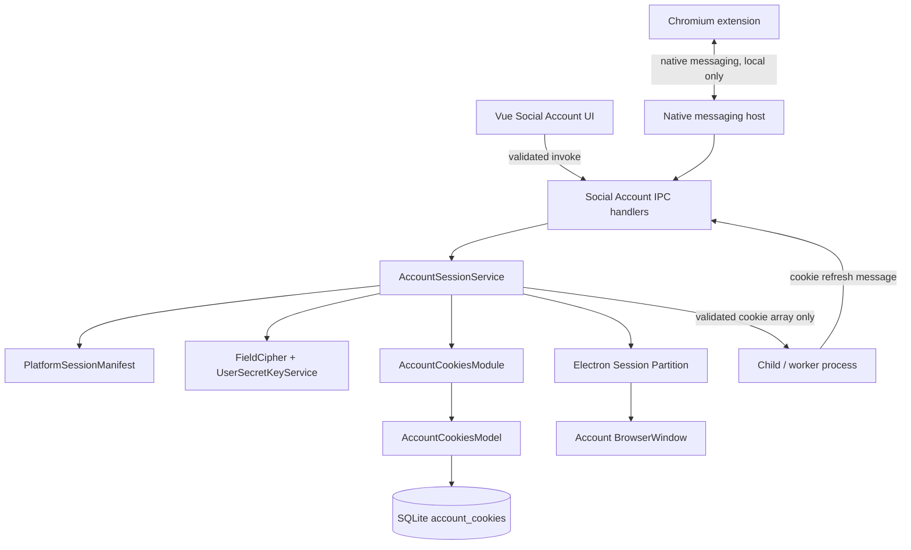
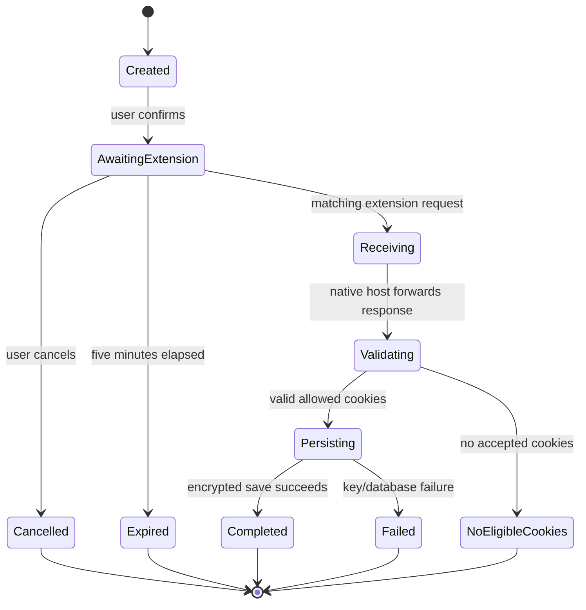

# Secure Social Account Sessions and Browser Profile Import - Technical Design

## Document Information

- **Version**: 1.0
- **Status**: Proposed
- **Created**: 2026-08-05
- **Companion PRD**:
  [`social-account-secure-browser-profile-import-prd.md`](social-account-secure-browser-profile-import-prd.md)
- **Primary owners**: Electron main process and Social Account maintainers
- **Affected runtime boundaries**: renderer, Electron main process, SQLite,
  account BrowserWindow session, child-process messages, Chromium extension,
  native-messaging host

## 1. Purpose

This design replaces plaintext social-account cookie storage with authenticated
encryption, makes each Tool Account reuse one isolated Electron session
partition, captures all required platform and SSO cookies, and adds a
consented browser-profile import workflow.

The implementation must preserve the current automation architecture:

- SQLite access remains in the main process through Model and Module classes.
- Child/worker processes receive already-decrypted cookie arrays in a message
  only when they need them; they never access SQLite or key material.
- Renderer code receives session status metadata, never cookie values.
- AiFetchly does not read a browser's encrypted `Cookies` database.

## 2. Current State and Constraints

### 2.1 Existing persistence

`account_cookies.cookies` is currently a plaintext JSON `CookiesType[]` blob.
The account cookie row has one record per `account_id` in practice, with
`AccountCookiesModel.saveAccountCookies()` performing an application-level
upsert.

```text
AccountCookiesEntity
  account_id       Tool Account ID
  cookies          plaintext JSON today; ENC1 envelope after migration
  partition_path   persistent Electron partition ID
  record_time      last write time
```

### 2.2 Existing cipher

Social-account passwords already use:

```text
UserSecretKeyService
  -> fetches an authenticated per-user 32-byte key
  -> retains it in process memory only
  -> zeros it on invalidation

FieldCipher
  -> AES-256-GCM
  -> ENC1:<base64-iv>:<base64-ciphertext-and-tag>
```

Cookie storage must use the same cipher and key service. It must not use the
legacy `CryptoSource`, which contains a hard-coded key and is unsuitable for
new secret persistence.

### 2.3 Existing session defects

`SocialAccountController.showSocialmediaWin()` currently:

1. creates a fresh `persist:path/...` partition on every open;
2. ignores the saved `partition_path`;
3. re-injects stored cookie JSON;
4. reads cookies only for one `socialTypeUrl` when the window closes;
5. writes the new partition but does not await the save.

The replacement must retain cookie injection as a compatibility layer while
reusing a stable account partition and correctly capturing multi-domain SSO
cookies.

## 3. Architecture



### 3.1 Trust boundaries

| Boundary | Input | Required protection |
|---|---|---|
| Renderer → main | account ID and pairing confirmation | Zod schema, account/platform lookup, no caller-supplied browser profile or domains |
| Browser extension → native host | one-time request token and cookies | native-host allowlisted extension ID, token expiry/replay check, strict schema and payload size |
| Native host → main | import result | local OS pipe only, short-lived request correlation, strict schema |
| SQLite → main | encrypted cookie blob | `ENC1` detection, AES-GCM authentication, schema validation after decrypt |
| Main → worker | normalized cookie array | send only the account's approved cookies; no database path, ciphertext, or secret key |
| Worker → main | refreshed cookie array | strict message schema and the same allowlist/normalization pipeline as all other writes |

## 4. Proposed Module Layout

### 4.1 New and changed source files

| File | Change |
|---|---|
| `src/modules/AccountSessionService.ts` | New orchestration service for cookie read/write, encryption, validation, partition resolution, and Electron session lifecycle. |
| `src/modules/PlatformSessionManifest.ts` | New pure-data allowlist keyed by social platform ID. No renderer imports. |
| `src/schemas/accountCookies.ts` | New Zod v4 schemas for stored cookies, Electron cookies, import messages, and session metadata. |
| `src/schemas/ipc/socialAccount.ts` | Add strict schemas for legacy cookie actions and browser-profile import operations. |
| `src/entity/AccountCookies.entity.ts` | Add non-secret metadata fields. |
| `src/model/AccountCookies.model.ts` | Add migration query/update methods; preserve one-row-per-account behavior. |
| `src/modules/accountCookiesModule.ts` | Delegate to or expose safe persistence helpers used only by `AccountSessionService`. |
| `src/controller/socialaccount-controller.ts` | Replace direct JSON parsing, random partitions, single-URL cookie capture, secret logging, and unawaited saves with `AccountSessionService`. |
| `src/main-process/communication/socialaccount-ipc.ts` | Replace cookie-related `ipcMain.on` channels with validated invoke handlers. |
| `src/config/channellist.ts` | Add browser-profile import and session metadata channels. |
| `src/views/api/socialaccount.ts` | Use `windowInvoke` for validated operations and typed return values. |
| `src/views/pages/socialaccount/widgets/SocialaccountTable.vue` | Add import action and status refresh. |
| `src/views/pages/socialaccount/socialaccountdetail.vue` | Add import dialog trigger and result state. |
| `src/views/components/socialaccount/BrowserProfileImportDialog.vue` | New dialog for account/platform confirmation, extension pairing instructions, progress, success, and error states. |
| `src/views/lang/{en,zh,es,fr,de,ja}.ts` | Add equivalent translations for every new UI string. |
| `src/main-process/browserProfileImport/*` | New main-process-only request registry and native-host integration. |
| `browser-extension/` | New separately packaged Chromium MV3 extension. It is not bundled into renderer code. |
| `src/childprocess/browserProfileNativeHost.ts` | New native-messaging process entry point. It only relays bounded messages and never accesses Electron APIs, SQLite, or the user key. |
| `native-host/` | Native-host packaging and installer registration assets. |

### 4.2 Layering rules

```text
Renderer
  -> views/api/socialaccount.ts
  -> validated IPC handler
  -> AccountSessionService
  -> AccountCookiesModule
  -> AccountCookiesModel
  -> TypeORM / SQLite
```

`AccountSessionService` is the only application service permitted to:

- decrypt persisted account cookies;
- apply cookies to an Electron `Session`;
- capture cookies from an Electron `Session`;
- invoke account-cookie migration;
- accept imported or worker-refreshed cookies for persistent storage.

`AccountCookiesModel` stores ciphertext and metadata only. It does not decrypt,
validate platform domains, resolve an Electron session, or import browser data.

## 5. Data Model

### 5.1 Entity fields

Retain the existing table and `cookies` column name to avoid an incompatible
table rebuild. Its value changes from plaintext JSON to an `ENC1` envelope.

Add nullable, non-secret fields:

```ts
interface AccountCookiesStorageMetadata {
  encryption_version: number | null; // 1 for FieldCipher ENC1
  source:
    | "manual_login"
    | "netscape_file"
    | "browser_profile"
    | "worker_refresh"
    | null;
  cookie_count: number | null;
  session_status: "available" | "missing" | "invalid" | "migration_pending" | null;
  last_error_code: string | null;
  migration_attempted_at: string | null;
}
```

`last_error_code` is a bounded enum-like code, such as
`KEY_UNAVAILABLE`, `CIPHER_INVALID`, `LEGACY_INVALID`, or
`NO_ALLOWED_COOKIES`. It must not contain a thrown error message, cookie value,
profile path, URL query string, or import token.

### 5.2 Partition identity

New partitions use:

```text
persist:social-account-<accountId>
```

The `accountId` is positive and obtained from the database, never from a
renderer-provided partition value. The prefix is fixed and avoids sharing a
partition with any unrelated application session.

For existing valid `persist:` partition values, preserve and reuse the stored
value. Invalid, empty, or non-persistent historical values are replaced only
when the account next obtains a valid session.

### 5.3 Cookie plaintext schema

The normalized in-memory representation is a Zod-derived type:

```ts
const normalizedCookieSchema = z.strictObject({
  domain: z.string().min(1).max(253),
  path: z.string().min(1).max(1024).default("/"),
  name: z.string().min(1).max(4096),
  value: z.string().max(16_384),
  secure: z.boolean(),
  httpOnly: z.boolean().default(false),
  expirationDate: z.number().finite().positive().optional(),
  sameSite: z.enum(["unspecified", "no_restriction", "lax", "strict"]).optional(),
  hostOnly: z.boolean().optional(),
});
```

The actual implementation must use `import { z } from "zod/v4"` and derive
the TypeScript type using `z.infer`. Conversion adapters normalize Netscape,
Electron, Chromium-extension, and Puppeteer values before they reach this
schema.

### 5.4 Encryption format

```text
JSON.stringify(NormalizedCookie[])
  -> FieldCipher.encrypt(plaintext, userSecretKey)
  -> ENC1:<base64-iv>:<base64-ciphertext-and-tag>
  -> account_cookies.cookies
```

No field-level cookie encryption is required. Encrypting the complete snapshot
reduces schema leakage and keeps one authenticated encryption operation per
write. Metadata is deliberately limited to fields needed for UI and support.

## 6. Platform Session Manifest

### 6.1 Shape

`PlatformSessionManifest.ts` exports a readonly array or record. It is pure
data and can be imported by the main process, native-host build tooling, and
extension manifest generator.

```ts
interface PlatformSessionDefinition {
  platformId: number;
  platformName: string;
  loginUrl: string;
  verificationUrl: string;
  allowedDomainSuffixes: readonly string[];
  requiredDomainSuffixes: readonly string[];
  browserProfileImportEnabled: boolean;
}
```

Example only:

```ts
{
  platformId: 1,
  platformName: "youtube",
  loginUrl: "https://www.youtube.com/",
  verificationUrl: "https://www.youtube.com/",
  allowedDomainSuffixes: [
    "youtube.com",
    "google.com",
    "accounts.google.com",
  ],
  requiredDomainSuffixes: ["youtube.com", "google.com"],
  browserProfileImportEnabled: true,
}
```

The actual IDs and URLs must be copied from `SocialPlatformList`; they must not
be guessed in implementation.

### 6.2 Validation

At application startup, validate the manifest:

1. each `platformId` exists exactly once;
2. each domain is lowercase ASCII without protocol, path, wildcard, port, or
   public-suffix-only value;
3. no allowlisted domain is broader than the platform needs;
4. each required domain is also allowlisted;
5. import-enabled platforms have a verification URL.

Invalid manifest data is a developer configuration error and must disable import
for that platform rather than allowing a broader fallback.

### 6.3 Domain matching

```ts
function matchesAllowedDomain(
  cookieDomain: string,
  allowedSuffixes: readonly string[],
): boolean {
  const domain = cookieDomain.trim().toLowerCase().replace(/^\./, "");
  return allowedSuffixes.some(
    (suffix) => domain === suffix || domain.endsWith(`.${suffix}`),
  );
}
```

The real implementation must also reject an empty normalized domain and use
the validated manifest values. It must not use substring matching, such as
`domain.includes("google.com")`, because `not-google.com` would match.

## 7. Account Session Service

### 7.1 Public interface

```ts
export interface AccountSessionMetadata {
  hasCookies: boolean;
  cookieCount: number;
  lastUpdatedAt: string | null;
  importSource:
    | "manual_login"
    | "netscape_file"
    | "browser_profile"
    | "worker_refresh"
    | null;
  sessionStatus: "available" | "missing" | "invalid" | "migration_pending";
}

export class AccountSessionService {
  async getMetadata(accountId: number): Promise<AccountSessionMetadata>;
  async getOrCreatePartition(accountId: number): Promise<string>;
  async applySnapshotToSession(accountId: number, session: Session): Promise<void>;
  async persistSnapshot(input: PersistAccountCookieSnapshotInput): Promise<void>;
  async captureSessionSnapshot(accountId: number, session: Session): Promise<void>;
  async clearAccountSession(accountId: number): Promise<void>;
  async migrateLegacySnapshots(): Promise<CookieMigrationSummary>;
}
```

`PersistAccountCookieSnapshotInput` contains `accountId`, `cookies`, `source`,
and the resolved `partitionPath`. It does not accept caller-supplied allowed
domains. The service resolves the Tool Account and platform manifest itself.

### 7.2 Read flow

```text
getSnapshot(accountId)
  -> AccountCookiesModel.getAccountCookies(accountId)
  -> no row: session_status = missing
  -> ENC1 row:
       get user key
       decrypt
       validate array
       return normalized cookies
  -> legacy plaintext row:
       validate array
       return only to migration/session flow
       schedule safe encryption rewrite
  -> malformed/tampered row:
       mark invalid with safe code
       return no cookies
```

No caller receives the decrypted blob except the main-process session service.
For the account list, `getMetadata()` returns `hasCookies` and `cookieCount`
without serializing the snapshot to renderer code.

### 7.3 Write flow

```text
Persist normalized cookies
  -> look up Tool Account
  -> resolve platform manifest
  -> drop expired and disallowed cookies
  -> deduplicate (domain, path, name), newest valid cookie wins
  -> validate normalized cookie array
  -> obtain user secret key
  -> JSON.stringify
  -> AES-256-GCM encrypt
  -> model upsert ciphertext + metadata in a single database update
```

If the key cannot be obtained, do not write. Return the stable error code
`KEY_UNAVAILABLE`. Do not replace an existing snapshot with an empty row.

### 7.4 Legacy migration

The migration runs after a successful authenticated user-secret-key fetch. It
must not block startup or run in a child process.

```text
for each candidate row where cookies does not start with "ENC1:":
  validate plaintext JSON as normalized cookie array
  if invalid:
    set session_status = invalid, last_error_code = LEGACY_INVALID
    preserve original cookies column for recovery
  else:
    encrypt validated array
    transactionally replace cookies + metadata
```

Migration rules:

- Process in bounded batches, for example 50 rows, to keep SQLite responsive.
- Re-query each row before update and skip it if another writer encrypted it.
- Never report cookie values in migration logs.
- Return aggregate counts: scanned, migrated, invalid, deferred-key,
  persistence-failed.
- Existing `ENC1` rows are not decrypted solely to migrate them.

### 7.5 Stable Electron session flow

Opening an account window:

```text
SocialAccountController.showSocialmediaWin(accountId)
  -> AccountSessionService.getOrCreatePartition(accountId)
  -> session.fromPartition(partitionPath)
  -> configure account proxy for this session
  -> AccountSessionService.applySnapshotToSession(accountId, session)
  -> BrowserWindow({ webPreferences: { session } })
  -> load platform login URL
```

Closing an account window:

```text
BrowserWindow close
  -> await session.cookies.get({})
  -> AccountSessionService.captureSessionSnapshot(accountId, session)
  -> filter with account platform manifest
  -> persist encrypted snapshot and stable partition
  -> only then emit saveCookiesSuccess
```

The close callback must use a `try/finally`-safe design so the BrowserWindow can
finish closing if persistence fails. It must report failure through the existing
safe message envelope, without including cookie details.

### 7.6 Clearing a session

```text
clearAccountSession(accountId)
  -> load persisted partitionPath, if any
  -> delete encrypted cookie row
  -> session.fromPartition(partitionPath).clearStorageData({
       storages: ["cookies", "localstorage", "indexdb", "serviceworkers", "cachestorage"],
     })
  -> clear auth cache where Electron supports it
  -> return safe result
```

The operation must be idempotent. A missing row or absent partition is a
successful clear. The service must only clear the exact persisted account
partition; it must never clear Electron's default session.

## 8. IPC Design

### 8.1 Replace unvalidated event channels

The existing cookie channels use `ipcMain.on` and JSON payloads. Replace them
with `registerValidatedHandler`, which gives a typed response envelope and
guarantees validation before work:

| Current intent | New channel | Schema |
|---|---|---|
| Upload Netscape cookies | `socialaccount:upload:cookies` | strict `{ id: positive integer }` |
| Clear account cookies | `socialaccount:clean:cookies` | strict `{ id: positive integer }` |
| Open manual login | `socialaccount:show:platformpage` | strict `{ id: positive integer }` |
| Read session status | `socialaccount:session:metadata` | strict `{ id: positive integer }` |
| Check profile import | `socialaccount:browser-import:availability` | strict `{ id: positive integer }` |
| Start pairing | `socialaccount:browser-import:start-pairing` | strict `{ id, confirmed: true }` |
| Cancel import | `socialaccount:browser-import:cancel` | strict `{ requestId }` |

Cookie-related IPC channels remain excluded from the dev-browser allowlist.
They must not become callable by AI tool code, general developer tools, or
arbitrary renderer windows.

### 8.2 Return contracts

`windowInvoke` receives the standard `CommonMessage<T>` envelope:

```ts
type BrowserProfileImportResult =
  | {
      state: "success" | "partial_success";
      importedCookieCount: number;
      rejectedCookieCounts: Record<SafeCookieRejectReason, number>;
      verificationUrl: string;
    }
  | {
      state:
        | "cancelled"
        | "extension_missing"
        | "permission_denied"
        | "no_eligible_cookies"
        | "request_expired"
        | "key_unavailable"
        | "storage_failed";
      importedCookieCount: 0;
      rejectedCookieCounts: Record<SafeCookieRejectReason, number>;
    };
```

No response type includes raw cookies, cookie names, filesystem paths, native
host command lines, extension request tokens, or database entities.

## 9. Browser Profile Import

### 9.1 Why extension plus native messaging

Directly opening Chromium's cookie SQLite database would require each browser's
cookie encryption implementation and the operating system's key chain. It also
breaks when the browser holds a file lock or changes its schema.

A Chromium extension can use the browser's own authorized cookie API only for
the profile in which the extension is installed and running. Chromium does not
let an extension enumerate or read arbitrary other browser profiles. Native
messaging keeps the transfer local and avoids accepting remote-debugging
endpoints.

### 9.2 Components

```text
AiFetchly desktop app
  -> creates a one-time import request in memory
  -> shows pairing instructions and a short-lived pairing code

Chromium extension (Manifest V3)
  -> is opened by the user in the intended Chrome, Edge, or Brave profile
  -> asks for optional host permissions for approved manifest domains
  -> reads only approved cookies for its own running browser profile
  -> connects to the local native host

Native messaging host
  -> accepts messages only from production AiFetchly extension ID
  -> relays one bounded reply through the app's authenticated named pipe
  -> has no browser-database access and no domain selection authority
```

### 9.3 Request state machine



The request registry is main-process memory only:

```ts
interface PendingBrowserProfileImport {
  requestId: string;
  requestSecret: string;
  accountId: number;
  platformId: number;
  expiresAtMs: number;
  state: "awaiting_extension" | "receiving";
}
```

Use `crypto.randomBytes(32)` or stronger for `requestSecret`. Delete the entry
on completion, cancellation, timeout, application shutdown, or a failed
validation. One request may persist one response only.

### 9.4 Extension permissions

The extension must use Manifest V3 and request:

- `cookies`;
- `storage` only if required for non-secret request state;
- a reviewed union of `optional_host_permissions` generated at build time from
  platform manifest values.

Optional host permissions are declared in the extension manifest and granted by
the user at runtime. They cannot be generated or broadened dynamically at
runtime. The extension must not request `<all_urls>`, `history`, `bookmarks`, `downloads`,
`management`, `webRequest`, clipboard access, or broad filesystem access.

The extension must show the current target platform before it reads cookies. It
must use a user gesture before granting optional host permissions.

### 9.5 Native host protocol

Use Chromium native-messaging framing: a 32-bit little-endian message length
followed by a UTF-8 JSON payload. Enforce a strict payload limit, for example
1 MiB, before JSON parsing.

The desktop app creates the request after the user chooses a Tool Account and
confirms pairing. It shows a short pairing code. The user then opens the
extension in the exact browser profile they intend to import from and enters or
approves that code. The desktop app does not enumerate browser profiles.

Desktop-to-host command:

```json
{
  "version": 1,
  "type": "import_request",
  "requestId": "uuid",
  "requestSecret": "base64url",
  "platformId": 12,
  "allowedDomains": ["youtube.com", "google.com"],
  "expiresAt": "2026-08-05T13:55:00.000Z"
}
```

Extension-to-host result:

```json
{
  "version": 1,
  "type": "import_result",
  "requestId": "uuid",
  "requestSecret": "base64url",
  "cookies": [],
  "extensionVersion": "1.0.0"
}
```

The host validates the extension origin using the operating-system native-host
manifest, checks protocol version and payload size, then forwards results to the
desktop process through a local, authenticated named pipe or Unix-domain socket.
The desktop process authenticates that relay with the request secret and consumes
the one-time request atomically. Do not implement a general HTTP server.

The desktop process repeats every validation because the native host is a
transport boundary, not a trust boundary.

## 10. Cookie Conversion and Validation

### 10.1 Sources

| Source | Adapter |
|---|---|
| Netscape `.txt` | existing parser → normalize output |
| Electron `session.cookies.get({})` | Electron cookie → normalize |
| Chromium extension `chrome.cookies` | extension cookie → normalize |
| Puppeteer `page.cookies()` worker refresh | worker message → normalize |

### 10.2 Normalization order

```text
raw source cookie
  -> source-specific adapter
  -> normalize domain, path, sameSite, expiry
  -> strict Zod validation
  -> platform domain allowlist filter
  -> drop expired values
  -> dedupe by domain + path + name
  -> persist encrypted snapshot
```

Rules:

- Strip exactly one leading dot from domains for comparison, while retaining a
  form acceptable to Electron when applying the cookie.
- Default a missing path to `/`.
- Reject `SameSite=None` / `no_restriction` when `secure` is false.
- Build a cookie URL with `https` when a cookie is secure or `SameSite=None`;
  otherwise use the platform-appropriate protocol.
- Do not overwrite an accepted valid cookie with a rejected duplicate.
- Count dropped records by safe reason only.

### 10.3 Applying cookies to Electron

`AccountSessionService.applySnapshotToSession` transforms normalized cookies to
Electron's cookie-set shape. It processes cookies independently so one malformed
cookie cannot prevent the rest of a session from loading.

Each rejected application is recorded as an aggregate safe metric. The code does
not call `console.log(cookieDetails)` or log a cookie object.

## 11. Worker Refresh Integration

The current search workflow receives refreshed cookies from a worker and writes
them through `SearchModule.updateAccountCookies`. Replace direct
`AccountCookiesEntity` construction in that path with:

```ts
await accountSessionService.persistSnapshot({
  accountId,
  cookies: refreshedCookies,
  source: "worker_refresh",
  partitionPath: await accountSessionService.getOrCreatePartition(accountId),
});
```

This preserves the rule that workers only send result data to the main process.
The worker never needs the field cipher, SQLite entity, TypeORM repository,
platform-manifest internals, or account partition ID.

## 12. Error Model

| Code | Renderer behavior | Persistence behavior |
|---|---|---|
| `KEY_UNAVAILABLE` | Ask user to restore login/connectivity and retry. | Existing snapshot untouched. |
| `CIPHER_INVALID` | Mark account session invalid; offer reimport/login. | Do not apply row. |
| `LEGACY_INVALID` | Ask user to reauthenticate. | Preserve legacy bytes; mark metadata invalid. |
| `NO_ALLOWED_COOKIES` | Explain that the paired browser profile lacks a supported login. | Do not replace existing snapshot. |
| `REQUEST_EXPIRED` | Restart import. | Delete in-memory request. |
| `EXTENSION_MISSING` | Show installation/open-extension action. | No mutation. |
| `PERMISSION_DENIED` | Explain needed platform permission and allow retry. | No mutation. |
| `SESSION_CAPTURE_FAILED` | Keep account window usable; show safe retry. | Existing snapshot untouched. |
| `PARTITION_CLEAR_FAILED` | State that local session cleanup needs retry. | Delete database row only after documented ordering decision. |

No error message sent to the renderer may include raw native errors without
redaction.

## 13. Database Migration Plan

1. Add nullable metadata columns through the project's TypeORM/SQLite migration
   mechanism and update `src/sql/scraperdb/account_cookies.sql` for fresh
   databases.
2. Deploy reader support for encrypted and legacy values before enabling
   migration.
3. On a valid authenticated main-process session, schedule a bounded background
   migration.
4. Convert valid rows to `ENC1` atomically.
5. Enable encrypted writes for all four sources: Netscape upload, manual login,
   browser-profile import, and worker refresh.
6. After release telemetry confirms successful migration, evaluate removal of
   direct raw-cookie access and unused legacy cookie persistence code.

The application must not add a foreign key in this migration. Existing
`account_cookies` data may include orphans, and adding a constraint would make
upgrade behavior risky. Account deletion continues explicitly calling cookie
cleanup. A later migration may add a foreign key only after an orphan audit.

## 14. Test Plan

### 14.1 Unit tests

Place main-process service tests under `test/vitest/main/` and pure schema or
utility tests under `test/vitest/utilitycode/`.

Required coverage:

- `AccountSessionService` encrypts new snapshots and rejects plaintext fallback.
- `AccountSessionService` decrypts valid `ENC1` data.
- AES-GCM tampering, malformed envelopes, and unavailable keys produce safe
  errors and never return cookies.
- Legacy plaintext migration is valid, idempotent, bounded, and preserves
  invalid rows.
- Domain manifest validation and exact suffix matching reject unsafe patterns.
- Cookie normalizers handle Netscape, Electron, Chromium, and Puppeteer inputs.
- Deduplication chooses the correct valid value without exposing it in assertion
  failures or snapshots.
- Partition resolution reuses historical valid values and creates deterministic
  new values.
- Partition cleanup is scoped to the requested account.
- One-time browser-import requests expire, cannot replay, and reject wrong
  account/platform pairings.

### 14.2 IPC tests

- All legacy and new cookie channels reject missing, malformed, string, negative,
  and unexpected fields.
- Session metadata response has no `cookies` property or raw entity data.
- Cookie-related channels remain excluded from dev-browser access.
- An unsupported platform cannot start pairing or import.
- Renderer cancellation cannot cancel another account's request.

### 14.3 Integration tests

- Use a temporary SQLite database with a mock secret-key service.
- Use a mocked Electron `Session` to assert cookie set/get and
  `clearStorageData` arguments.
- Simulate a Google/YouTube multi-domain session and confirm only allowlisted
  domains persist.
- Simulate a worker refresh and confirm SQLite receives `ENC1` ciphertext while
  the worker sees only normalized plaintext in a message.
- Simulate native-host responses for success, permission denial, expiration,
  replay, invalid JSON, oversized payload, and no eligible cookies.

### 14.4 Manual QA

Test Chrome, Edge, and Brave on each supported desktop operating system after
the extension and installer are available. Test fresh accounts, migrated
plaintext databases, unsupported platforms, missing extension, canceled consent,
and platform security-challenge behavior.

## 15. Rollout and Feature Flags

| Phase | Release gate |
|---|---|
| Secure storage | Encryption/migration tests pass; no plaintext logs remain. |
| Stable partition | Manual-login regression suite passes for an account with proxy and for multi-domain SSO. |
| Browser import internal | Extension and native host limited to development/test extension IDs. |
| Chrome rollout | Feature flag enabled for platform manifests that passed manual QA. |
| Edge and Brave rollout | Compatibility results verified independently; do not assume Chromium behavior is identical. |

Feature flag evaluation occurs in the main process. The renderer may display
availability but cannot force-enable an import path.

## 16. Operational Logging

Permitted log fields:

```text
accountId
platformId
source
resultCode
acceptedCookieCount
rejectedCountByReason
elapsedMs
```

Forbidden log fields:

```text
cookie values
cookie names
cookie objects
raw encrypted envelopes
requestSecret
profile filesystem path
unredacted native-host errors
```

Before shipping, remove existing cookie-object debug logs in
`socialaccount-controller.ts` and replace them with aggregate counts.

## 17. Open Implementation Decisions

1. Define the installer strategy for the native messaging host on Windows,
   macOS, and Linux before enabling browser import.
2. Decide whether Chrome extension distribution uses official stores,
   enterprise policy installation, or developer-mode packaging during beta.
3. Confirm first-release platform IDs and their exact cookie domain manifests.
4. Decide the failure ordering for database-delete vs. partition-clear when
   clearing an account session; the implementation must be explicit and
   idempotent.
5. Decide whether a safe aggregate local audit table is needed, or whether
   existing diagnostics are sufficient.

## 18. Implementation Sequence

1. Add Zod cookie schemas and the platform session manifest with tests.
2. Implement encrypted read/write and metadata in `AccountSessionService`.
3. Add migration support and route all current writes through the service.
4. Refactor account list metadata and downstream consumers to use safe service
   reads.
5. Refactor Electron login window creation, multi-domain capture, stable
   partitions, and partition cleanup.
6. Convert legacy cookie IPC operations to validated invoke handlers and update
   the Vue API/UI.
7. Build the import dialog with six-language translations.
8. Build the extension/native-host protocol and its integration tests.
9. Enable browser-profile import only behind a main-process feature flag.
10. Execute manual cross-browser QA and add manifests platform by platform.

## 19. Related Documents

- [Product requirements](social-account-secure-browser-profile-import-prd.md)
- `src/modules/fieldCipher/FieldCipher.ts`
- `src/modules/fieldCipher/UserSecretKeyService.ts`
- `src/controller/socialaccount-controller.ts`
- `src/main-process/communication/socialaccount-ipc.ts`
- `src/model/AccountCookies.model.ts`
