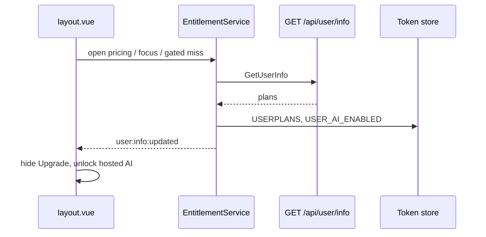

# Subscription Entitlement Reconciliation - Technical Design

| Field | Value |
| --- | --- |
| Document version | v1.0 |
| Created date | 2026-08-26 |
| Status | Draft |
| Owner | AiFetchly engineering |
| Source PRD | `docs/prd/subscription-entitlement-reconciliation-prd.md` |
| Primary code paths | `src/controller/UserController.ts`, `src/modules/WebSocketClient.ts`, `src/modules/tokenRefresh.ts`, `src/modules/remotesource.ts`, `src/service/AiFeatureGate.ts`, `src/main-process/communication/userIpc.ts`, `src/views/layout/layout.vue`, marketing `GET /api/user/info` |

## 1. Purpose

This document translates the entitlement reconciliation PRD into an implementation design.

The desktop must treat `GET /api/user/info` (Kill Bill plans) as the source of truth. WebSocket `subscription_*` notifies remain a fast hint. After a Paddle checkout in an external browser, the app must unlock hosted AI and update chrome even when the notify never arrives.

Non-negotiable constraints from the project constitution:

- No `any`. Zod v4 on new IPC payloads.
- IPC handlers do not touch TypeORM. They call a service / controller.
- Workers do not call `/api/user/info` or write Token store.
- Hosted AI IPC still checks `USER_AI_ENABLED` first (fail closed). Lazy reconcile runs only when that check would currently fail.
- Static imports only.
- User-facing strings go through i18n (`en`, `zh`, `es`, `fr`, `de`, `ja`).

## 2. Current System

### 2.1 Remote source of truth

Marketing `AccountController.Accountinfo` (`GET /api/user/info`, namespaced under `/apis`) loads Kill Bill plans via `killbill.GetUserPlansByEmail`. On Kill Bill error it returns a default Community plan rather than failing the whole user-info call.

Desktop client:

```text
RemoteSource.GetUserInfo()
  -> HttpClient GET /api/user/info
  -> jwtUser { name, email, id, roles, plans? }
```

The access JWT does **not** contain plans. A new access token is not required for entitlement to change. A new GET is.

### 2.2 Local cache (the only thing UI and AI gates read)

`UserController.updateUserInfo()` is the only writer:

| Token key | Meaning |
| --- | --- |
| `USERPLANS` | JSON array of `{ planName, planId?, status, ... }` |
| `USER_AI_ENABLED` | `"true"` iff `hasActiveAiPlan(plans)` |

AI plan detection (`UserController.isAiEnabledPlan` / `hasActiveAiPlan`):

- Free: name contains `community` or `free` → never AI.
- Paid AI: name contains `aifetch-plus`, `aifetch-pro`, `aifetch-go`, or `planId` in `BASE` / `PLUS` / `PRO`.
- Status must be `active` (case-insensitive).

`UserController.getUserInfo()` and IPC `QUERY_USER_INFO` (`user:info`) are **local reads** of that cache. They never hit the network.

`AiFeatureGate.isAiEnabled()` is the fail-closed reader used by `registerAiValidatedHandler`.

### 2.3 Who currently calls `updateUserInfo()`

| Caller | When |
| --- | --- |
| `completeDesktopLogin` | After token exchange |
| `WebSocketClient.refreshUserInfoOnSubscriptionChange` | WS `subscription_activated` / `updated` / `cancelled` / `payment_failed` |
| `DevBrowserDispatcher` | Dev-browser login path |

Startup does **not** call it. Token refresh does **not** call it. Window focus does **not** call it. `checklogin()` GETs `/api/user/info` but does **not** persist `USERPLANS` / `USER_AI_ENABLED`.

### 2.4 Purchase UX today

`layout.vue` `openPricingPlan()` does `window.open({VITE_LOGIN_URL}/pricing-plan)`. Main process never learns that pricing opened. Checkout happens in the system browser. Marketing emits `paddle.subscription.killbill_synced` → `PurchaseNotificationObserver` → in-memory `PushNotification`. If no WS client is registered for that user id, the message is dropped. Backend still logs success.

`WebSocketClient` already sends `websocket:event` with `type: "user_info_updated"` after a successful notify refresh. `layout.vue` does not subscribe. Header plan / Upgrade button stay stale until remount.

### 2.5 Companion WS reconnect (assumed present)

Access-token expiry at startup previously skipped the socket forever. `TokenRefreshService.onRefreshSuccess` + `WebSocketClient.retryConnectIfDisconnected` must remain. This design does not replace that; it makes entitlement correct when the socket still misses the notify.

## 3. Target Architecture

```text
Triggers
  startup | pricing open/focus | token refresh
  ws connected | ws notify | gated AI miss | optional IPC
        |
        v
SubscriptionEntitlementService.reconcile(trigger)
  in-flight dedupe
  cooldown (focus / gated only)
        |
        v
UserController.updateUserInfo()
  RemoteSource.GetUserInfo()  ->  GET /api/user/info
  persist USERPLANS, USER_AI_ENABLED
        |
        +-- GET failure --> keep cache, return { changed: false, failed: true }
        |
        v
Compare snapshot (plans + aiEnabled)
        |
        +-- unchanged --> log, maybe skip renderer event
        |
        v
Broadcast USER_INFO_UPDATED to all live BrowserWindows
        |
        v
layout.vue (+ AI chrome) updates plan label, Upgrade, aiEnabled
```

WebSocket notify payload is never written into `USERPLANS`. It is only a trigger plus toast `reason`.



## 4. Module Layout

### 4.1 New files

```text
src/service/SubscriptionEntitlementService.ts
src/entityTypes/subscriptionEntitlementTypes.ts
src/schemas/ipc/subscriptionEntitlement.ts
src/views/utils/subscriptionEntitlement.ts   # renderer listener helper
test/vitest/main/subscriptionEntitlementService.test.ts
test/vitest/main/subscriptionEntitlementIpc.test.ts
```

### 4.2 Modified files

| File | Change |
| --- | --- |
| `src/config/channellist.ts` | `USER_REFRESH_ENTITLEMENT`, `USER_OPEN_PRICING_PLAN`, `USER_INFO_UPDATED` |
| `src/config/usersetting.ts` | no new keys (cache stays `USERPLANS` / `USER_AI_ENABLED`) |
| `src/main-process/communication/userIpc.ts` | register new invoke handlers; wire window `focus` |
| `src/preload.ts` | allowlist new channels (invoke + receive) |
| `src/background.ts` | startup reconcile after token refresh; pass main window into service |
| `src/modules/WebSocketClient.ts` | `connected` + subscription notify → `reconcile()`; remove private `updateUserInfo` duplicate path |
| `src/modules/tokenRefresh.ts` | no new coupling if listener is registered in `userIpc` / `background` |
| `src/modules/desktopLoginCompletion.ts` | go through `reconcile('login')` instead of raw `updateUserInfo` (P1) |
| `src/main-process/communication/_shared/registerValidatedHandler.ts` | lazy reconcile only when `!isAiEnabled()` (Phase 2) |
| `src/service/AiFeatureGate.ts` | optional `ensureHostedAiEnabled()` helper used by the wrapper |
| `src/views/layout/layout.vue` | open pricing via IPC; subscribe to `USER_INFO_UPDATED` |
| `src/views/lang/{en,zh,es,fr,de,ja}.ts` | toast strings |
| `src/controller/UserController.ts` | export `hasActiveAiPlan` as public (or a `plansEnableAi()` helper) so the service/tests do not duplicate matching logic |
| `src/views/api/websocket.ts` | ignore `user_info_updated` on the WS channel once the dedicated channel exists (avoid double toasts) |

### 4.3 Why a service, not IPC-owned logic

`updateUserInfo()` already lives on `UserController`. The new service owns **when** to call it, **dedupe**, **cooldowns**, **snapshot compare**, and **broadcast**. IPC stays a thin Zod-validated facade.

Do not put this on `WebSocketClient`. Token refresh, focus, and gated AI must work with the socket down.

Do not add TypeORM entities.

## 5. Data Contracts

### 5.1 Triggers

```typescript
export const ENTITLEMENT_TRIGGERS = [
  "startup",
  "login",
  "pricing",
  "focus",
  "token_refresh",
  "ws_connect",
  "ws_notify",
  "gated_feature",
  "manual",
] as const;

export type EntitlementTrigger = (typeof ENTITLEMENT_TRIGGERS)[number];
```

### 5.2 Snapshot

```typescript
export type EntitlementSnapshot = {
  plans: UserPlanType[];
  aiEnabled: boolean;
  planNames: string[];
};
```

`planNames` is derived for logs: active plan names joined, never tokens or emails beyond what `Logger` already allows. Prefer logging plan names + `aiEnabled` + trigger only.

Snapshot equality: normalize plans to `{ planName, planId, status }` sorted by `planName`, plus `aiEnabled`. Ignore `startDate` / `price` jitter so a no-op GET does not toast.

### 5.3 Reconcile result

```typescript
export type EntitlementReconcileResult = {
  ok: boolean;
  changed: boolean;
  skipped: boolean;
  trigger: EntitlementTrigger;
  snapshot: EntitlementSnapshot;
  previous: EntitlementSnapshot;
  failReason?: "network" | "auth" | "in_flight_shared" | "cooldown";
};
```

- `ok: false` + `failReason: "network"` → cache untouched.
- `skipped: true` → cooldown or coalesced with an in-flight call (caller still awaits the shared promise).

### 5.4 Renderer event (`USER_INFO_UPDATED`)

Push channel, not invoke. Payload validated before send with Zod (main → renderer is trusted, but keep a single type).

```typescript
export type UserInfoUpdatedEvent = {
  reason: EntitlementTrigger;
  notificationType?: string; // WS notify type when reason === "ws_notify"
  plans: UserPlanType[];
  aiEnabled: boolean;
  changed: boolean;
};
```

Zod (ipc schema file, `zod/v4`):

```typescript
import { z } from "zod/v4";

export const entitlementTriggerSchema = z.enum(ENTITLEMENT_TRIGGERS);

export const userPlanSchema = z.object({
  planName: z.string(),
  planId: z.string().optional(),
  status: z.string(),
  startDate: z.string().optional(),
  endDate: z.string().optional(),
  price: z.number().optional(),
  currency: z.string().optional(),
  billingPeriod: z.string().optional(),
});

export const userInfoUpdatedEventSchema = z.object({
  reason: entitlementTriggerSchema,
  notificationType: z.string().optional(),
  plans: z.array(userPlanSchema),
  aiEnabled: z.boolean(),
  changed: z.boolean(),
});

export const refreshEntitlementInputSchema = lazySchema(() =>
  z.strictObject({
    trigger: entitlementTriggerSchema.default("manual"),
  })
);

export const openPricingPlanInputSchema = lazySchema(() =>
  z.strictObject({}).optional()
);
```

### 5.5 IPC channels

| Constant | Wire name | Direction | Purpose |
| --- | --- | --- | --- |
| `USER_REFRESH_ENTITLEMENT` | `user:refresh-entitlement` | invoke | Manual / test / renderer-initiated pull |
| `USER_OPEN_PRICING_PLAN` | `user:open-pricing-plan` | invoke | Record `pricingOpenedAt`, open URL, start retry loop |
| `USER_INFO_UPDATED` | `user:info:updated` | send | Broadcast snapshot to renderer |
| `QUERY_USER_INFO` | `user:info` | invoke | Unchanged local read |

Keep `WEBSOCKET_EVENT` for connection status and raw notify passthrough. Do **not** use it as the entitlement chrome update channel. That split avoids layout depending on `useWebSocket()` being mounted.

## 6. SubscriptionEntitlementService

Singleton, main-process only. Instantiated from `userIpc` / `background` after the main window exists.

### 6.1 Configuration

```typescript
const ENTITLEMENT_CONFIG = {
  PRICING_WINDOW_MS: 15 * 60 * 1000,
  PRICING_RETRY_OFFSETS_MS: [0, 3000, 6000, 10000, 20000],
  FOCUS_COOLDOWN_MS: 60 * 1000,
  GATED_COOLDOWN_MS: 30 * 1000,
  STARTUP_CONNECT_COALESCE_MS: 10 * 1000,
} as const;
```

Read from constants, not env, in v1. Tests inject a clock / config via constructor options.

### 6.2 State (in memory, not Token store)

```typescript
private inFlight: Promise<EntitlementReconcileResult> | null = null;
private pricingOpenedAt: number | null = null;
private pricingRetryTimers: ReturnType<typeof setTimeout>[] = [];
private lastFocusReconcileAt = 0;
private lastGatedReconcileAt = 0;
private lastSuccessAt = 0;
private lastSuccessHash = "";
private mainWindow: BrowserWindow | null = null;
```

No disk persistence of `pricingOpenedAt`. If the app restarts mid-checkout, FR-2 startup pull covers it.

### 6.3 `reconcile(trigger, opts?)`

```typescript
type ReconcileOptions = {
  notificationType?: string;
  force?: boolean; // bypass cooldown; pricing retries and ws_notify use this
};
```

Algorithm:

1. If `inFlight` is set, return that promise (`failReason` not used; `skipped` may be true on the inner result). Log `trigger` as coalesced.
2. If trigger is `focus` and not `force`: if local snapshot already has an active AI plan → return skipped (FR-4.2). Else if `now - lastFocusReconcileAt < FOCUS_COOLDOWN_MS` → skipped.
3. If trigger is `gated_feature` and not `force`: same cooldown with `lastGatedReconcileAt`.
4. If trigger is `ws_connect` and `now - lastSuccessAt < STARTUP_CONNECT_COALESCE_MS` → skipped (startup already pulled).
5. Set `inFlight = doReconcile(...).finally(() => { inFlight = null })`.
6. Return `inFlight`.

`doReconcile`:

1. `previous = readSnapshot()` from `UserController.getUserInfo()`.
2. `try { jwtUser = await userController.updateUserInfo() }`.
3. On throw / null: log error, return `{ ok: false, changed: false, snapshot: previous, failReason: "network" }`. **Do not** call the empty-plans Community default path. That path is only inside `updateUserInfo()` on a **successful** GET with empty `plans`.
4. `next = readSnapshot()`.
5. `changed = hash(previous) !== hash(next)`.
6. If changed, `broadcast(next, trigger)`.
7. If unchanged, do not toast. Optionally still broadcast `changed: false`? **No** for v1 — reduces noise. Layout already has last known state.
8. Update `lastSuccessAt` / hash. If trigger is `focus` / `gated_feature`, update that cooldown timestamp even when unchanged (prevents stampede).

Auth failures (401 after refresh already tried inside HttpClient): treat as `failReason: "auth"`, keep cache, do not sign out (matches current token-refresh policy).

### 6.4 `readSnapshot()`

Parse `getUserInfo()`. If `plans` missing, treat as `[]` and `aiEnabled` from `isAIEnabled()`.

Public helper on `UserController`:

```typescript
public plansEnableAi(plans: UserPlan[]): boolean
```

Move the body of private `hasActiveAiPlan` here so tests and the service share one matcher. Keep `hasActiveAiPlan` as a private alias or delete it.

### 6.5 `markPricingOpened()`

1. `pricingOpenedAt = Date.now()`.
2. Clear existing retry timers.
3. If `readSnapshot().aiEnabled === true`, skip retry loop (FR-3.4). Still allow later focus pull? Paid users already unlocked; skip.
4. Else schedule `PRICING_RETRY_OFFSETS_MS` timeouts, each calling `reconcile("pricing", { force: true })`.
5. After each success with `aiEnabled === true`, `clearPricingRetries()`.
6. Open URL with `shell.openExternal(pricingUrl)` (same base as layout: `resolveViteLoginBase() + "/pricing-plan"`). Fail the invoke if URL missing.

Renderer must stop calling `window.open` so main always sees the open.

### 6.6 `onMainWindowFocus()`

```text
if pricingOpenedAt && now - pricingOpenedAt <= PRICING_WINDOW_MS:
  reconcile("pricing", { force: true })
else:
  reconcile("focus")
```

Wire `BrowserWindow` `focus` in `userIpc` (or `background.ts` once the window is created). Ignore focus during the first 2s after `ready-to-show` to avoid a duplicate with startup reconcile.

### 6.7 Broadcast

```typescript
private broadcast(event: UserInfoUpdatedEvent): void {
  const parsed = userInfoUpdatedEventSchema.parse(event);
  for (const win of BrowserWindow.getAllWindows()) {
    if (!win.isDestroyed()) {
      win.webContents.send(USER_INFO_UPDATED, parsed);
    }
  }
}
```

Use `getAllWindows()` so a second window (if any) stays consistent. Do not send if `changed === false`.

### 6.8 Logging

```text
[entitlement] reconcile start trigger=pricing
[entitlement] reconcile ok trigger=pricing changed=true aiEnabled=true plans=AiFetch Plus
[entitlement] reconcile fail trigger=startup reason=network (cache kept)
[entitlement] coalesce trigger=focus into in-flight startup
[entitlement] skip trigger=ws_connect reason=startup_coalesce
```

Never log access/refresh tokens or Authorization headers.

## 7. Trigger Wiring

### 7.1 Startup (FR-2.1)

In `background.ts`, in the logged-in boot path, **after** the existing `TokenRefreshService.performAutoRefreshCheck()` and **before or after** `initializeWebSocketConnection`:

```typescript
await SubscriptionEntitlementService.getInstance().reconcile("startup");
```

Order:

1. Refresh access token (existing).
2. Reconcile entitlement (needs a valid Bearer).
3. Connect WebSocket (existing). WS `connected` then coalesces with `STARTUP_CONNECT_COALESCE_MS`.

If startup GET fails, cache stays; WS notify / focus / gated miss can retry.

### 7.2 Login (FR-2.2, P1)

`completeDesktopLogin` currently calls `updateUserInfo()` then inits WS. Replace the user-info block with `reconcile("login")` so the first layout can receive `USER_INFO_UPDATED` if it is already mounted. If layout is not mounted yet, `onMounted` `GetloginUserInfo()` still reads the just-written cache — both paths required.

### 7.3 Token refresh (FR-5.1)

Register once in `registerUserIpcHandlers` / `background`:

```typescript
TokenRefreshService.onRefreshSuccess(() => {
  void SubscriptionEntitlementService.getInstance().reconcile("token_refresh");
});
```

This is in addition to the WS retry listener. Two listeners on `onRefreshSuccess` are expected. Do not import `WebSocketClient` from the entitlement service.

Quiet-hour cost: ~1 extra GET per access-token lifetime (~1 hour). Acceptable vs PRD metric.

### 7.4 WebSocket connect (FR-5.2)

In `handleMessage` `case "connected"` (after `clientId` is stored):

```typescript
void SubscriptionEntitlementService.getInstance().reconcile("ws_connect");
```

### 7.5 WebSocket notify (FR-5.3)

Replace `refreshUserInfoOnSubscriptionChange` body with:

```typescript
void SubscriptionEntitlementService.getInstance().reconcile("ws_notify", {
  force: true,
  notificationType,
});
```

Stop forwarding a second `user_info_updated` on `WEBSOCKET_EVENT`. Keep forwarding the raw `notification` message if anything else listens; layout must not toast from that path.

### 7.6 Pricing (FR-3)

`layout.vue` `openPricingPlan`:

```typescript
await windowInvoke(USER_OPEN_PRICING_PLAN)
```

Main: validate, `markPricingOpened()`, return `{ opened: true, url }`. Errors: missing `VITE_LOGIN_URL` → existing `pricing_url_missing` copy.

### 7.7 Focus (FR-3.2 / FR-4)

`win.on("focus", () => service.onMainWindowFocus())`.

### 7.8 Gated feature (FR-6, Phase 2)

Do **not** GET on every hosted-AI IPC. Only when the gate is currently closed.

`AiFeatureGate.ts`:

```typescript
export async function ensureHostedAiEnabled(): Promise<boolean> {
  if (isAiEnabled()) return true;
  await SubscriptionEntitlementService.getInstance().reconcile("gated_feature");
  return isAiEnabled();
}
```

`registerAiValidatedHandler` step 1 becomes:

```typescript
if (!(await ensureHostedAiEnabled())) {
  return { status: false, msg: "AI feature is not enabled", data: null };
}
```

Handlers that call `isAiEnabled()` / `isAIEnabled()` inline (workspace, user-memory, etc.) should switch to `ensureHostedAiEnabled()` in Phase 2. Phase 1 may land the helper and wire Chat V2 open only if timeboxed; PRD Phase 2 is the full gate sweep.

Local provider chat: `USER_LOCAL_AI_ENABLED` / `AIProviderResolver` must **not** go through this. Hosted-only gates only.

402 from hosted HTTP: Phase 2, one `reconcile("gated_feature")` then retry once at the HttpClient/AI client layer if a dedicated 402 mapper already exists (`AIChatErrorMapper`). Do not retry forever.

### 7.9 Workers

No change in Phase 1. New `utilityProcess` forks keep taking `WORKER_AI_ENABLED` from main at spawn time. Document: a contact-extraction worker started before purchase stays gated until respawn. Phase 4 may restart AI-gated workers on `aiEnabled` false→true.

## 8. Renderer

### 8.1 Layout

On mount, keep `GetloginUserInfo()` for the first paint (local cache).

Subscribe:

```typescript
windowReceive(USER_INFO_UPDATED, (event: UserInfoUpdatedEvent) => {
  applyPlans(event.plans)
  if (event.changed && event.aiEnabled && wasFree) {
    showSuccessMessage(t('subscriptionEntitlement.unlocked') || '...')
  }
  if (event.changed && !event.aiEnabled && wasPaid) {
    showInfoMessage(t('subscriptionEntitlement.cancelled') || '...')
  }
})
```

Extract `applyPlans` from the current `onMounted` plan-label logic (`getDisplayPlans`, `isPlusSubscriptionPlan`, `isFreeSubscriptionPlan`, `showUpgradePlan`). Do not `router.push` on plan change.

### 8.2 Other views that snapshot `aiEnabled` on mount

Phase 2: `templatedetail.vue`, `yellowpages/create.vue`, `emailextraction/index.vue`, knowledge-library gates. Either listen to `USER_INFO_UPDATED` or re-read `QUERY_USER_INFO` when the event fires. A small composable `useEntitlement()` in `src/views/utils/subscriptionEntitlement.ts` should own the subscription so views do not duplicate toast rules.

Chat V2: if it caches `aiEnabled` at panel open, re-read on event. Phase 2 lazy gate also covers “open chat while still Community in cache.”

### 8.3 i18n keys

```text
subscriptionEntitlement.unlocked
subscriptionEntitlement.cancelled
```

English sources from the PRD. Add all six language files. No toast on failed GET. No toast claiming payment failed when pricing retries exhaust.

## 9. Error Handling

| Failure | Behavior |
| --- | --- |
| No access token | Skip reconcile; log; do not clear cache |
| GET network / 5xx | Keep cache; `ok: false` |
| GET 401 after HttpClient refresh attempt | Keep cache; do not sign out |
| GET 200 empty plans | Existing `updateUserInfo` writes Community + `USER_AI_ENABLED=false` — this **is** a successful remote empty set, not a transport failure |
| `shell.openExternal` fails | Invoke returns `status: false`; renderer shows existing error toast |
| Window destroyed mid-broadcast | Skip that window |
| Zod fail on invoke input | `status: false`, handler not run |

Empty-plans Community write is a product footgun if Kill Bill is briefly empty during sync. Pricing retries (5 times / 20s) exist to ride through that. Do not add a special “ignore empty plans inside pricing window” rule in v1 unless QA shows Kill Bill returning `[]` instead of Community during sync. If that happens, treat `[]` inside the pricing window as `failReason: "network"` (keep previous cache). Call this out in implementation as a one-line guard:

```typescript
if (inPricingWindow() && (!res.plans || res.plans.length === 0)) {
  // do not persist Community overwrite; return ok:false
}
```

Recommended: **include this guard in Phase 1**. It is cheaper than a support ticket.

## 10. Sequence Details

### 10.1 Checkout, notify dropped

```text
User clicks Upgrade
  -> USER_OPEN_PRICING_PLAN
  -> pricingOpenedAt=now
  -> openExternal(pricing-plan)
  -> retry GET at 0s, 3s, 6s, 10s, 20s
User pays in browser (desktop WS down)
  -> Kill Bill eventually has Plus
  -> one of the retries / focus GET sees Plus
  -> USER_INFO_UPDATED changed=true aiEnabled=true
  -> toast + hide Upgrade
```

### 10.2 Startup after overnight purchase

```text
boot -> token refresh -> reconcile(startup) -> cache Plus
layout onMounted reads local Plus
WS connected -> reconcile(ws_connect) skipped (coalesce)
```

### 10.3 Notify arrives (fast path)

```text
WS notification_type=subscription_activated
  -> reconcile(ws_notify, force)
  -> GET /api/user/info
  -> broadcast
```

Do not apply the notify `plan` field to Token.

## 11. Backend (Phase 3, optional)

Desktop Phase 1 does not require marketing changes beyond the existing “log N clients / warn if zero” diagnostic.

If Phase 3 is scheduled:

1. `PushNotification`: log `GetUserConnectionCount`; warn on 0.
2. Welcome payload may add `plans` or `plan_updated_at` for coalesce (desktop may skip GET if hash matches). Optimization only; desktop must still GET when hashes differ or field absent.
3. Durable queue is a separate marketing design (Redis/DB, flush on `Hub.Register`). Out of scope here.

## 12. Testing

### 12.1 Unit (`test/vitest/main/subscriptionEntitlementService.test.ts`)

Mock `UserController.updateUserInfo` / `getUserInfo` / `BrowserWindow.getAllWindows`.

| Case | Expect |
| --- | --- |
| Two concurrent `reconcile` calls | One GET |
| GET throws | Cache snapshot unchanged; `ok: false` |
| GET empty plans outside pricing window | Community persisted (mock `updateUserInfo` doing that) |
| GET empty plans inside pricing window | Previous paid/community cache kept |
| Community → Plus | `changed: true`, send `USER_INFO_UPDATED` |
| Plus → Plus same hash | no send |
| `focus` while already `aiEnabled` | skip GET |
| `focus` while Community twice in 60s | one GET |
| `gated_feature` twice in 30s | one GET |
| `ws_connect` within 10s of startup success | skip |
| Pricing retries stop when `aiEnabled` becomes true | remaining timers cleared |
| `ws_notify` does not write payload plans | only `updateUserInfo` mock called |

### 12.2 IPC (`test/vitest/main/subscriptionEntitlementIpc.test.ts`)

Zod reject on bad trigger. `USER_OPEN_PRICING_PLAN` calls `markPricingOpened`. Preload allowlist includes the new channels (static string test if a guard file exists; otherwise preload review).

### 12.3 WebSocket client

Existing mocha/vitest WS tests: notify path calls entitlement service, not `UserController.updateUserInfo` directly.

### 12.4 Token refresh

Existing `TokenRefreshService` listener tests: entitlement listener invoked on success, not on refresh failure.

### 12.5 Manual (from PRD)

Keep the PRD manual matrix. Dev: `AIFETCHLY_SKIP_TSC` is not an excuse to skip the entitlement vitest file in CI.

## 13. Implementation Order

Match PRD logical chain:

1. Types, Zod, `SubscriptionEntitlementService` + unit tests.
2. `USER_INFO_UPDATED` + layout listener + i18n (pulls are useless without UI).
3. `userIpc` + preload + `USER_OPEN_PRICING_PLAN` + focus + startup.
4. Token refresh listener + WS connect/notify rewire.
5. Empty-plans-in-pricing-window guard.
6. Phase 2: `ensureHostedAiEnabled` in `registerAiValidatedHandler` and remaining inline gates.
7. Phase 3 backend logs / durable notify (separate PR).

## 14. File-Level API Sketch

```typescript
// src/service/SubscriptionEntitlementService.ts
export class SubscriptionEntitlementService {
  static getInstance(): SubscriptionEntitlementService;
  static resetInstance(): void; // tests

  setMainWindow(win: BrowserWindow | null): void;

  reconcile(
    trigger: EntitlementTrigger,
    opts?: ReconcileOptions
  ): Promise<EntitlementReconcileResult>;

  markPricingOpened(): Promise<{ url: string }>;
  onMainWindowFocus(): void;
  clearPricingRetries(): void;
}
```

```typescript
// src/service/AiFeatureGate.ts (Phase 2 addition)
export function isAiEnabled(): boolean;
export function ensureHostedAiEnabled(): Promise<boolean>;
```

Do not make `ensureHostedAiEnabled` call reconcile when already enabled.

## 15. Risks

| Risk | Handling |
| --- | --- |
| Startup + WS connect double GET | 10s coalesce |
| Focus storm | 60s cooldown; paid skip |
| `registerAiValidatedHandler` latency | Phase 2: extra GET only when currently disabled |
| Circular import TokenRefresh ↔ entitlement | register listener in `userIpc`, not inside TokenRefresh |
| Circular import WebSocketClient ↔ entitlement | WS calls service; service never imports WS |
| `updateUserInfo` initializes DB paths | already does on plan fetch; reconcile at startup is after userdata path exists for logged-in users |
| Kill Bill empty array during sync | pricing-window guard (Phase 1) |
| Toast spam | emit renderer event only when `changed` |

## 16. Open Questions (locked defaults for v1)

| Question | v1 default |
| --- | --- |
| Chrome Upgrade vs AI unlock | Upgrade hidden when not every plan is free (`layout` existing helper). AI unlock uses `hasActiveAiPlan` only. |
| `past_due` | Follow Kill Bill `status` via existing matcher (not `active` → no AI). |
| Pricing window | 15 minutes. |
| Welcome-message plans | Phase 3 only. |

## 17. Mapping to PRD

| PRD | Design |
| --- | --- |
| FR-1 | `SubscriptionEntitlementService.reconcile` |
| FR-2 | `background.ts` startup + optional login path |
| FR-3 | `USER_OPEN_PRICING_PLAN` + retry timers + focus in window |
| FR-4 | `onMainWindowFocus` + cooldown |
| FR-5 | TokenRefresh listener; WS `connected` / notify |
| FR-6 | `ensureHostedAiEnabled` (Phase 2) |
| FR-7 | `USER_INFO_UPDATED` + layout / composable |
| FR-8 | structured `[entitlement]` logs; backend client-count is Phase 3/P1 |

## 18. Out of Scope Recap

- JWT plan claims
- Sub-minute global polling
- Embedding Paddle.js
- Worker `/api/user/info`
- New SQLite entities
- Durable marketing notify queue in the desktop Phase 1 PR
