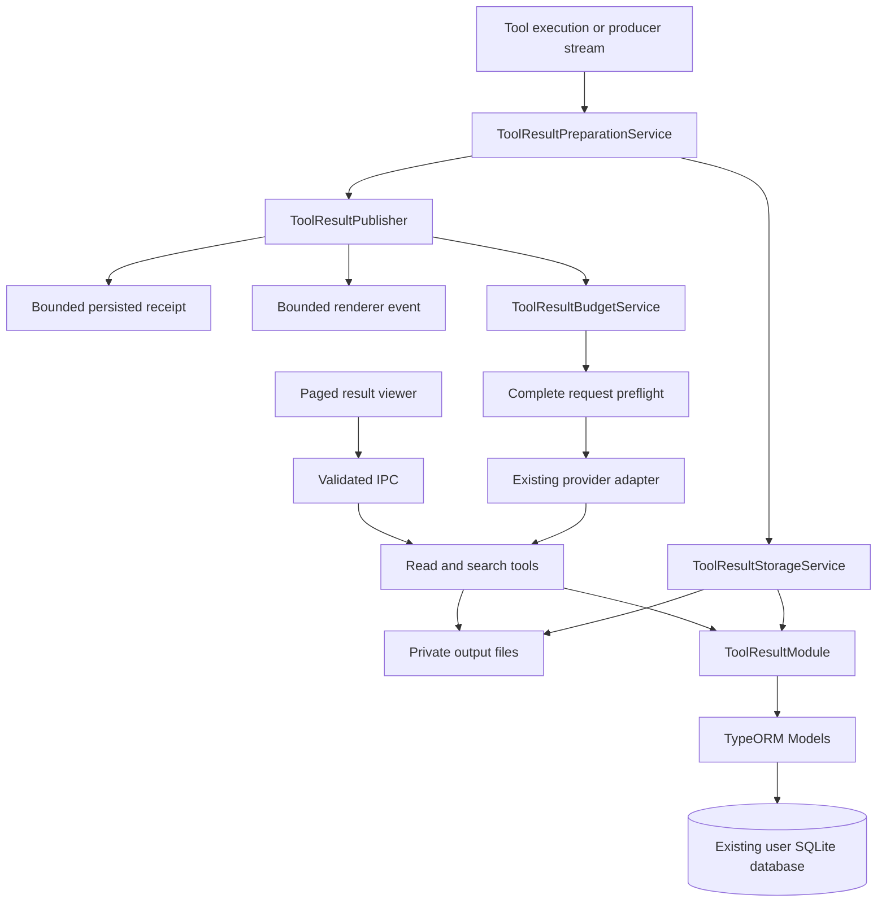
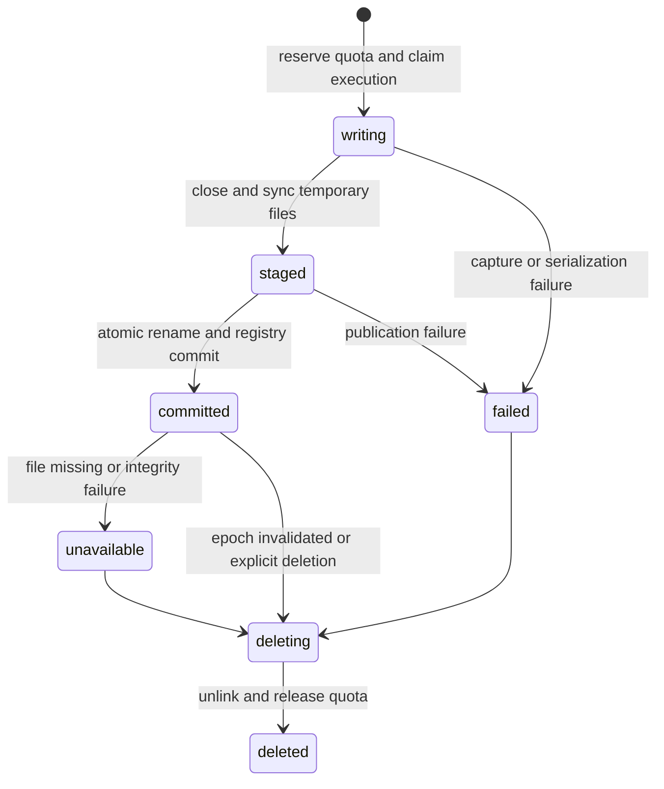

# Technical Design: Recoverable Large Tool Results

**Date:** 2026-09-29

**Last updated:** 2026-09-30

**Status:** Proposed design for review; no feature implementation is claimed

**PRD:** [Recoverable large tool results](2026-09-29-ai-chat-large-tool-results-prd.md)

**Scope:** Local tool-output capture, result preparation, provider budgeting, scoped retrieval, history, and renderer integration

## 1. Decisions and invariants

1. Store oversized output once in application-managed files; keep a TypeORM registry and bounded receipts in conversation messages.
2. Prepare results before ordinary message persistence, renderer events, and model continuation. Do not make the event sink responsible for asynchronous externalization after an event has already escaped.
3. Keep operation outcome, producer completeness, capture preservation, and preview completeness as independent facts.
4. Make `tool_result_read` and `tool_result_search` built-in scoped tools with bounded outputs. They never recursively externalize their own output.
5. Enforce both serialized-byte and token budgets. Allocate tool-result space from the selected model's actual usable input capacity, then validate the final request.
6. Preserve assistant tool-call IDs, result pairing, exact original arguments, and execution identity. Context reduction must not replace executed arguments with fabricated `{}`.
7. Use the same services for normal V2, permission resume, scheduled turns, child-agent results, and legacy client-side execution. Certify legacy remote retrieval separately.
8. New large results contain no raw bulk output in message metadata. Existing historical source is immutable; migration adds bounded derived projections.
9. Every output access validates active profile, owner conversation/agent, conversation epoch, artifact state, and any explicit delegation grant. IDs are not authorization.
10. Full-output preservation is conditional on producer and storage caps. On failure, publish a bounded truthful receipt, not an oversized fallback or a false success.

## 2. Source baseline and integration map

The baseline is source inspection on 2026-09-29 at HEAD `9fc0322a`, including the working tree's existing chat/archive changes. Findings are not runtime reproductions. Recheck integration symbols against the implementation branch before editing; line numbers are intentionally not used as contracts.

| Existing file / symbol | Current responsibility or gap | Design integration |
| --- | --- | --- |
| `src/service/AIChatQueryLoop.ts`: `normalizeToolResult`, result emission, preflight | Full payload normalization/emission; late lossy fallback | Await preparation; use model projection; run aggregate budget every round |
| `src/service/AIChatQueryEngine.ts`: permission resume, persisting sink | Separate result serialization on resume; event saves are queued and errors logged | Shared publisher on resume; await terminal receipt publication before model continuation |
| `src/service/AIChatQueryEvents.ts` | Carries `fullContent` plus `toolResult` | Bounded compatible payload plus versioned output descriptor |
| `src/modules/AIChatV2Module.ts`: `saveToolResultMessage` | Raw result in content and metadata | Store receipt once as content and bounded control/display metadata |
| `src/service/StreamEventProcessor.ts` | Legacy local execution, permission resume, retries, remote results | Same preparation boundary and bounded compatibility adapter |
| `src/service/ToolExecutionService.ts` | Legacy result persistence | Persist bounded receipt; no independent full-result serialization |
| `src/api/aiChatApi.ts`: `streamContinueWithToolResults` | Sends legacy results to remote continuation | Send bounded provider projection; advertise retrieval only after capability certification |
| `src/service/AgentRuntime.ts`, `src/service/AgentTranscriptService.ts` | Agent execution, summaries, isolated loop | Trusted agent scope; bounded summaries; explicit parent export grants |
| `src/service/MCPToolService.ts`: `executeMCPTool` | Returns received MCP result without a general result-size policy | Normalize blocks; route output through common preparation; add supported ingress caps |
| `src/service/ShellToolService.ts`, `src/service/BackgroundShellRegistry.ts` | Output buffered and capped independently | Shared streaming capture handle across foreground/background handoff |
| `src/service/FileToolService.ts`: `executeFileRead` | Reads whole file; rejects above 2 MB before paging; long first line can exceed output cap | Do not depend on it for artifact retrieval; bound its model result or return a scoped source descriptor |
| `src/service/AIChatRequestBudgetService.ts` | Preflight based partly on UTF-8 bytes divided by four | Reuse limit resolution; introduce common counting contract and serialized-body cap |
| `src/service/AIChatContextAssembler.ts` | Live tail retained and rejected if bounded reads incomplete | Resolve receipt projections before sizing/loading live tail |
| `src/service/AIChatSectionPacker.ts`, archive services/models | History references, exact source reads, compaction coverage | Compact bounded receipts; keep artifact references; make legacy source reads actually bounded |
| `src/config/skillsRegistry.ts`, `src/service/ToolLoadPolicyService.ts` | Tool registration and deferred catalog | Register retrieval tools as core helpers while references may be emitted |
| `src/service/PlanModeToolPolicy.ts`, `src/service/AgentToolPolicyService.ts` | Mode and agent restrictions | Treat retrieval as scoped read-only; retain owner/grant checks |
| `src/views/components/aiChatV2/AiChatV2Message.vue` | Renders full result text in details | Show receipt and open paged viewer |
| `src/config/SqliteDb.ts` | Entity registry; `synchronize: true`, empty migration list | Register additive entities and a versioned data-bootstrap marker |

The old `shrinkLiveTurnToolPayloads` implementation is retired from the new path. Its broad string slicing and argument replacement are not acceptable substitutes for preservation. Large argument/history pressure that remains after result preparation still requires a truthful budget failure or legitimate whole-turn compaction.

## 3. Architecture and responsibilities



| Proposed component | Responsibility |
| --- | --- |
| `ToolResultPreparationService` | Normalize supported result data, preserve control fields, build preview, select inline/external representation, handle preparation failures |
| `ToolResultStorageService` | Bounded serialization/spooling, atomic publication, checksums, private paths, cleanup; no direct repository access |
| `ToolResultModule` | Ownership, epochs, quotas, state transitions, publication and projection coordination through Models |
| `ToolResultModel` | Artifact rows, quota reservations, durable access grants, keyset lists and conditional updates |
| `ToolResultProjectionModel` | Versioned bounded projections over existing source message rows |
| `ToolResultPublisher` | Idempotent terminal receipt persistence and renderer delivery; used by all execution adapters |
| `ToolResultBudgetService` | Model projections, aggregate reduction, read-page allocation, token/byte accounting |
| `ToolResultRetrievalService` | Authorized incremental read/search, cursor validation, retrieval-work accounting |
| `ToolResultRecoveryService` | Reconcile interrupted writes, publish-pending records, tombstones and orphan files |
| `ToolResultPreviewService` | Deterministic bounded text/JSON/log previews; no provider calls |

Database code stays in Models/Modules and uses the existing `Token`/`USERSDBPATH` resolution through `BaseDb`/`BaseModule`. IPC handlers validate and call services/modules; they do not query repositories. File-root resolution is separate from database-path resolution.

No new worker is necessary for the initial design. Incremental file I/O and yielding serialization/search run in main-process services. If performance measurements require a parsing worker, its entry point and worker-only code belong under `src/childprocess/`; it receives bounded chunks and never accesses the database.

## 4. Representation and contracts

### 4.1 Terminology

| Term | Meaning |
| --- | --- |
| Source result | Supported data supplied by a producer after existing normalization/redaction rules |
| Captured output | Bytes successfully saved; may be all or a prefix of the source result |
| Receipt | Bounded immutable description of operation outcome, preserved output, and retrieval options |
| Model projection | Budget-adjusted representation of an inline result or receipt for one provider request |
| UI projection | Bounded display/control metadata, with no bulk source data |
| Execution ID | Trusted identity of one actual attempt; different from a permission placeholder or model-generated call ID |
| Conversation epoch | Durable generation invalidated when a conversation is cleared/deleted |

For supported JSON, “exact” means preservation of the normalized JSON data serialized with the documented encoder, not original upstream whitespace or object identity. For text/log streams, exact retrieval preserves captured UTF-8 bytes. Bytes lost upstream cannot be recovered and must not be represented as captured.

### 4.2 Internal TypeScript contracts

These are proposed interfaces, not existing exports. Implementations use explicit return types, `unknown` for untrusted data, and schema validation at boundaries.

```typescript
export type ToolOperationStatus =
  | "success" | "error" | "partial" | "cancelled"
  | "blocked" | "pending" | "permission_required" | "unknown";

export type SourceCompleteness = "complete" | "partial" | "unknown";
export type OutputPreservation = "complete" | "partial" | "unavailable";

export interface TrustedToolOutputContext {
  readonly profileId: string;
  readonly conversationId: string;
  readonly conversationEpoch: string;
  readonly turnId: string;
  readonly executionId: string;
  readonly toolCallId: string;
  readonly toolName: string;
  readonly ownerAgentId?: string;
  readonly signal: AbortSignal;
}

export interface StoredToolOutputRef {
  readonly outputId: string;
  readonly revision: number;
  readonly storageBackend: "file" | "legacy_message";
  readonly format: "text" | "json" | "jsonl" | "binary";
  readonly mediaType: string;
  readonly capturedBytes: number;
  readonly originalBytes?: number;
  readonly sha256?: string;
  readonly preservation: "complete" | "partial";
  readonly sourceCompleteness: SourceCompleteness;
  readonly incompleteReason?: string;
}

export interface ToolResultReceipt {
  readonly schemaVersion: 1;
  readonly toolCallId: string;
  readonly toolName: string;
  readonly operationStatus: ToolOperationStatus;
  readonly success: boolean;
  readonly executionTimeMs: number;
  readonly summary?: string;
  readonly control: Readonly<Record<string, unknown>>;
  readonly outputs: readonly StoredToolOutputRef[];
  readonly preview: string;
  readonly previewComplete: boolean;
  readonly storageErrorCode?: string;
}

export interface PreparedToolResult {
  readonly receipt?: ToolResultReceipt;
  readonly canonicalMessageContent: string;
  readonly modelContent: string;
  readonly uiMetadata: Readonly<Record<string, unknown>>;
  readonly serializedBytes: number;
  readonly accountedTokens: number;
}

export interface ToolResultOutputPolicy {
  readonly maxInlineBytes: number;
  readonly maxInlineTokens: number;
  readonly previewKind: "text" | "records" | "head_tail";
  readonly delivery: "normal" | "bounded_reader" | "source_reference";
}
```

`sha256` is required by runtime schema validation for a committed file backend. A legacy-message reference can initially rely on its stored source-row identity/revision; do not fabricate a checksum or load a huge row solely to make the first receipt. A bounded background walk may calculate its checksum later without changing source bytes. Public descriptors omit internal backend/path details when the client does not need them.

`control` is not an unchecked copy of the result. Each adapter supplies a validated bounded schema. Examples include `needsPermissionPrompt`, permission category/preview, `executionPending`, `job_id`, `shell_id`, exit code, batch IDs/statuses, retryability, totals, pagination cursors, and partial-result counts. Strings, arrays, and nested fields each have limits, and the whole control object is accounted in the envelope. If essential control data cannot fit, return an explicit bounded preparation error rather than silently omitting a permission or outcome field.

Outer trusted execution status is authoritative; spreading producer properties after `success` must not allow a producer's nested `success` key to overwrite it. Preserve top-level partial/count/timeout fields from `ToolExecutionResult`, which are not all retained by the existing normalizer.

`modelArtifacts` stays on its existing transient channel. It is not serialized into a receipt, output text, metadata, or logs. Persist only existing safe image descriptors where appropriate. Text size rules do not grant images a budget bypass.

### 4.3 Example model-facing result

```json
{
  "schema_version": 1,
  "success": true,
  "operation_status": "success",
  "summary": "Search returned 2400 businesses.",
  "total": 2400,
  "output": {
    "output_id": "out_7e21d8f4_example",
    "format": "json",
    "captured_bytes": 10485760,
    "preservation": "complete",
    "source_completeness": "complete"
  },
  "preview": "Sample records and available field names...",
  "preview_complete": false,
  "read_tool": "tool_result_read",
  "search_tool": "tool_result_search"
}
```

IDs above are illustrative. Real IDs use cryptographically random UUIDs or equivalent entropy and contain no raw user, tool, or filesystem names. The instruction to use the reader lives in the trusted tool/prompt contract; producer text is never promoted to a system instruction.

Small results can preserve their existing wire shape. New typed metadata differentiates inline data from receipts; do not detect externalization by searching text for tags. Empty results receive a small explicit empty-output representation without inventing an error. Nonempty error results follow the same preservation policy as successful results.

## 5. Storage data model and lifecycle

### 5.1 Additive TypeORM records

| Record | Required fields / indexes |
| --- | --- |
| `ai_tool_output_scopes` | Profile/conversation primary scope; current output epoch, deletion fence and timestamps; exists independently of the archive feature flag |
| `ai_tool_outputs` | `outputId` primary key; profile, conversation, epoch, owner agent, turn, execution, tool-call ID, tool name; stream key; revision; state; backend (`file` or `legacy_message`); format/media type; relative storage key or source-row identity/revision; captured/original bytes; SHA-256; source completeness; preservation; bounded failure code; policy version; lease/fence; publication status and bounded receipt needed for recovery; timestamps |
| `ai_tool_output_reservations` | Reservation ID, profile/conversation/epoch, execution ID, reserved/used bytes, lease expiry, fence; indexes for profile and conversation accounting |
| `ai_tool_output_grants` | Output ID, grantee conversation/epoch/agent, grant reason, revocation time; unique owner-approved grant key |
| `ai_tool_result_projections` | Profile/conversation/epoch, source row ID, source revision/hash, policy version, bounded content/metadata, output references; unique source identity and policy version |
| `ai_tool_output_retrieval_budgets` | Profile/conversation/epoch/agent/turn unique key; reserved/settled call count and returned tokens; conditional-update version and timestamps |
| Versioned bootstrap marker | Schema/data-bootstrap version and last bounded legacy backfill position; resume after interruption |

Unique artifact identity is `(profile, conversation, epoch, executionId, streamKey)`. A tool call producing text plus stderr can have multiple bounded descriptors. Cap descriptors per receipt at 8; excess attachments belong to an indexed manifest artifact. Same identity plus same source hash is idempotent. Same identity plus different bytes is a conflict, not permission to overwrite committed evidence.

Capture the result's execution ID before tool execution and carry it through async jobs/resume. A permission placeholder has a different phase and cannot consume the terminal result's artifact key. A deliberate new tool execution gets a new execution ID even if a caller reused a tool-call ID.

The output epoch is owned by `ai_tool_output_scopes`; it need not equal the archive epoch. Clear/delete coordinates invalidation of both under the conversation lifecycle lock, even when either subsystem's rollout flag is off. A trusted resolver obtains the current output epoch before execution and revalidates it at commit/access. Never reconstruct an old scope from an untrusted incoming result after deletion.

### 5.2 Paths and ownership

Use a private app-managed root, resolved in the main process and injected for tests:

```text
<app-managed-root>/tool-results/<profile-key>/<conversation-epoch>/<output-id>/
    payload.txt | payload.json | payload.jsonl | payload.bin
    manifest.json
    optional bounded-index sidecar
```

All path segments are generated internally. Never interpolate producer names, model arguments, raw conversation titles, or requested filenames into storage paths. Model/UI access uses IDs. Resolve paths under the fixed root, reject traversal/symlink escape, and open regular files only. Use restrictive permissions supported by the platform; this design does not claim encrypted-at-rest storage.

The manifest contains only versioned bounded metadata and integrity information. It is not an alternate copy of the full payload. File storage and quotas are separate from the `USERSDBPATH` database location; changing profiles must select the corresponding root and registry scope.

### 5.3 State transitions



`committed` does not mean original output was complete: preservation and source completeness are separate fields. A valid partial prefix may be committed with `preservation: partial`. The registry is authoritative for authorization and publication; a file merely existing does not make it readable through the tools.

Publication protocol:

1. Validate trusted scope and epoch; create a conditional writing claim and reserve quota through the Module.
2. Write a temporary payload with bounded buffers while computing byte counts and a streaming checksum. Write a bounded manifest.
3. Flush/close and sync files; sync the containing directory where supported. Promote by atomic rename within the same filesystem.
4. Commit artifact registry state with the expected epoch, lease fence, checksum, and sizes. Reject stale writers.
5. Persist the bounded terminal receipt and its artifact references before model continuation. Make terminal receipt writes idempotent by execution/phase identity.
6. Emit the renderer result and append the model projection. If delivery fails, retry delivery using the saved receipt, never execution.

Filesystem operations and SQLite transactions are not one atomic transaction. The protocol explicitly tolerates a file promoted before its DB commit or a committed artifact whose message publication is pending. Record publication status or an equivalent durable outbox field; startup reconciliation completes safe publication or marks the result unavailable. Do not mark a terminal tool result saved merely because its save Promise was queued.

### 5.4 Quotas and cleanup

- Default cap: 64 MiB per artifact/stream; 1 GiB per conversation; 5 GiB per profile. Account for payloads, sidecars, temporary files, and outstanding reservations.
- Reserve in bounded increments, initially 1 MiB for unknown-length streams; grow atomically before writes. Known sizes can reserve once. Failed writes release unused reservations.
- Keep a default free-disk reserve of 128 MiB. Refuse further preservation when quota or free-space checks fail; handle actual write failures even after a successful check.
- Limit concurrent heavy captures to 2 per profile. Apply backpressure to streams; do not build an unbounded memory queue of producer chunks.
- Reclaim abandoned temporary files and unreferenced unpublished artifacts only after a 24-hour grace period and an expired lease. Keep active leases protected.
- Do not automatically evict committed referenced output by age or least-recently-used policy in v1. Refuse new preservation when required.
- Clear/delete/profile removal invalidates the relevant epoch first, revokes grants, cancels readers/writers, then schedules idempotent file deletion. All late commits compare the epoch fence. Bulk-clear paths receive the same treatment.

## 6. Serialization, previews, and producer limits

### 6.1 Materialized results

Do not stringify an arbitrary large object repeatedly to discover whether it is too large. A yielding JSON walker streams one normalized representation to a sink that initially holds at most the inline-byte allowance and spills to a temporary file when necessary. It updates checksum and counters once. Release source-object references as early as the caller permits.

Support ordinary JSON primitives, plain records, and arrays. Use documented JSON semantics for missing/undefined object properties; reject cycles, BigInt, unsupported prototypes/accessors, invalid text encoding, and excessive nesting with typed serialization errors. Do not invoke arbitrary producer getters or `toJSON` methods as part of preview generation. Default traversal depth is 128; bound node work and yield after at most 64 KiB emitted or 10 ms elapsed, whichever occurs first.

This bounds additional serialization buffers, not the memory of an already allocated producer object. MCP transports and HTTP clients need their own receive-size limits. For adapters that support an ingress byte cap, start with 64 MiB and reject before constructing larger objects. An SDK without such a hook is an explicit coverage limitation and cannot claim bounded ingress memory.

If the artifact cap interrupts JSON serialization, do not label an invalid JSON prefix as valid JSON. Store a UTF-8 text fragment with `preservation: partial`, original media type metadata, and `ARTIFACT_LIMIT_REACHED`. Alternatively, for an upgraded record producer, write complete JSONL records and mark the record set partial.

### 6.2 Preview construction

- Text: a UTF-8-safe prefix, preferably ending at a newline when this fits.
- Logs: bounded head and tail with explicit omitted-region markers; no claim of continuity.
- Known record tools: counts, field names, and a bounded sample of complete records. Source order is preserved.
- Unknown JSON: top-level keys plus bounded primitive values/complete sampled items; never emit malformed JSON as a structured envelope.
- Errors: preserve the error code and concise message; full stack/log details become output when available.
- Images/binary: use existing supported artifact descriptors and media handling; no base64 payloads in text previews. Reader returns an unsupported-text response for binary output; user export remains possible.

Do not perform AI summarization before the result is safe to send. A producer-provided summary is also untrusted data and subject to byte/token limits.

### 6.3 Foreground/background shell capture

Create capture handles for stdout and stderr at process spawn, before any output is collected. Decode UTF-8 with an incremental decoder; keep a small head/tail ring for display. Pipe raw supported bytes into the same handles for the entire process lifetime.

When a command becomes a background job, transfer ownership of the handles and counters to `BackgroundShellRegistry`; do not start a second collector that loses or duplicates the foreground prefix. Polling returns a bounded status/preview and a stable execution identity. Only sealed output gets an immutable artifact revision; growing live-output cursors are deferred from v1.

At cap/quota failure, stop saving additional bytes, continue draining pipes to prevent child-process deadlock, and mark preservation partial. Do not kill or repeat a side-effecting process solely because output storage reached its cap. Existing cancellation and timeout policy still controls process termination.

### 6.4 Existing file and resource readers

The dedicated artifact reader does not call `FileToolService.executeFileRead`. Ordinary `file_read` must still produce bounded output: use its existing authorized source plus continuation information or externalize the returned text once. Do not grant all filesystem reads an `Infinity` exemption; the current reader is not guaranteed to self-bound a single oversized line.

Only trusted built-in retrieval implementations with verified byte/token ceilings receive `delivery: bounded_reader`. Third-party tools cannot declare themselves exempt from policy. Large resource URLs or binary blocks must preserve existing permissions and must not trigger automatic remote downloads merely to build a preview.

## 7. Model and transport budgets

### 7.1 Common accounting contract

Use one counting adapter for result preparation, retrieval pages, aggregate reduction, and final request preflight. Resolve model context/output limits through the existing catalog with provenance. Prefer a locally available tokenizer that matches the provider's serialization; use provider token counts when already available, without requiring a remote count call for every result.

When exact counting is unavailable, the initial fallback charges one token per UTF-8 byte of text/serialized tool definitions plus explicit framing overhead, with the existing safety reserve. This is intentionally more conservative than `bytes / 4`; it is not a claim of exact token usage for every possible provider. Existing image accounting remains separate and nonzero. A provider's actual usage or rejection can tighten the request profile but must not justify silently expanding an unverified limit.

Count complete response envelopes, tool schemas, tool-call arguments, system text, role/call framing, and multimodal parts. Do not count only the preview field. The implementation must reconcile existing `AIChatTokenEstimator`, retrieval estimators, and `ToolPromptBudgetService` in budget-sensitive paths so one layer cannot approve data that another omits.

Also check actual UTF-8 bytes of the final serialized HTTP request. Use a configured/provider request-body ceiling when known; proposed unknown-transport fallback is 8 MiB. A model's context size is not a transport-size limit. Check existing image handoff fixtures against this added cap before enabling it; return a specific transport-budget error when they exceed it, without silently dropping images.

### 7.2 Allocation formulas

Let:

```text
C = resolved model context capacity
O = effective output reservation, capped by model output limit
M = ceil(0.10 × C), existing safety allowance
U = max(0, C - O - M), usable input capacity
I_fixed = accounted request input excluding tool-result content bodies
          but including their framing, calls, schemas, user/system content and images
R = max(0, U - I_fixed)
B_results = min(floor(0.25 × U), R)
T_inline = min(2000, floor(0.10 × U), currently allocated result capacity)
```

An inline result is eligible only if its final model representation is at most 16 KiB **and** at most `T_inline` tokens. It may still be externalized later by aggregate policy. Per-tool policies can lower global ceilings; they cannot raise them or bypass the aggregate/final checks.

Canonical saved receipt size is at most 4 KiB. Its preview is at most 2 KiB/512 tokens and is shortened further to fit the whole receipt. Its validated control payload has a default 1 KiB ceiling. All output descriptors and wrapper fields count toward the 4 KiB ceiling; descriptor manifests are used when necessary.

Model projections may be smaller than the canonical receipt. Preserve identity, execution outcome, preservation/completeness, essential control fields, and retrieval method first. Allocate optional preview last. There is no universal assumption that a minimal receipt costs a fixed number of tokens: count the actual serialized receipt. If even required paired receipts cannot fit, return an explicit budget error instead of removing a result, altering call IDs, or inventing argument history.

Example: with `C=8192`, `O=1024`, and `M=820`, `U=6348` and `B_results` is at most 1587 tokens before considering `R`. A fixed 50,000-character per-result ceiling would be inappropriate. If `I_fixed` alone exceeds `U`, externalizing output cannot solve the request; use legitimate history compaction or stop with the specific remaining-capacity error.

### 7.3 Aggregate reduction algorithm

Before each provider call:

1. Freeze the effective model, actual exposed tools, output reservation, and image handoff for this dispatch attempt.
2. Resolve any legacy/history projections before loading bulky fields into the request.
3. Compute `B_results` and account every tool-result body, including reader/search results.
4. Replace eligible inline results in descending size order; tie-break by original message order. Save each source first, then replace its model body with a receipt. Persist the derived projection so rebuilding does not restore the bulk body.
5. Reduce optional previews of receipts when needed. For prior retrieval pages, keep a bounded range receipt identifying the already existing output and exact returned span; do not create another artifact. Prefer retaining the newest useful retrieval page while removing older page text, subject to the budget.
6. If still needed, invoke the existing bounded compaction coordinator for eligible completed history, then rebuild and repeat allocation once for that rebuild.
7. Run complete-request token and serialized-byte preflight. Dispatch only when both pass.

Do not evict mandatory current tool call/result pairing. Do not rewrite source messages or original arguments. An inline result saved because of aggregate pressure uses the same storage semantics as a result saved immediately after execution.

Memoize replacement decisions by execution/source identity, content hash, policy version, and effective budget profile. Repeated preparation of unchanged content reuses the same artifact and receipt. Within an unchanged profile, reduction is monotonic during a turn; switching to a smaller model permits further projection reduction. Preserve stable canonical receipts across restarts; model-specific projection is derived.

### 7.4 Provider rejection recovery

For a provider context-size or HTTP body-size rejection despite successful preflight, permit one additional **model-request** retry with optional previews removed and smaller retained retrieval pages. Recalculate both budgets. Do not execute previously completed tools again. If the reduced request still fails, surface the classified error with the original result references intact. This retry is separate from transport retries and must not multiply existing retry loops.

## 8. Retrieval tools and cursors

### 8.1 Registration and trusted context

Register `tool_result_read` and `tool_result_search` in `src/config/skillsRegistry.ts`. Both are local, read-only, `delivery: bounded_reader`, and available in the core tool set while new reference delivery is enabled or existing references are present. Include their schema cost in `I_fixed` before selecting output thresholds.

Use trusted execution context for profile, conversation epoch, agent, and turn. Model arguments never select those identities or a filesystem path. Scoped access to previously generated output needs no new broad filesystem permission prompt. Plan mode and scheduled mode explicitly allow these read-only operations; agent policy still checks ownership or a durable export grant.

The parent can read a child artifact only after the child runtime explicitly exports that artifact through its bounded terminal result and records a grant. Sibling agents receive no implicit access. Revoked/deleted owners invalidate associated grants. Do not infer authorization merely from the fact that an output ID appeared in a prompt.

### 8.2 Read request and response

```json
{
  "output_id": "out_example",
  "cursor": "optional opaque continuation",
  "max_tokens": 1200
}
```

Validate `max_tokens` as a positive integer and clamp to the runtime's allocated capacity. The normal first call omits `cursor` and begins at byte zero. A search match returns a `read_cursor` positioned near that match. Arbitrary raw offsets and JSON-path evaluation are not part of the first public contract.

```json
{
  "success": true,
  "output_id": "out_example",
  "revision": 1,
  "format": "json",
  "content_kind": "text_fragment",
  "content": "an exact bounded fragment of the saved representation",
  "range": { "start_byte": 8192, "end_byte": 10240 },
  "exact": true,
  "has_more": true,
  "next_cursor": "opaque_next_page",
  "preservation": "complete",
  "source_completeness": "complete"
}
```

Ranges are `[start_byte, end_byte)` in captured UTF-8 bytes, with valid code-point boundaries. Pages of a JSON artifact are explicitly text fragments and need not be independently parseable JSON; the enclosing response always is valid JSON. This makes minified single-line output pageable.

The serialized tool response, including wrapper and cursor, must fit both 8 KiB and the allocated maximum of 2,000 tokens. Decode incrementally from a bounded buffer, cut at safe boundaries, and fit the actual serialized envelope. An empty artifact returns `has_more: false`. If the minimum envelope plus one code point cannot fit, return a bounded `MODEL_BUDGET_UNAVAILABLE` result without advancing the cursor. Never return a successful zero-progress page with `has_more: true`.

### 8.3 Search request and response

```json
{
  "output_id": "out_example",
  "query": "example.org",
  "cursor": "optional search continuation",
  "max_matches": 10,
  "max_tokens": 1200
}
```

V1 search is case-sensitive literal UTF-8 text matching. Empty queries, NUL-containing queries, and queries over 256 Unicode code points or 1 KiB are rejected. No arbitrary regular expressions. `max_matches` defaults to 10 and is capped at 20; each snippet and the whole envelope are bounded.

```json
{
  "success": true,
  "output_id": "out_example",
  "matches": [
    {
      "start_byte": 900120,
      "end_byte": 900131,
      "excerpt": "bounded matching context",
      "read_cursor": "opaque_cursor_for_match_context"
    }
  ],
  "scan_complete": false,
  "next_cursor": "opaque_search_continuation",
  "source_completeness": "complete"
}
```

Scan at most 8 MiB or 100 ms per call, whichever occurs first, yielding during the scan. Carry up to `queryByteLength - 1` overlapping bytes across internal buffers; suppress duplicate boundary matches by committed match-end position. A continuation identifies the first unexamined start position so a query crossing page boundaries is not lost. Snippet byte ranges and read cursors use safe text boundaries even when matching operates on bytes.

If the match-count or response budget is reached, stop and return a cursor. `scan_complete: true` means every position in the captured representation was examined, not that an upstream partial result was complete. `scan_complete: false` with no matches is a valid partial search.

### 8.4 Cursor format and validation

Use an opaque versioned encoding authenticated with an app-managed persistent key. Internal fields include output ID/revision, mode, byte position, search-query digest and overlap state when applicable, and policy version. A search cursor cannot be used as a read cursor except through the explicitly generated `read_cursor`.

On every use, validate signature, schema, numeric ranges, version, file identity, and current owner/grant/epoch. Cursor integrity supplements authorization; it does not replace it. Do not bind cursors to a transient turn, so restart/next-turn reads remain possible. Accounting is charged to the current trusted turn. Key rotation invalidates old cursors gracefully; output IDs remain usable from the beginning.

If the artifact is missing, changed, or corrupt, do not serve different bytes under an old revision. Return a stable unavailable/changed error. Local application-managed files are immutable after commit. Check file identity/size against the manifest on open; verify full checksum during sealing, recovery suspicion checks, and export. Do not claim full cryptographic revalidation from a single paged read.

### 8.5 Retrieval-work accounting and availability

Maintain a durable bounded counter keyed by profile, conversation epoch, agent, and trusted turn ID. Default allowance is 32 read/search calls and 32,000 returned tokens per assistant turn; read and search share it. Persist counters so permission pauses or crash resume cannot reset the allowance. A new explicit user/scheduled turn receives a new allowance.

Reserve calls and prospective output atomically before concurrent retrieval, then settle actual returned tokens. Charge repeated reads as work; do not let duplicate calls bypass the guard. Cumulative allowance is distinct from live context allocation. Older retrieved pages can be reduced to range receipts under §7 without changing the source output.

Return `RETRIEVAL_BUDGET_EXHAUSTED` when no further work is allowed, with the saved ID and continuation when available. The agent should report incomplete review or use a separately authorized bulk-processing capability. It must not silently create new autonomous turns merely to reset this limit. Future tuning may increase the allowance based on measured tasks; v1 does not promise exhaustive model review of a 64 MiB artifact in one turn.

## 9. Execution-path integration and publication ordering

### 9.1 Shared result pipeline

```text
execute tool under existing permission/timeout/cancellation policy
  -> capture trusted outcome and transient image handoff
  -> apply existing post-tool hook transformations
  -> await shared result preparation and required storage commit
  -> await idempotent bounded terminal receipt publication
  -> emit bounded UI result
  -> append paired model projection
  -> allocate aggregate budget and complete-request preflight
  -> continue model
```

Hooks that need the produced object run before final preparation, but their serialized input/output must also be bounded. For external-process hooks, send a bounded outcome/preview and scoped reference or reject an unsupported oversized hook request; do not move the raw-payload problem into hook IPC. Any hook transformation is subject to preparation again. Bounded audit fields identify the final representation's provenance without recording raw secrets.

All early/synthetic branches use the same bounded serializer, including malformed arguments, deferred tool discovery, policy denial, permission prompts, and cancellation receipts. Small synthetic results normally stay inline. Keep permission/control decisions outside the preview.

### 9.2 Adapter coverage

| Path | Required action |
| --- | --- |
| Normal V2 execution | Prepare after hooks and before current `eventSink.emit`/`messages.push` |
| Permission resume | Call the same preparer/publisher in `AIChatQueryEngine`; replace placeholder phase safely |
| Async job completion | Normalize returned `ToolExecutionResult`; use original execution identity; prevent repeated polling from publishing multiple artifacts |
| Scheduled loops | Inject storage/budget/retrieval dependencies through the engine factory; no interactive retrieval prompt |
| Agent runtime | Use agent-scoped context and bounded transcript summaries; grant parent access only to explicitly exported artifacts |
| MCP | Normalize text and structured content without serializing the same data twice; preserve `isError` and upstream completeness |
| Legacy local tool execution/retry/resume | Common preparation in `StreamEventProcessor` and `ToolExecutionService`; compatibility projection for remote continuation |
| Legacy server-originated result events | Bound local persistence/UI on receipt; do not claim prevention of upstream remote processing/transport failures |
| Shell polling | Bounded progress with execution identity; final sealed result references existing capture handles |

### 9.3 Persistence failures after execution

Artifact publication and receipt publication have distinct recovery states. If output storage fails but message storage works, save an unavailable/partial-preservation receipt with the actual operation outcome. If the message database itself fails, emit a bounded user-visible persistence error and stop continuation; retain any durable staged artifact/manifest for reconciliation. Do not assert that history is saved.

If the process crashes before the execution outcome is durably recorded, outcome may remain unknown. This feature cannot make arbitrary remote side effects transactional. Reconcile through existing operation/job IDs when possible; never automatically classify an unknown operation as safe to repeat.

## 10. History, compaction, and existing data

### 10.1 New messages

For a newly externalized result, `ai_chat_messages.content` is the canonical receipt. Metadata contains bounded display/control fields and output references; it does not contain the full original object or a second receipt text copy. Existing `fullContent` event naming can remain temporarily for compatibility, but its contract changes to bounded display content and must be documented/tested.

The archive's original source for this new message is the receipt. The output is a separate referenced source, not imaginary hidden text inside the message. History search indexes receipt summaries/control fields; searching inside a saved payload uses `tool_result_search`. History read returns the receipt plus output descriptors and must not silently expand the payload.

Compaction packs tool receipts with operation identity, outcome, important IDs/counts, output IDs, and completeness. Derived summaries may mention results but must not claim full output coverage when only a preview was examined. Keep an authorized output reference index in the durable conversation state so a later assistant can rediscover output even if a prose summary omits its ID.

### 10.2 Legacy source projections

Do not overwrite old message `content` or metadata to make old rows smaller. They remain original evidence under the recoverable-history contract. Add `ai_tool_result_projections` keyed by source row identity, epoch, revision/hash, and policy version. Store a receipt projection after preserving the old result into an artifact. An existing small row can use an inline projection.

Read metadata-only pages first: row identity, ordering, type, source byte lengths, revision, and projection availability. Do not `SELECT` the full content/metadata for a large row and then claim the query was bounded because it returned only one row. Use bounded SQL text slices with tested Unicode semantics or another bounded export path through Models.

The current `AIChatMessageArchiveModel.readSourceSlice*` methods retrieve a full content field and slice it in JavaScript. They need a bounded database read implementation before being used for large-source migration/retrieval. Original code-point offsets remain the archive contract; output readers use bytes. Conversion must be explicit and tested, never inferred by treating the two units as equal.

Integrate projection lookup before `AIChatContextAssembler`'s live-tail byte allowance and completeness decision. Otherwise a large legacy row can fail bounded loading before the result preparer gets a chance to reduce it. UI/history adapters also load projections before materializing raw metadata.

Backfill is resumable, keyset-paged, and bounded by bytes/time as well as row count. It may temporarily retain both the original database source and a file; charge file quota and report that historical DB storage is not reclaimed in this release. If quota prevents backfill, retain the original source and serve bounded legacy pages through Models; do not make a false file reference. Any new result receipt derived from this fallback names the supported legacy-source reader through the common output abstraction.

To support that fallback, registry records use a tagged backend `file` or `legacy_message`, with validated source-row identity/revision for the latter. Both readers enforce the same scope/page/budget contract. The 64 MiB new-file capture limit does not retroactively truncate already existing database source; no extra file quota is charged until bytes are copied. A source mutation invalidates the derived projection and cursor; it does not overwrite an existing committed file artifact under the same revision.

### 10.3 Reload and compaction invariants

- Rebuild from canonical bounded projections, never from raw payload expansion.
- Preserve tool-call/result pairing and source order.
- New message receipt offsets and legacy source offsets are distinct; label retrieved source kind.
- Archive revision changes invalidate affected derived projections using existing bookkeeping.
- Clear/delete invalidates output epochs even when an archive feature flag is off.
- Compaction does not delete output artifacts or reset retrieval authorization.
- Existing references remain supported when new capture is disabled.

## 11. IPC, renderer, and export

### 11.1 Proposed IPC surface

| Channel | Validated input | Output |
| --- | --- | --- |
| `AI_TOOL_RESULT_GET` | Active conversation and output ID | Bounded authorized descriptor |
| `AI_TOOL_RESULT_READ` | Output ID, cursor, requested page size | Escaped text data and cursor; at most 32 KiB serialized |
| `AI_TOOL_RESULT_SEARCH` | Output ID, bounded literal query, cursor | Bounded snippets and read cursors |
| `AI_TOOL_RESULT_EXPORT` | Output ID and user save-dialog interaction | Completion/cancellation/failure status; no full payload in IPC |

All handlers authenticate the renderer/request scope and delegate to Modules/Services. Per repository policy, AI-feature handlers check `Token`/`USER_AI_ENABLED` before parsing request data or doing work and return the standard disabled response when necessary. Saved data remains durable when AI is disabled, but this initial AI UI surface follows that gate; a separate general data-export surface would need its own approved product scope.

Use contextBridge APIs, Zod schemas, plain serializable DTOs, bounded error strings, and no raw storage paths. A model-triggered read uses the stricter model page budget; the user viewer uses the 32 KiB UI page budget and does not consume model retrieval-work tokens.

### 11.2 Components and translations

Modify `AiChatV2Message.vue` to display preservation metadata and open a proposed `AiChatToolResultViewer.vue`. The viewer holds at most five recent pages, supports visited-page back navigation, cancels stale requests on close/conversation change, and never appends all pages into one growing string. Search results and selections also have bounded caches.

Proposed translation namespace: `aiChatV2.toolOutput`. Keys include `saved`, `partial`, `unavailable`, `preview`, `view`, `export`, `size`, `search`, `search_incomplete`, `next_page`, `previous_page`, `copy_page`, `loading`, `source_incomplete`, `quota_reached`, `deleted`, and `export_failed`. Add accurate values to `en.ts`, `zh.ts`, `es.ts`, `fr.ts`, `de.ts`, and `ja.ts` and English fallbacks in components.

Copy copies only the currently displayed text unless the UI explicitly labels another bounded selection. Never describe that action as copying the full result. Use text rendering, not `v-html`. Provide keyboard focus management, labeled controls, accessible loading/error announcements, and wrapping/scrolling for long lines.

### 11.3 Export

Export requires an explicit user action and a native save dialog. Main-process code streams the authorized artifact to the selected destination with bounded buffers; it does not return bytes to the renderer. Show cancellation and I/O errors without exposing internal paths. Check epoch during export and stop on deletion. Export includes the captured representation; for partial output use a truthful filename/manifest or visible warning. It does not reconstruct data the producer or capture layer never preserved.

## 12. Failure taxonomy and recovery rules

Errors use bounded machine codes and translated UI messages. Internal diagnostics may record stage, counts and an execution correlation ID, but not output or arguments. Retrieval responses preserve the output reference when the caller is authorized and the reference remains valid.

| Code | Condition | Required behavior |
| --- | --- | --- |
| `OUTPUT_SERIALIZATION_FAILED` | Cycles, unsupported values, invalid encoding, or depth limit | Preserve the operation outcome; bounded diagnostic preview; commit a clearly partial text capture only if usable |
| `ARTIFACT_LIMIT_REACHED` | Capture exceeds its 64 MiB ceiling | Seal safe captured prefix/records as partial; continue draining producer streams |
| `OUTPUT_QUOTA_EXCEEDED` | Conversation/profile reservation denied | Keep a bounded preview and actual execution status; do not evict referenced artifacts |
| `OUTPUT_DISK_FULL` | Free reserve exhausted or write returns a disk-full error | Release unused reservations; retain valid partial capture if safely sealable; otherwise mark unavailable |
| `OUTPUT_WRITE_FAILED` | Other file-write/rename/sync failure | Do not publish a complete reference; reconcile temp state later |
| `OUTPUT_PUBLICATION_FAILED` | Registry/terminal receipt could not commit | Stop model continuation if durable outcome publication failed; retain recovery record where possible |
| `OUTPUT_NOT_AVAILABLE` | ID is missing, deleted, unauthorized, or belongs to another scope | Same public response for unauthorized/missing cases; no content or existence leak |
| `OUTPUT_CHANGED` | Authorized legacy source changed or cursor revision no longer matches | Reject stale cursor; offer restart against a newly authorized current revision |
| `OUTPUT_INTEGRITY_FAILED` | Authorized artifact fails identity/checksum validation | Mark unavailable; do not substitute other bytes or re-execute the producer |
| `OUTPUT_FORMAT_UNSUPPORTED` | Text reader requested for binary content | Return bounded metadata and user-export guidance; do not inline base64 |
| `INVALID_OUTPUT_CURSOR` | Invalid signature/schema/mode/range | Reject without reading content; valid output ID can be used to restart |
| `MODEL_BUDGET_UNAVAILABLE` | Even a minimum retrieval response cannot fit | Do not advance a cursor; permit existing bounded context relief, then retry only if space changes |
| `RETRIEVAL_BUDGET_EXHAUSTED` | Per-turn call/token allowance reached | Report incomplete analysis and retain continuation; no implicit turn reset |
| `CONTEXT_REQUIRED_CONTENT_TOO_LARGE` | Required request content still exceeds model capacity | Stop before provider dispatch; preserve results for a later turn/model choice |
| `REQUEST_BODY_TOO_LARGE` | Final serialized request exceeds transport ceiling | Reduce optional projection once if possible; do not strip required images or repeat tools |
| `RETRIEVAL_UNSUPPORTED_BY_HOST` | Legacy remote lane has no verified reader routing | Return a bounded limited-output result; local viewer may still read saved output |

### 12.1 Cancellation and deletion races

If cancellation arrives before a result is produced, retain existing tool cancellation behavior. If a tool already completed, cancellation stops model continuation, not preservation of a completed side effect. A final bounded receipt may be persisted without emitting a misleading active-chat result after Stop. Follow existing UI cancellation semantics.

Deletion is stronger than cancellation: invalidate the output epoch first and reject all later commits. Writers close handles and release reservations; background cleanup removes files even if a producer finishes afterward. Recreating the same conversation ID uses a new epoch. Reader/export operations revalidate the epoch between pages/chunks and stop promptly.

### 12.2 Recovery sweep

On startup and after abnormal publication failure, process state in bounded keyset batches. Reclaim expired writing leases; inspect staged files/manifests; validate file size/checksum before promoting any recoverable artifact; complete idempotent pending receipt publication only for the still-valid owner epoch. Sweep unregistered files by generated directory identity and grace period. Rate-limit I/O and yield, so a large orphan directory does not block application startup.

Never infer operation success from a payload file alone. Recovery trusts the recorded outcome/identity; otherwise preserve it as unknown and request existing job reconciliation. It does not call the original tool.

## 13. Configuration, rollout, and backward compatibility

### 13.1 Central configuration

Add `src/config/toolResultConfig.ts` for immutable defaults, validated overrides and policy-version identity. Proposed configuration keys are design names, not existing settings:

| Key | Default / behavior |
| --- | --- |
| `ai_tool_output_capture_enabled` | Off until storage/read integration is certified; enables new file capture |
| `ai_tool_output_model_refs_enabled` | Off until read/search routing is ready; V2 flag is independent from legacy capability |
| `ai_tool_output_ui_enabled` | Controls new viewer rollout; old viewer receives bounded content regardless |
| `inlineMaxBytes` / `inlineMaxTokens` | 16 KiB / 2,000, further reduced by allocation |
| `receiptMaxBytes` | 4 KiB including descriptors/control/preview |
| `previewMaxBytes` / `previewMaxTokens` | 2 KiB / 512, further reduced by envelope allocation |
| `readMaxBytes` / `readMaxTokens` | 8 KiB / 2,000 including envelope |
| `resultInputFraction` | 0.25 of usable input, also limited by remaining space |
| `artifactMaxBytes` | 64 MiB per newly captured artifact/stream |
| `conversationQuotaBytes` / `profileQuotaBytes` | 1 GiB / 5 GiB including reservations and sidecars |
| `minimumFreeDiskBytes` | 128 MiB |
| `captureConcurrency` | 2 per profile |
| `retrievalMaxCalls` / `retrievalMaxTokensPerTurn` | 32 / 32,000 |
| `searchMaxScanBytes` / `searchMaxMs` | 8 MiB / 100 ms per call |
| `uiReadMaxBytes` | 32 KiB serialized response |
| `orphanGraceHours` | 24, with active-lease protection |
| `unknownTransportMaxBytes` | 8 MiB; lower provider-configured limits win |

Validate positive finite integers/fractions and reject invalid overrides with a safe fallback. Third-party tool policy may lower limits only. Product/admin tuning of quotas must preserve consistency across layers; record policy version on receipts and metrics. A hard independent emergency event serializer ensures a disabled or misconfigured feature cannot emit an unbounded result.

### 13.2 Additive bootstrap

Register entities in `SqliteDb.ts`. Because current initialization uses schema synchronization and no registered migrations, introduce a versioned idempotent bootstrap for this feature's indexes and data backfill. Do not pretend a new migration file will run automatically. Test against an existing production-shaped SQLite fixture, a fresh database, and an interrupted bootstrap. Avoid full-table reads, destructive column changes, or automatically VACUUMing a large database on startup.

Small old results continue to render. New receipt metadata uses `schemaVersion: 1`; readers reject unsupported newer versions with an intelligible response. Old code may display the bounded receipt text, but an application downgrade to a version without readers does not provide full retrieval. Rollback within the feature-capable build is the supported operational rollback.

### 13.3 Legacy hosted continuation

Before enabling remote model references, run a contract fixture against `/api/ai/ask/continue`: send a receipt plus client-tool definitions, receive a `tool_result_read` call routed to the desktop, return a bounded page, and observe a correct model continuation. Confirm the server does not drop unknown receipt fields, expand saved output, or attempt to read a local path itself.

Treat certification as an explicit configured server capability or a supported versioned capability negotiation. A successful unrelated tool call is not proof. If capability is absent, retain local full output but send a bounded preview with `RETRIEVAL_UNSUPPORTED_BY_HOST` and an explicit model limitation; do not name unavailable reader tools in the model receipt. Server-originated large SSE events still require server/transport limits outside this desktop change.

### 13.4 Rollout gates and rollback

Deploy additive schema/read support first. Enable capture in developer/test environments, then V2 model references and UI for a limited cohort. Inspect measured failures and performance targets before broader enablement. Scheduled/agent consumers must pass the same end-to-end contract before their flag is enabled.

Turning capture off prevents new file writes; it does not unregister readers for existing references, erase artifacts, or reinstate raw result emission. Newly oversized output falls back to a bounded explicit limited-output receipt. Turning model-reference delivery off does not make existing reference history unsafe to display/read. Existing complete-request preflight remains mandatory in every mode.

## 14. Observability and diagnostics

Use an event family such as `tool_output_prepared`, `tool_output_stored`, `tool_output_read`, `tool_output_search`, `tool_output_reduced`, `tool_output_failed`, and `tool_output_reconciled`.

Safe fields: hashed correlation identity, runtime lane, producer category, operation/preservation state, original/captured/receipt/request byte counts, token estimate and provenance, model-limit provenance, preparation/storage/read latency, scan-complete flag, retry count, and failure stage/code. Log neither contents nor filesystem paths nor raw tool arguments, email addresses, authorization data, or full URLs.

Separate counters for provider context rejection, local preflight rejection, HTTP body rejection, serialization failure, quota refusal, disk failure, and renderer-delivery failure. A single generic “large tool error” counter cannot identify the broken boundary. Track captured completeness per producer so a capped producer is not mistakenly reported as lossless.

Performance diagnostics use synthetic fixtures, not production output dumps. Record OS, application/Electron version, hardware/storage, tokenizer profile, warm/cold state, payload format, and trial count. Measure additional serialization/capture memory separately from the producer's already-materialized object.

## 15. Verification strategy and acceptance mapping

Tests described here are required future implementation work; none are claimed to have run as part of writing this document.

### 15.1 Deterministic test matrix

| Test group | Fixture / assertion | PRD acceptance |
| --- | --- | --- |
| Preparation boundaries | Just below/at/above byte and token thresholds; empty output; long error; control fields survive | AC-01, AC-02, AC-12, AC-15 |
| Serialization fidelity | Nested JSON, Unicode, cycles, BigInt, deep structures; reconstructed complete content/hash match | AC-02, AC-05, AC-06 |
| Streaming and partial capture | 1/10/64 MiB streams, cap exceeded mid-codepoint, write failure, backpressure | AC-06, AC-12, AC-15, AC-24 |
| Aggregate budgeting | Twenty medium results, many small receipts, 8k/32k/128k contexts, image/schema/argument cost, model fallback | AC-03, AC-08, AC-20, AC-26 |
| Read/search | Facts near EOF; minified one-line JSON; matches across chunk/call boundaries; no-progress budget; query caps | AC-04, AC-05, AC-06, AC-16, AC-17 |
| Retrieval work guard | Shared read/search allowance; duplicate calls; parallel reservations; restart/resume persistence | AC-10, AC-18 |
| Scope isolation | Wrong profile/conversation/epoch/agent, sibling access, explicit parent grant, tampered cursor, symlink escape | AC-11, AC-14 |
| Durable publication | Fault injection before/after file close/rename/registry/message commit; duplicate events; lease conflict | AC-07, AC-12, AC-13, AC-25 |
| Lifecycle | Delete during capture/read/export; bulk clear with archive flag off; reused conversation ID | AC-14, AC-27 |
| Execution adapters | Normal, permission-resume, async final/polling, scheduled, child agent, MCP mixed blocks | AC-09, AC-10, AC-20, AC-25 |
| History/compaction | Bounded legacy SQL reads and projections; source offsets unchanged; reopen after compact; original large metadata not emitted | AC-07, AC-08, AC-19 |
| UI and export | Lazy opening, paging, close cancellation, five-page cache, keyboard focus, copy label, streaming save dialog export | AC-22, AC-23 |
| Legacy protocol | Certified client-tool round trip and explicit unsupported-host fallback | AC-21 |
| Shell handoff | Foreground prefix and background suffix captured exactly once; stdout/stderr ordering within each stream | AC-24 |
| Rollback | Capture disabled after artifacts exist; reader remains usable; new results remain bounded | AC-27 |

Additional assertions: successful external actions are invoked exactly once under every induced storage/provider retry; there is no `file_read -> externalize -> file_read` recursion; no original arguments become `{}`; every provider-dispatched tool result has a matching call ID; no full output appears in captured ordinary IPC or debug-log fixtures.

### 15.2 Proposed test files and suites

Add focused Vitest coverage under `test/vitest/main/service/` for preparation, storage, retrieval, budget, publisher, and recovery. Add module/model tests under the repository's corresponding existing test directories for quota/epoch transactions and projections. Extend existing `AIChatQueryLoop.budget.test.ts`, `AIChatQueryEngine` permission tests, `AgentRuntime` tests, MCP tests, shell tests, archive/history tests, and feature-flag tests rather than creating parallel fake execution paths.

Create `test/vitest/main/components/AiChatToolResultViewer.test.ts` and extend the current `AiChatV2Message` component coverage. Add an Electron E2E spec under `test/e2e/specs/` for large-result receipt -> search -> page -> restart -> reopen; include a fake provider/tool fixture so the gate does not depend on paid model calls or external network services.

Required checks for implementation changes:

```text
yarn testmain
yarn test:components
yarn test:e2e
yarn exec tsc --noEmit
yarn exec vue-tsc --noEmit
```

Use the non-watch TypeScript invocations because repository `yarn tsc` and `yarn vue-check` currently enable watch mode. Run relevant module tests through the existing `yarn test` runner when Models/Modules are changed. Record unrelated baseline failures separately; do not claim a suite passed when it did not.

### 15.3 Performance fixture

Build generated text, JSONL, nested JSON, minified JSON, CJK/emoji, and stdout/stderr fixtures at 1/10/64 MiB. Capture peak additional memory, main-process event-loop stalls, storage time, first-page latency, search scan time, and renderer event bytes across at least 20 measured warm trials plus separately reported cold trials. Use checksums and exact-match assertions in the same fixture.

Evaluate PRD NFR-01–09 against the documented host. The 16 MiB memory, 200 ms warm first-page p95, and 50 ms event-loop-stall targets are proposed release targets, not benchmark results. Upstream materialized MCP memory is reported as a separate uncovered boundary until that adapter supports capped streaming/receiving.

## 16. Implementation inventory and sequence

### 16.1 Proposed files

| Area | Proposed additions / existing changes |
| --- | --- |
| Configuration and types | Add `src/config/toolResultConfig.ts`, `src/entityTypes/toolResultTypes.ts`, `src/schemas/toolResult.ts`; extend `skillTypes.ts` with trusted result-policy metadata |
| Persistence | Add scoped output, reservation, grant, retrieval-budget and projection entities/models; add `src/modules/ToolResultModule.ts`; register in `SqliteDb.ts` |
| Services | Add preparation/storage/preview/budget/retrieval/publisher/recovery services described in §3 |
| Tool handlers | Add `src/service/agentTools/toolResultReadTool.ts` and `toolResultSearchTool.ts`; update registry/catalog/plan/agent policy |
| Execution | Update query loop/engine/factory/events, AgentRuntime, legacy processor/persistence, MCP adapters and provider request projection |
| Capture | Update shell/background registry and eligible resource/file adapters with shared capture handles |
| History | Update archive Models/Modules, context assembler, section packer and tool-history adapters for bounded source projections |
| UI/IPC | Add `src/main-process/communication/tool-result-ipc.ts`, contextBridge channels/API helpers and `AiChatToolResultViewer.vue`; update result cards and six language files |
| Tests | Add focused service/model/component suites and deterministic Electron flow/benchmark fixtures |

Names are proposed public design contracts; private helpers may be consolidated if responsibilities remain clear. There is no need for a new network service, external search engine, or mandatory embedding dependency. Use existing filesystem, crypto, schema-validation and TypeORM facilities; evaluate a local tokenizer dependency during implementation against existing availability and provider support.

### 16.2 Dependency-ordered delivery

1. **Contracts and durable storage:** implement schemas, output scope epochs, registry/reservations, single-pass serializer, publication/reconciliation, and storage fault tests.
2. **Retrieval and policy:** implement true bounded read/search, scoped cursors/grants, shared accounting, core tool registration and policy tests. Keep model-reference delivery off until this passes.
3. **V2 publication and budget:** wire normal/resume/async/scheduled/agent paths, replace lossy result fallback, enforce aggregate and final budgets, and certify image/control behavior.
4. **History and renderer:** add bounded legacy projection reads, compaction integration, lifecycle cleanup, viewer/translations, and end-to-end restart tests. This completes the first V2 release boundary.
5. **Producer capture and export:** complete foreground/background shell spooling and user export; certify preservation per producer rather than using a global lossless claim.
6. **Legacy certification and rollout:** verify remote reader routing; otherwise retain the documented bounded fallback. Enable by lane and measure real failure rates.

Each unit includes its tests and a descriptive conventional commit, following repository rules. UI changes and their tests commit together. This is a technical dependency sequence, not an approved execution plan or evidence that any code has shipped.

## 17. Requirement traceability

| PRD requirements | Technical sections |
| --- | --- |
| FR-01, FR-02, FR-04, FR-05 | §4 representations, §6 preparation, §7 budgets, §9 publication |
| FR-03, FR-13, FR-14 | §5 storage/lifecycle, §12 failures and recovery |
| FR-06, FR-07, FR-18 | §8 retrieval/authorization, §9 adapters, §10 history |
| FR-08 | §7 allocation and dispatch, §8.5 retrieval accounting |
| FR-09, FR-10 | §4 projections, §9 publication, §10 persistence, §11 viewer |
| FR-11 | §11.3 export |
| FR-12, FR-17 | §10 history and legacy projections |
| FR-15 | §4.2 transient artifacts, §6.2 previews, §7 multimodal accounting |
| FR-16 | §6.3 shell streaming |
| FR-19 | §11 UI/i18n, §15 verification |
| FR-20 | §14 observability |
| NFR-01–09 and AC-01–27 | §15 verification matrix and measured release gates |

## 18. Alternatives and remaining validation

| Alternative | Assessment |
| --- | --- |
| Increase model context or global output limits | May postpone errors but does not bound transport, renderer, storage duplication, or smaller-model fallback |
| Truncate every result in place | Simple but loses evidence; cannot reliably support later inspection or side-effect reconciliation |
| Summarize all large results with an AI request | Adds latency/cost and another size-sensitive request; summaries are not exact source preservation |
| Keep full result only in ordinary chat rows and use existing history reader | Useful as a legacy fallback; current source reads materialize full rows, and new bulk output would continue to burden message storage/indexing |
| Save a path and reuse current `file_read` | Current total-file cutoff, whole-file loading, workspace restrictions, and long-line behavior prevent a reliable general solution |
| File artifact plus small registry and dedicated bounded reader | Selected: preserves data within explicit caps and keeps all ordinary consumers bounded |

Validation inputs that remain external to this document are the user's exact failure signature, representative production payload distribution, legacy-server capability, and measured performance/tokenizer coverage. They affect tuning and rollout certification; they do not leave the core storage/retrieval/error contracts undefined.

Revisit defaults after measurement. Any change to output completeness semantics, source immutability, scope authorization, or no-reexecution behavior requires a design update and new regression coverage, not only a configuration change.

## 19. References

- [Product requirements](2026-09-29-ai-chat-large-tool-results-prd.md)
- [Recoverable conversation history technical design](../../prd/ai-chat-recoverable-history-incremental-compaction-technical-design.md)
- [AI tool catalog technical design](../../prd/ai-tool-list-management-technical-design.md)
- [Tool timeout resilience design](2026-06-25-ai-tool-timeout-resilience-technical-design.md), historical design context; current source is authoritative for implemented behavior.
- User-provided local reference: `/Users/cengjianze/project/github/claude-code/docs/large-tool-result-handling.md`. Its snapshot describes per-tool persistence, aggregate limits, bounded reads, independent UI collapse, and producer-specific caps. This design adopts those principles without depending on its numeric thresholds, feature flags, or provider-specific protocol.
